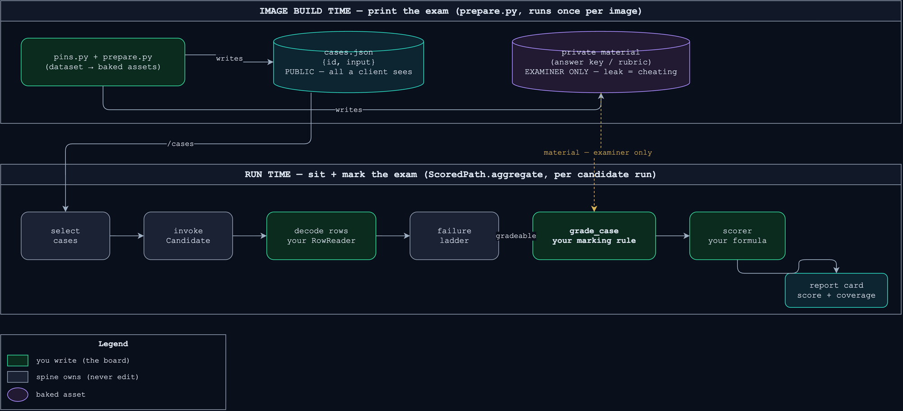
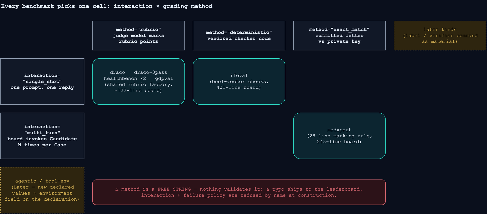
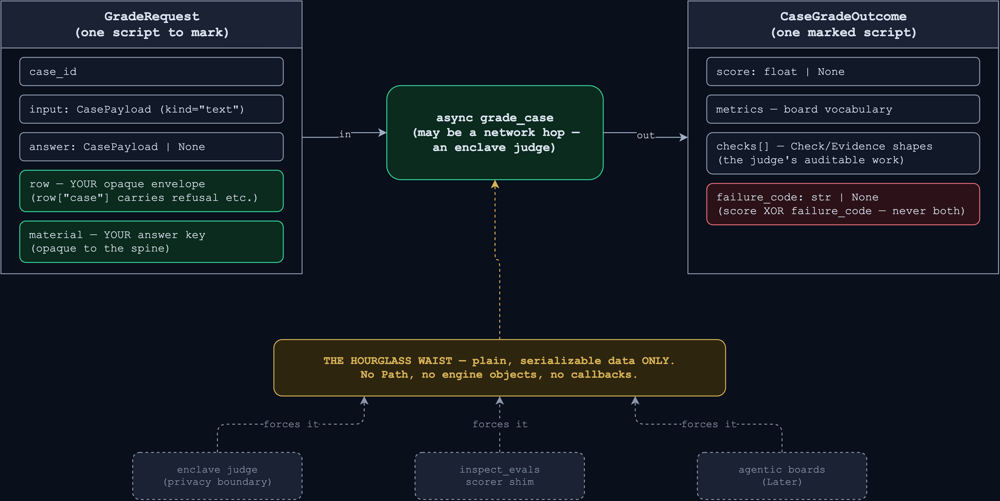
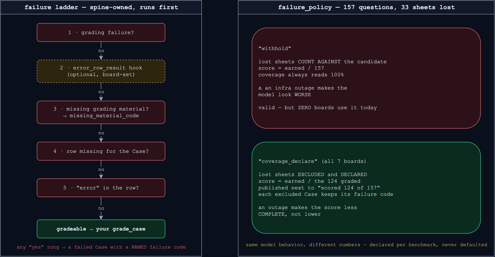

# Adding a benchmark

**TLDR: a benchmark is an exam. You bring the question paper (dataset mapping), the
marking rule (`grade_case`), and the cover sheet (declaration); the shared spine runs the
exam hall.** You never edit another board or a shared spine file — if you have to, the
spine failed its deletion test and that is a bug to file, not a pattern to copy.



Realistic size, from the boards in production: a rubric board on the shared factories is
~122 lines of grading code (`gdpval/grade.py`, `healthbench/grade.py` — both exactly
122); a novel grading mode is larger (`medxpert/aggregate.py` 245, `ifeval/grade.py` 401)
plus its protocol/runtime modules. Everything below is walked against MedXpertQA
(`benchmarks/medxpert/`), the newest board — when a step says "copy the shape", that is
the module to open.

## Step 0 — pick your cell on the two axes



`interaction` and `failure_policy` live on `BenchmarkDeclaration`
(`benchmarks/definition.py`) — both **required, no defaults**: a defaulted policy is a
policy nobody can approve, and the declaration is splatted unconditionally into the
manifest so reviewers approve it by reading the manifest, never engine source. The
grading `method` is the informal third axis: a free string on `ScoredPath`, published as
`CaseGrade.method` — reuse an existing value unless your grading genuinely is a new kind.

## Step 1 — the board module

One directory: `src/screamingface_engine/benchmarks/<board>/`. MedXpertQA's layout:

| File | Role (exam terms) |
|---|---|
| `pins.py` | which printing of the question paper — dataset id, config, revision, split, `PREPARER_REVISION` / `PROTOCOL_REVISION` |
| `prepare.py` | prints the paper — dataset → baked assets, at image build time |
| `definition.py` | the exam's public listing — the `Benchmark` record, `compute_revision()`, the url4 protocol template, the declaration |
| `runtime.py` | the exam hall's doors — the board's FastAPI routes |
| `aggregate.py` | the marking room — `grade_case`, the `ScoredPath` wiring, the scorer |
| `grading.py` / `answering.py` / `prompts.py` | board-private marking and prompting helpers |

Unit tests go to `tests/unit/test_<board>_*.py` (medxpert ships seven). Spine tests
(`test_spine_*.py`) are not yours to touch.

## Step 2 — prepare the assets

`prepare.py` exposes `def prepare(out: Path) -> dict[str, Any]` (an audit summary) plus
an argparse `main()` with `--out`. It runs at **image build time only**
(`Dockerfile.benchmark`), never at request time:

```sh
uv run --with datasets python -m screamingface_engine.benchmarks.medxpert.prepare \
    --out /opt/benchmarks/medxpert
```

- **Split public from private on disk** (see the build-time lane above): `cases.json` is
  all a client sees; the answer key / rubric is read only by `runtime.py` and
  `aggregate.py`.
- Heavy dataset deps (`datasets`) are **not** engine dependencies — import lazily inside
  `prepare` (`importlib.import_module`).
- Dataset drift raises a `BenchmarkAssetPreparationError` subclass (reported without a
  traceback); `TypeError`-family stays reserved for programming defects
  (`benchmarks/deployment.py`).
- Pin everything in `pins.py`, fold it into `compute_revision()` — the revision is in
  every route path, so a re-print of the paper is a new, distinguishable exam.
- Assets land under `$URL4_BENCHMARK_ASSETS` (default `/opt/benchmarks`), one directory
  per bundle id; two boards may share one bundle (draco/draco-3pass do).

## Step 3 — the case-row shapes

Two row shapes, one public, one board-owned:

- **The baked dataset row** (`cases.json`): a JSON array of objects with an `int` `id`
  and a non-blank `str` `input`; every other key rides through as Case metadata. The
  spine decodes it into `SelectedCase` (`benchmarks/aggregation.py`).
- **The evaluation row** your `grade_case` receives: an **opaque, board-owned envelope**
  (`spine/rows.py` files it and never looks inside). Your
  `RowReader.decode_case_evaluation` shapes it; the one sub-key the spine reads is
  `row["case"]` — the candidate fields (`status`, `output`, `finish_reason`, `refusal`,
  `execution`, `operations`, `metadata`) — so your decode must hoist that mapping (copy
  `medxpert/aggregate.py` or `ifeval/grade.py`).

Inputs and answers cross the seam as kind-tagged payloads (`spine/payloads.py`);
`TextPayload` (`kind="text"`) is the only kind implemented — `text+attachments` and
`environment` arrive as new dataclasses, never as a spine rewrite.

## Step 4 — write `grade_case`, the marking rule



```python
type GradeCase = Callable[[GradeRequest], Awaitable[CaseGradeOutcome]]
```

The worked example — MedXpertQA's whole marking rule, 28 lines
(`medxpert/aggregate.py`):

```python
async def _grade_case(request: GradeRequest) -> CaseGradeOutcome:
    """Exact-match one committed letter against the private key — the whole exam rule."""
    attempt: Mapping[str, Any] = request.row["attempt"]
    material = request.material
    assert isinstance(material, Mapping)  # the ladder already rejected unusable assets
    label: str = str(material["label"])
    committed: str = str(attempt.get("answer") or "")
    answered: bool = bool(committed)
    correct: bool = answered and committed == label
    return CaseGradeOutcome(
        score=1.0 if correct else 0.0,  # unanswered scores 0.0, not None —
        metrics={"answered": answered},  # the official empty-prediction verdict
        checks=[
            {
                "type": "choice",
                "id": "1",
                "label": "committed choice matches the published key",
                "outcome": "MET" if correct else "UNMET",
                "evidence": [_match_evidence(committed, label, correct)],
                "metadata": {"committed": committed, "expected": label},
            }
        ],
    )
```

Read the example's grammar: `material` is the answer key your board baked in Step 2;
`row` is your own envelope from Step 3; the returned `checks` are
`Check`/`Evidence`-shaped dicts (`benchmarks/contract.py`) so the judge's work is
auditable per Case.

**Rubric boards don't write this at all.** The shared factory gives you the judged
marking rule in one line (`spine/rubric.py`):

```python
grade_case = rubric_grade_case(case_score=case_score, judge_producer_id="gdpval/judge")
```

where `case_score: (points, verdicts) -> float | None` is your board's official scoring
formula. The factory owns the two rubric failure codes (`"incomplete_verdicts"`,
`"no_positive_points"`) and judge replies are parsed by the one shared parser
(`spine/verdict.py`) — never write your own.

## Step 5 — declare the cover sheet and wire the path

```python
declaration = BenchmarkDeclaration(
    failure_policy="coverage_declare",
    interaction="multi_turn",  # medxpert; single_shot for most boards
)
```



The invariant every board factory repeats: **declare `withhold` only if your aggregate
actually withholds** — every current board reduces through the shared path, which scores
exactly the gradeable subset and publishes coverage, i.e. `coverage_declare`.

Bundle the hooks into a `ScoredPath` (`spine/scored.py`) — MedXpertQA's is the smallest
complete registration of the whole surface (`medxpert/aggregate.py`):

```python
_PATH = ScoredPath(
    reader=RowReader(...),  # your decode from Step 3
    grade_case=_grade_case,  # your marking rule from Step 4
    failure_messages=...,  # your board's wording per failure code
    method="exact_match",
    grading_failure_code=...,
    grading_failure_message=...,
    missing_material_code="missing_answer_asset",  # default: "missing_rubric_asset"
)
```

then call `_PATH.aggregate(raw_rows, benchmark_id=..., benchmark_revision=...,
selected_cases=..., grading_material=..., scorer=..., case_metadata=...)`. Four optional
hooks let a board reshape a ladder rung's result — `ifeval` sets `missing_row_result`,
`draco` sets all four; don't set any until a golden or a spec forces you to. For the
scorer: rubric boards use the shared `exam_scorer(mean)` (`spine/exam.py`, fixed metric
vocabulary); other boards pass their own function (medxpert's `_accuracy`, ifeval's
`_ifeval_score`).

The protocol surface — the url4 template in `definition.py` (`build`) plus the FastAPI
routes in `runtime.py` (`install`) — follows one rule: **one explicit route per
operation, revision in the path**. Registration refuses a benchmark whose rendered
protocol references a route `install` never registered, so a missing route fails at
startup, not mid-run. Copy `medxpert/definition.py` + `medxpert/runtime.py`; the shapes
are not summarized here on purpose — those two files are the source of truth.

## Step 6 — register

A flat, hand-edited list — no entry points, no discovery. Three edits in
`benchmarks/builtins.py`:

1. Import your `Benchmark` and `ASSET_BUNDLE_ID`.
2. Add a lazy prepare shim + bundle:
   `MEDXPERT_ASSETS = BenchmarkAssetBundle(id=MEDXPERT_ASSET_BUNDLE_ID, prepare=_prepare_medxpert)`.
3. One line in `BUILTIN_DEPLOYMENT`:
   `BenchmarkRegistration(benchmark=MEDXPERT, asset_bundle=MEDXPERT_ASSETS)`.

And one edit outside the engine: add the board id to `_BENCHMARKS` in
`packages/screamingface/src/screamingface/_runtime/cli.py`, which backs
`screamingface prepare <benchmark>` on the client.

## Step 7 — protect the score

Unit tests first: the marking rule's happy path, boundaries, and every failure code you
can produce. Then the e2e replay lane — the recorded tape that locks your published score
against refactors:
[`packages/screamingface/tests/e2e/README.md`](../../../packages/screamingface/tests/e2e/README.md).
Short shape: wire the board into the lane (it SKIPs loudly until fixtures exist), the
owner pays for exactly one recorded run, a dev blesses it with `just e2e-bless`, and CI
thereafter replays with zero API keys, going red on any of five locks — expression sha,
case statuses, failure codes, coverage, score.

## Decision — `grade_case` reviewed as a public seam (2026-09-14, OME-1102)

The hook was extracted by the team that built the spine; before calling it a contract we
checked it against two external shapes.

**Shape 1 — the MedXpertQA row mapping** (now merged): needed no sibling handler and no
spine edit. It exercised the seam's least-used corners — a non-rubric method, `multi_turn`
interaction, a board-named `missing_material_code`, `case_metadata` — all through
declared extension points. Pass.

**Shape 2 — an in-enclave refusal judge (Crucible-shaped): pass, with one recorded
caveat.** The checks:

- The request is plain serializable data (the hourglass invariant) — it can cross a
  privacy boundary as-is. The hook is async, so the enclave hop fits the signature.
- Judge configuration rides in `material` (opaque to the spine) — no signature change
  needed to point a Case at an external judge.
- A refusal's text does **not** ride on `GradeRequest.answer` (that is `None` when no
  usable answer exists); it is reachable through the board-owned `row` envelope, whose
  `row["case"]` mapping carries `refusal`. A refusal judge therefore grades from the
  envelope, which the board controls end-to-end. No sibling handler needed.
- The judge's own words come back inside `checks[].evidence[]`
  (`Evidence.explanation` / `raw_output`), so an external judge's audit trail fits the
  existing result shape.

**Caveat:** this review ran against the shape described in the epic (an in-enclave judge
whose owners approve eval code before running it), not against a contract document from
that judge's owners. If their real interface needs anything beyond an async call with
serializable data in and `CaseGradeOutcome` out, that is a new ticket against
`BenchmarkDeclaration` or the payload union — not a quiet widening of `grade_case`.

## Gotchas — the steps people miss

- **`asset_bundle` has no default** on `BenchmarkRegistration` — a board with no assets
  still decides that explicitly.
- **Case statuses are two:** `scored` | `failed`. A graded refusal is an ordinary scored
  Case carrying `refusal` text; an ungradeable one is a failed Case with the
  `provider_refusal` failure code (OME-1037).
- The five-stage marking-room narrative at the top of `spine/scored.py` is the best
  30-line orientation in the codebase — read it before your first board.

## Related docs

- [`execution-flow-diagrams.md`](execution-flow-diagrams.md) — where your board's
  aggregate gets called from.
- [`request-workflow.md`](request-workflow.md) — the k8s request trace.
- [`packages/screamingface/tests/e2e/README.md`](../../../packages/screamingface/tests/e2e/README.md)
  — the record/bless/replay lane (Step 7).
- Diagram sources: `diagrams/*.drawio` (draw.io, `sf-dark` palette) next to their PNGs.
