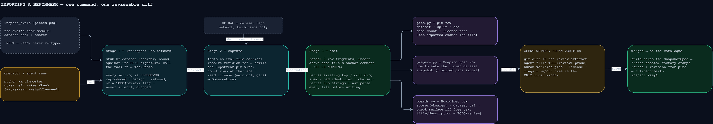

# Adding an imported benchmark (inspect_evals)

**TLDR: an imported benchmark is someone else's exam, and onboarding it is a customs
operation, not an authoring project. A board is two data rows — a `SnapshotSpec` (how to
bake the frozen dataset) and a `BoardSpec` (the catalogue entry) — and one command
generates both by reading the eval's own code. You never write grading code, prompt
code, or a module: the eval's own `record_to_sample`, prompt template, and scorer are
CALLED, never reimplemented.** If you find yourself writing a `grade_case` or a new
file under `benchmarks/`, you are on the wrong page — that is
[`adding-a-benchmark-manually.md`](adding-a-benchmark-manually.md).

Onboarding is **AI-first** (owner decision 2026-09-16): an agent runs the command and
writes everything; a human's whole job is verifying the resulting diff. The journey:



All three touched files live in the inspect plugin,
`src/screamingface_engine_inspect/` — the engine core is never edited (zero spine
edits is an acceptance criterion, not an aspiration).

## Step 0 — check the eval is importable

The importer handles **single-shot** evals (one candidate call per Case, deterministic
scorer). Before running anything, open the eval's task module in the *installed*
`inspect_evals` (the exact `==`-pinned version — what you read is what bakes) and
check:

- The exam loads via `hf_dataset(...)` from the HuggingFace Hub. Local/JSON datasets
  are not importable; the tool refuses them.
- The scorer is constructed with literal arguments (`match(numeric=True)`,
  `choice()`, `includes()`, …). Non-literal scorer args (callables, model objects)
  make the eval a manual-import candidate, not a row.
- The dataset's license permits public redistribution — the tool *warns* on an
  uncleared license and still emits (the diff review is the gate), so check early,
  not after the work is done.
- Agentic, multi-turn, and model-graded evals are out of scope for this pipeline.

## Step 1 — run the importer

From `apps/screamingface-engine` (needs the build-side deps):

```sh
uv sync --extra inspect
uv run python -m screamingface_engine_inspect.importer \
    inspect_evals.gsm8k.gsm8k:gsm8k --key gsm8k --task-arg fewshot=0
```

- The task reference is dotted `module:attr` to the **task function** — the same
  convention the generated rows use for `record_to_sample`.
- `--key` becomes the catalogue id (`inspect-<key>`) and the pin-constant stem
  (`GSM8K_*`) — it must start with a letter and derive a distinct stem.
- `--task-arg name=value` (repeatable) is forwarded to the task function — use it to
  switch off fewshot examples and similar knobs so the imported exam is the plain
  form.
- `--shuffle-seed N` pins a serving order. Required when the eval shuffles without
  its own seed, and useful for grouped splits (mmlu's subjects) — the seed becomes
  exam identity and rides the revision hash.
- `--choice-shuffle-seed N` pins one per-case **choice order**. Required when the
  eval passes `shuffle_choices=True` (unseeded — lab_bench, truthfulqa); refused
  when the eval doesn't shuffle choices at all, and refused when the eval seeds
  its own choice shuffle (upstream already defines ONE order). The bake applies
  inspect's own `MemoryDataset.shuffle_choices`, and the seed rides the revision
  hash too.
- `data_files` + `features` (infinite_bench) need no flag — both are conserved
  automatically: `data_files` as a literal pin (dict of str to str only), and
  `features` as a dotted pointer at the eval's own `Features` constant, resolved
  and type-checked at bake. Both ride the revision hash.

The command edits `pins.py`, `prepare.py`, and `boards.py` in place at their anchor
comments, all-or-nothing, and `git diff` is the artifact everything downstream
reviews. It **refuses loudly** rather than guessing — see the refusal table below.

## Step 2 — fill what the tool cannot know

The generated `BoardSpec` row carries `TODO` placeholders and possibly `TODO(review)`
flags. The importing agent (not a human) resolves all of them:

- **`title` / `description` / `focus`** — catalogue prose, written from the eval's own
  README/docstring and the dataset card, in the voice of the existing rows (open the
  gsm8k/mmlu rows in `boards.py`; state case count, split, what the model does, how
  grading works, that no judge tokens are spent, and how the score is computed).
- **`TODO(review)` flags** — each names a setting the bake does not reproduce (a
  custom solver, a system message, an unreproduced dataset option). For each one:
  either confirm it does not change the exam (and say why in the comment), or stop —
  the eval is not row-importable and silently shipping a different exam is the one
  unforgivable outcome.

## Step 3 — decide the check surface

`with_check_surface=True` **only for free-text boards** (spec §4): the eval's own
scorer then also answers the corrective loop's mid-run checks with sealed
pass/fail-only feedback. **MCQ boards never get one** — pass/fail feedback over a
handful of options is an elimination attack (OME-796). The generated row defaults
correctly from the scorer family; treat changing it as an owner decision.

### Live activity comes from the shared adapter

Boards created through `single_shot_board` inherit loading, answering, grading and
aggregation observations. The shared Inspect scorer emits case-grading start and
terminal facts around actual scoring, including judge-backed scoring; merely recording
an answer is not grading completion. Candidate-internal corrective checks do not emit
benchmark case-grading facts.

No per-board logging decorator or custom stage name is needed. Keep the installed async
aggregation route: it awaits scoring in the owning observation context. Do not replace
it with a synchronous wrapper or worker-thread hop that loses that context. The adapter
also supplies Case ID and selected-case numbering outside model input.

If you bypass the shared adapter, follow the
[manual guide's activity contract](adding-a-benchmark-manually.md#live-activity-what-the-benchmark-owns).
Logs must not contain prompts, responses, private grading data or raw exception text,
and scoring must be identical with observation disabled.

## Step 4 — verify

```sh
uv run .claude/scripts/run_gates.py screamingface-engine   # from the repo root
```

The row machinery's shared tests already cover registration, revision identity, and
the extra-less catalogue; add the per-board definition assertions to the imported
boards' test module (follow the existing boards' entries). Sanity-check the bake on a
handful of rows if the eval's `record_to_sample` has any unusual shape.

The shared activity integration tests live in
`tests/unit/inspect/test_inspect_aggregation_activity.py` and
`test_inspect_grading_activity.py`. For a new scorer/execution path, verify events through
the actual installed aggregation route, including failure and observation-disabled
parity; a direct-scorer test alone misses async/context boundaries.

## Step 5 — open the PR; a human verifies the diff

Import time is the **only trust window**: builds fetch by the recorded sha and
runtime never fetches, so nothing after this diff can change the exam. The reviewer's
checklist (minutes, not hours):

- The revision is a 40-hex commit sha and its HF permalink
  (`https://huggingface.co/datasets/<dataset>/tree/<sha>`) resolves.
- The case count is plausible for the named split.
- The license in the pins comment is genuinely cleared for a public catalogue.
- Every `TODO(review)` is resolved with a reason, and the prose honestly describes
  the exam.
- The check-surface flag matches the scorer family (free text ⇔ surface on).

## When the tool refuses

Every refusal is an `ImporterError` that names the fact that stopped it. The rule
behind all of them: **every setting the eval declares is conserved — reproduced in
the rows, known-benign, or refused/flagged. Silence is never an option.**

| Refusal | Meaning | What to do |
|---|---|---|
| not a 40-hex commit sha | the revision resolved to a mutable ref | let the tool resolve it; never hand-write a branch/tag (the bake and board assembly refuse it too) |
| hf_dataset kwarg(s) … not reproduced | the eval uses a dataset option the bake doesn't carry (`limit`, `trust`, …) | decide per kwarg: neutralize via `--task-arg`, or the eval isn't row-importable |
| shuffles with no seed | upstream order is random per run; an import must pin ONE order | pass `--shuffle-seed` |
| shuffles each case's choice order with no seed | `shuffle_choices=True` randomizes the answer options per run; an import must pin ONE choice order | pass `--choice-shuffle-seed` |
| upstream seeds its shuffle, and a row shuffle combined with a choice shuffle cannot reproduce that exam | the bake's row shuffle is not HF's algorithm, and each case's choice order depends on its row position — upstream's seeded exam would silently differ | import by hand, or extend the bake to replay HF's row permutation |
| eval pins its own choice-shuffle seed | upstream already defines ONE choice order; a policy seed would bake an exam upstream never produces | drop `--choice-shuffle-seed` |
| data_files has a shape the importer does not conserve | only a dict of str to str round-trips through the generated literal | extend the importer for this family |
| features does not resolve to one module attribute | an inline `Features(...)` has nothing the row can point at | extend the importer or add the row by hand |
| fewshot/extra load is not the exam | the Task's dataset isn't the HF load the tool saw | pass task args that disable the extras |
| key already exists / colliding stem | board imported, or two keys derive the same `PREFIX_*` | pick a distinct key |
| stem is not a valid identifier | e.g. a leading digit | rename the key (`wiki2` not `2wiki`) |
| characters that cannot be written | a Hub-sourced string would break the generated Python | inspect the dataset card — this is a red flag, not an inconvenience |
| anchor line missing | someone edited the anchor comments | restore them; nothing was written |

## What the tool will never do

- Invent catalogue prose or a license verdict — those are the agent's writing and the
  human's judgment.
- Re-type a value that exists in the eval's code — it reads, binds, and records.
- Leave a half-imported tree — every insertion point is validated before any file is
  written, and every composed file must `ast.parse`.

## Related docs

- [`adding-a-benchmark-manually.md`](adding-a-benchmark-manually.md) — authoring a
  board from scratch (novel dataset or grading); also the deep dive on the spine
  seam that imported boards ride for free.
- `src/screamingface_engine_inspect/pins.py` — the lockfile docstring: the three row
  kinds and WHY frozen data is the security property.
- `docs/spec/2026-09-09-OME-1113-inspect-evals-import.md` — the import spec (§4 dual
  registration, §5 snapshots, §6 revision identity).
- Diagram source: `diagrams/importer-pipeline.drawio` (draw.io, `sf-dark` palette).
