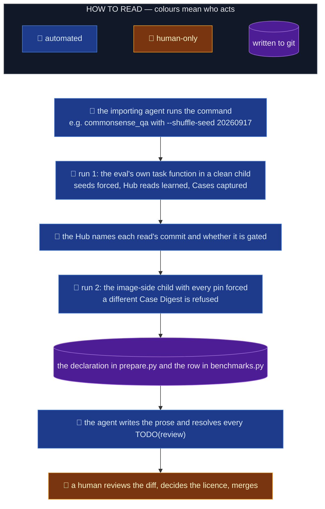

# Adding an imported benchmark (inspect_evals)

**TLDR: an imported benchmark is someone else's benchmark, and onboarding it is a customs
operation, not an authoring project. A benchmark is two data rows — a `TaskReplayCasesSpec`
(how Case Preparation replays the eval's own task function, sealed by a Case Digest) and a
`BenchmarkSpec` (the catalogue entry) — and one command generates both by calling the eval's
own task function, twice. You never write grading code, prompt code, or a module: the
eval's own loader, solvers and scorer are CALLED, never reimplemented.** If you find yourself writing a `grade_case` or a new
file under `benchmarks/`, you are on the wrong page — that is
[`adding-a-benchmark-manually.md`](adding-a-benchmark-manually.md).

Before the steps, read [`importing-an-inspect-eval.md`](importing-an-inspect-eval.md): for
every field of an inspect `Task` it says whether we take it, read it as a gate, or replace it
with our own rule, and for every step of inspect's `eval()` which ScreamingFace component does
it instead. Since OME-1460 there is one path, Task replay, for every eval.

Onboarding is **AI-first** (owner decision 2026-09-16): an agent runs the command and
writes everything; a human's whole job is verifying the resulting diff. The journey:


```mermaid
%%{init: {"flowchart": {"wrappingWidth": 440}}}%%
flowchart TB
  subgraph KEY["HOW TO READ — colours mean who acts"]
    direction LR
    k1["🤖 automated"]
    k2["👤 human-only"]
    k3[("written to git")]
    k1 ~~~ k2 ~~~ k3
  end
  KEY ~~~ s1
  s1["🤖 the importing agent runs the command<br/>e.g. commonsense_qa with --shuffle-seed 20260917"]
  s2["🤖 run 1: the eval's own task function in a clean child<br/>seeds forced, Hub reads learned, Cases captured"]
  s3["🤖 the Hub names each read's commit and whether it is gated"]
  s4["🤖 run 2: the image-side child with every pin forced<br/>a different Case Digest is refused"]
  s5[("the declaration in prepare.py and the row in benchmarks.py")]
  s6["🤖 the agent writes the prose and resolves every TODO(review)"]
  s7["👤 a human reviews the diff, decides the licence, merges"]
  s1 --> s2 --> s3 --> s4 --> s5 --> s6 --> s7
  classDef auto fill:#1e3a8a,stroke:#4a7fd4,color:#dbeafe
  classDef human fill:#78350f,stroke:#f5a524,color:#fef3c7
  classDef data fill:#4c1d95,stroke:#a06ed4,color:#ede9fe
  class k1,s1,s2,s3,s4,s6 auto
  class k2,s7 human
  class k3,s5 data
  style KEY fill:#111827,stroke:#4b5563,color:#e5e7eb
```

Both touched files live in the inspect plugin,
`src/screamingface_engine_inspect/` — the engine core is never edited (zero shared-grading
edits is an acceptance criterion, not an aspiration).

## Step 0 — check the eval is importable

The importer handles **single-shot** evals (one candidate call per Case, deterministic
scorer). Before running anything, open the eval's task module in the *installed*
`inspect_evals` (the exact `==`-pinned version — what you read is what prepares) and
check:

- The eval loads its Cases through a fetch the Case Source recorder can see:
  `hf_dataset`/`datasets.load_dataset`, `huggingface_hub`'s downloads, inspect's
  `download`/`file`, or inspect_evals' `_download_remote`. An eval that fetches some other
  way is refused ("no Case Source was recorded").
- The scorer is constructed with literal arguments (`match(numeric=True)`,
  `choice()`, `includes()`, …). Non-literal scorer args (callables, model objects)
  make the eval a manual-import candidate, not a row.
- The dataset's license permits public redistribution — a licence off the cleared list is
  written as `license="TODO"` with the card's value in the note, and assembly refuses
  `TODO`, so the owner decides before merge. Check early, not after the work is done.
- Agentic and multi-turn evals are out of scope for this pipeline.
- **Model-graded (LLM-judged) evals are importable since OME-1240**, with three extra
  conditions:
  - The scorer takes its judge as an explicit model argument (xstest's `model=`,
    frontierscience's `model=`), or resolves inspect's grader *role*
    (`get_model(role="grader")` with no model kwarg), which the row's `JudgeSpec` fills
    since OME-1370; any other role is refused by name.
  - The scorer must not carry its own generation settings or tools into the judge
    call. The wire carries ONLY the row's `JudgeSpec.params`; at grading, the
    provider refuses by name any `GenerateConfig` field the eval sets beyond
    transport plumbing, and any non-empty `tools` (persistbench's
    `GenerateConfig(temperature=0, reasoning_effort="high")` is the real shape that
    makes an eval not row-importable as-is). There is no silent drop: an eval that
    grades only at specific sampling settings either isn't imported, or ships
    without them as a NAMED DEVIATION (below).
  - A judged eval with no answer key (xstest, coconot — the target is empty and the
    judge grades from the question, the reply and its own prompt) is imported with
    `--no-answer-key`. Assembly refuses it on a row with no judge, or whose judge template
    reads `{criterion}`. If the template reads other Sample metadata (coconot's
    `{refusal}`), also pass `--keep-sample-metadata`: the metadata is then sealed inside the
    Case Digest.
  - An eval with no answer key and no judge, whose own scorer grades from the reply
    alone (cyse4_mitre_frr's refusal regex), is imported with `--no-answer-key` too and sets
    `scorer_reads_answer_key=False` on its benchmark row. Assembly refuses the flag on
    a row with a key, with a judge, or on an `inspect_ai.scorer` built-in; a test in
    `test_inspect_task_replay_benchmarks.py` grades every such row against an empty
    and a non-empty key and requires the same grade.
  - A row that must leave Samples out (sad_stages_full's three empty questions, onet_m6's
    six ungradable ones) takes `--excluded-sample-id` (repeatable) at import; the importer
    writes `excluded_sample_ids` with a `TODO(review)` where the NAMED DEVIATION's reason
    goes.
  - A judge that answers in words rather than inspect's C/I/P/N letters (coconot's
    UNACCEPTABLE / ACCEPTABLE / NEITHER) needs `verdict_grades` on the row: each word
    → its grade, copied from the eval's own epoch reducer and pinned to it by a test.
    Without it every Case fails as `invalid_score_value`.

## Step 1 — run the importer

From `apps/screamingface-engine` (needs the build-side deps):

```sh
uv sync --extra inspect --inexact
uv run python -m screamingface_engine_inspect.importer \
    inspect_evals.commonsense_qa.commonsense_qa:commonsense_qa --key commonsense_qa \
    --shuffle-seed 20260917
```

- The task reference is dotted `module:attr` to the **task function**.
- `--key` becomes the catalogue id (`inspect-<key>`).
- `--task-arg name=value` (repeatable) is forwarded to the task function in both runs and at
  every build — use it to switch off fewshot examples and similar knobs so the imported
  benchmark is the plain form (gsm8k and winogrande: `--task-arg fewshot=0`).
- `--shuffle-seed N` is the seed forced through inspect's own shuffle when the eval calls
  `hf_dataset(..., shuffle=True)` with no seed; the import refuses such an eval without it,
  and refuses the flag when the eval makes no such shuffle (a seed nothing applies).
- `--choice-shuffle-seed N` is the same for a bare `shuffle_choices=True` (lab_bench).
- `--excluded-sample-id`, `--no-answer-key`, `--keep-sample-metadata`: see Step 0.
- The Hub commits need no flag: run 1 records every Hub read, the importer asks the Hub which
  commit each names (and whether it is gated, which writes `needs_hf_token=True`), and the
  declaration's `source_pins` force them at every build. A gated dataset needs `HF_TOKEN` or
  a cached `hf auth login` on the importing machine.

The command edits `prepare.py` and `benchmarks.py` in place at their anchor comments,
all-or-nothing, and `git diff` is the artifact everything downstream reviews. It **refuses
loudly** rather than guessing — see the refusal table below.

## Step 2 — fill what the tool cannot know

The generated `BenchmarkSpec` row carries `TODO` placeholders and possibly `TODO(review)`
flags. The importing agent (not a human) resolves all of them:

- **`title` / `description` / `focus`** — catalogue prose, written from the eval's own
  README/docstring and the dataset card, in the voice of the existing rows (open the
  gsm8k/mmlu rows in `benchmarks.py`; state case count, split, what the model does, how
  grading works, and how the score is computed — string-match benchmarks say that no judge
  tokens are spent, judged benchmarks say judge calls are routed and metered through our
  gateway).
- **`TODO(review)` flags** — the licence the owner must decide, the reason for a Named
  Deviation, a judge to pin. Resolve each with a reason in the comment, or stop: silently
  shipping a different benchmark is the one unforgivable outcome.
- **The Case Sources comment** above the declaration lists every fetch run 1 recorded, with
  what pins it. Check each against the eval's loader.

## Step 3 — decide the draft-feedback offer

`with_check_surface=True` **only for string-match free-text benchmarks** (spec §4): the
eval's own scorer then also answers the corrective loop's mid-run checks with sealed
pass/fail-only feedback. **MCQ benchmarks never get one** — pass/fail feedback over a
handful of options is an elimination attack (OME-796). **Judged benchmarks never get one
either (yet)** — a judged mid-run check spends judge tokens per attempt while the
surface still advertises `free`; assembly refuses the combination until the check-cost
knob lands (OME-1116). The generated row defaults correctly from the grading family —
judged rows are generated with NO surface; treat changing any of it as an owner
decision.

### Live activity comes from the shared adapter

Benchmarks created through `single_shot_benchmark` inherit loading, answering, grading and
aggregation observations. The shared adapter's grading step emits case-grading start and
terminal facts around actual scoring, including judge-backed scoring; merely recording
an answer emits an answering operation with `action=recording` (displayed as
“Answer recorded”), and packaging its attempt emits no grading event. Judge calls
carry the explicit `role=judge` and grading Case ID; the Client joins that ID to
the selected position from answering. Candidate-internal corrective checks do not emit
benchmark case-grading facts.

No per-benchmark logging decorator or custom stage name is needed. Keep the installed async
aggregation route: it awaits scoring in the owning observation context. Do not replace
it with a synchronous wrapper or worker-thread hop that loses that context. The adapter
also supplies Case ID and selected-case numbering outside model input.

If you bypass the shared adapter, follow the
[manual guide's activity contract](adding-a-benchmark-manually.md#live-activity-what-the-benchmark-owns).
Logs must not contain prompts, responses, private grading data or raw exception text,
and scoring must be identical with observation disabled.

## Step 4 — verify

```sh
uv run .claude/scripts/run_gates.py screamingface-engine   # from the repo root
```

The row machinery's shared tests already cover registration, revision identity, and
the extra-less catalogue; add the per-benchmark definition assertions to the imported
benchmarks' test module (follow the existing benchmarks' entries). Sanity-check the prepare step on a
handful of rows if the eval's `record_to_sample` has any unusual shape.

The shared activity integration tests live in
`tests/unit/inspect/test_inspect_aggregation_activity.py` and
`test_inspect_grading_activity.py`, plus the complete fake-Gateway recipe in
`test_imported_activity_lifecycle.py`. For a new scorer/execution path, verify events through
the actual installed aggregation route, including failure and observation-disabled
parity; a direct-scorer test alone misses async/context boundaries.

## Step 5 — open the PR; a human verifies the diff

Import time is the **only trust window**: every build replays at the declaration's pinned
commits and checks the Case Digest, and runtime never fetches, so nothing after this diff
can change the benchmark without the build refusing it. The reviewer's checklist (minutes,
not hours):

- Each `source_pins` entry is a 40-hex commit and its permalink
  (`https://huggingface.co/datasets/<repo>/tree/<sha>`) resolves; every Hub Case Source in
  the comment has one.
- The case count is plausible for the eval's split.
- The declaration's `license=` is genuinely cleared for a public catalogue.
- Every `TODO(review)` is resolved with a reason, and the prose honestly describes
  the benchmark.
- The check-surface flag matches the grading family (string-match free text ⇔ surface
  on; MCQ and judged ⇔ surface off).
- **Judged rows only** (the model-graded lane, OME-1240):
  - The judge model is a DECLARED gateway model: its route (`/<gateway-model-id>`)
    exists in the engine's builtin model world (`models/builtins.py` seeds) — an
    undeclared judge 404s only at run time (the new-model three-registrations rule).
  - `judge=JudgeSpec(model=..., params=...)` is declared, and the SAME model appears as
    a `screamingface/<model>` value in `scorer_kwargs` — assembly cross-checks both
    directions, but the reviewer confirms the chosen judge is the intended house judge
    (precedent: HealthBench's judge model and params, `benchmarks/healthbench/revision_inputs.py`).
  - The judge model, its params, and the judge prompt (template/instructions kwargs)
    are benchmark identity — expect the revision to move if any of them changes.
  - If the scorer dispatches on Sample metadata (frontierscience's `format`), the
    declaration has `keep_sample_metadata=True` (automatic for an eval's own scorer;
    `--keep-sample-metadata` for a judge template that reads it) — otherwise the scorer
    grades blind. The automatic rule is a policy, not a read of the scorer's code: an eval's
    own scorer keeps ALL Sample metadata, even when it reads none (aime's worked solutions).
    The metadata stays private Grading Material, never shown to a Candidate, but it is
    inside the Case Digest, so a change to it moves the Benchmark Revision.
  - The importer auto-flags inspect's builtin `model_graded_*` scorers with a
    `judge=JudgeSpec(model="TODO")` placeholder; an eval-module custom scorer that
    calls `get_model()` internally is NOT auto-flagged — the reviewer catches it here.
  - Check the eval's README/paper for ITS judge. If the pinned house judge differs
    from the one the paper graded with, the row carries a `NAMED DEVIATION` comment
    with the link, and the catalogue prose says scores are not comparable to the
    published numbers (precedent: frontierscience — the paper grades with GPT-5 at
    high reasoning effort; the row pins the house judge and says so).
  - Know the bad-reply semantics before reading a low score: a judge reply the
    eval's parser cannot grade becomes a per-case `invalid_score_value` rejection
    (it never aborts the whole aggregate), but a TRUNCATED reply that still parses
    keeps upstream's 0.0 silently — on the first live run, check the judge calls'
    finish reasons before trusting zeros.
  - Judged runs are auditable per case: each case's judge call lands in its
    evidence `accounting` (tokens/USD/latency/attempts) and the engine log tags the
    judge round trip `role=judge case=N` — the owner's small paid run verifies both,
    plus judge cost in the report's `cost_usd`.

## Importing a local Task — a Benchmark that is NOT in inspect_evals

The importer takes any `module:task` reference, and a scorer defined in that same module
resolves. So a Benchmark we author ourselves is written **in inspect's shape** and imported
like gsm8k — the lane rule in `adding-a-benchmark-manually.md` says this is the default for
every new Benchmark whose Candidate is called once per Case. MuSiQue-Ans is the worked example
(`src/screamingface_engine_inspect/local_tasks/musique/`, OME-1513).

What you write — one package under `local_tasks/<name>/`, the same five pieces as an
inspect_evals eval such as `bbeh/`:

| Piece | Where | What it is |
|---|---|---|
| dataset loader | `<name>.py` | a pinned fetch (Hub commit + sha256) rendered into `Sample`s: `input` is the exact Candidate-facing text, `target` the answer key (a list when there are aliases), `metadata` whatever the scorer needs |
| scorer(s) | `<name>.py` | `@scorer` functions, `(state, target) -> Score`; several scorers = several Named Scores, the first is the Headline |
| the Task | `<name>.py` | `@task def <name>() -> Task(dataset=…, solver=generate(), scorer=[…])` |
| vendored grading code | `vendor/` | the paper's own scorer when it has one, copied byte-for-byte with its licence and a sha256 test (`test_local_task_musique_vendor.py` is the template) |
| the card | `README.md` | dataset, prompt, scoring, baselines, how to run |

Then run the importer on it and fill the generated rows exactly as for an import:

```sh
uv run python -m screamingface_engine_inspect.importer \
    screamingface_engine_inspect.local_tasks.<name>.<name>:<name> --key <name>
```

Three things differ from an inspect_evals import:

- **Origin.** The generated `BenchmarkSpec` row gets `origin="screamingface"`: the Benchmark is
  ours, and the provenance rule then asks it for no `inspect_contributors`. Leave the default
  (`inspect_evals`) only for evals that really came from inspect_evals.
- **Provenance is hand-written.** There is no `eval.yaml` to read, so every TODO (paper,
  authors, citation, licence, baselines, difficulty) is yours to fill from the paper and the
  reference harness. Registration refuses the row until every TODO is gone.
- **A scorer that reads Sample metadata must tolerate its absence** (`state.metadata.get(...)`).
  The no-network grading lane runs every judge-less Benchmark over stand-in Cases that carry no
  metadata; a `KeyError` there shows as a grading failure on a Benchmark that grades fine in
  production.

The hand-built lane stays only for a Benchmark whose Candidate must be called more than once
per Case: capture runs the Task's solvers up to their first `generate`, so a second prompt
that contains the first reply cannot be captured. Several *independent* attempts per Case
(pass@k, `Task.epochs`) are a different thing and are decided in `OME-1458`.

### Two network gotchas on a developer Mac

Seen on 2026-10-07; neither is a repo change.

- The Hugging Face hub client can stall mid-file (10 of 30 MB, then nothing) while plain
  `curl` fetches the same URL in seconds. `HF_HUB_DISABLE_XET=1` makes the client use the plain
  download path.
- The importer parent can hang in `SYN_SENT` on an IPv6 connection to the Hub's CDN. Put a
  `sitecustomize.py` on `PYTHONPATH` that filters `socket.getaddrinfo` results to `AF_INET`;
  the replay child inherits the environment, so one shim covers both.

## When the tool refuses

Every refusal is an `ImporterError` that names the fact that stopped it. The rule
behind all of them: **every setting the eval declares is reproduced — reproduced in
the rows, known-benign, or refused/flagged. Silence is never an option.**

| Refusal | Meaning | What to do |
|---|---|---|
| the task raised / yielded no Samples | the eval failed in the clean child, or built an empty dataset | read the child's error line; fix the task args |
| no Case Source was recorded | the eval fetched through something the recorder does not wrap | extend the recorder for that primitive (it is a reviewable fetch), or import by hand |
| two Samples share the id | the eval's ids collide, so Cases cannot be addressed | report upstream; import by hand |
| calls hf_dataset(…, shuffle=True) with no seed | inspect's own order is random per run | pass `--shuffle-seed` (or `--choice-shuffle-seed` for `shuffle_choices=True`) |
| …seed was never applied | the eval makes no unseeded hf_dataset shuffle the seed would pin | drop the flag |
| two Task replays produced different Cases | a shuffle the enforcer cannot reach (the eval's own `MemoryDataset.shuffle()`), generated Cases, a per-run value in metadata, or HEAD moving between the runs | pass task args that fix the order, or re-run |
| reads … at two revisions / cannot resolve … | the eval reads one repo at two commits, or the Hub could not be asked | report upstream / retry with the Hub reachable |
| key already exists | the benchmark is already imported | pick a distinct key |
| characters that cannot be written | a string from the eval or the Hub would break the generated Python | inspect it — this is a red flag, not an inconvenience |
| anchor line missing | someone edited the anchor comments | restore them; nothing was written |

At build, the same declaration is replayed with every pin forced: a Hub read with no pin, a
different commit than the eval's own, or a different Case Digest makes the Benchmark SKIPPED
with the reason, and the strict PR image job fails.

A different Case Digest ends with one of two explanations when the declaration carries a
`case_set_digest`:

- **"same N Cases in another order"**: the rows are unchanged but served in a new order, usually
  a shuffle the pins no longer reach. Check the seed and commit in the bundle's
  `provenance.json`; re-importing re-seals the new order once you accept it.
- **"same count, different Cases: text changed"**: at least one Case's prompt or Grading Material
  differs. Usually an upstream data or prompt change; treat it as a new Benchmark Revision and
  re-import. For lab_bench, a moved `choice_shuffle_seed` also lands here, because the options
  sit inside each Case's text.

A count change already names both counts, so it gets no extra explanation.

## What the tool will never do

- Invent catalogue prose or a license verdict — those are the agent's writing and the
  human's judgment.
- Re-type a value that exists in the eval's code — it reads, binds, and records.
- Leave a half-imported tree — every insertion point is validated before any file is
  written, and every composed file must `ast.parse`.

## Related docs

- [`adding-a-benchmark-manually.md`](adding-a-benchmark-manually.md) — authoring a
  benchmark from scratch (novel dataset or grading); also the deep dive on the shared grading code
  seam that imported benchmarks ride for free.
- `src/screamingface_engine_inspect/fetch_pins.py` — what every replay forces onto the
  eval's fetches, and why a forced commit (not only a digest) is the security property.
- `docs/spec/2026-09-09-OME-1113-inspect-evals-import.md` — the import spec (§4 dual
  registration, §5 prepared cases, §6 revision identity).

### Running notebook scores

The shared async aggregation path publishes a running score after canonical case grading,
including model-judged benchmarks. No per-benchmark logging hook or client scoring formula is needed.
Judging occurs during aggregation for imported boards, so scores update as judges finish,
not merely when candidate answers are recorded. The final CandidateResult overrides the
optional cumulative snapshots; dropped or coalesced snapshots never affect grading.
