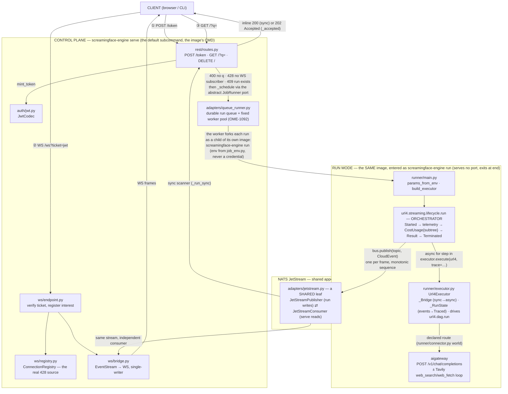
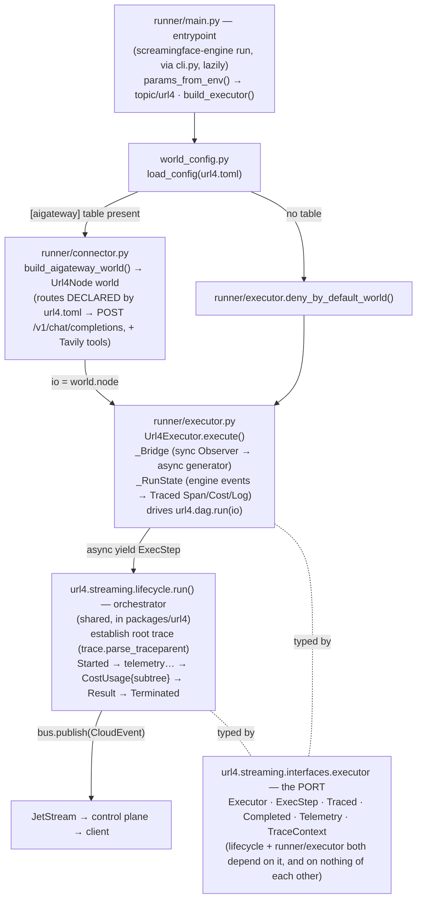
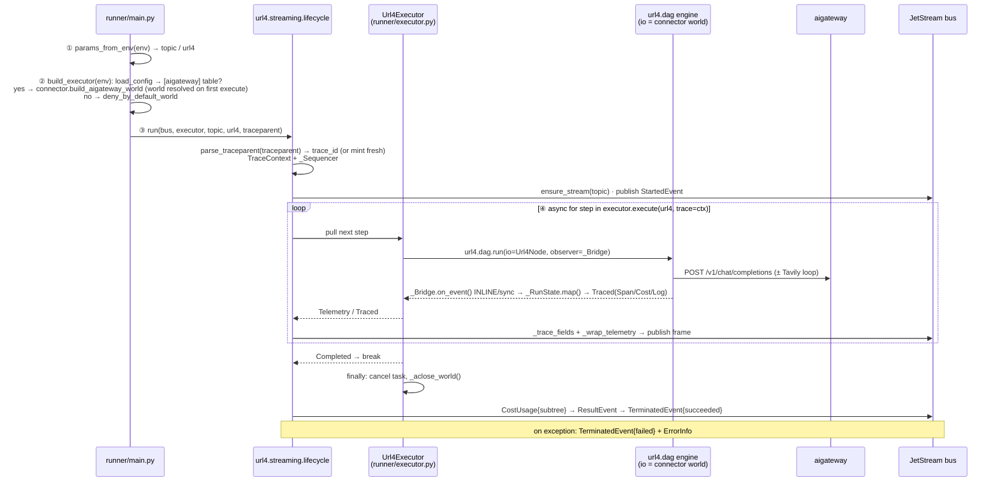

# screamingface-engine — execution-flow diagrams

Static reference for the execution flow through the screamingface-engine codebase and the
purpose of each source file. Companion to `docs/request-workflow.md` (the
narrative) and `docs/protocol.md` (the wire contract).

Diagrams are mermaid: GitHub renders them, and edits diff as plain text.

---

## 1. End-to-end execution flow (`serve` + `run` — two of the image's three modes)

Notes the boxes can't carry:

- `GET /?q=` also reads two headers before scheduling: a strictly W3C-valid `traceparent`
  (checked by `url4.streaming.trace.valid_traceparent`; malformed → dropped, the run mints a
  fresh trace) and the optional `X-Profile` / Envoy-verified `X-User-Email` pair. Provider
  credentials never travel on this request — they are stored via `rest/connections.py` →
  AI Gateway, and the run selects one by profile.
- The 428 check in the GET pipeline goes through the `SubscriberGate` **port**
  (`rest/interest.py`); `ws/registry.py`'s live-WS counts are what answer it.
- The sync scanner and the WS bridge are **independent consumers** of the same JetStream
  stream; neither feeds the other.
- The third mode, `screamingface-engine worker`, is the queue's consumer loop — the worker
  pool's Deployment pins it, and it execs `run` as a child per claimed run (see §4).

---

## 2. Run mode — execution flow (`screamingface_engine/runner/`)

`world_config.py` is the single parser for the DECLARED model world. The control plane uses it to
project discovery and the run mode uses it to build routes, so the two cannot disagree.
`url4.toml` ships in the image at `/etc/url4/url4.toml`, baked from
`apps/screamingface-engine/url4.toml`.

### Run-mode call sequence (one run)

---

## 3. File purpose — one line each

### Run mode (`src/screamingface_engine/runner/`)

| Layer | File | Purpose |
|---|---|---|
| entrypoint | `runner/main.py` | `screamingface-engine run` entrypoint: read env (names from `screamingface_engine/job_env.py`) → wire `JetStreamPublisher` + executor → call `lifecycle.run` |
| orchestrator (shared: `url4.streaming`) | `lifecycle.py` | Drives the executor, wraps frames as CloudEvents, publishes the Started…Terminated lifecycle |
| adapter (the **only** url4-engine importer) | `runner/executor.py` | `Url4Executor`: `_Bridge` (sync→async), `_RunState` (events→Traced), drives the DAG |
| world builder | `runner/connector.py` | Builds the `Url4Node` "world" of declared routes → aigateway chat (+ optional Tavily tools) |
| declared world | `world_config.py` | Parses `url4.toml` (`/etc/url4/url4.toml`) once for both control-plane discovery and Runner execution |
| boundary doc | `runner/__init__.py` | No re-exports — it carries the layering rule (what this half may and may not import) |

### Control plane (`src/screamingface_engine/`)

| File | Purpose |
|---|---|
| `cli.py` | The one console script, `screamingface-engine` — argv picks `serve` (default), `run`, or `worker`; imports each mode lazily and is the only module exempt from the layering gate |
| `app.py` | FastAPI factory — `create_app` (DI) / `create_app_from_env` (prod) |
| `config.py` | `Settings` + replay-window TTL validation |
| `rest/routes.py` | REST control plane — `POST /token`, `GET /?q=` (sync/async), `DELETE /` |
| `rest/connections.py` | Provider-credential intake — accepted only long enough to forward to AI Gateway, never stored here |
| `rest/interest.py` | `SubscriberGate` **port** behind the 428 gate |
| `ws/endpoint.py` | `GET /ws` — verify ticket, register interest, start bridge |
| `ws/bridge.py` | `Bridge` — EventStream→WS streaming, single-writer, `Attach`/`Stop`, heartbeats, nacks |
| `ws/registry.py` | `ConnectionRegistry` — live-WS counts per topic (the real 428 source) |
| `adapters/queue_runner.py` | Prod adapter — durable run queue + worker pool (OME-1092); the queue message carries the per-run env, never a credential |
| `adapters/memory.py` | `InMemoryEventStream` — the headless suite's stream double (no broker); re-exported by `testing/__init__.py` for the suite's convenience |
| `adapters/jetstream.py` | **Shared leaf** — `JetStreamPublisher` (run mode writes) + `JetStreamConsumer` (control plane reads); one binding, no second copy to keep in sync |
| `job_env.py`, `subjects.py` | The other two **shared leaves** — the Job env-var contract (per-run + per-deploy sections in one module) and the NATS subject/stream naming |
| `adapters/factory.py` | Composition root — `URL4_CLOUD_RUNNER` → queue adapter or `None` |
| `auth/*` | `JwtCodec`, RFC 9457 `Problem` handlers, FastAPI `VerifiedClaims` dependency |
| `schemas/*` | OpenAPI/AsyncAPI/CloudEvents Pydantic models (`type` `oneOf`) |
| `metrics.py`, `ops.py` | OpenMetrics `/metrics`, `/livez` `/readyz` probes |
| `testing/mock_runner.py` | Test executor/runner doubles |

### Shared (`url4.streaming`, from packages/url4)

| Package | Purpose |
|---|---|
| `url4.streaming` | The shared CONCEPTS: the wire `protocol`, the abstract `EventPublisher`/`EventConsumer`/`Executor`/`JobRunner`, and the pure logic over them (`lifecycle`, `codec`, `trace`, `job_name`). No broker and no framework — ever (it ships alongside the engine but imports none of it). The Job env-var names are NOT here — they are screamingface-engine's, and since the merge they live in exactly one module, `screamingface_engine/job_env.py`, with nothing left to keep in parity |

---

## 4. Key invariants

- The **run mode produces** the CloudEvents lifecycle; the **control plane only bridges/schedules** — it never re-shapes a frame.
- The two halves talk through **`url4.streaming`** — the wire models, the `EventPublisher`/`EventConsumer`/`Executor`/`JobRunner` abstractions and the run lifecycle — plus three shared leaves of this app's own vocabulary (`job_env`, `subjects`, `adapters.jetstream`). Neither knows how the other is built.
- **One image, three modes, chosen by argv.** The worker pool's Deployment pins `["screamingface-engine", "worker"]`, and the worker forks each run as a child that execs `screamingface-engine run` — so a pod missing its env fails loudly at boot instead of silently starting a web server nothing will dial. `serve` is the default, which is what keeps the image `CMD` and the chart's Deployment command unchanged.
- **The import graph is the boundary.** Two distributions used to make a cross-import uninstallable; one venv makes it merely a typo that type-checks. `.claude/scripts/check_layering.py` replaces that structure: `screamingface_engine.runner.*` must not import the control plane and vice versa, `cli.py` excepted. Verified empirically — importing `screamingface_engine.runner.main` loads none of fastapi, uvicorn, starlette, kubernetes, jwt or prometheus_client, which is what holds a Job's cold start to the engine + httpx + nats-py.
- `lifecycle.run` ↔ `runner/executor.py` talk **only** through the `Executor` port; the lifecycle never imports `url4`, which is why the control plane could run it in-process too.
- Only `runner/connector.py` + `runner/main.py` construct a `Url4Executor`; everything else treats it as an opaque `Executor`.
- The run mode is a 4-layer pipeline: **entrypoint → orchestrator → adapter → (url4 engine + aigateway world)**, all typed by one `Executor` abstraction; the orchestrator is shared code in `url4.streaming`, only the ends are this app's own.
