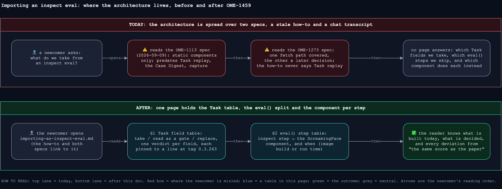
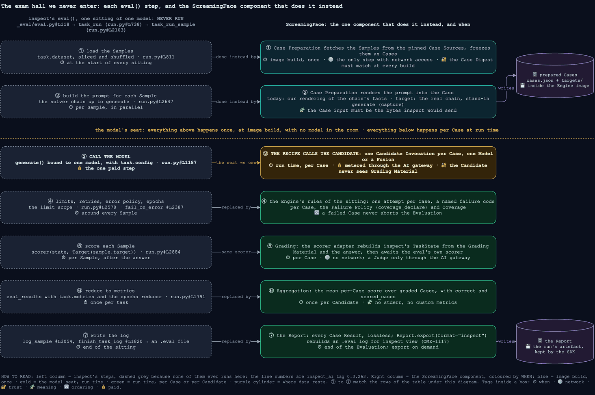
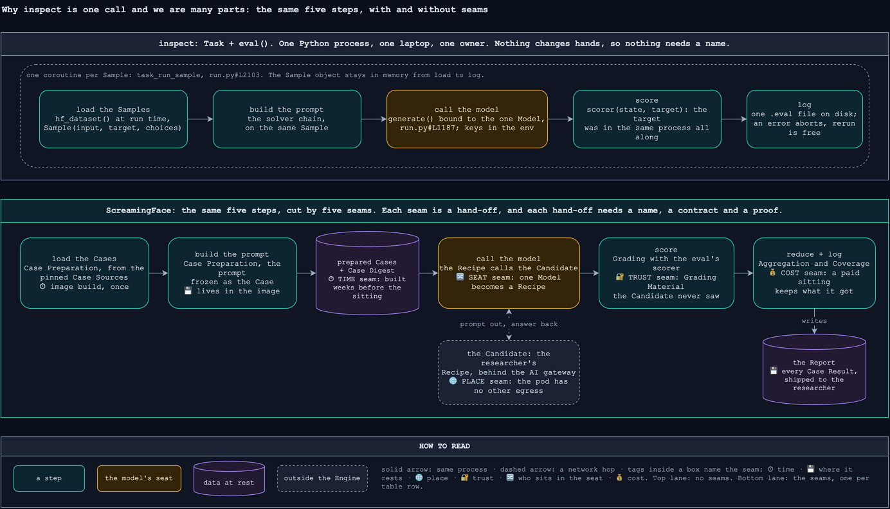

# Importing an inspect eval: what we take from it, and which ScreamingFace component runs each step

- Status: architecture doc (OME-1459, 2026-10-02). It describes the target architecture and
  marks what is built today; it adds no mechanism of its own.
- Component: `apps/screamingface-engine` (`screamingface_engine_inspect`).
- Ticket: [OME-1459](https://linear.app/openmined/issue/OME-1459/document-what-we-take-from-an-inspect-eval-and-which-screamingface).
  Parent epic: OME-1299. Ledger: `docs/work/2026-10-02-ome-1459-inspect-import-doc.md`.
- Pinned to: `inspect-ai` 0.3.263 and `inspect-evals` 0.20.0, the versions `uv.lock` pins.
  Every inspect claim below links a line at tag
  [`0.3.263`](https://github.com/UKGovernmentBEIS/inspect_ai/tree/0.3.263) or
  [`v0.20.0`](https://github.com/UKGovernmentBEIS/inspect_evals/tree/v0.20.0). Engine lines are
  as of OME-1460 (2026-10-06), relative to `src/screamingface_engine_inspect/` unless another
  path is given.
- How to read the status marks: ✅ built, on `main` (capture rendering
  [#1219](https://github.com/ScreamingFace/screamingface/pull/1219), Task replay
  [#1191](https://github.com/ScreamingFace/screamingface/pull/1191), one fetch path OME-1460
  [#1237](https://github.com/ScreamingFace/screamingface/pull/1237) and its fold) · ⏳ decided,
  not built (the ticket is named).

[inspect_evals](https://github.com/UKGovernmentBEIS/inspect_evals/tree/v0.20.0) is a library of
ready-made evals. Each eval is one `@task` function that returns a `Task`: **the eval's complete
exam kit**, with the question bank, the instructions for building each prompt, the marking scheme
and the rules of the sitting. inspect's own runner, `eval(task, model)`, is **the exam hall**: it
loads the Samples, builds each prompt, calls one model, marks, and writes a log. We copy an eval
into ScreamingFace as an **Imported Benchmark**, and we do it by taking the kit apart and never
entering inspect's exam hall. The question bank and the prompt-building steps become our Cases
(frozen once, at image build, by **Case Preparation**). The marking scheme runs unchanged, inside
our Grading, per Case. The rules of the sitting are ours: the Candidate's own settings, one attempt
per Case, our Failure Policy and Coverage. **The model's seat is the one piece we own:** where
inspect would call one model, our Recipe calls the Candidate, which may be one Model or a Fusion.

The rule this page exists to make checkable: **for every field of a `Task`, a reader can see
whether we take it, read it as a gate, or replace it with our own rule (§1); and for every step of
`eval()`, which ScreamingFace component does it instead, and when (§2).**

## Before / After

For the next dev importing an eval, or reviewing an import PR, there is one page to read before
the diff. For the owner, every deviation from "the same score as the paper" is a named row in §1
and §2 instead of a fact rediscovered per PR.

## 1. The exam kit: what a `Task` holds

A `Task` is a plain constructor,
[`Task.__init__` at `_eval/task/task.py#L82`](https://github.com/UKGovernmentBEIS/inspect_ai/blob/0.3.263/src/inspect_ai/_eval/task/task.py#L82)
(the class starts at
[`#L76`](https://github.com/UKGovernmentBEIS/inspect_ai/blob/0.3.263/src/inspect_ai/_eval/task/task.py#L76)),
with 33 parameters and four deprecated aliases. Three real kits, to read the tables against:

- **gsm8k**,
  [`gsm8k.py#L45`](https://github.com/UKGovernmentBEIS/inspect_evals/blob/v0.20.0/src/inspect_evals/gsm8k/gsm8k.py#L45):
  `dataset=hf_dataset("openai/gsm8k", split="test", revision=…)`, `solver=[system_message(10
  worked examples), prompt_template(MATH_PROMPT_TEMPLATE), generate()]`, `scorer=match(numeric=True)`,
  plus `version` and `metadata`. Nothing else is set. The simplest shape: a question bank, one
  prompt wrapper, one answer-matching rule.
- **sevenllm_mcq_zh**,
  [`sevenllm.py#L54`](https://github.com/UKGovernmentBEIS/inspect_evals/blob/v0.20.0/src/inspect_evals/sevenllm/sevenllm.py#L54):
  a JSONL fetched as a raw file from the Hugging Face Hub at a pinned commit
  ([`sevenllm.py#L37`](https://github.com/UKGovernmentBEIS/inspect_evals/blob/v0.20.0/src/inspect_evals/sevenllm/sevenllm.py#L37)),
  `solver=[prompt_template(TEMPLATE),
  multiple_choice()]`, `scorer=choice()`. Two chained prompt-building solvers: the first wraps the
  Sample's input in an instruction, the second lists the choices A to D. §3 uses it.
- **worldsense**,
  [`worldsense.py#L61`](https://github.com/UKGovernmentBEIS/inspect_evals/blob/v0.20.0/src/inspect_evals/worldsense/worldsense.py#L61):
  a bz2 file from GitHub at a pinned commit with a sha256 check, `solver=generate()` only, its own
  `@scorer` (a regex over the answer,
  [`#L170`](https://github.com/UKGovernmentBEIS/inspect_evals/blob/v0.20.0/src/inspect_evals/worldsense/worldsense.py#L170)),
  four `metrics`, and `config=GenerateConfig(temperature=0.0)`. The options are already inside the
  Sample's input text; `choices` is set
  ([`#L114`](https://github.com/UKGovernmentBEIS/inspect_evals/blob/v0.20.0/src/inspect_evals/worldsense/worldsense.py#L114))
  but no solver renders it.

Three verdicts, one per field. **Take** means the field's content becomes part of the Benchmark.
**Read as a gate** means we inspect the field to decide whether and how to import, and nothing of
it is copied. **Replace with ours** means the field is never read: the Engine's own rule applies,
and where that rule changes what a paper would report, the row says so (a Named Deviation lives on
the Benchmark; this table is where the reader learns there is one).

### 1a. Take

| `Task` field (line in `task.py`) | What we build from it | Where it lands | Status |
| -- | -- | -- | -- |
| `dataset` ([#L84](https://github.com/UKGovernmentBEIS/inspect_ai/blob/0.3.263/src/inspect_ai/_eval/task/task.py#L84)) | The Samples after the eval's own loading, filtering and conversion become the Cases. Each Sample's `target`, `choices` and kept `metadata` ([`Sample`, `_dataset.py#L29`](https://github.com/UKGovernmentBEIS/inspect_ai/blob/0.3.263/src/inspect_ai/dataset/_dataset.py#L29)) become its Grading Material. | `cases.json` and `targets/<id>.json` in the image, written by `captured_case_records` and `_write_cases` (`capture.py:108`, `prepare.py:1274`); the Case count and the Case Digest in the declaration | ✅ Task replay, every Imported Benchmark |
| `setup` ([#L85](https://github.com/UKGovernmentBEIS/inspect_ai/blob/0.3.263/src/inspect_ai/_eval/task/task.py#L85)) | Part of the solver chain below. inspect runs `setup` before `solver` ([`resolve_plan`, `run.py#L680`](https://github.com/UKGovernmentBEIS/inspect_ai/blob/0.3.263/src/inspect_ai/_eval/task/run.py#L680)); the import child walks it first too, for the multiple-choice witness (`_uses_multiple_choice`, `import_replay.py:229`). | with `solver` | ✅ run (capture) |
| `solver` ([#L86](https://github.com/UKGovernmentBEIS/inspect_ai/blob/0.3.263/src/inspect_ai/_eval/task/task.py#L86)) | The Case input: the text the chain would hand to the model. Capture: the real chain runs on each Sample with a stand-in `generate`, and the messages it receives are frozen as the Case (§3). | `cases.json` | ✅ capture rendering |
| `scorer` ([#L88](https://github.com/UKGovernmentBEIS/inspect_ai/blob/0.3.263/src/inspect_ai/_eval/task/task.py#L88)) | A pointer to the eval's own scorer constructor plus its literal kwargs (`_scorer_reference`, `importer.py:90`). At grade time the same scorer is built (`_scorer_factory`, `benchmarks.py:2057`) and called once per Case through the scorer adapter (`inspect_grade_case`, `scorer_adapter.py:83`). Exactly one scorer; a judge scorer also declares its Judge (see `model_roles`). | `scorer` and `scorer_kwargs` on the `BenchmarkSpec` declaration in `benchmarks.py` | ✅ |

### 1b. Read as a gate

| `Task` field | What the gate decides | Where it lands | Status |
| -- | -- | -- | -- |
| `sandbox` ([#L95](https://github.com/UKGovernmentBEIS/inspect_ai/blob/0.3.263/src/inspect_ai/_eval/task/task.py#L95)) | Agentic evals are out of scope: a Task with a sandbox (for example [gdm_intercode_ctf, `#L162`](https://github.com/UKGovernmentBEIS/inspect_evals/blob/v0.20.0/src/inspect_evals/gdm_intercode_ctf/gdm_intercode_ctf.py#L162)) needs Docker per Sample and a tool loop. Capture refuses a sandbox before any Sample runs (`captured_case_records`, `capture.py:127`), and a tool call or a second `generate` per Sample (§3). | a refusal reason | ✅ refusal by name; the execution lane is OME-1239 |
| `model_roles` ([#L94](https://github.com/UKGovernmentBEIS/inspect_ai/blob/0.3.263/src/inspect_ai/_eval/task/task.py#L94)) | No eval in inspect_evals 0.20.0 sets this field. The grader role reaches us through the scorer instead: `model_graded_fact` and `model_graded_qa` default to `model_role="grader"` ([`_model.py#L42`](https://github.com/UKGovernmentBEIS/inspect_ai/blob/0.3.263/src/inspect_ai/scorer/_model.py#L42), [`#L122`](https://github.com/UKGovernmentBEIS/inspect_ai/blob/0.3.263/src/inspect_ai/scorer/_model.py#L122)), and simpleqa's scorer asks for it directly ([`scorer.py#L108`](https://github.com/UKGovernmentBEIS/inspect_evals/blob/v0.20.0/src/inspect_evals/simpleqa/scorer.py#L108)). A judge scorer imports with `JudgeSpec(model="TODO")` (`importer.py:1236`); assembly refuses a `TODO`, any role other than `grader` (`_SUPPORTED_MODEL_ROLES`, `benchmarks.py:1771`), and any provider but the AI gateway. The Judge is Benchmark-owned and pinned in the Benchmark Revision. | `JudgeSpec` on the declaration; the judge provider (`judge_provider.py`) | ✅ (OME-1240, OME-1370) |
| `metrics` ([#L89](https://github.com/UKGovernmentBEIS/inspect_ai/blob/0.3.263/src/inspect_ai/_eval/task/task.py#L89)) | Custom metrics are read by name and surfaced as a review flag (`_custom_metrics`, `importer.py:70`); none is computed. Aggregation is always the mean per-Case score (§2). worldsense's `ws_bias` is such a flag. | the import PR's review notes | ✅ |

### 1c. Replace with ours

None of these fields is read by Case Preparation, and only `epochs` by the importer (to map or refuse it). The Engine's rule applies
instead, and the row names the deviation a reader would otherwise have to discover.

| `Task` field | inspect's rule | Our rule instead | Deviation worth knowing |
| -- | -- | -- | -- |
| `model` ([#L92](https://github.com/UKGovernmentBEIS/inspect_ai/blob/0.3.263/src/inspect_ai/_eval/task/task.py#L92)) | the default model for the sitting | the Candidate: the Recipe the researcher submits, one Model or a Fusion | this is the point of the product, not a deviation |
| `config` ([#L93](https://github.com/UKGovernmentBEIS/inspect_ai/blob/0.3.263/src/inspect_ai/_eval/task/task.py#L93)) | `GenerateConfig` merged into every model call ([`run.py#L768`](https://github.com/UKGovernmentBEIS/inspect_ai/blob/0.3.263/src/inspect_ai/_eval/task/run.py#L768)) | the Candidate's own model parameters, passed through the connector (`screamingface_engine/world/connector.py:858`) | an eval that pins `temperature=0` (worldsense) is run at the Candidate's temperature |
| `epochs` ([#L100](https://github.com/UKGovernmentBEIS/inspect_ai/blob/0.3.263/src/inspect_ai/_eval/task/task.py#L100)) | repeat each Sample N times and reduce ([`run.py#L1752`](https://github.com/UKGovernmentBEIS/inspect_ai/blob/0.3.263/src/inspect_ai/_eval/task/run.py#L1752)) | N Attempts per Case when every reducer is `max`, `at_least_1` or `pass_at_N`: each Case is asked N times and a Check is met if any Attempt met it (`BenchmarkDeclaration.attempts`) | the one field the importer does read: any-match epochs become `attempts=N` on the row; any other reducer (`mean`, `pass_at_k` with k < N, a custom one) is refused by name (OME-1458) |
| `fail_on_error`, `continue_on_fail`, `score_on_error` ([#L101](https://github.com/UKGovernmentBEIS/inspect_ai/blob/0.3.263/src/inspect_ai/_eval/task/task.py#L101) to [#L103](https://github.com/UKGovernmentBEIS/inspect_ai/blob/0.3.263/src/inspect_ai/_eval/task/task.py#L103)) | abort the sitting after a share of errors, or score the errored Samples ([`handle_error`, `run.py#L2372`](https://github.com/UKGovernmentBEIS/inspect_ai/blob/0.3.263/src/inspect_ai/_eval/task/run.py#L2372)) | the Failure Policy: Imported Benchmarks declare `coverage_declare` (`single_shot.py:339`), so a Case without a valid Case Grade is left out of the score and shows up in Coverage (`candidate_coverage`, `screamingface_engine/benchmarks/contract.py:480`) | the score is a mean over graded Cases, reported beside Coverage; never aborted |
| `message_limit`, `token_limit`, `turn_limit`, `time_limit`, `working_limit`, `cost_limit` ([#L104](https://github.com/UKGovernmentBEIS/inspect_ai/blob/0.3.263/src/inspect_ai/_eval/task/task.py#L104) to [#L109](https://github.com/UKGovernmentBEIS/inspect_ai/blob/0.3.263/src/inspect_ai/_eval/task/task.py#L109)) | per-Sample caps entered as one scope ([`run.py#L2578`](https://github.com/UKGovernmentBEIS/inspect_ai/blob/0.3.263/src/inspect_ai/_eval/task/run.py#L2578)) | the Engine imposes no per-Case cap: the Candidate's own `max_tokens` applies, and a reply that exhausts it with no text fails by name as `model_token_cap` (`world/model_response.py:67`); the USD ceiling is the Evaluation Budget (glossary), with cost metered by the gateway | an eval's token cap is not enforced; a Case that hits the Candidate's cap becomes a named failure, not a wrong answer |
| `early_stopping` ([#L110](https://github.com/UKGovernmentBEIS/inspect_ai/blob/0.3.263/src/inspect_ai/_eval/task/task.py#L110)) | stop the sitting early on a callback | every selected Case runs | none for the 0.20.0 catalogue; no eval sets it |
| `cleanup` ([#L87](https://github.com/UKGovernmentBEIS/inspect_ai/blob/0.3.263/src/inspect_ai/_eval/task/task.py#L87)) | per-Sample teardown after solving and scoring | nothing to tear down: no sandbox exists | none |
| `checkpoint`, `on_checkpoint`, `on_resume` ([#L96](https://github.com/UKGovernmentBEIS/inspect_ai/blob/0.3.263/src/inspect_ai/_eval/task/task.py#L96) to [#L98](https://github.com/UKGovernmentBEIS/inspect_ai/blob/0.3.263/src/inspect_ai/_eval/task/task.py#L98)) | save and resume a long sitting | the Report and Partial Report: a run that ends early keeps every finished Candidate Result | none |
| `approval` ([#L99](https://github.com/UKGovernmentBEIS/inspect_ai/blob/0.3.263/src/inspect_ai/_eval/task/task.py#L99)) | human approval of tool calls | no tool calls exist in a single-shot Case | none |
| `headline_metric` ([#L117](https://github.com/UKGovernmentBEIS/inspect_ai/blob/0.3.263/src/inspect_ai/_eval/task/task.py#L117)) | which metric summarises the task | the Benchmark score is the mean per-Case score (`_accuracy`, `single_shot.py:800`) | none for a mean-accuracy eval; an eval whose headline is another metric reports a different number here (see `metrics`) |
| `viewer` ([#L116](https://github.com/UKGovernmentBEIS/inspect_ai/blob/0.3.263/src/inspect_ai/_eval/task/task.py#L116)) | the `inspect view` log viewer | the Report; the inspect log export rebuilds an `.eval` log from it for `inspect view` (`packages/screamingface/src/screamingface/_inspect_log/`, OME-1117) | none |
| `name`, `display_name` ([#L111](https://github.com/UKGovernmentBEIS/inspect_ai/blob/0.3.263/src/inspect_ai/_eval/task/task.py#L111), [#L112](https://github.com/UKGovernmentBEIS/inspect_ai/blob/0.3.263/src/inspect_ai/_eval/task/task.py#L112)) | the task's registered name | the Benchmark key, chosen by the importing dev (`--key`, required, `importer.py:1493`), and the catalogue title an agent writes | none |
| `version`, `metadata`, `tags` ([#L113](https://github.com/UKGovernmentBEIS/inspect_ai/blob/0.3.263/src/inspect_ai/_eval/task/task.py#L113) to [#L115](https://github.com/UKGovernmentBEIS/inspect_ai/blob/0.3.263/src/inspect_ai/_eval/task/task.py#L115)) | the eval's own version marker and labels | the Benchmark Revision: a hash over the Cases, prompts, Grading and Benchmark-owned Models (`single_shot.py:266`) | none; a new inspect_evals version is a new import and a new revision |
| deprecated aliases `plan`, `tool_environment`, `epochs_reducer`, `max_messages` ([`TaskDeprecatedArgs`, #L69](https://github.com/UKGovernmentBEIS/inspect_ai/blob/0.3.263/src/inspect_ai/_eval/task/task.py#L69)) | folded into `solver`, `sandbox`, `epochs`, `message_limit` ([#L200](https://github.com/UKGovernmentBEIS/inspect_ai/blob/0.3.263/src/inspect_ai/_eval/task/task.py#L200)) | the verdict of the field each one aliases | none |

**In the package but not on the `Task`, and how it still reaches us:**

- **Task arguments** (`gsm8k(fewshot=10)`, `mgsm(languages=["en"])`): recorded in the
  declaration and replayed verbatim (`--task-arg`; the Task-replay declaration carries
  `task_args`). One eval can become several Benchmarks, one per argument set, each with its own
  Benchmark key.
- **The code behind the fields** (`record_to_sample`, a custom `@solver`, a custom `@scorer`): run,
  never read or copied. Task replay calls the task function, so the eval runs its own converter
  wherever it is written.
- **Several `@task` functions in one package** (cybermetric has four, sad five): one declaration
  each, one Benchmark each.
- **README and `eval.yaml`**: the owner's licence decision (a `TODO` licence blocks the merge) and
  the agent-written catalogue prose (a `TODO` difficulty is refused at registration,
  `screamingface_engine/benchmarks/definition.py:166`).

## 2. The exam hall we never enter: `eval()`

`eval()` ([`_eval/eval.py#L118`](https://github.com/UKGovernmentBEIS/inspect_ai/blob/0.3.263/src/inspect_ai/_eval/eval.py#L118))
resolves the models and the tasks, then runs each task through
[`task_run` at `_eval/task/run.py#L738`](https://github.com/UKGovernmentBEIS/inspect_ai/blob/0.3.263/src/inspect_ai/_eval/task/run.py#L738),
which runs every Sample through
[`task_run_sample` at `run.py#L2103`](https://github.com/UKGovernmentBEIS/inspect_ai/blob/0.3.263/src/inspect_ai/_eval/task/run.py#L2103).
The table walks those three functions in execution order. One row per step; the right-hand
column names the one ScreamingFace component that does it instead, and when.

| `eval()` step | inspect (line) | ScreamingFace component | When | Status |
| -- | -- | -- | -- | -- |
| resolve the model and its roles | `eval_resolve_tasks` ([`eval.py#L1988`](https://github.com/UKGovernmentBEIS/inspect_ai/blob/0.3.263/src/inspect_ai/_eval/eval.py#L1988)) | the Candidate is the researcher's Recipe; a Judge is declared on the Benchmark (`JudgeSpec`) and reached only through the AI gateway | run time | ✅ |
| load the Samples | `task.dataset`, sliced and shuffled ([`run.py#L811`](https://github.com/UKGovernmentBEIS/inspect_ai/blob/0.3.263/src/inspect_ai/_eval/task/run.py#L811); shuffle in [`loader.py#L103`](https://github.com/UKGovernmentBEIS/inspect_ai/blob/0.3.263/src/inspect_ai/_eval/loader.py#L103)) | Case Preparation, from the pinned Case Sources, once; the Case Digest proves the same Cases at every build (§4) | image build | ✅ Task replay |
| build the prompt for each Sample | the solver chain up to `generate` ([`plan(state, generate)`, `run.py#L2647`](https://github.com/UKGovernmentBEIS/inspect_ai/blob/0.3.263/src/inspect_ai/_eval/task/run.py#L2647)), in parallel across Samples | Case Preparation: the real chain with a stand-in `generate`, the prompt frozen into the Case (§3) | image build | ✅ capture |
| **call the model** | `generate()` bound to the one model, with `task.config` ([`run.py#L1187`](https://github.com/UKGovernmentBEIS/inspect_ai/blob/0.3.263/src/inspect_ai/_eval/task/run.py#L1187); `model.generate` in [`generate.py#L28`](https://github.com/UKGovernmentBEIS/inspect_ai/blob/0.3.263/src/inspect_ai/_eval/task/generate.py#L28)) | **the Recipe calls the Candidate**: one Candidate Invocation per Case on the candidate route (`CANDIDATE_ROUTE`, `screamingface_engine/benchmarks/contract.py:27`; `_CandidateInvocation`, `world/candidate_adapter.py:28`), which may fan out to a Fusion's members and synthesizer | run time, per Case | ✅ |
| limits, retries and the error policy | the limit scope ([`run.py#L2578`](https://github.com/UKGovernmentBEIS/inspect_ai/blob/0.3.263/src/inspect_ai/_eval/task/run.py#L2578)), `retry_on_error` ([`#L2155`](https://github.com/UKGovernmentBEIS/inspect_ai/blob/0.3.263/src/inspect_ai/_eval/task/run.py#L2155)), `fail_on_error` ([`#L2387`](https://github.com/UKGovernmentBEIS/inspect_ai/blob/0.3.263/src/inspect_ai/_eval/task/run.py#L2387)) | the Engine: one attempt per Case, named failure codes per Case, the Failure Policy and Coverage (§1c) | run time | ✅ |
| epochs | the seed plan repeats every Sample N times ([`run.py#L1752`](https://github.com/UKGovernmentBEIS/inspect_ai/blob/0.3.263/src/inspect_ai/_eval/task/run.py#L1752)) | N Attempts per Case for any-match epochs; any other reducer is refused at import (OME-1458) | import | ✅ by design |
| sandboxes, tools, agents | `sandboxenv_context` per Sample ([`run.py#L2351`](https://github.com/UKGovernmentBEIS/inspect_ai/blob/0.3.263/src/inspect_ai/_eval/task/run.py#L2351)); the tool loop inside `generate` | not supported in this lane; refused at import (§1b). The agentic lane is OME-1239. | — | ✅ refusal by name |
| score each Sample | `scorer(state, Target(sample.target))` ([`run.py#L2884`](https://github.com/UKGovernmentBEIS/inspect_ai/blob/0.3.263/src/inspect_ai/_eval/task/run.py#L2884)) | Grading: the scorer adapter rebuilds inspect's `TaskState` from the Case's Grading Material and the Candidate's answer, replays the answer-marking step a `multiple_choice` solver would have left (`scorer_adapter.py`, stage 2), then awaits the same scorer. A raise becomes the named failure `scorer_error`. | run time, per Case; no network | ✅ |
| reduce to metrics | `eval_results` with `task.metrics` and the epochs reducer ([`run.py#L1791`](https://github.com/UKGovernmentBEIS/inspect_ai/blob/0.3.263/src/inspect_ai/_eval/task/run.py#L1791); [`results.py#L90`](https://github.com/UKGovernmentBEIS/inspect_ai/blob/0.3.263/src/inspect_ai/_eval/task/results.py#L90)) | Aggregation: the mean per-Case score over graded Cases, with `correct` and `scored_cases` as its metrics (`_accuracy`, `single_shot.py:800`); `stderr` and custom metrics are not computed | run time, once per Candidate | ✅ |
| write the log | `log_sample` and `finish_task_log` ([`run.py#L3054`](https://github.com/UKGovernmentBEIS/inspect_ai/blob/0.3.263/src/inspect_ai/_eval/task/run.py#L3054), [`#L1820`](https://github.com/UKGovernmentBEIS/inspect_ai/blob/0.3.263/src/inspect_ai/_eval/task/run.py#L1820)) into an `.eval` file | the Report (every Case Result, lossless); `Report.export(format="inspect")` rebuilds an `.eval` log for `inspect view` (OME-1117) | run time; export on demand | ✅ |

The one-sentence rule the table proves: **we capture the exam, not the exam results, and the
model's seat is the one piece we own.** Everything above the model call happens once, at image
build, with no model in the room. Everything below it happens per Case at run time, with the
eval's own scorer and our own rules of the sitting.

### The machine, per Sample: five steps, and where OME-1273 cuts them

Every `@task` function returns the same shape, `Task(dataset=…, setup=…, solver=…, scorer=…)`.
That is a bag of parts; it does nothing by itself. `eval()` is the machine that uses the parts,
and for every Sample it does five things. **OME-1273 is one decision about that machine: cut it
at step 3.** Steps 1 and 2 run once at image build, by the eval's own code; step 3 is the Recipe;
steps 4 and 5 run per Case in Grading. The table says what each step is, what the open PRs do
with it, and why that and not the imitation `main` ships today.

| # | What `eval()` does per Sample | inspect line | What OME-1273 does instead | Why |
| -- | -- | -- | -- | -- |
| 1 | make a `TaskState` from the Sample: input → messages, plus choices, target, metadata | [`create_sample_state`, `run.py#L1449`](https://github.com/UKGovernmentBEIS/inspect_ai/blob/0.3.263/src/inspect_ai/_eval/task/run.py#L1449) | Task replay (✅ #1191): the eval's own task function runs in a child process, so `task.dataset` holds the Samples after the eval's own loading and filter; every fetch is recorded as a Case Source and the Case Digest seals the result. Capture (✅ #1219) then builds the same `TaskState` per Sample with the same private helper inspect uses, `sample_messages` (`_capture_one`, `capture.py:164`). | our reader re-did the loading: 18 Benchmarks serve an order inspect never produces, and a `.filter()` in the task needed its own hook (OME-1269). Running the real function once removes the copy (§4). |
| 2 | run `setup`, then `solver`, on that state; the solvers edit the messages and eventually call `generate` | [`resolve_plan`, `run.py#L680`](https://github.com/UKGovernmentBEIS/inspect_ai/blob/0.3.263/src/inspect_ai/_eval/task/run.py#L680); [`plan(state, generate)`, `#L2647`](https://github.com/UKGovernmentBEIS/inspect_ai/blob/0.3.263/src/inspect_ai/_eval/task/run.py#L2647) | Capture (✅ #1219): `chain([task.setup, task.solver])` runs on the state with a stand-in `generate` (`_StandIn`, `capture.py:73`). Refused by name: a sandbox (`captured_case_records`, stage 1), tools on the state, a second `generate`, a chain that never calls `generate`, reordered choices, and any message shape but system turns then one user turn. | imitation read facts off the chain and re-rendered them with our copy of inspect's formatting; sevenllm's chained template was dropped, both replays agreed, and the Digest sealed a wrong prompt (§3). The real code cannot drop a step. |
| 3 | `generate` sends the messages to a real model and appends the reply | [`run.py#L1187`](https://github.com/UKGovernmentBEIS/inspect_ai/blob/0.3.263/src/inspect_ai/_eval/task/run.py#L1187); [`generate.py#L28`](https://github.com/UKGovernmentBEIS/inspect_ai/blob/0.3.263/src/inspect_ai/_eval/task/generate.py#L28) | **the cut.** At build the stand-in records `state.messages` as the Case input and appends an empty reply. At run time the Recipe calls the Candidate with that text, once per Case. | the model's seat is the one piece we own (§2). The paper is frozen with no model in the room, so no Candidate shapes it and no money is spent at build. |
| 4 | keep running solvers after the reply: answer parsing | [`multiple_choice` after `generate`, `_multiple_choice.py#L334`](https://github.com/UKGovernmentBEIS/inspect_ai/blob/0.3.263/src/inspect_ai/solver/_multiple_choice.py#L334) | at build it runs on the blank reply, finds nothing, and leaves the state inspect would hold after a silent model. At grade time the scorer adapter replays the answer-marking step on the Candidate's real answer (`scorer_adapter.py`, stage 2; ✅). | this step needs the real answer, which exists only at run time. It is the one solver step that moves across the cut, into Grading. |
| 5 | run `scorer` on the finished state | [`run.py#L2884`](https://github.com/UKGovernmentBEIS/inspect_ai/blob/0.3.263/src/inspect_ai/_eval/task/run.py#L2884) | Grading rebuilds the `TaskState` from the Case's Grading Material and the answer and awaits the eval's own scorer; no network (✅). | the scorer is the marking scheme, taken unchanged (§1a). |

### Why inspect is one call and we are many parts

inspect's simplicity is interface simplicity: `Task` takes 37 parameters and `eval()` takes 59
([`eval.py#L118`](https://github.com/UKGovernmentBEIS/inspect_ai/blob/0.3.263/src/inspect_ai/_eval/eval.py#L118)),
and the parts are all there as keyword arguments. What inspect never does is hand anything to
someone else: **one process fetches the Samples, builds the prompt, holds the model key, holds the
answer key, scores and writes the log, so nothing in between needs a name, a contract or a proof.**
Every ScreamingFace term in this page is the name of something that changes hands at one of five
seams inspect does not have.

| Seam | What changes hands | Why inspect has no seam here | The parts it names |
| -- | -- | -- | -- |
| ⏱ **Time** | the prepared Cases, from an image build to a sitting weeks later | the process that fetched the data is the process that runs it: `hf_dataset` is called inside the task, inside `eval()` | Case Preparation, Case Source, Case Digest, Benchmark Revision |
| 🌐 **Place** | the prompt out to the Candidate, the answer back | one laptop with internet and the provider keys in its environment; the Engine pod reaches nothing but the AI gateway | Candidate Invocation, the candidate route, the Report |
| 🔐 **Trust** | nothing: the answer key must stay on the Engine side of the hop | input and target ride in one `Sample` through one process ([`_dataset.py#L29`](https://github.com/UKGovernmentBEIS/inspect_ai/blob/0.3.263/src/inspect_ai/dataset/_dataset.py#L29)); the model being graded is the author's own | the Case against its Grading Material, Judge, Benchmark-owned Model |
| 🔀 **Seat** | the one model call becomes a Recipe: a Fusion's members and synthesizer, or a Corrective Loop | `generate` is bound to one `Model` ([`run.py#L1187`](https://github.com/UKGovernmentBEIS/inspect_ai/blob/0.3.263/src/inspect_ai/_eval/task/run.py#L1187)) | Candidate, Recipe, Fusion, Model (the product, not overhead) |
| 💰 **Cost** | money spent and a number published on a leaderboard | a failed local sitting aborts under `fail_on_error` and is rerun for free | Failure Policy, Coverage, Partial Report |

Not every part is a seam. Two fetch paths and two renderings were one job done twice during a
transition; OME-1460 deleted the Hugging Face fetch path and the imitation rendering with it. An
import is now close to inspect's shape: call the task function, record and pin what it fetched,
freeze what it would have sent, and keep only the five seams.

## 3. The solver seam: what capture reproduces and what it refuses

A solver is any `async (state, generate) -> state`
([`Solver`, `solver/_solver.py#L79`](https://github.com/UKGovernmentBEIS/inspect_ai/blob/0.3.263/src/inspect_ai/solver/_solver.py#L79));
`generate` is the one hook through which a solver reaches a model
([`Generate`, `#L37`](https://github.com/UKGovernmentBEIS/inspect_ai/blob/0.3.263/src/inspect_ai/solver/_solver.py#L37)).
The three solvers nearly every single-shot eval uses only rewrite the prompt before calling it:
[`prompt_template`, `solver/_prompt.py#L18`](https://github.com/UKGovernmentBEIS/inspect_ai/blob/0.3.263/src/inspect_ai/solver/_prompt.py#L18)
fills `{prompt}`;
[`system_message`, `#L46`](https://github.com/UKGovernmentBEIS/inspect_ai/blob/0.3.263/src/inspect_ai/solver/_prompt.py#L46)
prepends a system turn;
[`multiple_choice`, `solver/_multiple_choice.py#L242`](https://github.com/UKGovernmentBEIS/inspect_ai/blob/0.3.263/src/inspect_ai/solver/_multiple_choice.py#L242)
lists the choices as `A) … B) …` under a template
([`#L17`](https://github.com/UKGovernmentBEIS/inspect_ai/blob/0.3.263/src/inspect_ai/solver/_multiple_choice.py#L17)),
calls `generate`, and then does work **after** the answer comes back: it parses the letters and
marks the chosen options on `state.choices`
([`#L334`](https://github.com/UKGovernmentBEIS/inspect_ai/blob/0.3.263/src/inspect_ai/solver/_multiple_choice.py#L334)),
which the
[`choice` scorer, `scorer/_choice.py#L61`](https://github.com/UKGovernmentBEIS/inspect_ai/blob/0.3.263/src/inspect_ai/scorer/_choice.py#L61)
then reads.

**Capture rendering** (✅ #1219; `capture.py`) runs the eval's real chain, `task.setup` then
`task.solver`, on every Sample with `generate` swapped for a stand-in that records the messages
it is handed and returns an empty answer. Whatever reaches the stand-in is the Case's input.
At image build only the task function and its solver chain run: no model, no scorer, no Judge,
no sandbox, no tool, nothing paid.

- **Reproduced:** any solver that only rewrites the prompt, standard or custom, because the real
  code runs. sevenllm's two chained solvers and agieval's run-time template are then what
  inspect sends, byte for byte (✅ #1221, #1220); gsm8k is imported with `fewshot=0` (OME-1460,
  D2), so it carries no few-shot system message; sad's five tasks are imported (#1222). The test
  `test_a_chained_template_and_multiple_choice_renders_as_inspect_does` (`tests/unit/inspect/test_capture.py`,
  #1219) runs inspect's own chain on a stand-in Sample and pins the rendering.
- **Refused by name:** a second `generate` call, a tool call, a sandbox, and a prompt that
  differs between the two replays of the same Sample (an unseeded shuffle). An eval whose solver
  needs a real answer to continue cannot be captured.
- **Handed to Grading, not refused:** work a solver does after the answer comes back.
  `multiple_choice`'s answer-marking step is the one case in the catalogue, and the scorer
  adapter already replays it before calling `choice()` (§2, "score each Sample").

**Why imitation failed, the worked example.** sevenllm's chain is `prompt_template(TEMPLATE)` then
`multiple_choice()`. The deleted imitation writer picked one rendering per Case: choices present,
so it rendered the multiple-choice template and dropped the instruction wrapper (its `_prompt`
went straight to `mcq_prompt` when choices existed). Both Task replays agreed, because both ran
the same writer, so the Case Digest sealed a wrong prompt. Capture took the imitation writer out
of the Task-replay path, and OME-1460 deleted it with the four patches it needed (the
choice-template override, agieval's constant, the planned sad renderer and a choice-rendering
switch).

## 4. The fetch seam: one path

inspect loads Samples through
[`hf_dataset`, `dataset/_sources/hf.py#L122`](https://github.com/UKGovernmentBEIS/inspect_ai/blob/0.3.263/src/inspect_ai/dataset/_sources/hf.py#L122)
(its `revision` parameter at
[`#L127`](https://github.com/UKGovernmentBEIS/inspect_ai/blob/0.3.263/src/inspect_ai/dataset/_sources/hf.py#L127)
is passed to `datasets.load_dataset` at
[`#L215`](https://github.com/UKGovernmentBEIS/inspect_ai/blob/0.3.263/src/inspect_ai/dataset/_sources/hf.py#L215)),
or through `csv_dataset`, `json_dataset`, `inspect_ai.util.download` and inspect_evals' own
helpers. Each place a task fetches from is a **Case Source**; the pin is a Hub revision, a commit
in the URL, or an upstream sha256.

| | Task replay ✅ (every Imported Benchmark, OME-1460) |
| -- | -- |
| who fetches | the eval's own task function, called in a child process with empty caches (`replay_environment`, `task_replay.py:75`); a recorder wraps every fetch primitive and writes one Case Source per top-level call (`case_sources.py`), and forces the declaration's pins onto them (`CaseSourceRecorder.install`, `case_sources.py:249`; the rules, `fetch_pins.py:74` and `:105`): a Hub fetch gets the declared commit, one with no pin or a different commit is refused by name |
| what pins the Cases | the Hub commits in `source_pins` (resolved once at import, `source_pins_of`, `fetch_pins.py:161`) plus the Case Digest (`case_digest`, `prepare.py:123`), taken twice at import and checked at every image build (`prepare_replayed_cases`, `task_replay.py:208`); a mismatch writes `SKIPPED` and fails the PR image job (`SCREAMINGFACE_FAIL_BENCHMARK_BUILD_ON_UNCONFIRMED_CASES=1`) |
| whose shuffle | inspect's own; an `hf_dataset` shuffle the eval makes with no seed gets the declaration's `shuffle_seed` / `choice_shuffle_seed` (D1), and one without a declared seed is refused by name |
| the question filter (OME-1269) | the task runs its own filter |

OME-1460 retired the Hugging Face path: its 30 Benchmarks moved to Task replay under their keys,
each with a new Benchmark Revision. The run-time side never fetches: only Case Preparation has
network access and Grading downloads nothing. One lane grades every judge-less Imported
Benchmark with outbound network blocked (the `no_network` fixture,
`test_every_judge_less_benchmark_grades_with_no_network`); judged ones have their own
fake-judge tests.

## 5. Now / Later / Out

| | What | Where it is decided |
| -- | -- | -- |
| **Now** (on `main`) | every Imported Benchmark by Task replay: capture rendering, the Case Source recorder forcing the declaration's Hub commits and seeds, the Case Digest taken twice at import and checked at every build; the scorer adapter, gateway Judges with the `grader` role, the inspect log export | OME-1113, OME-1240, OME-1370, OME-1117, OME-1273, OME-1460 |
| **Out** | agentic evals: a sandbox, a tool loop or a second model call per Sample. The single-shot lane captures a prompt and owns one model seat; an agent's transcript is the thing being graded, which needs the execution lane. | OME-1239 |

## Related docs

- The how-to: [`adding-an-imported-benchmark.md`](adding-an-imported-benchmark.md).
- The founding spec, `docs/spec/2026-09-09-OME-1113-inspect-evals-import.md`, and the Task-replay
  spec, `docs/spec/2026-09-30-OME-1273-task-replay-import.md`. Both are history; this page is the
  current picture.
- The glossary, `CONTEXT.md` at the repo root: Case, Case Preparation, Case Source, Case Digest,
  Grading Material, Candidate, Recipe, Judge, Failure Policy, Coverage, Aggregation, Imported
  Benchmark, Named Deviation.
