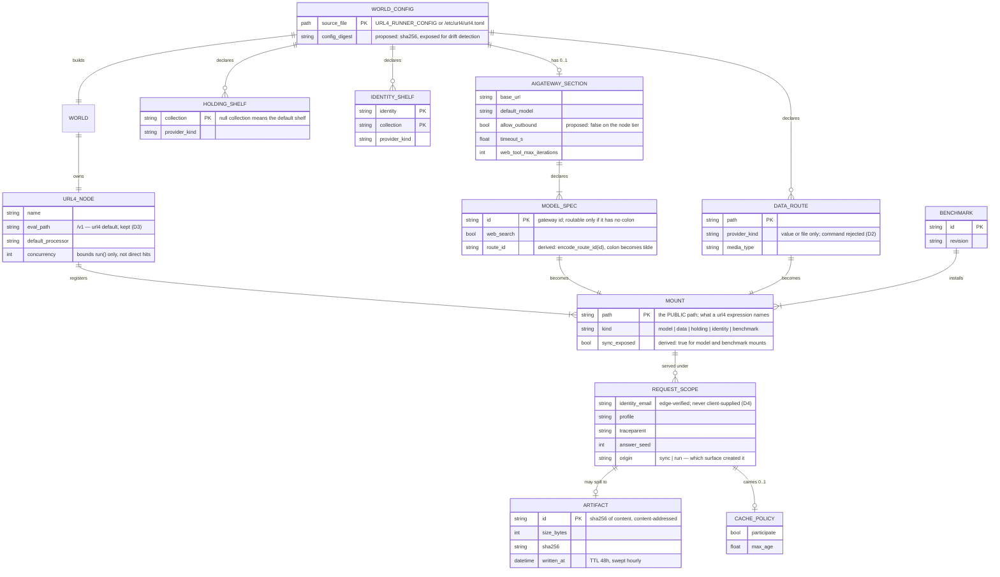

# Entity model

## 0. An honest caveat

This design introduces **no new persistent store**. The engine has no relational
database. The entities below are of three kinds, and the diagram marks which:

| Lifetime | Meaning | Examples |
|---|---|---|
| **Config** | Parsed from `url4.toml` at process start. Immutable thereafter. | `WorldConfig`, `ModelSpec`, `DataRoute` |
| **Process** | Built once per process, held in memory. | `World`, `Mount` |
| **Request** | Created per request or per run. Never shared. | `RequestScope` |
| **Persisted** | Survives the process. | `Artifact` (S3 or filesystem) |

The only entity this work newly *writes* to durable storage is `Artifact`, and only
because of D9. Everything else is configuration and in-memory wiring. An ERD is
still worth drawing, because the whole point of the change is that **one declaration
produces one mount set consumed by two surfaces** — and that is a relationship
worth pinning.

## 1. Diagram

## 2. Entity notes

### WORLD_CONFIG
Parsed by `world_config.load_config()` from the TOML at `URL4_RUNNER_CONFIG`,
default `/etc/url4/url4.toml`, which is baked into the image.

`config_digest` is new. [proposed] Both the App and the node tier read the same
file from the same image, but nothing enforces that today. A digest exposed on a
health endpoint lets an operator detect a rolling deploy where the two tiers are
briefly running different configuration — which under D6 would show up as the App
forwarding to a mount the node does not have. See `contracts.md` C2.

### MODEL_SPEC → MOUNT
The relationship is exactly one-to-one **for routable ids only**. An id containing
a colon is declared but not addressable, because the url4 grammar forbids `:` in a
path segment (`models/registry.py:113-143`). `encode_route_id()` maps `:` to `~`.

This matters for the sync surface in a way it never did for the ensemble surface:
the encoded form now appears in a **user-facing URL**. A caller reaching a
HuggingFace provider-suffixed model must write `/huggingface/model~provider`. That
is an API affordance, not an internal detail, and it needs a test and a line of
documentation. [implied]

### DATA_ROUTE
New in unit 2. url4's own resolver supports `value`, `file` and `command` providers
(`cli/_config.py:189-212`). D2 restricts the engine to `value` and `file`. A
command-backed provider must be rejected at config load with a named error, not
silently ignored — silent omission would make a mount vanish without explanation.
[proposed]

### HOLDING_SHELF, IDENTITY_SHELF
New in unit 2. Under D8 these are **global**: every sync caller resolves the same
shelves, because url4's identity handlers receive only a collection name and the
`Request` carries no identity (`peer/_dispatch.py:51-63`). Per-caller scoping needs
an upstream change to `packages/url4` and is out of scope.

The practical rule for operators: **anything declared here is readable by every
caller of the sync surface.** The node must log the declared shelves at startup so
this is visible rather than assumed. [`ans:Q9`, proposed]

### REQUEST_SCOPE
The heart of F2. A `ContextVar` holding everything that used to live on the
`_ModelEndpoint` instance. ContextVars are per-`asyncio.Task`, and a task spawned
inside a request copies the context at creation, so child tasks inherit correctly
and siblings stay isolated.

`origin` distinguishes the two producers. It is not decoration: metrics, logs and
the cache key all need to tell a sync call from a run, and a single field is
cheaper than inferring it. [proposed]

The invariant that must be tested, because violating it is silent and severe: **no
value derived from `REQUEST_SCOPE` may be cached on any object that outlives the
request.** That is exactly what the current code does and exactly what F2 removes.

### ARTIFACT
Existing entity, content-addressed by SHA-256, 48 h TTL, swept hourly. Unit 3 adds a
second writer (the node tier) under D9.

Because the id is a content hash, two callers producing identical output share one
artifact. That is correct for storage but means the id is **not a capability** —
it is guessable when the content is guessable. The fetch endpoint must therefore
authenticate rather than rely on the id being unguessable. See `contracts.md` C6.
[implied]

## 3. What is deliberately not modelled

- **Run / Topic / capability token.** They belong to the ensemble surface, which
  this work does not change. They appear in `contracts.md` for completeness only.
- **Any per-caller persistent state.** The sync surface is stateless by design. A
  caller's only durable trace is an `Artifact` and the log line for the call.
- **A mount registry table.** Mounts live in the node's in-memory dictionaries.
  Persisting or publishing them is the OME-1187 mount-table work, out of scope.
