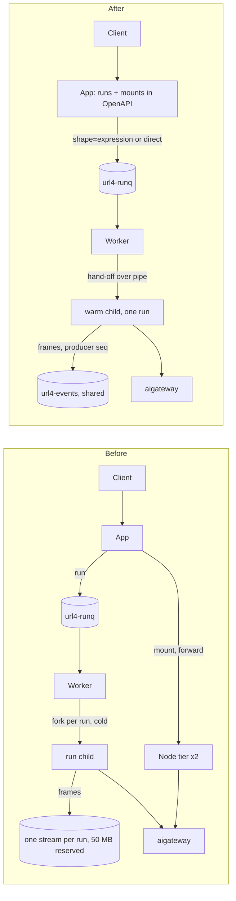

# Uniform executor — overview

**Status:** planned · **Date:** 2026-09-25 · **Scope:** `apps/screamingface-engine`, `packages/url4`
**Supersedes (on completion):** `docs/plans/00-overview.md` decisions D5, D6 and D9, and
`docs/plans/prd/03-node-tier-and-sync-surface.md`. D1 and D4 stay in force.

## 1. Summary

Today the engine has two executors. The worker pool runs url4 expressions from a NATS queue,
one child process per run, and streams events. The optional node tier runs mount calls
(`GET /<mount>?q=`) in a separate Deployment with its own capacity, timeouts, spill rule and
no events. This plan makes the worker pool the **only** executor. Every request, ensemble or
simple, becomes a run on the same queue, runs in the same kind of child process, and writes
the same events. The node tier is deleted after a parity gate.

To make that path fit simple requests, the plan also:

- replaces the per-run JetStream stream with one shared stream (removes a concurrency cap);
- lets a sync `GET /?q=` work without a WebSocket;
- keeps warm child processes ready, so a run does not wait for Python start-up and world build;
- projects every mount into `/openapi.json`.

## 2. The crux

**The hard part is the frame sequence in a shared stream.** The client checks that frame
sequences are 1, 2, 3, … with no gap, and it fails a run after repeated gaps
(`packages/screamingface/src/screamingface/_engine/contract.py:141-160`). Today the consumer
replaces the producer sequence with the JetStream stream sequence
(`packages/url4/src/url4/streaming/codec.py:13-14`). The two values are equal only because each
run has its own fresh stream. In a shared stream they differ.

**Invariant:** every frame of a topic carries a gap-free producer sequence, and every writer
keeps it gap-free. **Operations that enforce it:** the consumer never overrides the sequence;
the child is the only writer while it runs; every other writer (App tombstone, supervisor
classification) publishes with `Nats-Expected-Last-Subject-Sequence` and `last + 1`. See
`erd.md` §5 (I-EV1..I-EV4) and `prd/01-shared-events-stream.md`.

**Second crux:** the D1 guarantee (a mount call runs one handler, never a DAG). It moves from
"the node tier only has direct mounts" to "`shape=direct` runs go through
`url4.peer.dispatch_direct`, which refuses the eval path", checked by the App and again by the
child. See `prd/04-mount-call-as-direct-run.md`.

## 3. Before and after

## 4. Subsystems and ownership

| Subsystem | Code | PRD |
|---|---|---|
| Event store and frame sequence | `adapters/jetstream.py`, `subjects.py`, `runner/main.py`, `adapters/queue_runner.py`, `packages/url4/.../codec.py` | 01 |
| App sync path and audience | `rest/routes.py`, `ws/registry.py`, `reaper.py` | 02 |
| Worker and child process | `worker/supervisor.py`, `worker/loop.py`, `worker/exec_wrapper.py`, `runner/main.py`, new `child_protocol.py` | 03 |
| Mount surface and direct runs | `rest/` (new mount routes), `schemas/openapi.py`, `runner/executor.py`, `local.py`, `packages/url4/src/url4/peer/` | 04 |
| Node tier removal | `world/node_tier/`, `rest/forwarder.py`, `cli.py`, `config.py`, `deploy/helm/` | 05 |

Owner for all: unassigned.

## 5. Documents and reading order

Read in this order. It is also the build order.

1. `00-overview.md` (this file)
2. `erd.md` — entities, invariants, state table, migrations
3. `test-plan.md` — risk model, TDD rules, kind environment, measurement, phase exit criteria
4. `prd/01-shared-events-stream.md` — phase 1
5. `prd/02-sync-run-without-websocket.md` — phase 2
6. `prd/03-warm-child-pool.md` — phase 3
7. `prd/04-mount-call-as-direct-run.md` — phase 4
8. `prd/05-node-tier-decommission.md` — phase 5
9. `contracts.md` — one contract per connection; use it while you build each phase

Phase 0 (kind environment, measurement baseline, all characterization tests) comes before
phase 1. See `test-plan.md` §7.

## 6. Interview ledger

Every `ans:Qn` tag in these documents resolves here. Answers are quoted as given.

| ID | Question | Answer |
|---|---|---|
| Q1 | Which changes are in scope? | "All six changes (Recommended)" — sync without a WebSocket, shared events stream, warm children, direct-shape runs, capacity classes, delete the node tier. The stateless App (OME-890) was **not** selected. Capacity classes were later removed by Q8. |
| Q2 | How should the node tier be removed? | "Delete after parity gate (Recommended)" |
| Q3 | What extra latency is acceptable? | "No latency gate" (user picked against the recommendation "measure, then fix target"). Measure and report only. |
| Q4 | Where must the implementing agent validate? | "local + emulated k8s using kind" (free text) |
| Q5 | What happens to the public mount surface? | "the app must actually somehow project the real available endpoints so it appears in the openapi.json. (even though all of them would be routed to the same workflow" (free text) |
| Q6 | Must a sync `GET /?q=` still need a token? | "Keep the token (Recommended)" |
| Q7 | How must in-flight runs behave during the rollout? | "Drain window is fine (Recommended)" |
| Q8 | How should short and long runs share workers? | "No classes, FIFO buckets" (user picked against the recommendation "reserve 1 slot per worker"). This overrides the capacity-class part of Q1. |
| Q9 | Mount call: what happens when the 30 s bound runs out? | "504 and stop the run (Recommended)" |
| Q10 | Spill limit for mount responses? | "One limit: 1 MiB (Recommended)" |
| Q11 | Events store full? | "Drop oldest frames + alert (Recommended)" |
| Q12 | Where does the public direct-dispatch API go? | "Add public API to url4 (Recommended)" |

## 7. Global assumptions

- The App stays at 1 replica. The interest registry stays in memory. `[stated ans:Q1]`
- No environment outside the repo enables `node.enabled`. The parity gate asks a human to
  confirm this (PRD 05, DC-H1 item 5). `[proposed]`
- Production runs Linux, so `RLIMIT_AS` applies. `[existing worker/exec_wrapper.py]`
- The url4 package changes in the same PR as the engine, because it is an editable workspace
  install. `[existing Dockerfile]`
- These documents were written outside the repo's SDLC process, on the owner's instruction.
  The implementing agent must follow the repo's own rules for the code work (`CLAUDE.md`:
  worktree per unit, Linear issue under an epic at PR open, PR with green CI), unless the owner
  says otherwise. `[stated — owner instruction in the planning session]`

## 8. Deferred and open questions

| # | Question | Where | Recommended default |
|---|---|---|---|
| 1 | Local mode and production expose different mount sets (local: eval path yes, benchmark endpoints no; production: the opposite). | PRD 04 §6 | Keep both sets. Serve the local eval path as a `shape=expression` sync run. Ask the owners if production should also hide benchmark endpoints. |

No other question is open. Every other product decision traces to an answer in §6.

## 9. Instructions for the implementing agent

1. Read the documents in the order of §5.
2. Do phase 0 fully before you change behavior.
3. In each phase, follow the TDD table of its PRD from top to bottom. CHAR tests first.
4. Obey the stop rules in `test-plan.md` §7.
5. At the end of each phase, run every quality gate (`test-plan.md` §4) and the kind cases for
   that phase. Record the result in `measurements/` when the phase has a benchmark case.
6. Do not start phase 5 removal until `measurements/parity-gate.md` passes DEC-1.
