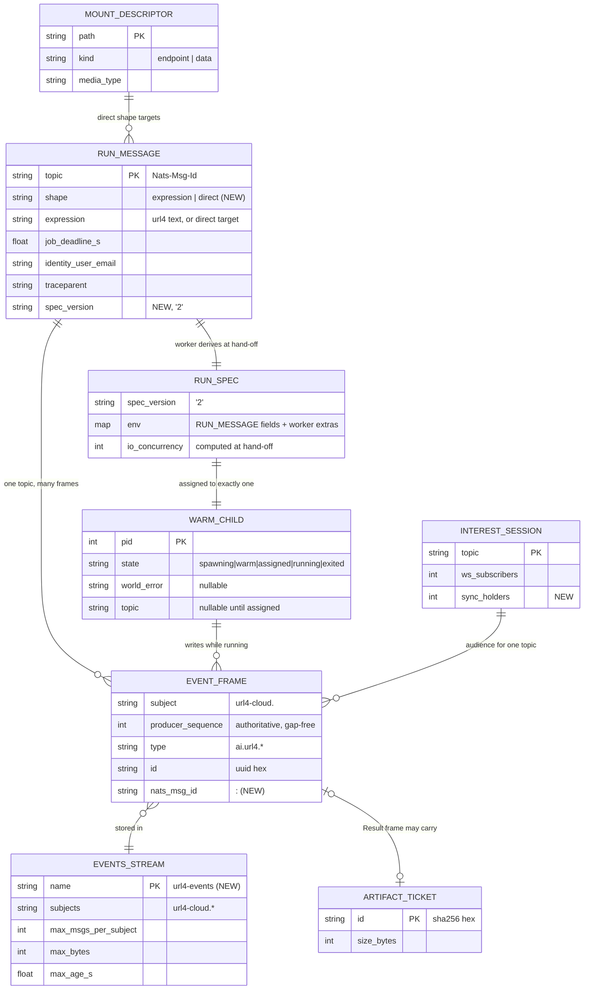

# ERD: uniform executor

This document gives the data model for the uniform-executor change. The change has no
relational database. The "stores" are NATS JetStream streams, the in-memory state of the
App and of the worker supervisor, and the artifact store. Each one gets an entity section.

Source tags: `[stated prompt]`, `[stated ans:Qn]`, `[existing <path>:<line>]`,
`[implied]`, `[proposed]`. Paths are relative to `apps/screamingface-engine/src/screamingface_engine/`
unless they start with `packages/` or `apps/`. The interview ledger is in `00-overview.md`.

## 1. Diagram



## 2. RUN_MESSAGE — the run-queue payload (existing, changed)

**Store.** JetStream stream `url4-runq`, `retention=WorkQueue`, file storage, one bucket
subject per caller hash. `[existing runner_queue.py:434-442]`

**Purpose.** One message is one run. The App writes it. One worker claims it.

**Current shape.** The body is a JSON object of per-run environment keys. It has no
version field. `[existing runner_queue.py:245-275]` The keys are the `job_env` constants:
`TOPIC`, `EXPRESSION`, `JOB_DEADLINE_S`, `TRACEPARENT`, the identity key mapped from
`X-User-Email`, `ANSWER_SEED`, `CACHE_PARTICIPATE`, `CACHE_MAX_AGE_S`,
`EXTRA_MODELS`, `IO_CONCURRENCY`, `STREAM_GRACE_S`. `[existing runner_queue.py:31-471]`
Headers: `Nats-Msg-Id = topic`, `Url4-Enqueued-At = <ISO-8601 UTC>`.
`[existing runner_queue.py:487-490]` The subject is `url4-runq.<bucket>`, where the bucket
is the caller-identity hash modulo the bucket count (default 16).
`[existing runner_queue.py:92, 410-417]`

**Delta.**

| Field | Type | Rule | Tag |
|---|---|---|---|
| `job_env.RUN_SHAPE` (`URL4_CLOUD_RUN_SHAPE`) | `"expression" \| "direct"` | Absent means `expression`. So an old message still decodes. | [proposed] |
| `job_env.EXPRESSION` | string | For `shape=direct` it holds the direct target: `<mount path>?<raw query>`, max 8 KiB. | [proposed] |
| `job_env.SPEC_VERSION` (`URL4_CLOUD_SPEC_VERSION`) | `"2"` | Absent means version 1. A worker refuses an unknown major version with a `failed` terminal frame and code `unsupported_spec_version`. | [proposed] |

**Invariants.**

- One topic has at most one live queue message (dedup window 120 s). `[existing runner_queue.py:67]`
- `shape=direct` ⇒ the target path is in the App's mount set and is not the eval path. The
  App checks this before publish. The child checks it again. `[implied — D1 in docs/plans/00-overview.md §3]`
- `shape=direct` ⇒ `JOB_DEADLINE_S ≤ sync_max_wait_s + 5`. A direct run never outlives its
  caller. `[implied — ans:Q9]`

**Retention.** WorkQueue: the message goes away at ack. `max_deliver=2`, `ack_wait=60 s`.
`[existing runner_queue.py:69-70]`

## 3. RUN_SPEC — the hand-off to a warm child (new)

**Store.** None. It exists only on the child's stdin pipe for one read.

**Purpose.** A warm child starts before its run is known. The worker sends the run
through this record. `[stated ans:Q1]`

**Shape.** One UTF-8 JSON line, max 1 MiB, then `\n`. `[proposed]`

```json
{"spec_version": "2",
 "env": {"<job_env key>": "<value>", "...": "..."},
 "io_concurrency": 3}
```

- `env` is the RUN_MESSAGE body as decoded. It holds the same keys with the same meaning.
  One codec serves both, so the two cannot drift. `[proposed]`
- `io_concurrency` is the worker's `_io_budget()` result at hand-off time, not at spawn
  time. `[existing worker/supervisor.py:751-766]` → moved to hand-off `[proposed]`

**Invariants.**

- One RUN_SPEC goes to exactly one child. A child reads one RUN_SPEC in its life. `[proposed]`
- The child never reads a per-run key from its process environment before it has read the
  RUN_SPEC. A test enforces this (see PRD 03, test WRM-4). `[proposed]`

## 4. WARM_CHILD — supervisor state for one child process (new)

**Store.** The memory of the worker supervisor. It is lost when the worker stops. That is
correct: a child cannot outlive its worker. `[implied]`

**Attributes.** `pid`, `state`, `spawned_at`, `ready_at`, `world_error` (text or null),
`topic` (null until assigned), `proc` handle. `[proposed]`

**State table.** Every state × every event. Events that cannot happen are rejected on
purpose (the transition is a bug, logged at ERROR, and the child is killed).

| State \ Event | READY | spec written | ACK | exit (any code) | drain | ready timeout |
|---|---|---|---|---|---|---|
| spawning | → warm | reject (bug) | reject (bug) | → exited, count warm failure | kill → exited | kill → exited, count warm failure |
| warm | reject (bug) | → assigned | reject (bug) | → exited, count warm failure, spawn a replacement | kill → exited | n/a |
| assigned | reject | reject | → running | → exited; retry the run once on a new child (no side effect is possible yet) | kill; classify `stopped/worker_draining` | n/a |
| running | reject | reject | reject | → exited; classify with today's `_classify` | today's drain path | n/a |
| exited | — | — | — | — | — | — |

`[proposed]`; classification `[existing worker/supervisor.py:875-933]`

**Invariant.** A child that reached `assigned` is never returned to `warm`. One run per
child keeps the crash domain at one run. `[existing docs/work/2026-09-02-OME-1089-runner-worker.md:14-20]`

## 5. EVENTS_STREAM — the shared event store (new; replaces one stream per topic)

**Current behavior.** Each run gets its own stream `url4-cloud_<topic>`, subject
`url4-cloud.<topic>`, `max_age=86400 s`, `max_bytes=50 MB`, `discard=OLD`.
`[existing adapters/jetstream.py:69-76, 213-219]` The `max_bytes` value is a reservation
that counts against the store from creation, so the store size divided by 50 MB caps the
number of concurrent runs. The error 10047 marks the cap. `[existing adapters/jetstream.py:64-76]`
The runner deletes its stream 60 s after its terminal frame. `[existing runner/main.py:157-198]`
An orphan sweep runs only when `add_stream` fails with 10047. `[existing adapters/jetstream.py:223-289]`

**New entity.**

| Attribute | Value | Tag |
|---|---|---|
| `name` | `url4-events` | [proposed] |
| `subjects` | `["url4-cloud.*"]` (subject names do not change) | [proposed] |
| `retention` | limits | [proposed] |
| `storage` | file | [existing adapters/jetstream.py:213] |
| `discard` | `OLD` (store full ⇒ drop the oldest frames) | [stated ans:Q11] |
| `max_age_s` | 86 400 | [existing adapters/jetstream.py:69] |
| `max_bytes` | chart value `events.maxBytes`, default 1 GiB (sized to today's deployments: 8 runs in flight, 50 MB each before), must be ≤ the JetStream file store | [proposed] |
| `max_msgs_per_subject` | chart value `events.maxMsgsPerSubject`, default 20 000; phase 0 measures the real frame count | [proposed] |
| `max_msg_size` | 2 MiB (a 1 MiB result body plus JSON escaping and envelope) | [proposed] |
| `duplicate_window_s` | 120 | [proposed] |
| `num_replicas` | chart value `events.replicas`, default 1 (same as `url4-runq`) | [proposed] |

**Access patterns.** Write: append to one subject. Read: an ordered, ack-less consumer
filtered to one subject, from the first message of that subject. Purge: by subject.
`[proposed]`

**Invariants.**

- I-EV1. Every frame on `url4-cloud.<topic>` carries a producer sequence. The sequences are
  1, 2, 3, … with no gap. The url4 producer already asserts this.
  `[existing packages/url4/src/url4/streaming/lifecycle.py:57-66]`
- I-EV2. The consumer never replaces the producer sequence. Today it replaces it with the
  stream sequence. `[existing packages/url4/src/url4/streaming/codec.py:13-14; adapters/jetstream.py decode call]`
  In a shared stream the stream sequence has gaps inside one run, and the client treats a gap
  as lost frames. `[existing packages/screamingface/src/screamingface/_engine/contract.py:141-160]`
  So this invariant is mandatory. `[implied]`
- I-EV3. At most one writer at a time per subject. While the child runs, only the child
  writes. A writer that is not the child (the App tombstone, the supervisor classification
  frame, the `queue_expired` frame) reads the last frame of the subject, writes
  `sequence = last + 1`, and sets `Nats-Expected-Last-Subject-Sequence` to the stream
  sequence of that last frame (`0` for an empty subject). On a mismatch it reads again and
  retries, max 3 times. `[proposed]`
- I-EV4. One terminal frame per topic, and it is the last frame. `[existing adapters/queue_runner.py:345-366]`

**Size and growth.** One subject holds max 20 000 frames. The stream total is max 1 GiB by default.
When the stream is full, JetStream drops the oldest frames of any subject. `[stated ans:Q11]`
A metric shows the use ratio, and an alert rule fires at 0.8. `[stated ans:Q11]`

**Consistency with other stores.** The RUN_MESSAGE is the source of truth for "this run
exists". The EVENT_FRAME subject is the source of truth for "this run finished" (a terminal
frame). The worker dedupe gate reads the subject before it spawns. `[existing worker/supervisor.py:414, 621-629]`

## 6. EVENT_FRAME — one CloudEvent (existing, changed)

**Envelope fields.** `specversion "1.0"`, `id` (uuid hex), `source`
(`/trace/<topic>[/node/<id>]`), `subject` (topic), `type` (`ai.url4.*`), `time`,
`sequence` (string integer), `sequencetype "Integer"`, `traceparent`, `tracestate`,
`datacontenttype "application/json"`. `[existing packages/url4/src/url4/streaming/protocol/envelope.py:17-33]`
Types: started, log, span, cost.usage, heartbeat, result, terminated, error.
`[existing packages/url4/src/url4/streaming/protocol/unions.py:70-79]`

**Delta.**

- `sequence` on the wire is the producer sequence (I-EV2). `[proposed]`
- NATS header `Nats-Msg-Id = <topic>:<sequence>`. A retried publish then cannot write a frame
  twice. `[proposed]`
- NATS header `Url4-Seq = <sequence>`, for operators and tools. `[proposed]`

**Wire compatibility.** For a run with one writer, the producer sequence and today's
stream sequence have the same values (both start at 1 on a fresh subject). So clients see
no change. A characterization test pins this before the change (EVT-C1). `[implied]`

## 7. ARTIFACT_TICKET (existing, used by mounts now)

`ResultData` holds exactly one of `body` or `artifact`. `[existing packages/url4/src/url4/streaming/protocol/signals.py:195-218]`
A result body over the inline limit is written to the artifact store under its sha256.
The limit is 1 MiB for every shape. `[stated ans:Q10]` Today the node tier uses 512 KiB.
`[existing world/node_tier/settings.py:81]`
A signed URL is `/artifacts/{id}?exp=<unix>&sig=<hex>`, HMAC-SHA256 over
`url4-artifact-v1:<id>:<exp>` with `URL4_CLOUD_ARTIFACT_SIGNING_KEY`.
`[existing artifacts/signing.py:39-71]` The signed-URL TTL is 600 s. `[existing config.py artifact_url_ttl_s]`

## 8. INTEREST_SESSION — App audience per topic (existing, changed)

**Store.** `ConnectionRegistry`, App memory. `[existing ws/registry.py:64-157]` The App runs
1 replica because this store is in memory. `[existing deploy/helm/values.yaml:1-21]` The
NATS-based fix (OME-890 follow-up) is out of scope. `[stated ans:Q1]`

**Current attributes.** `subscribers` (WebSocket count), cache policy, notifiers.
`audience_arrived` fires on 0 → 1, `audience_left` on 1 → 0. `[existing ws/registry.py:83-103]`

**Delta.** Split the count into `ws_subscribers` and `sync_holders`. `has_subscriber` is
true when the sum is above 0. The audience events fire on transitions of the sum.
`[proposed — ans:Q1 "sync without a WebSocket"]`

## 9. MOUNT_DESCRIPTOR — App mount table (new)

**Store.** App memory. It is derived at startup from the same `world` module that the
workers use. `[existing rest/forwarder.py:155-192 derive_forward_contract]`

**Attributes.** `path` (PK), `kind` (`endpoint` or `data`), `media_type` (data routes; for
endpoints, the media type of the result), `summary` (text for OpenAPI). `[stated ans:Q5]`

**Source.** A new public url4 function returns route information: path, kind and media
type. The engine does not read private url4 attributes for this. `[stated ans:Q12]`

**Invariant.** The descriptor set equals the set that the App registers as routes, and each
one is in `/openapi.json`. `[stated ans:Q5]` No descriptor collides with an engine route or
with the eval path. Startup fails on a collision. `[existing world/serving.py:127 F4 guard]`

## 10. Migrations

- **RUN_MESSAGE.** Expand only. New keys have safe defaults when absent (`shape=expression`,
  `spec_version=1`). A new worker reads an old message. An old worker that reads a
  `shape=direct` message would run it as an expression. The drain rollout prevents that
  mix. `[stated ans:Q7]`
- **EVENTS_STREAM.** No data moves. The rollout drains the system first. `[stated ans:Q7]`
  After deploy, a one-shot command deletes every legacy stream whose name matches
  `url4-cloud_*`: `screamingface-engine admin purge-legacy-streams`. It prints each name,
  and `--dry-run` only lists. `[proposed]` **Superseded 2026-09-27 (owner):** the App and
  the worker do this deletion at startup, so a GitOps auto-sync needs no manual step (see
  `implementation-notes.md` D7). Without a drain first, runs in flight on a legacy stream
  lose their frames, and an old worker still up can read a `shape=direct` message.
- **EVENTS_STREAM config change later.** At startup the App calls `add_stream`. If the
  stream exists, it calls `update_stream` for mutable fields (`max_bytes`, `max_age`,
  `max_msgs_per_subject`, `num_replicas`). For an immutable field (`storage`,
  `retention`), startup fails with a message that names the field. `[proposed]`
- **INTEREST_SESSION / WARM_CHILD / MOUNT_DESCRIPTOR.** Memory only. No migration.
