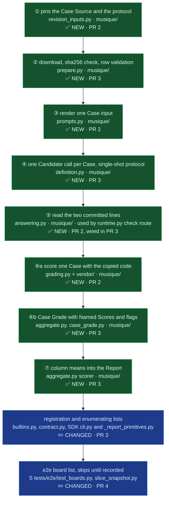

# OME-1475 — MuSiQue-Ans build plan

**Ticket:** [OME-1475](https://linear.app/openmined/issue/OME-1475/build-and-score-the-musique-benchmark)
· **Spec:** `docs/spec/2026-10-07-OME-1475-musique-ans.md`
· **Stack:** screamingface-engine, screamingface · **Date:** 2026-10-07

Four stacked PRs, each under review-attention size. The spec holds every decision (D1 to D14);
this plan says where each one lands. Paths: `E` = `apps/screamingface-engine/`,
`M` = `E/src/screamingface_engine/benchmarks/musique/`, `S` = `packages/screamingface/`.

## Global constraints

* **Template:** ContractEval (`benchmarks/contracteval/`) is the single-shot, judge-free model for
  every file; MedXpert (`benchmarks/medxpert/`) is the model for the answer parser and for Case
  result metadata. Copy their shapes; do not invent new seams.
* **Never edit** `benchmarks/aggregation.py` or `shared_grading/benchmark_aggregation.py`: Named
  Scores are declared on `BenchmarkAggregation(named_scores=...)` and returned per Case on
  `CaseGradeOutcome(scores=...)`; the run-level `CandidateScore.scores` is our scorer's job.
* **The live-score projection keeps only** `grade.score`, `grade.metrics`, `grade.scores` and
  check outcomes (`activity/progress.py:70-113`). The scorer must read nothing else, or
  `test_early_grade_compatibility` fails.
* **Ids.** Benchmark id `musique-ans`; package, asset bundle and SDK CLI name `musique` (the CLI
  runs `python -m screamingface_engine.benchmarks.{name}.prepare`). Case ids are 1-based
  positions, as in ContractEval; the dataset's own id rides in the answer record.
* **Only Case Preparation touches the network.** Grading reads files; tests make no network call.
* **House style:** typed locals, a one-line intuition docstring on every function, Feynman
  docstrings on the parser and the scorer wrapper, plain `test_` functions, each test naming the
  invariant it defends. ruff limits: `PLR0911` 3 returns · `PLR0912` 7 branches · `C901` 8 ·
  line 100.
* **Checks per PR:** ruff, ruff format, pyright, and the touched test files (plus the inspect
  lane for tests under `tests/unit/inspect/`: `uv run --extra inspect pytest …`). No paid run.

## The code map



HOW TO READ: one box per step where data changes hands, numbered as in the spec's Data Flow;
green is new code, blue is an existing file this work changes.

## PR 1 — spec and plan (this PR)

The spec, this plan, the PR 1 ledger, and the `docs/tasks/` mirror (status `in_progress`).

## PR 2 — the scoring core (`OME-1475-pr2-musique-cases-scoring`)

Pure functions only; nothing registered, nothing served. **Case Preparation is not here:** the
family guard (`tests/unit/test_benchmark_deployment.py`,
`test_the_family_guard_covers_every_family_preparer_package`) requires every
`benchmarks/<family>/prepare.py` to belong to a registered Benchmark, so the preparer ships in
PR 3 with the registration.

| File | Contents |
| -- | -- |
| `M/__init__.py` | empty |
| `M/revision_inputs.py` | `DATASET = "dgslibisey/MuSiQue"`, `DATASET_REVISION = "c8f4f8c9465fb69d31a8eae894c3fd509c4ca321"`, `DATASET_FILE = "musique_ans_v1.0_dev.jsonl"`, `DATASET_SHA256 = "15fa63794d18a94ce12411aca6e2327e65b6e83b0b1490efab3f1962e48abf3b"`, `EXPECTED_CASES = 2417`, `PREPARER_REVISION = "ans-dev-v1"`, `PROTOCOL_REVISION = "answer-support-lines-v1"`, `SCORER_REVISION = "StonyBrookNLP/musique@922ac98f19a201998dbdae6d7f2887a5258dbdeb"`; advisory `MAX_TOKENS = 4096` with ContractEval's WHY comment |
| `M/prompts.py` | the byte-frozen template from the spec; `render_case_input(question: str, paragraphs: Sequence[Paragraph]) -> str` |
| `M/answering.py` | `ExtractedReply(answer: str, answer_line: bool, support: frozenset[int], support_line: bool)`; `extract_reply(completion: str) -> ExtractedReply` per spec D6/D7 |
| `M/vendor/` | `metric.py`, `answer.py`, `support.py` copied from `StonyBrookNLP/musique@922ac98f`, the only change being `from metrics.metric import Metric` → `from .metric import Metric`; `LICENSE` (the repo's CC BY 4.0); `__init__.py` docstring naming the commit, each file's upstream sha256, and that one change |
| `M/grading.py` | `score_answer(prediction: str, answer: str, aliases: Sequence[str]) -> AnswerScore(f1: float, exact: int)` via `metric_max_over_ground_truths`; `score_support(predicted: Collection[int], gold: Collection[int]) -> float` via a fresh `SupportMetric` per Case |
| `E/pyproject.toml` | add `musique/vendor` beside `ifeval/vendor` in ruff `extend-exclude`, pyright `ignore`, coverage `omit` |
| `E/tests/fixtures/musique/dev_two_rows.jsonl` | two real dev rows: `2hop__460946_294723` and `3hop1__454441_55349_651302` (has an alias) |

Upstream sha256 at `922ac98f`: `answer.py` `10368f619b4d5ef5d83748c05a96c0afd332a14ab5c010740c98d58dfaefe974`,
`support.py` `ac16c0daf458a6a4d6db97682c2340fe5b5936a947bf32c04dc3bf16406077c6`,
`metric.py` `c858d1bfda2f0b005065e87a402cd2f82154eb7eed5916845ae130759cc3a299`.

Answer record (private, `answers/<id>.json`): `answer`, `answer_aliases`, `supporting_idx`
(sorted), `musique_id`, `hop_type` (the id prefix, e.g. `2hop`, `3hop1`). Public Case:
`{id, input}` only.

Tests, written first:

* `E/tests/unit/test_musique_vendor.py` — each vendored file, with the import line restored,
  hashes to its upstream sha256.
* `E/tests/unit/test_musique_grading.py` — the spec's reply table, `Denver, CO` → 0.67 against
  `Denver` + `Denver, Colorado`, both-empty support → 1.0, empty prediction → 0.
* `E/tests/unit/test_musique_answering.py` — last label wins, markdown, case, empty label line
  takes the next non-empty line, missing lines, duplicate and non-integer support tokens.
* `E/tests/unit/test_musique_prompts.py` — the fixture's first row renders to a hand-written
  literal, byte for byte.

## PR 3 — the Benchmark (`OME-1475-pr3-musique-benchmark`)

| File | Contents |
| -- | -- |
| `M/prepare.py` | `PrepareError(BenchmarkAssetPreparationError)`; `download_dev_file() -> bytes` (lazy `importlib.import_module("huggingface_hub")`, `hf_hub_download(repo_id=DATASET, filename=DATASET_FILE, revision=DATASET_REVISION, repo_type="dataset")`); `verify_sha256(data: bytes) -> None`; `parse_rows(data: bytes) -> list[dict[str, Any]]`; `validate_row(row) -> None` (fields present, `answerable` true, `idx` equals position, 2 to 4 supporting); `case_records(rows) -> tuple[list[CaseRecord], dict[int, AnswerRecord]]`; `emit(out, cases, answers)`; `prepare(out: Path) -> None`; `main()`; re-export `DATASET_REVISION` (the SDK CLI fingerprints it) |
| `M/case_grade.py` | ContractEval's `CHECK_SCHEMA` / `CASE_GRADE_SCHEMA` shape for this Benchmark |
| `M/runtime.py` | `ServedBenchmark` as ContractEval's; `_check` runs `extract_reply` and records `{answer, support, answer_line, support_line}` as the verdict |
| `M/aggregate.py` | `BenchmarkAggregation(..., grading_failure_code="musique_grading_failed", missing_material_code="missing_answer_asset", named_scores=("f1", "exact", "support_f1"))`; `_grade_case` → `CaseGradeOutcome(score=f1, scores={"f1", "exact", "support_f1"}, metrics={"answer_line_found", "support_line_found"}, checks=[…])`; the scorer averages each column over the graded Cases (the inspect `_column_means` pattern, `screamingface_engine_inspect/single_shot.py:827-866`); `Scoring(metadata=…)` surfaces `musique_id` and `hop_type` (MedXpert `aggregate.py:109-117, 180-196`) |
| `M/definition.py` | `BENCHMARK_ID = "musique-ans"`, `ASSET_BUNDLE_ID = "musique"`, `CASE_COUNT = 2417`, routes, `compute_revision()` over every pin plus the prompt template and the vendored files' sha256, single-shot `_build` as ContractEval's, and `MUSIQUE_ANS = Benchmark(...)` with `declaration=BenchmarkDeclaration(failure_policy="coverage_declare", interaction="single_shot", difficulty="hard")`, a unique `focus`, `dataset_url`, and the provenance below |
| `E/…/benchmarks/builtins.py` | import, lazy `_prepare_musique` shim, `MUSIQUE_ASSETS`, one `BenchmarkRegistration` |
| `E/…/benchmarks/contract.py` | `"musique_grading_failed"` in `DECLARED_FAILURE_CODES`, beside the other `*_grading_failed` codes |
| `S/src/screamingface/_report_primitives.py` | the same code, same grouping |
| `S/src/screamingface/_runtime/cli.py` | `"musique"` in `_BENCHMARKS`; `_validate_benchmark_output` entry `("cases.json", "answers")` |
| `S/scripts/build_notebooks.py` + `S/examples/15_musique.ipynb` | a builder as ContractEval's: one solo Model and one Fusion on a small `limit`, `params={"max_tokens": 4096}`, the three scores, and a per-hop F1 table grouped by `case.metadata["hop_type"]` |

Provenance on `MUSIQUE_ANS`:

```python
paper_url="https://aclanthology.org/2022.tacl-1.31/",
authors="Trivedi et al., 2022",
citation=<the TACL 2022 BibTeX>,
homepage_url="https://github.com/StonyBrookNLP/musique",
harness_url="https://github.com/StonyBrookNLP/musique/tree/922ac98f19a201998dbdae6d7f2887a5258dbdeb",
license="CC-BY-4.0",
license_note="MuSiQue data and code are CC BY 4.0; Cases are served from the byte-identical dgslibisey/MuSiQue mirror.",
human_baseline=HumanBaseline(score=0.78, source_url="https://aclanthology.org/2022.tacl-1.31/"),
frontier_score=FrontierScore(score=0.692, model="Beam Retrieval (DeBERTa-large, beam size 2)",
                             source_url="https://aclanthology.org/2024.naacl-long.96/", as_of="2024-06"),
notebook="15_musique",
```

Enumerating tests to extend (each an existing file):

* `E/tests/unit/inspect/test_benchmark_declaration.py` — row `"musique-ans": ("coverage_declare", "single_shot", "hard")`.
  The append-only gate flags edits to existing tests; the owner's `--skip-append-only` press is
  expected, as on ContractEval.
* `E/tests/fixtures/early_grade_compatibility.json` — `musique-ans` with `revision` and the
  rendered `protocols["1"]`, `["2"]` (from `benchmark.protocol(n)`; no generator script exists).
* `E/tests/unit/test_benchmark_stage_parity.py` `assets()` and
  `E/tests/unit/test_builtin_early_score_timing.py` `_assets` — a `musique` branch (two Cases).
* `E/tests/unit/test_failure_classes.py` — the new code.
* `S/tests/test_runtime_cli.py` — `"musique"` in the parametrize tuple.

New tests: `test_musique_prepare.py` (fixture through `case_records` and `emit`; wrong sha256, wrong
count, non-positional `idx`, missing field each raise `PrepareError`; the public Case holds no
answer; the download is monkeypatched), `test_musique_definition.py` (pins in the revision, provenance values, declaration),
`test_musique_aggregate.py` (Named Scores key set and order, headline equals score, column means,
flags in metrics, metadata, missing material → `missing_answer_asset`),
`test_musique_case_evaluation.py` (the route end to end on the two fixture Cases, as ContractEval's).

Checks: engine and SDK ruff/pyright, the new and touched tests, the inspect lane for
`tests/unit/inspect/`, `uv run --extra notebook python scripts/check_notebooks.py`, both
failure-code conformance tests.

## PR 4 — e2e lane and close (`OME-1475-pr4-musique-e2e`)

* `S/tests/e2e/test_boards.py` — `musique-ans` in `BOARDS`, `musique` in `_ASSET_BUNDLE`; it
  skips loudly until a golden exists, as ContractEval does.
* `S/tests/e2e/fixtures/slice_snapshot.py` — the `_ASSET_BUNDLE` entry.
* Close the docs: every OME-1475 ledger's outcome, the mirror `status: done`. The owner-verify
  note names the remaining owner steps: one cache-on paid run, then `just e2e-bless musique-ans …`,
  then the paid score lock.

## Owner steps after merge

1. Release the SDK before deploying the Engine (new failure code; the SDK refuses unknown codes).
2. One cache-on paid run on a small subset, then the full 2,417; bless the golden from its dump.
3. Update OME-1457's MuSiQue row the same day.
