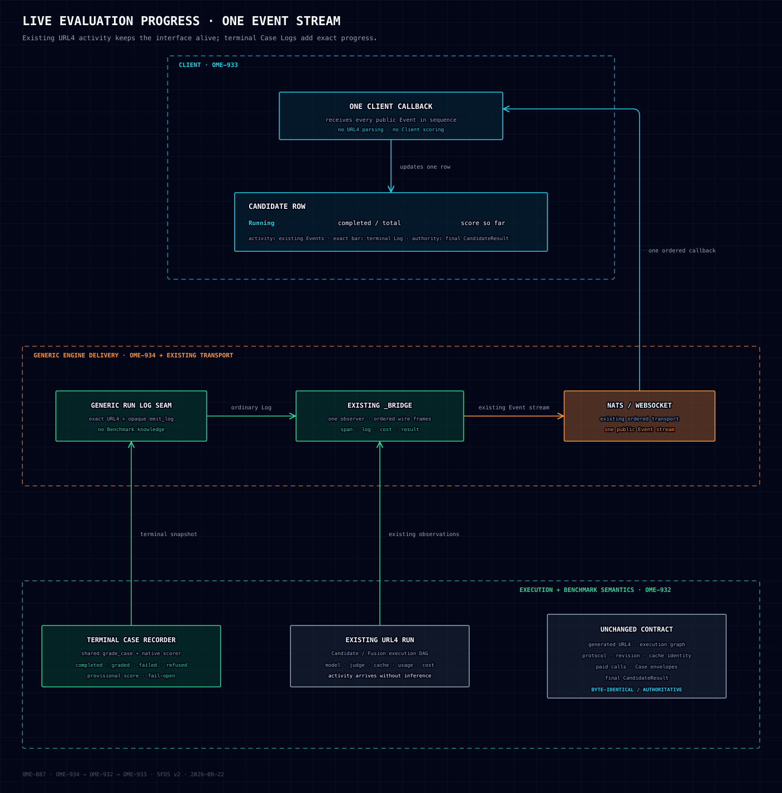

# OME-932 — Terminal Benchmark progress and provisional scores

Status: APPROVED, revised 2026-08-23. Production code is blocked only on OME-934.

## 1. Problem

Existing URL4 Events show model calls, spans, usage, cost, and cache outcomes, which is enough to
keep an Evaluation visibly alive. They do not carry the returned Case envelope or Benchmark grade,
so the Client cannot derive an accurate completed-Case bar or provisional Benchmark score.

The final `CandidateResult` already owns authoritative score and coverage. Live progress must
reuse that Benchmark authority without duplicating paid work, changing execution, or teaching the
Client how a Benchmark scores.

## 2. Decision

OME-934 first adds a generic optional Runner run scope with an opaque structured-Log emitter.
OME-932 uses that seam to bind one run-local Benchmark tracker and emits one complete snapshot after
each newly terminal Case.

There are no `Answering`, `Grading`, `Finalizing`, or current-Case events. Existing URL4
observations keep the UI alive between terminal Case snapshots.

Progress is passive observation:

```text
existing Case execution succeeds ─┐
                                  ├─> Benchmark tracker -> ordinary structured Log
existing Candidate execution fails┘
```

OME-932 makes no change to generated URL4, its graph, protocol/revision/cache identity, URL4
grammar, or `packages/url4`. Result-affecting decisions remain explicit in URL4 or the pinned
Benchmark manifest.



[Open the interactive architecture diagram](../diagrams/ome-887-live-evaluation-progress-architecture.html).

## 3. Ownership and boundaries

### OME-934: generic Runner mechanism

The Runner exposes only a generic run scope and structured-Log emitter. It does not import
`benchmarks.progress`, recognize Benchmark routes, interpret counters, calculate scores, or
construct ScreamingFace attributes.

### OME-932: Benchmark semantics

`benchmarks/progress.py` owns:

- exact Benchmark/total discovery during run-scope setup, only when the rendered expression
  contains exactly one registered aggregate route with a literal `aggregate:N`;
- binding that Benchmark's one immutable Evaluation adapter to the selected Case count and
  deployment assets;
- the `screamingface.evaluation-progress.v1` schema;
- run-local terminal Case accounting;
- conversion of raw terminal Case execution through the bound Evaluation adapter;
- selected-order provisional scoring;
- privacy filtering and fail-open publication.

Only the existing shared Candidate and Case execution seams notify the active tracker. Individual
Benchmark route handlers do not register progress projectors or scorers. `BenchmarkRegistry` wires
immutable Benchmark Evaluation adapters; generic Runner modules never import concrete plugins.

### OME-933: Client

The Client continues to receive every Event through its existing callback. It recognizes progress
records among ordinary Log Events, renders the accurate bar and provisional score, and reconciles
from the final `CandidateResult`. It never parses URL4 or computes a Benchmark score.

## 4. Terminal accounting

A successful shared Case execution return contributes exactly one terminal Case and provides the
raw Case envelope used by `grade_case`. A Candidate adapter exception contributes exactly one
failed terminal Case before the identical exception is re-raised. Protected grading failures retain
their existing Case/failure treatment.

The run-local tracker is shared safely across concurrent Case tasks. Completion order may differ
from selected order; counters remain exact and scoring input is sorted into selected Benchmark order
before calling the scorer. OME-931 is therefore independent, not a prerequisite.

Snapshots are complete state, never deltas. The tracker enforces:

- fixed positive `cases.total`;
- monotonic `completed`, `graded`, `failed`, and `refused`;
- every counter is between zero and total;
- graded, failed, and refused are each no greater than completed;
- each terminal Case is accounted once;
- finite numeric provisional scores only;
- coverage is always `graded / total`.

A graded refusal may increment both graded and refused, matching the finalizer. A failure without a
numeric grade increments completed and failed but not graded.

## 5. Structured Log contract

Each snapshot is an ordinary `ai.url4.log` on the existing sequenced CloudEvents stream.

Body:

```text
evaluation progress
```

Required scalar attributes:

| Attribute | Contract |
|---|---|
| `screamingface.event.schema` | Exact value `screamingface.evaluation-progress.v1` |
| `cases.total` | Fixed positive selected Case count |
| `cases.completed` | Terminal Cases accounted so far |
| `cases.graded` | Terminal Cases carrying a numeric `CaseGrade.score` |
| `cases.refused` | Terminal refused Case count |
| `cases.failed` | Terminal failed Case count |
| `score.provisional` | Finite Benchmark-native number or null |
| `score.coverage` | `cases.graded / cases.total`, in `[0, 1]` |

Candidate association remains Client-owned per run. CloudEvent sequence orders progress snapshots
within that run. The record repeats no Candidate or model identifier.

It contains no Case id, input, answer, prompt, attachment, rubric, Judge explanation, model identity,
provider error, or Benchmark-private metadata.

## 6. Benchmark authority

Each `Benchmark` declares exactly one optional Evaluation adapter. It is Benchmark semantics, not
a progress-specific callback collection. Its interface owns:

- the exact revision-pinned aggregate route;
- `bind(assets_root, selected_case_count) -> BoundEvaluation`;
- selected Case identity/order resolution inside that bound run;
- `BoundEvaluation.grade_case(raw_case_execution) -> IndexedCaseResult`;
- `BoundEvaluation.score_cases(graded_cases) -> CandidateScore`.

The generic tracker binds the adapter once at run-scope setup and then consumes only normalized
indexed `CaseResult` values. It does not receive a scorer repeatedly from individual Case route
handlers and cannot silently replace one run's scoring authority mid-run.

Live projection and final aggregation call the same Benchmark-owned `grade_case` and scorer
functions. Extraction is a refactor of existing IFEval, DRACO, and HealthBench semantics, not a
second implementation. The aggregate modules remain the owners of those semantics; the Evaluation
adapter binds their pure functions to installed assets and selected Case order.

The scorer is computation-only, deterministic, re-entrant, subset-safe, and free of model, network,
filesystem mutation, and paid calls. The provisional score remains in the Benchmark's native scale.

## 7. Failure and regression contracts

Progress is observational and fail-open:

- absent, malformed, unknown, or ambiguous run discovery installs no tracker;
- missing run-log context suppresses progress;
- tracker, adapter, projection, or sink failure suppresses that snapshot;
- bridge pressure treats progress as an ordinary Log;
- no progress failure becomes a URL4, Benchmark, or Client failure;
- the final `CandidateResult` remains authoritative.

The following are byte/behaviour invariants:

- generated URL4 and derived protocol/revision/cache identity are unchanged;
- the URL4 execution graph contains no progress node or dependency;
- aggregate input rows and final `CandidateResult` bytes are unchanged;
- no Candidate, model, Judge, checker, grader, network, or paid call is added or reordered;
- existing error types, codes, permanence, and final-result treatment are unchanged.

## 8. Out of scope

- Answering, grading, finalizing, or current-Case phase inference.
- Any generated URL4 or `packages/url4` change.
- A new public CloudEvent or Client Event kind.
- Client UI implementation, owned by OME-933.
- Persisting progress into final Reports, leaderboard records, or cache entries.
- Retry orchestration or compatibility fallbacks for unreleased progress designs.

## 9. Acceptance

1. IFEval, DRACO, and HealthBench each expose one Evaluation adapter through `BenchmarkRegistry`;
   live/final paths share its `grade_case` and scorer functions.
2. Out-of-order success, refusal, Candidate failure, and grading failure produce exact monotonic
   terminal counts without duplicate accounting.
3. Provisional scores use completed gradeable Cases in selected order and reconcile with the final
   result.
4. No-gradeable subset, malformed envelope, scorer failure, and Log-sink failure are fail-open.
5. URL4 bytes, identities, aggregate rows, final results, paid-call ledgers, and errors match the
   pre-OME-932 baseline.
6. Privacy and layering tests enforce the boundaries above.
7. `uv run .claude/scripts/run_gates.py screamingface-engine` is green.
8. No concrete Benchmark runtime endpoint imports or calls a progress registration function.
