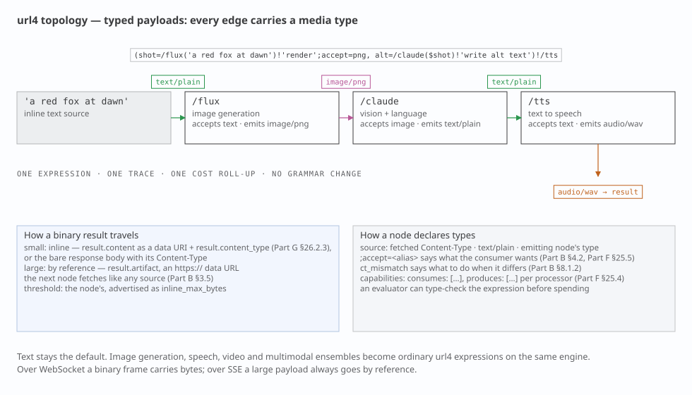
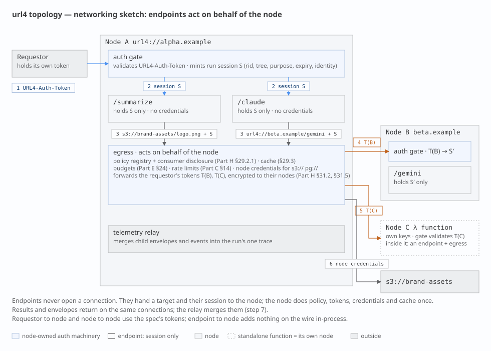

# 0. The eight answers

This document fixes the words we use for the pieces of url4. It is short on purpose.
Each section states a definition, says where the spec agrees or is silent, and stops.

| # | Question | Answer |
|---|---|---|
| 1 | What is a node? | A stateless function behind a path. It takes `(context)!intent` and returns a result. Every node can evaluate a full url4 expression. |
| 2 | What is a host? | The origin (`scheme://authority`) that mounts one or more nodes at paths and answers discovery. `/` is its default node. |
| 3 | Swarm? Composition? | Not protocol words. The expression **is** the composition. The hosts it touches are its request tree. "Swarm" is only a deployment word for one operator's hosts. |
| 4 | `.well-known` or OPTIONS? | Both are documented in §5 with their trade-offs. The owner picks there. |
| 5 | `/name` vs `url4://name`? | `/name` is a node mounted on the host that is evaluating. `url4://name` is host `name`'s default node `/`. Spec Part B §5.4 already says this. |
| 6 | Where does an ensemble run? | Wherever an evaluator runs: the SDK on a laptop, or a host. A local host may mount remote nodes under local names (proxy mounts). |
| 7 | Can I test a host first? | One fetch of the host's capabilities document, or one OPTIONS per node (§5). A separate "plan" concept is deferred (§10). |
| 8 | Streaming fallback? | One GET asks for the richest mode; the node answers with the best it has: WebSocket, then SSE, then sync (§6). Sync is the only MUST. Async is a separate axis. |
| 9 | Text in, text out? | A habit, not a rule. Every edge carries a **typed payload** (text, image, audio, video, embeddings) named by its media type. Text is the default. No grammar change (§8). |

**What changes against today**

- The Engine becomes a url4 **host**. Today no url4 node is reachable over HTTP; the SDK's node-to-node code is unused.
- Every node speaks the same GET. The node picks the richest delivery it supports: **WebSocket → SSE → sync**, in one round trip. Sync is the only MUST.
- Two spec words move: the spec's *Node* becomes our *Host*; the spec's *Endpoint* becomes our *Node*. Appendix A asks Kevin for the rename.
- A node is a **universal inference processor**: image generation, speech, video and multimodal ensembles become ordinary expressions on the same engine, telemetry and cost accounting (§8).

# 1. Terms

Eight words. Each has one meaning.

| Our word | Meaning | Spec word today | In the SDK | In the Engine |
|---|---|---|---|---|
| **Node** | A stateless function at a path. Accepts `GET <path>?q=<expr>`, evaluates it, returns a result plus envelope. | *Endpoint* (Part A §1.4) | an entry in `Url4Node`'s endpoint registry | a route such as `/anthropic/<model>` |
| **Host** | An origin that mounts nodes at paths, serves `/` as the default node, and answers discovery. | *Node* (Part A §1.4) | `Url4Node` (the class name lags; Appendix B) | the App, after this change |
| **Mount** | The binding of a path to a node implementation: `local` (in-process), `command` (subprocess), or `proxy` (forwards to a declared remote node). | not defined | `endpoint()`, `[commands]`, — | in-process handlers only |
| **Evaluator** | Whatever runs an expression: resolves sources, fans out, reduces, runs the intent. Every node contains one. | "the node executes" (Part A §1) | `url4.dag.run` | `Url4Executor` in the Runner |
| **Intent processor** | The thing inside a node that turns resolved context plus intent into a result: a model call, a script, a command. | *Intent processor* (Part A §1.4) | endpoint handler | one `httpx` call to aigateway |
| **Requestor** | Whoever sends an expression. | *Requestor* (Part A §1.4) | `Client` | product client |
| **Request tree** | The hosts and nodes one expression touches. Strict tree, never a graph (v0.2 §16.1). | "request tree", "call tree" (v0.2 §22) | the compiled DAG, per node | one run |
| **Capabilities document** | JSON a host publishes to say which nodes, mounts, features and delivery modes it offers. | named in Part A §1.4; schema unwritten (Part G) | none | none |

Words we do not use in the protocol: *ensembler*, *orchestrator*, *swarm*, *composition*, *plan*, *fusion*. "Fusion" stays product copy.

# 2. Addressing

Three address forms, plus any other scheme as data. The spec fixes their meaning in Part B §3.1.1, §3.5 and §5.4; we add one rule about the root and one about other schemes.


- `/claude(ctx)!'go'` — a node on the host that is evaluating. Resolves to `url4://<current host>/claude` (Part B §5.4).
- `url4://beta.example/claude(ctx)!'go'` — a node on another host. That host evaluates the sub-expression itself (Part B §3.1.1; SDK invariant OME-535).
- `url4://beta.example` — the host's default node. **Our rule: `url4://host` ≡ `url4://host/`.**
- `https://data.example/rows` — plain HTTP data. No url4 headers, no envelope, `@` is an error (Part B §3.5).

**Root and version.** `/` is the host's default node. The spec makes `/v1` the protocol-version path (v0.2 §35.1). We keep both: `/` serves the current version; `/v1` is an explicit alias. The SDK's `url4 serve` (`/v1`) and `Client` (default `/v1`) move to `/` (Appendix B).

**Scheme inheritance.** A bare relative data URI inherits the scheme of the request that carried it (Part B §5.4.1). Under `url4://` it is a url4 read; under `https://` it is a plain read.

**Any scheme is a source.** The spec fixes the roles of `url4://` (evaluate) and `https://` (read), lists `s3://` with the rule "the node uses its own credentials", and fails unknown schemes with `unsupported_mode` (Part B §3.5). We generalise the `s3://` rule: any other scheme is a **read through a scheme adapter that the evaluating host mounts**. The SDK already has the slot: `FetchRequest.kind` is `url4`, `http`, `relative`, or `other`.

```
(sales=pg://warehouse/analytics.monthly_sales,
 logo=s3://brand-assets/logo.png;accept=image/png,
 notes=sqlite:///srv/app/notes.db/notes,
 policy=https://data.example/policy.md)!'Draft the Q3 update. Use the logo.'
```

Rules:

- **The evaluating host resolves it, with its own credentials.** `pg://warehouse` names a connection the host knows; the expression never carries a secret, because the expression is the shareable audit artifact (Part A §1.2).
- **The adapter types the result** (§8): an S3 object carries its stored `Content-Type`; a table or query returns `application/json` rows, or `text/csv` when asked with `;accept`. Rows are a collection, so `pg://warehouse/analytics.monthly_sales*(row)!'summarise $item'` iterates them (Part B §5.3).
- **Advertised, or refused.** The host lists its schemes in the capabilities document; an unlisted scheme is `unsupported_mode`, permanent (Part B §3.5). Access control and consent apply as for any source (Part B §5.6.4).
- **Hexagonal.** A scheme adapter is an `IOLayer` adapter registered by scheme; the core never imports it. `url4 serve` gains a `[schemes]` table beside `[data]`.

What a scheme's path means (bucket and key; database, schema and table; file and table) is the adapter's contract, not the grammar's. The grammar only sees `scheme://authority/path`.

# 3. Node contract

A node is a function. That is the whole idea.


A node:

- **MUST** answer `GET <path>?q=<expression>` and evaluate the expression. Every node evaluates url4; a node may walk a DAG before it reaches its own intent processor. There is one grade of node, not two.
- **MUST** be stateless per invocation. It keeps nothing between calls. Its own data is reached through `@` (Part B §5.6) and lives behind it, not in it. Multi-turn work uses an explicit session key (`;coord=`, Part B §4.2), never process memory.
- **MUST** return the envelope (v0.2 §13) and state the delivery mode it actually used (v0.2 §11.4).
- **MUST NOT** resolve `@` inside a sub-expression addressed to another host (Part B §5.6.3.1).
- **MUST** answer sync. **SHOULD** offer stream (SSE), WebSocket, and async, and advertise which (§5, §6). When asked for more than it has, it answers with the richest mode it does have; that is never an error.
- **MAY** be mounted on any host, or be its own origin. A Lambda-style function with its own URL is a host with one node.
- Speaks GET. A WebSocket, when offered, is the same GET with `Upgrade: websocket` (§6). Other verbs are 405, except the ones this document adds: `DELETE` on a run handle (§6) and, if adopted, `OPTIONS` (§5).

Nodes share nothing. A node knows another node only by address, and only because the expression named it.

# 4. Host contract

A host is an origin. It routes; it does not evaluate.

- Mounts one or more nodes at paths. `/` is the default node.
- Mount kinds: `local` (a function in the process), `command` (a subprocess; doctrine N4), `proxy` (forwards the sub-request verbatim to a declared target on another host).
- Declares proxy mounts with their targets in its capabilities document. Attribution and consumer disclosure (v0.2 §16.2.2) need the real target, so proxies are never hidden.
- Serves discovery (§5) and the version alias `/v1` (§2).
- A local SDK process that mounts remote nodes under local names is a host. That is how "run the ensemble on my laptop, but call `/claude` as if it were mine" works.

# 5. Discovery — the open decision

Two ways for a requestor to learn what a host can do. Neither exists yet: the spec names the capabilities document (Part A §1.4) but its schema is in the unwritten Part G; OPTIONS appears nowhere in the spec.


| | A · host document `GET /.well-known/url4-capabilities` | B · per node `OPTIONS /<node>` |
|---|---|---|
| "Can this host run my expression?" | one call, whole answer | one call per node named in the expression |
| Standalone function with its own origin | works: the document sits at that origin's root | works |
| Node behind a shared, non-url4 gateway | invisible unless the gateway lists it (RFC 8615: root of the origin only) | works: the node answers for itself |
| Caching | ordinary GET: `ETag`, CDN, browser cache | not cached by CDNs or browsers |
| Browsers and CORS | plain GET | preflight uses the same verb; CORS middleware often answers first (RFC 9110 §9.3.7 allows a body, browsers ignore it) |
| Gateways and serverless platforms | fine | some strip or auto-answer OPTIONS |
| Proxy mount targets (attribution) | listed in one place | per node |
| Spec status | named; schema to write (Part G §27.2) | not in the spec |

Both share one hazard: the Engine's JWT header is called `URL4-Capability`. The document is "capabilities". Appendix B proposes renaming the header.

**Draft capabilities document** (host level; a node's OPTIONS answer is the one entry for that node):

```json
{
  "url4": "0.5",
  "host": "url4://alpha.example",
  "default_node": "/",
  "nodes": {
    "/":          { "mount": "local",   "delivery": ["sync", "stream"],
                    "features": ["nesting", "iteration", "broadcast", "self_ref"] },
    "/summarize": { "mount": "local",   "delivery": ["sync"] },
    "/upper":     { "mount": "command", "delivery": ["sync"] },
    "/claude":    { "mount": "proxy",   "target": "url4://beta.example/claude" }
  },
  "schemes": { "s3": {}, "pg": { "connections": ["warehouse"] }, "sqlite": {} },
  "holdings": { "collections": ["default", "science"], "self_ref_support": true }
}
```

> **Owner decision (open).** Pick one:
>
> - [ ] **A only** — host document is a MUST; nothing per node.
> - [ ] **B only** — OPTIONS per node is a MUST; no host document.
> - [ ] **A MUST + B SHOULD** — the document indexes the host; a node may also answer OPTIONS with its own entry.
>
> Recommendation: A MUST + B SHOULD. A alone fails the standalone-function-behind-a-gateway case; B alone fails the single-call test in answer 7.

# 6. Delivery and transport

The spec defines three delivery modes and a fallback rule (v0.2 §11). We adopt them, add WebSocket as a fourth answer, and make the whole ladder one request.


**One request, the node picks.** The evaluator sends the richest ask it can, once:

```
GET /claude?delivery=stream&q=(ctx)!'go'
Upgrade: websocket
Accept: text/event-stream, application/json
```

The node answers with the best it supports. RFC 6455 lets a WebSocket handshake ride an ordinary GET; RFC 9110 lets a server ignore `Upgrade` and answer normally. So one round trip covers the whole ladder:

| Node answers | Meaning | Telemetry travels as |
|---|---|---|
| `101 Switching Protocols` | **WebSocket**: bidirectional; cancel and attach in-band | frames, same names as the SSE events |
| `200 text/event-stream` | **stream**: SSE on the same GET (v0.2 §11.2) | SSE events, then `result`, then `envelope` |
| `200 text/plain` or `application/json` | **sync**: bare answer, or the envelope, by `Accept` | envelope `meta` (below) |
| `202` + `Location` | **async**: run handle; `GET` it for status, `DELETE` it to cancel | on the handle |

Rules:

- **sync is the only MUST.** SSE, WebSocket and async are SHOULD, advertised per node in the capabilities document (§5). A serverless function that offers only sync and SSE is conformant.
- **Ladder, not error.** WebSocket → SSE → sync. A node answering below the ask is normal; the envelope's `delivery` field says what happened (v0.2 §11.4).
- **Async is an axis, not a rung.** It is requested with `Prefer: respond-async`, or entered by the node when a sync run would outlive the timeout (v0.2 §11.4 `sync → async`).
- **Browsers go SSE-first.** A browser cannot attach `Accept` to a WebSocket handshake, so a browser evaluator asks for SSE and upgrades only where the capabilities document says WebSocket is offered.
- **The Engine's product session** keeps its WebSocket at `/ws`. It is one instance of the WebSocket rung, not a separate protocol.
- **Telemetry is always in-band.** Whatever the mode, the caller receives logs, spans and cost on the same connection or in the envelope. A remote host's own OTLP export is its business, never something the caller depends on (§7).

**Telemetry per mode.** WebSocket and SSE carry it *in place*: an SSE body is a sequence of named events (`event: log`, `event: span`, `event: cost.usage`, then `event: result`, `event: envelope`), in order, on the one response. The spec already builds on this (v0.2 §12.5 is an SSE event catalog); our three signals are three more names. What SSE lacks against WebSocket is only the return path: no in-band cancel or attach.

Sync has no room for that: the body is the answer. So the wrapper is negotiated, with two knobs that must not be conflated:

| Knob | Governs | Values |
|---|---|---|
| `Accept` header | the wrapper | `text/plain` (default): the bare answer, no logs, no telemetry, what `url4 serve` returns today. `application/json`: the envelope (v0.2 §13) |
| `meta` param | how much the envelope carries | `none`: result and status. `summary`: counts, latency, cost. `full`: per-source detail, nested child envelopes (v0.2 §13.3), and a `telemetry` block with logs and spans |
| `fmt` param | the shape of the answer *content* | `text`, `markdown`, `json` (v0.2 §7.1); orthogonal, a JSON envelope can wrap a markdown answer |

A JSON answer with no `meta` gets `summary`, so asking for JSON always buys the cheap insight; `meta=full` is the explicit debug switch. What a node exposes is its decision (v0.2 §14.4): a production node may answer `meta=full` with the `telemetry` block redacted, but it MUST keep the structure and use `null` or `"redacted"`, never drop fields silently. A development node hands over everything. Same envelope, same evaluator code, different policy.

**Cancel.** The spec calls cancellation a gap (v0.2 §34). Over WebSocket, cancel is in-band. Otherwise it is `DELETE` on the run handle returned as `Location` (and `Link rel=self`), which the Engine already does. New terminal state `cancelled`; SSE event `request.cancelled`.

# 7. Telemetry

Three signals, one trace, as in the doctrine skill. What changes is where a one-shot GET puts them.

- **sync**: in the body, only when the caller asked for the envelope (`Accept: application/json`, §6). `meta` sets the level (`summary` by default, `full` adds logs and spans; v0.2 §13.2). At `meta=full` a child's envelope nests in `source.envelope` (v0.2 §13.3). Each node aggregates only what it saw itself (v0.2 §14.1). A bare `text/plain` answer carries nothing.
- **stream** and **WebSocket**: as events: logs, spans, `cost.usage` (self and subtree), then `result`, then `envelope`. Same names in both.
- **durable**: OTLP export to the trace backend. There is no separate "Enclave" store; the exporter superseded it.

This closes doctrine item F4. **Idempotency:** a url4 GET is idempotent in the HTTP sense (RFC 9110 §9.2.2): repeating it has no extra server-side effect. Results need not be identical; the spec's §33 conflates the two (Appendix A).

# 8. Typed payloads: a node is a universal inference processor

We have treated a node as text in, text out. That is a habit, not a spec rule. The spec defines a source as "a URI, text, or nested expression" and an intent processor as whatever executes the intent on behalf of the node (Part A §1.4). Nothing says the payload is a string.



**Proposal.** Every edge in an expression carries a **typed payload**, the way a ComfyUI edge carries an image, a latent or a mask. The type system is the media type: `text/plain`, `image/png`, `audio/wav`, `video/mp4`, `application/json` for embeddings and structured data. Text stays the default and the most common type. No grammar change.

```
(shot=/flux('a red fox at dawn')!'render';accept=image/png,
 alt=/claude($shot)!'write alt text')!/tts
```

Edges: text → image → text → audio. Three nodes, three processors, one expression, one trace, one cost roll-up.

**What the spec already gives us**

- `;accept=<type>` is a source-level execution annotation (Part B §4.2) and `ct_mismatch` a defined parameter (Part B §8.1.2). The spec calls input negotiation out of scope and treats an unusable format as an intent-execution failure, not a source failure (v0.2 §32). That is the right split; we only add the rules Part F owes.
- The SDK already carries a media type on every fetch (`FetchRequest.media_type`) and parses collections by declared type (Part B §5.3.7). The Engine already forks results by size: inline, spilled to a content-addressed artifact, or refused above a hard cap.

**Three rules the spec does not yet give (Part F, §25)**

1. **A source declares its type.** A URI source has the `Content-Type` it was fetched with. Inline text is `text/plain`. A nested expression has the type its node emitted. `;accept=<type>` says what the consumer wants; `ct_mismatch` says what to do when the two differ (fail, convert, or pass through).
2. **A binary result travels inline when small, by reference when large.** Bare sync (`Accept: text/plain` and friends): the response body *is* the bytes, with its `Content-Type`. Envelope: `result.content` carries small payloads base64-encoded with `result.media_type`; large payloads become `result.artifact`, an `https://` URL that the next node fetches as plain data (Part B §3.5). The inline threshold is the node's, advertised in its capabilities. Over WebSocket a binary frame carries the bytes; over SSE a large payload always goes by reference.
3. **A processor advertises what it accepts and emits.** Two lists of media types per node in the capabilities document or the OPTIONS answer. An evaluator can then type-check an expression before it spends anything: the one place the deferred "plan" idea (§10) would return.

```json
"/flux":   { "mount": "local",
             "accepts": ["text/plain"],
             "emits":   ["image/png"],
             "inline_max_bytes": 262144 },
"/claude": { "mount": "local",
             "accepts": ["text/plain", "image/png", "image/jpeg"],
             "emits":   ["text/plain"] },
"/tts":    { "mount": "local",
             "accepts": ["text/plain"],
             "emits":   ["audio/wav"] }
```

**Why it matters.** Image generation, text-to-speech, speech-to-text, video evaluation and multimodal ensembles all become ordinary url4 expressions on the same engine, with the same telemetry, the same cost accounting and the same attribution. aigateway stays the provider boundary; it already fronts image and audio providers. The Engine's artifact store is rule 2 as built.

**Open.** A media type for embeddings (`application/json` with a profile, or a vendor type); whether `fmt` (v0.2 §7.1) folds into `accept` for the *result* side; and how attribution weights apply to non-text sources (Part E).

# 9. The Engine as a host


| | Today | Target |
|---|---|---|
| App | control plane: `POST /token`, `GET /?q=`, `DELETE`, `/ws` bridged from NATS | a **host**: `/` evaluator node (`GET ?q=` with WebSocket, SSE, sync and async answers, `DELETE`), model nodes over HTTP, capabilities, `/ws` kept for the product client |
| Runner | k8s Job with one in-process `Url4Node`; model routes are in-process handlers | the evaluator process the `/` node spawns per run |
| Model nodes | `/anthropic/<model>` reachable only inside the Runner | reachable over HTTP on the host; later each one a standalone function, proxy-mounted |
| aigateway | provider boundary | unchanged |
| Node-to-node | unused SDK code | the normal path |

**Phases.** (1) Host surface on the App: discovery per §5, `GET /?q=` answering SSE and sync (WebSocket via `Upgrade` where the App already has it), `DELETE`. (2) Model nodes over HTTP. (3) Standalone model functions, proxy-mounted, listed in the capabilities document.

**Serverless posture.** A node is a function; it needs no origin of its own. Only the host needs one. The Runner is already function-shaped. The App is not: it holds an audience count in memory, runs two perpetual tasks, and gates runs on an attached WebSocket. Those belong to the product session, not to the node surface, and stay in the App.

# 10. Deferred, and one question to move forward

**Authentication as a host concern (question, not a decision).** Separating Host from Node makes a safe place for authentication possible, because it gives the credentials exactly one owner. The spec's inter-node auth (v0.2 §22, "under active development") propagates per-destination encrypted tokens in `ABC-Auth-Token` headers, and Part B §3.5 names a `URL4-Auth-Token` with a target type. The SDK defers all of it: `url4 serve` ships no authn or authz and asks for a reverse proxy in front. The Engine already has the shape we want: the App mints a per-run capability token and the Runner only carries it.

The idea to test: **the host, through its evaluator, is the only party that holds, validates and issues credentials. Nodes never see a raw credential.** A node receives a host-issued session, a capability scoped to one run (`rid`, request tree, purpose, expiry), and uses it for whatever it needs: reading `@` holdings, calling a sibling node, asking the host to fetch an `s3://` source. Outbound, the host attaches the per-destination token of spec §22 to the sub-request; inbound, the host validates before any node runs. A standalone serverless function is its own host and validates for itself, so the rule holds at every size.

Questions to answer before this becomes a section:

1. **Session shape.** Is the node-side session the Engine's JWT topic capability generalised (`sub` = run, `iat` window), or the spec's `URL4-Auth-Token`? One token type, or a host-internal one plus the spec's wire one?
2. **Where the identity lives.** `@alice` access control and consent (Part B §5.6.4) need the requestor's identity at the node. Does the session carry it, or does the node ask the host?
3. **Proxy mounts.** For `/claude → url4://beta.example/claude`, which side validates the requestor, and does beta see our identity or a delegated one (v0.2 §22.2 encrypts to the destination)?
4. **Rename consequence.** Spec §22 addresses tokens to a "node". Under Appendix A delta 1 that becomes a host. Is the token's destination always the host, never the path?
5. **`coord=` sessions.** The explicit session key of §3: issued by the host from the same capability, or separate?
6. **What a node may do with a session.** Only call back into its own host, or reach other hosts directly with a host-minted, destination-bound token?

Recommendation to explore first: host-issued run capability for nodes (the Engine's pattern), spec §22 tokens between hosts, identity carried in the capability claims. Attribution, consent and audit (Parts E and H) then attach to the same run identity.

**Deferred**


- **Plan / preflight** as a defined concept. Today the SDK's `Graph.validate()` checks syntax only and the Engine's preflight checks routes on one host. Deferred by owner decision; §5 answers the practical question.
- **Swarm** as a protocol noun. Would need membership and trust rules that belong to the unwritten governance parts.
- **Node grades** (processor-only vs evaluator). Rejected: every node evaluates.

# 11. Networking sketch: nodes act on behalf of the host

A brainstorm, not a decision. It answers one question from §10 concretely: **how does a node make an outbound request without holding a credential?**



**Three candidate mechanisms**

| | A · Host egress | B · Delegated token | C · Sidecar |
|---|---|---|---|
| Who opens the outbound connection | the host | the node, with a host-minted token | a per-node proxy process |
| Where credentials live | host only | host mints; node carries a destination-bound token (v0.2 §22.2) | sidecar only |
| Policy, disclosure, cache, budgets, rate limits | one place: the host's egress (v0.2 §16.2.2, §16.3, §20, §31) | at mint time on the host; enforcement split | in the sidecar |
| Serverless node | nothing to configure | needs network egress and key handling per function | platform-dependent |
| Cost | an extra hop; large payloads through the host, or by reference (§8) | none | one process per node |
| What it is today | how the SDK already works: an in-process node fetches through the host's `IOLayer` | the Engine's per-run JWT, generalised | not built |

**Recommendation to explore first: A for nodes, B between hosts.** A node never talks to the network. It talks to its host. The host talks to other hosts with the spec's tokens. A standalone serverless function is its own host, so the same two rules cover it: the parent host reaches it host-to-host (B), and inside it the function is a node using its own host's egress (A). C is a deployment shape of A, not a third protocol.

**The flow the diagram draws**

1. The requestor calls Host A with its `URL4-Auth-Token` (Part B §3.5). Host A's auth gate validates it.
2. The gate mints a **run session S**: `rid`, the request tree, purpose, expiry, the requestor's identity. Every node in the run receives S and nothing else. In-process nodes get it as an object; command mounts get it in the environment.
3. A node that needs `url4://beta.example/gemini` or `s3://brand-assets/logo.png` hands the target and S to the host's **egress**. It does not open a connection.
4. Egress does the host's work once, in one place: consults the policy registry and discloses consumers (v0.2 §16.2.2), checks budgets and rate limits (v0.2 §20, §31), serves from cache when allowed (v0.2 §16.3), and either fetches with the host's own credentials (`s3://`, `pg://`) or mints a destination-bound token **T(B)** for Host B, on behalf of the requestor (v0.2 §22.2, §22.3).
5. Host B's gate validates T(B), mints its own session S′, and runs `/gemini`. Its result and envelope come back on the same connection.
6. A proxy-mounted standalone function is Host C: same as step 5 with T(C).
7. Host A's telemetry relay merges what came back into the run's one trace (doctrine F1).

**What is new on the wire, and what is not**

- Requestor to host, and host to host: nothing new. The spec's tokens and `traceparent`.
- Node to host: **nothing on the wire for in-process nodes**; it is a function call through the host's `IOLayer`, which is what `Url4Node` does today. For out-of-process nodes (command mounts, containers) an explicit host endpoint is needed, something like `GET /.host/egress?u=<absolute URI>` with `URL4-Session: S`. Its path and shape are open.

**Open questions this sketch adds**

- Does egress return bytes to the node, or a reference (§8)? For large sources, by reference keeps the host out of the data path.
- Is T(B) bound to the run (`rid`) as well as the destination, so a leaked token cannot be replayed into another run? The spec binds to `rid` and a timestamp (v0.2 §22.2); we should keep that.
- Can a node ever be granted direct egress (mechanism B at node level)? Probably only for trusted local mounts, and only by host policy.
- Where does the egress endpoint live for command mounts: a Unix socket, a loopback port, or the host's public origin with S as the credential?

# Appendix A — proposed spec deltas for Kevin

Each item names the anchor and the change. All are proposals.

1. **Part A §1.4 — rename.** *Node* → **Host** ("an origin implementing the protocol; mounts nodes"). *Endpoint* → **Node** ("a path on a host bound to an evaluator and an intent processor"). Add **Mount** (`local | command | proxy`, proxies declare their target). Consequence to confirm: v0.2 §22 tokens are then addressed to hosts, never to paths (§10).
2. **Part B §3.1.1, v0.2 §35.1 — root.** `url4://host` ≡ `url4://host/`; `/` is the host's default node at the current version; `/v1` is a version alias.
3. **Part C §11.2 — bindings.** `delivery=stream` is SSE on the same GET, requested with `Accept: text/event-stream`. A node MAY also offer WebSocket by honouring `Upgrade: websocket` on that same GET (`101`); frames carry the same event names.
4. **Part C §11.4 — ladder and floor.** The node answers with the richest mode it supports, WebSocket → SSE → sync, in one round trip; sync is the only MUST and `any → sync` is always legal. A node answering below the ask is not an error; the envelope's `delivery` field says what happened.
5. **v0.2 §33 (Part H in v0.5) — idempotency.** Replace "the protocol does not guarantee idempotency" with: GET is idempotent per RFC 9110 §9.2.2; results are not guaranteed deterministic.
6. **v0.2 §34 (Part H in v0.5) — cancellation.** `DELETE` on the run handle (`Location`). Terminal state `cancelled`; SSE event `request.cancelled`; propagates to in-flight children.
7. **Part D §13 — envelope for sync callers.** `Accept: text/plain` returns the bare answer; `Accept: application/json` returns the envelope, `meta=summary` by default. At `meta=full` the envelope carries a `telemetry` block (`logs[]`, `spans[]`, `cost`) that a node MAY redact per §14.4 (structure kept, `"redacted"` sentinel). `fmt` stays the answer's content format and is orthogonal.
8. **Part F §25 — typed payloads.** The payload on every edge is a typed value named by its media type; text is the default. Rules: a source declares its type (fetched `Content-Type`, `text/plain`, or the emitting node's type); `;accept` states the consumer's need and `ct_mismatch` the policy; binary results travel inline (`result.content` + `result.media_type`) below a node-declared threshold and by reference (`result.artifact`, an `https://` data URL) above it; WebSocket binary frames MAY carry bytes, SSE goes by reference.
9. **Part B §3.5 — other schemes.** Generalise the `s3://` row: any scheme other than `url4://`, `https://`, `http://` is a read through a scheme adapter on the evaluating host, resolved with the host's own credentials, typed by the adapter, advertised in the capabilities document (`schemes`), and otherwise `unsupported_mode` (permanent). Path semantics per scheme are the adapter's contract.
10. **Part G §27.2 — capabilities document.** Schema as drafted in §5: `nodes` keyed by path, `mount`, `target`, `delivery`, `features`, and `accepts` / `emits` media-type lists with `inline_max_bytes` (§8); `schemes` the host reads (§2); `holdings`. Optional binding: the same entry as an `OPTIONS` body with `Content-Type: application/url4-capabilities+json`.

# Appendix B — follow-up work items

To file after owner review, one per landing.

| Landing | Item |
|---|---|
| screamingface-engine | Host surface phase 1: discovery per §5, `GET /?q=` with SSE, `DELETE` on the run handle |
| screamingface-engine | Model nodes reachable over HTTP (phase 2); standalone model functions, proxy-mounted (phase 3) |
| screamingface-engine | Rename the `URL4-Capability` JWT header to avoid the "capabilities" collision |
| url4-sdk | Delivery negotiation in `Url4Node.asgi()`: `Upgrade`/`Accept` handling, SSE body, optional WebSocket answer; evaluator-side single-request ladder in `HttpIOLayer` |
| url4-sdk | Capabilities document and/or OPTIONS responder, after the §5 decision; advertise `delivery` per node |
| url4-sdk | `url4 serve` default path `/`; `Client` default path `/`; `/v1` alias |
| url4-sdk | `proxy` mount kind in `url4.toml` |
| url4-sdk | Scheme adapters (`s3://`, `pg://`, `sqlite://`, …) as `IOLayer` adapters registered by scheme; `[schemes]` in `url4.toml`; `schemes` in capabilities |
| url4-sdk | Typed payloads: bytes + media type through `IOLayer`/`FetchRequest`, `;accept`/`ct_mismatch` enforcement, `result.artifact` by-reference fetch |
| screamingface-engine | Non-text processors over aigateway (image, speech); artifact store as the by-reference path; `accepts`/`emits` in capabilities |
| url4-sdk | `Url4Node` → host naming retrofit with a deprecation alias |
| repo | Doctrine skill synced in this unit (T1, N1, F2, F4, term table) |
| Kevin | Review Appendix A |

# Appendix C — where the spec lives

- Parts A and B, v0.5 DRAFT (2026-07-10): `secondbrain/kevin-mcdonough/docs/adrs/URL4-Spec-A.md`, `URL4-Spec-B.md`.
- Parts C–I: "Not yet written" stubs (`…/adrs/site/part-c.html` … `part-i.html`). Their content is the pre-v0.5 monolith, git `8a052dc:kevin-mcdonough/docs/adrs/URL4-Spec.md`, header v0.2. Cited here as "v0.2 §N".
- Public docs: `public-docs/src/pages/learn/Url4Page.vue`. They use "fusion" and "typed DAG"; the spec uses neither.
- Doctrine: `.claude/skills/url4-engine/SKILL.md`, updated with this document.
