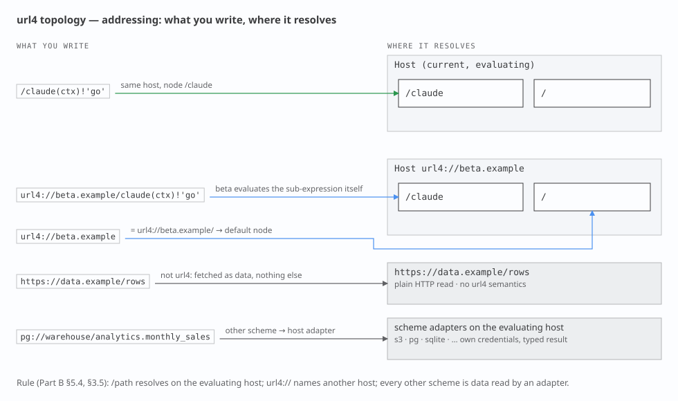
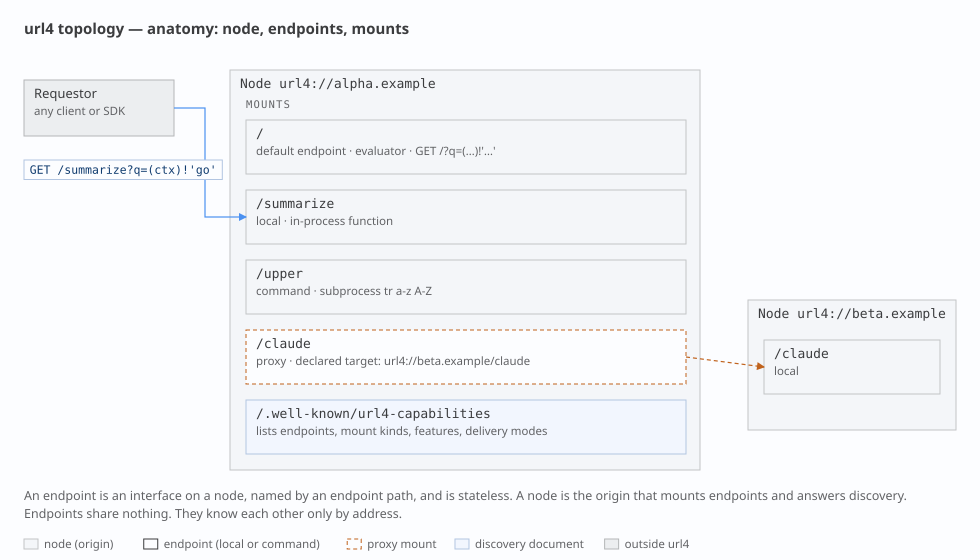
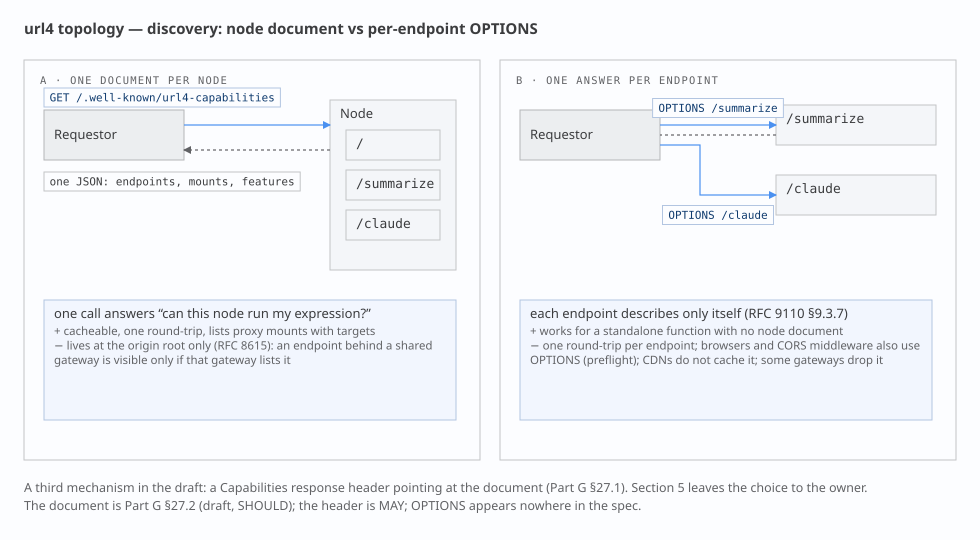
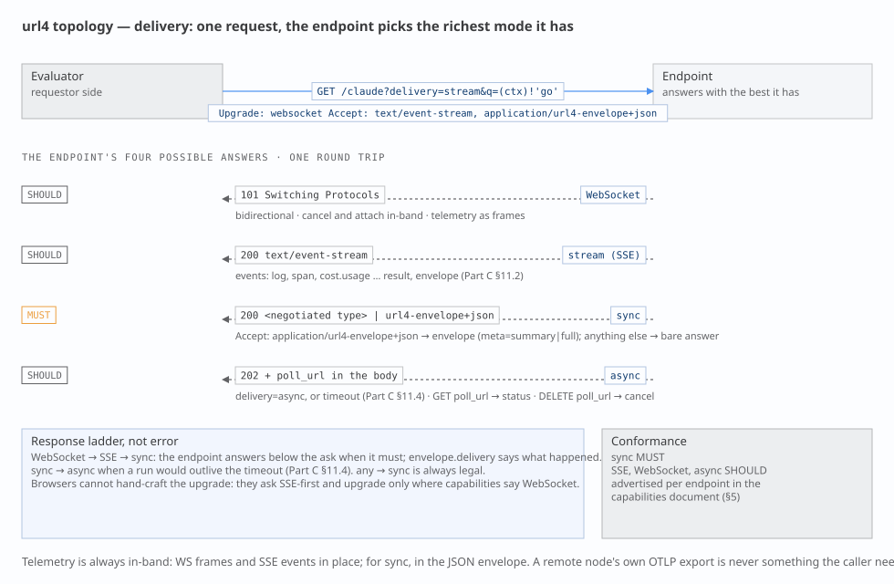
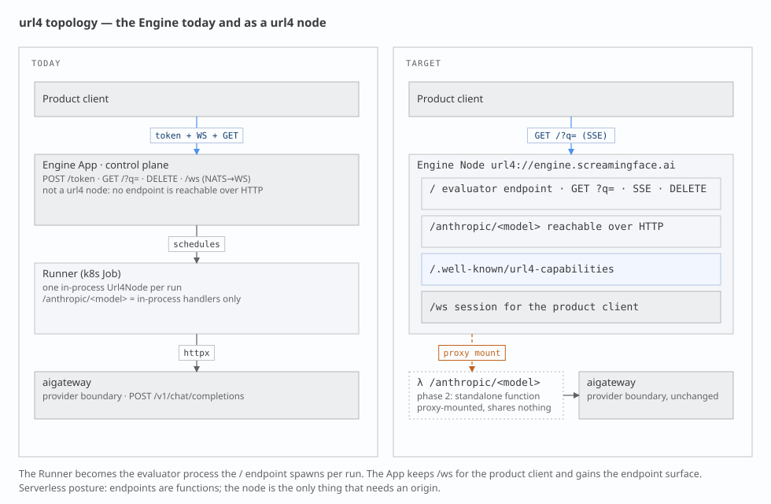

# 0. The eight answers

This document fixes the words we use for the pieces of url4. It is short on purpose.
Each section states a definition, says where the spec agrees or is silent, and stops.

| # | Question | Answer |
|---|---|---|
| 1 | What is a node? | A stateless function behind a path. It takes `(context)!intent` and returns a result. Every node can evaluate a full url4 expression. |
| 2 | What is a host? | The origin (`scheme://authority`) that mounts one or more nodes at paths and answers discovery. `/` is its default node. |
| 3 | Swarm? Composition? | Not protocol words. The expression **is** the composition. The hosts it touches are its request tree. "Swarm" is only a deployment word for one operator's hosts. |
| 4 | `.well-known` or OPTIONS? | Both are documented in §5 with their trade-offs. The owner picks there. |
| 5 | `/name` vs `url4://name`? | `/name` is a node mounted on the host that is evaluating. `url4://name` is host `name`'s default node `/`. Spec Part B §5.4 already says this. |
| 6 | Where does an ensemble run? | Wherever an evaluator runs: the SDK on a laptop, or a host. A local host may mount remote nodes under local names (proxy mounts). |
| 7 | Can I test a host first? | One fetch of the host's capabilities document, or one OPTIONS per node (§5). A separate "plan" concept is deferred (§9). |
| 8 | Streaming fallback? | Ask for `stream` in one GET; accept whatever comes back. `stream → sync`, `sync → async`, and `any → sync` (§6). WebSocket is never a node transport. |

**What changes against today**

- The Engine becomes a url4 **host**. Today no url4 node is reachable over HTTP; the SDK's node-to-node code is unused.
- Node streaming is **SSE on the same GET**, as the spec says. WebSocket stays for the product client only.
- Two spec words move: the spec's *Node* becomes our *Host*; the spec's *Endpoint* becomes our *Node*. Appendix A asks Kevin for the rename.

# 1. Terms

Eight words. Each has one meaning.

| Our word | Meaning | Spec word today | In the SDK | In the Engine |
|---|---|---|---|---|
| **Node** | A stateless function at a path. Accepts `GET <path>?q=<expr>`, evaluates it, returns a result plus envelope. | *Endpoint* (Part A §1.4) | an entry in `Url4Node`'s endpoint registry | a route such as `/anthropic/<model>` |
| **Host** | An origin that mounts nodes at paths, serves `/` as the default node, and answers discovery. | *Node* (Part A §1.4) | `Url4Node` (the class name lags; Appendix B) | the App, after this change |
| **Mount** | The binding of a path to a node implementation: `local` (in-process), `command` (subprocess), or `proxy` (forwards to a declared remote node). | not defined | `endpoint()`, `[commands]`, — | in-process handlers only |
| **Evaluator** | Whatever runs an expression: resolves sources, fans out, reduces, runs the intent. Every node contains one. | "the node executes" (Part A §1) | `url4.dag.run` | `Url4Executor` in the Runner |
| **Intent processor** | The thing inside a node that turns resolved context plus intent into a result: a model call, a script, a command. | *Intent processor* (Part A §1.4) | endpoint handler | one `httpx` call to aigateway |
| **Requestor** | Whoever sends an expression. | *Requestor* (Part A §1.4) | `Client` | product client |
| **Request tree** | The hosts and nodes one expression touches. Strict tree, never a graph (v0.2 §16.1). | "request tree", "call tree" (v0.2 §22) | the compiled DAG, per node | one run |
| **Capabilities document** | JSON a host publishes to say which nodes, mounts, features and delivery modes it offers. | named in Part A §1.4; schema unwritten (Part G) | none | none |

Words we do not use in the protocol: *ensembler*, *orchestrator*, *swarm*, *composition*, *plan*, *fusion*. "Fusion" stays product copy.

# 2. Addressing

Three address forms. The spec fixes their meaning in Part B §3.1.1 and §5.4; we add one rule about the root.



- `/claude(ctx)!'go'` — a node on the host that is evaluating. Resolves to `url4://<current host>/claude` (Part B §5.4).
- `url4://beta.example/claude(ctx)!'go'` — a node on another host. That host evaluates the sub-expression itself (Part B §3.1.1; SDK invariant OME-535).
- `url4://beta.example` — the host's default node. **Our rule: `url4://host` ≡ `url4://host/`.**
- `https://data.example/rows` — plain HTTP data. No url4 headers, no envelope, `@` is an error (Part B §3.5).

**Root and version.** `/` is the host's default node. The spec makes `/v1` the protocol-version path (v0.2 §35.1). We keep both: `/` serves the current version; `/v1` is an explicit alias. The SDK's `url4 serve` (`/v1`) and `Client` (default `/v1`) move to `/` (Appendix B).

**Scheme inheritance.** A bare relative data URI inherits the scheme of the request that carried it (Part B §5.4.1). Under `url4://` it is a url4 read; under `https://` it is a plain read.

# 3. Node contract

A node is a function. That is the whole idea.



A node:

- **MUST** answer `GET <path>?q=<expression>` and evaluate the expression. Every node evaluates url4; a node may walk a DAG before it reaches its own intent processor. There is one grade of node, not two.
- **MUST** be stateless per invocation. It keeps nothing between calls. Its own data is reached through `@` (Part B §5.6) and lives behind it, not in it. Multi-turn work uses an explicit session key (`;coord=`, Part B §4.2), never process memory.
- **MUST** return the envelope (v0.2 §13) and state the delivery mode it actually used (v0.2 §11.4).
- **MUST NOT** resolve `@` inside a sub-expression addressed to another host (Part B §5.6.3.1).
- **SHOULD** stream with SSE when asked (§6) and **MUST** answer sync when it cannot.
- **MAY** be mounted on any host, or be its own origin. A Lambda-style function with its own URL is a host with one node.
- Speaks GET. Other verbs are 405, except the ones this document adds: `DELETE` on a run handle (§6) and, if adopted, `OPTIONS` (§5).

Nodes share nothing. A node knows another node only by address, and only because the expression named it.

# 4. Host contract

A host is an origin. It routes; it does not evaluate.

- Mounts one or more nodes at paths. `/` is the default node.
- Mount kinds: `local` (a function in the process), `command` (a subprocess; doctrine N4), `proxy` (forwards the sub-request verbatim to a declared target on another host).
- Declares proxy mounts with their targets in its capabilities document. Attribution and consumer disclosure (v0.2 §16.2.2) need the real target, so proxies are never hidden.
- Serves discovery (§5) and the version alias `/v1` (§2).
- A local SDK process that mounts remote nodes under local names is a host. That is how "run the ensemble on my laptop, but call `/claude` as if it were mine" works.

# 5. Discovery — the open decision

Two ways for a requestor to learn what a host can do. Neither exists yet: the spec names the capabilities document (Part A §1.4) but its schema is in the unwritten Part G; OPTIONS appears nowhere in the spec.



| | A · host document `GET /.well-known/url4-capabilities` | B · per node `OPTIONS /<node>` |
|---|---|---|
| "Can this host run my expression?" | one call, whole answer | one call per node named in the expression |
| Standalone function with its own origin | works: the document sits at that origin's root | works |
| Node behind a shared, non-url4 gateway | invisible unless the gateway lists it (RFC 8615: root of the origin only) | works: the node answers for itself |
| Caching | ordinary GET: `ETag`, CDN, browser cache | not cached by CDNs or browsers |
| Browsers and CORS | plain GET | preflight uses the same verb; CORS middleware often answers first (RFC 9110 §9.3.7 allows a body, browsers ignore it) |
| Gateways and serverless platforms | fine | some strip or auto-answer OPTIONS |
| Proxy mount targets (attribution) | listed in one place | per node |
| Spec status | named; schema to write (Part G §27.2) | not in the spec |

Both share one hazard: the Engine's JWT header is called `URL4-Capability`. The document is "capabilities". Appendix B proposes renaming the header.

**Draft capabilities document** (host level; a node's OPTIONS answer is the one entry for that node):

```json
{
  "url4": "0.5",
  "host": "url4://alpha.example",
  "default_node": "/",
  "nodes": {
    "/":          { "mount": "local",   "delivery": ["sync", "stream"],
                    "features": ["nesting", "iteration", "broadcast", "self_ref"] },
    "/summarize": { "mount": "local",   "delivery": ["sync"] },
    "/upper":     { "mount": "command", "delivery": ["sync"] },
    "/claude":    { "mount": "proxy",   "target": "url4://beta.example/claude" }
  },
  "holdings": { "collections": ["default", "science"], "self_ref_support": true }
}
```

> **Owner decision (open).** Pick one:
>
> - [ ] **A only** — host document is a MUST; nothing per node.
> - [ ] **B only** — OPTIONS per node is a MUST; no host document.
> - [ ] **A MUST + B SHOULD** — the document indexes the host; a node may also answer OPTIONS with its own entry.
>
> Recommendation: A MUST + B SHOULD. A alone fails the standalone-function-behind-a-gateway case; B alone fails the single-call test in answer 7.

# 6. Delivery and transport

The spec defines three delivery modes and a fallback rule (v0.2 §11). We adopt them and add one rule.



- **sync** (default): `GET` → `200`, result plus envelope.
- **stream**: same `GET` with `delivery=stream` and `Accept: text/event-stream` → `200 text/event-stream`. Events per v0.2 §12.5; the Engine's `ai.url4.*` frames become SSE events with the same names.
- **async**: same `GET` with `Prefer: respond-async` → `202` and a `Location` run handle. `GET` the handle for status; `DELETE` it to cancel.

**Fallback** (v0.2 §11.4, plus our floor):

| From | To | When |
|---|---|---|
| stream | sync | the node cannot stream; the envelope says `delivery: sync` |
| sync | async | the run would outlive the timeout; `202` + `Location` |
| any | sync | **sync is the universal floor** (ours) |

One optimistic request: ask for stream, accept what comes back. No probing call, no second protocol.

**WebSocket** is the session transport between the product client and the Engine. It is never a node binding and never a fallback target. SSE is the spec's stream transport (v0.2 §11.2); doctrine T1 changes to match.

**Cancel.** The spec calls cancellation a gap (v0.2 §34). We use `DELETE` on the run handle returned as `Location` (and `Link rel=self`), which the Engine already does. New terminal state `cancelled`; SSE event `request.cancelled`.

# 7. Telemetry

Three signals, one trace, as in the doctrine skill. What changes is where a one-shot GET puts them.

- **sync**: in the body. The envelope's `meta` carries counts, latencies and cost at the level the requestor asked for (`none`, `summary`, `full`; v0.2 §13.2). At `meta=full` a child's envelope nests in `source.envelope` (v0.2 §13.3). Each node aggregates only what it saw itself (v0.2 §14.1).
- **stream**: as SSE events: logs, spans, `cost.usage` (self and subtree), then `result`, then `envelope`.
- **durable**: OTLP export to the trace backend. There is no separate "Enclave" store; the exporter superseded it.

This closes doctrine item F4. **Idempotency:** a url4 GET is idempotent in the HTTP sense (RFC 9110 §9.2.2): repeating it has no extra server-side effect. Results need not be identical; the spec's §33 conflates the two (Appendix A).

# 8. The Engine as a host



| | Today | Target |
|---|---|---|
| App | control plane: `POST /token`, `GET /?q=`, `DELETE`, `/ws` bridged from NATS | a **host**: `/` evaluator node (`GET ?q=`, SSE, `DELETE`), model nodes over HTTP, capabilities, `/ws` kept for the product client |
| Runner | k8s Job with one in-process `Url4Node`; model routes are in-process handlers | the evaluator process the `/` node spawns per run |
| Model nodes | `/anthropic/<model>` reachable only inside the Runner | reachable over HTTP on the host; later each one a standalone function, proxy-mounted |
| aigateway | provider boundary | unchanged |
| Node-to-node | unused SDK code | the normal path |

**Phases.** (1) Host surface on the App: discovery per §5, `GET /?q=` with SSE, `DELETE`. (2) Model nodes over HTTP. (3) Standalone model functions, proxy-mounted, listed in the capabilities document.

**Serverless posture.** A node is a function; it needs no origin of its own. Only the host needs one. The Runner is already function-shaped. The App is not: it holds an audience count in memory, runs two perpetual tasks, and gates runs on an attached WebSocket. Those belong to the product session, not to the node surface, and stay in the App.

# 9. Deferred

- **Plan / preflight** as a defined concept. Today the SDK's `Graph.validate()` checks syntax only and the Engine's preflight checks routes on one host. Deferred by owner decision; §5 answers the practical question.
- **Swarm** as a protocol noun. Would need membership and trust rules that belong to the unwritten governance parts.
- **Node grades** (processor-only vs evaluator). Rejected: every node evaluates.

# Appendix A — proposed spec deltas for Kevin

Each item names the anchor and the change. All are proposals.

1. **Part A §1.4 — rename.** *Node* → **Host** ("an origin implementing the protocol; mounts nodes"). *Endpoint* → **Node** ("a path on a host bound to an evaluator and an intent processor"). Add **Mount** (`local | command | proxy`, proxies declare their target).
2. **Part B §3.1.1, v0.2 §35.1 — root.** `url4://host` ≡ `url4://host/`; `/` is the host's default node at the current version; `/v1` is a version alias.
3. **Part C §11.2 — stream binding.** `delivery=stream` is SSE on the same GET, requested with `Accept: text/event-stream`.
4. **Part C §11.4 — fallback floor.** Add `any → sync`. A node MAY answer a stream request with a sync response; the envelope's `delivery` field says so. Not an error.
5. **v0.2 §33 (Part H in v0.5) — idempotency.** Replace "the protocol does not guarantee idempotency" with: GET is idempotent per RFC 9110 §9.2.2; results are not guaranteed deterministic.
6. **v0.2 §34 (Part H in v0.5) — cancellation.** `DELETE` on the run handle (`Location`). Terminal state `cancelled`; SSE event `request.cancelled`; propagates to in-flight children.
7. **Part G §27.2 — capabilities document.** Schema as drafted in §5: `nodes` keyed by path, `mount`, `target`, `delivery`, `features`; `holdings`. Optional binding: the same entry as an `OPTIONS` body with `Content-Type: application/url4-capabilities+json`.

# Appendix B — follow-up work items

To file after owner review, one per landing.

| Landing | Item |
|---|---|
| screamingface-engine | Host surface phase 1: discovery per §5, `GET /?q=` with SSE, `DELETE` on the run handle |
| screamingface-engine | Model nodes reachable over HTTP (phase 2); standalone model functions, proxy-mounted (phase 3) |
| screamingface-engine | Rename the `URL4-Capability` JWT header to avoid the "capabilities" collision |
| url4-sdk | SSE delivery in `Url4Node.asgi()`; `delivery` param and `Accept` negotiation |
| url4-sdk | Capabilities document and/or OPTIONS responder, after the §5 decision |
| url4-sdk | `url4 serve` default path `/`; `Client` default path `/`; `/v1` alias |
| url4-sdk | `proxy` mount kind in `url4.toml` |
| url4-sdk | `Url4Node` → host naming retrofit with a deprecation alias |
| repo | Doctrine skill synced in this unit (T1, N1, F2, F4, term table) |
| Kevin | Review Appendix A |

# Appendix C — where the spec lives

- Parts A and B, v0.5 DRAFT (2026-07-10): `secondbrain/kevin-mcdonough/docs/adrs/URL4-Spec-A.md`, `URL4-Spec-B.md`.
- Parts C–I: "Not yet written" stubs (`…/adrs/site/part-c.html` … `part-i.html`). Their content is the pre-v0.5 monolith, git `8a052dc:kevin-mcdonough/docs/adrs/URL4-Spec.md`, header v0.2. Cited here as "v0.2 §N".
- Public docs: `public-docs/src/pages/learn/Url4Page.vue`. They use "fusion" and "typed DAG"; the spec uses neither.
- Doctrine: `.claude/skills/url4-engine/SKILL.md`, updated with this document.
