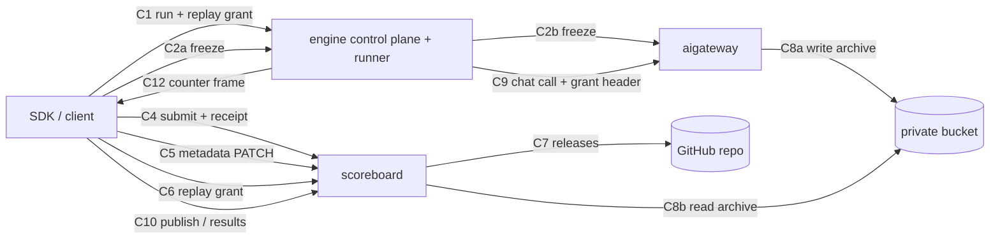

# Contracts — E14 reproducible submission (OME-1307)

This document has one section per connection. The shapes are `[proposed]` unless a tag says
otherwise. Test ids point to the PRD TDD tables (`SR-`, `CV-`, `MD-`, `SC-`, `RP-`, `PB-`).
The user decisions D1 to D7 (2026-09-29, `00-overview.md` §4.2 Q19 to Q24) override older text.

**Identity** `[stated ans:Q22]`. In production, the scoreboard and the gateway run the existing
auth mode `cloudflare_headers`: the service checks the peer against its allowed networks
(`SCOREBOARD_ALLOWED_NETWORKS` on the scoreboard) **before** it reads `X-User-Email`
`[existing apps/scoreboard/src/scoreboard/core/auth/cloudflare_identity.py]`. Every owner,
submitter, reporter, grant `sub` and admin check below uses that verified identity. The auth
mode `disabled` is a dev and local fallback only. Where a section says "in `disabled` mode", it
describes that fallback, not production.

## 0. Topology of the new hops



There is no scoreboard ↔ gateway connection. Trust between them goes through two signed
tokens: the **receipt** (C3, gateway → scoreboard) and the **grant** (C6, scoreboard →
gateway). See DR-2.

## C1 — Run with a replay grant — SDK → engine, sync, HTTPS + WebSocket

- **Shape.** The existing start request and the WebSocket attach
  `[existing packages/screamingface/src/screamingface/_engine/transport.py:858-887]`, plus one
  optional request header on the **start request `GET /?q=<url4>`**:
  `X-SF-Cache-Replay: <grant JWS>` (≤ 2,048 UTF-8 bytes). The header does **not** ride
  `POST /token` (D7, X-5; the start route is
  `[existing apps/screamingface-engine/src/screamingface_engine/rest/routes.py:597-676]`).
- **Engine handling.** The REST edge reads the header next to the answer seed. The control
  plane copies the value into the run's job environment (`URL4_CLOUD_CACHE_REPLAY_GRANT`). The
  child binds it into `RequestScope.replay_grant`. The engine never decodes it (RP-D2).
- **Policies.** Same timeouts and retries as today. The header adds no retry.
- **Failure.** The engine refuses before it schedules the run, with its problem shape (§ Error
  bodies):
  - `431 replay_grant_too_large`: the header is over 2,048 bytes.
  - `400 replay_grant_ambiguous`: more than one non-blank `X-SF-Cache-Replay` header.
  - `503 replay_unsupported`: this engine's runner cannot carry a replay.

  The SDK raises before the run. A missing or blank header means a normal run.
- **Contract tests.** RP-11, RP-12, RP-16.

## C2a — Freeze — SDK → engine, sync, HTTPS

```http
POST /v1/cache-versions
Content-Type: application/json
{"trace_id": "4bf92f3577b34da6a3ce929d0e0e4736"}

201 | 200 (idempotent re-freeze)
{"receipt": "<JWS>", "cache_version_id": "uuid", "entry_count": 412,
 "call_count": 420, "missing_count": 8, "coverage_status": "partial",
 "archive_sha256": "64-hex"}
```

- **Auth.** The caller identity comes from the edge (`X-User-Email`), the same as the other
  engine routes. The engine forwards it as identity headers.
- **Policies.** SDK timeout 60 s. One retry on a connection error or a 502/503/504, with
  1–3 s jitter. Safe to retry, because the freeze is idempotent (CV-D3).
- **Engine errors.** `422 invalid_freeze_request` (the body has no valid `trace_id`) and
  `503 cache_versions_unconfigured` (the engine has no gateway freeze route configured), in the
  engine problem shape (§ Error bodies). The engine passes a gateway `401`, `403` or `429`
  through with no code. It passes the C2b coded errors through with their code.
- **Failure (caller).** Any non-2xx result, or a timeout after the retry, means the SDK
  submits without a version and warns (SC-E1).
- **Contract tests.** SC-18, SC-19, SC-21.

## C2b — Freeze — engine → aigateway, sync, HTTP (ClusterIP :9105)

- **Shape.** The same body and response as C2a. Gateway route: `POST /v1/cache-versions`.
- **Auth.** The existing gateway auth modes. The account is resolved from the identity
  headers, as on the chat path. The request must pass the NetworkPolicy, which already admits
  `url4-cloud` `[existing apps/aigateway/charts/aigateway/templates/networkpolicy.yaml]`.
- **Errors.** `404 trace_not_captured` (CV-E1, CV-D2), `413 cache_version_too_large` (CV-E3),
  `503 capture_disabled` (a kill switch, `AIGW_CACHE_VERSIONS_ENABLED=false`).
- **Policies.** Engine timeout 55 s, less than the SDK's 60 s, so the engine answers first. No
  engine retry; the SDK owns the retry.
- **Contract tests.** CV-7, CV-8, CV-9, CV-14, CV-15, SC-21.

## C3 — Cache version receipt — aigateway → (SDK) → scoreboard, signed token

A compact JWS with `alg: EdDSA` (Ed25519), header `kid`, and these claims. The gateway signs
with PyJWT EdDSA behind its `ReceiptSigner` port; the scoreboard verifies behind its
`ReceiptVerifier` port. There is no shared package (D7, X-3).

```json
{"iss": "aigateway", "aud": "scoreboard", "sub": "<caller identity>",
 "vid": "uuid", "tid": "32-hex", "sha": "64-hex",
 "n": 412, "c": 420, "cov": "complete|partial", "iat": 1790000000}
```

- **Keys** (D7, X-4).
  - Signing key `AIGATEWAY_RECEIPT_SIGNING_KEY`: standard base64 of the raw 32-byte Ed25519
    private key (no PEM), from a Secret.
  - `kid` is **derived**: `sha256(<raw 32-byte public key>).hexdigest()[:16]`. There is no kid
    variable.
  - `SCOREBOARD_RECEIPT_PUBLIC_KEYS`: a JSON object `{"<kid>": "<base64 of the raw 32-byte
    public key>"}`, with the current key plus the previous key.
  - `sha` is the `archive_sha256` of `erd.md` §3.5 (sha256 of the gzip bytes, X-16).
- **Verifier (scoreboard).** Pick the key by the header `kid` in
  `SCOREBOARD_RECEIPT_PUBLIC_KEYS`; an unknown `kid` is `422`. Check the signature and `aud`.
  Check `sub` equals the verified `cloudflare_headers` submitter (only in the `disabled` dev
  fallback, skip this). Check `tid` equals the report `trace_id`. The receipt has no `exp`: it
  attests a fact about an immutable version, and replay protection comes from the unique
  `cache_version_id` (SC-E4).
- **Failure.** `422 invalid_cache_version_receipt`, `403 cache_version_not_yours`,
  `409 cache_version_already_bound`.
- **Contract tests.** CV-13, CV-25, SC-4, SC-5, SC-6.

## C4 — Submit — SDK → scoreboard, sync, HTTPS

- **Shape.** Today's `ScoreSubmission`
  `[existing apps/scoreboard/src/scoreboard/scores/schemas.py:366]`, plus these optional
  fields:

```json
{"paper_url": "https://…", "revision_of": "kevins-best",
 "cache_version_receipt": "<JWS>",
 "replay": {"result_id": "uuid", "cache_version_id": "uuid",
            "hits": 412, "misses": 8, "repeated_key_collapses": 0,
            "pinned_baseline_result_id": "uuid|null"}}
```

- **Response.** Today's `ScoreSchema` for the head, plus:

```json
{"paper_url": "…", "metadata_revision": 1,
 "reported_result": {"id": "uuid", "is_original": true, "reporter": "…",
                     "cache_version": {"id": "uuid", "sha256": "…", "entry_count": 412,
                                       "call_count": 420, "coverage_status": "complete"},
                     "publication_state": "private"},
 "reported_results_count": 1,
 "notices": [{"code": "system_already_named|clustered_under", "...": "..."}]}
```

- **Status.** `201` for a new head or a new reported result. `200` for an idempotent
  `run_id` replay.
- **Idempotency.** `Idempotency-Key: <run_id>`, unchanged
  `[existing packages/screamingface/src/screamingface/_scoreboard/leaderboards.py:106]`. It is
  now enforced by the unique `ReportedResult.run_id`.
- **Errors.** Today's errors, plus the C3 errors, plus the registry errors (SR-E1 to SR-E5).
- **url4 size cap.** The existing cap stays: `url4_expression` has at most 32,000 characters,
  and a longer value gets `422` before any parse
  `[existing apps/scoreboard/src/scoreboard/scores/schemas.py:378]`. There is no 256 KiB /
  `413` cap (D7, X-22; SR-19).
- **Policies.** SDK timeout 30 s. Retry on a connection error or a 5xx, twice with backoff.
  Safe, because of the idempotency key.
- **Trust.** The replay block is a client claim. The scoreboard checks that the result id
  exists, that the claimed `cache_version_id` belongs to it, and that the caller could have
  gotten a grant for it. A non-null `pinned_baseline_result_id` gets the same checks as the
  result id: it must exist, be on the same board, and pass the same replay access rules (as
  built, X-SEC-1, 2026-09-30; it does not have to equal the result id). Otherwise
  `422 invalid_replay_claim`. The hit and miss counts are
  stored as reported, and are labelled "reported by client" in the results list.
- **Contract tests.** SC-3 to SC-16, SC-18.

## C5 — Metadata edit — SDK → scoreboard, sync, HTTPS

```http
PATCH /v1/scores/{score_id}
If-Match: "3"
Content-Type: application/json
{"authors": ["ana@x.org", "bruno@y.org"], "paper_url": "https://…"}

200  ETag: "4"   <ScoreSchema>
401 identity_not_verified | 403 not_submission_owner | 404 | 412 metadata_revision_conflict
| 422 (field errors / field_not_editable) | 428 precondition_required

GET /v1/scores/{score_id}/metadata-history?cursor=…&limit=50
200 {"events": [{"actor": "…", "at": "…", "from_revision": 3, "to_revision": 4,
                 "before": {...}, "after": {...}}], "next_cursor": "…|null"}
```

- **Policies.** SDK timeout 15 s. One retry on a connection error. It is safe by MD-D4 (a
  resend of equal values returns 200).
- **Contract tests.** MD-3 to MD-19.

## C6 — Replay grant — SDK → scoreboard, sync, HTTPS; the grant token scoreboard → (engine) → aigateway

```http
POST /v1/replay-grants
{"pin": "kevins-best@2026-09-01", "benchmark_id": "gsm8k"}

200 {"grant": "<JWS>", "result_id": "uuid", "score_id": "uuid",
     "cache_version_id": "uuid", "expires_at": "RFC3339"}
404 replay_pin_not_found | 410 cache_version_withdrawn | 422 invalid_replay_pin
| 422 replay_benchmark_mismatch
```

The grant JWS has `alg: EdDSA`, header `kid`, and these claims:
`{"iss":"scoreboard","aud":"aigateway","sub":"<caller identity>","vid":"uuid","rid":"uuid","iat":…,"exp":iat+43200}`.
The scoreboard signs with PyJWT EdDSA behind its `GrantSigner` port; the gateway verifies
behind its `ReplayGrantVerifier` port (D7, X-3).

- **`sub`.** The verified `cloudflare_headers` identity of the caller (`ans:Q22`). Only in the
  `disabled` dev fallback is it `"anonymous"`.
- **Keys** (D7, X-4).
  - Signing key `SCOREBOARD_REPLAY_GRANT_SIGNING_KEY`: standard base64 of the raw 32-byte
    Ed25519 private key (no PEM), from a Secret.
  - `kid` comes from `SCOREBOARD_REPLAY_GRANT_SIGNING_KID` (it is not derived).
  - `AIGATEWAY_REPLAY_GRANT_PUBLIC_KEYS`: a JSON object `{"<kid>": "<base64 of the raw
    32-byte public key>"}`, with the current key plus the previous key.
- **Verifier (gateway).** Pick the key by the header `kid`. Check the signature, `aud`, `exp`
  (±60 s skew allowance), that `vid` exists, and that `sub` equals the caller (skipped only
  when auth is `disabled`). Cache the result for 60 s (CV-D9).
- **Grant life: the 12 h limit** `[stated ans:Q21]` (D4). `exp = iat + 43,200 s`, with no
  refresh. This is **shorter** than the worst case of a run: the engine job deadline is
  57,600 s, and the queue wait can add up to 57,600 s more (A3, checked false and accepted).
  When the grant expires during a run, each later chat call gets `403 replay_grant_invalid`
  with `reason: expired` (CV-E4). The engine fails that run with the typed error (RP-E6,
  RP-14). The run never becomes a live run. The SDK does not mint a new grant.
- **Policies.** SDK timeout 10 s. No fallback (RP-E5).
- **Contract tests.** RP-1 to RP-10, RP-4, CV-18, CV-19, CV-21.

## C7 — Releases — scoreboard worker → GitHub REST API, sync, HTTPS

- **Calls.**
  - `GET /repos/{o}/{r}/releases/tags/cv-<vid>`
  - `POST /repos/{o}/{r}/releases` with `{tag_name, name, body, draft:false}`
  - `POST {upload_url}?name=entries.jsonl.gz` and `?name=manifest.json`
  - `DELETE /repos/{o}/{r}/releases/{id}`
  - `DELETE /repos/{o}/{r}/git/refs/tags/cv-<vid>`
- **Auth.** A GitHub App installation token, with contents write on this one repo, minted per
  job (PB-D7).
- **Policies.** Timeout 30 s per API call and 120 s per asset upload. Retry on 5xx, 429 and
  secondary-limit 403, honoring `Retry-After`, with the backoff of PB-E4. Idempotency through
  the deterministic tag plus the get-by-tag check (PB-D1).
- **Failure.** See PB-E4, PB-D1, PB-D4.
- **Contract tests.** PB-20 (recorded fixtures), PB-22 (sandbox repo, nightly).

## C8a / C8b — Archive — aigateway → bucket (write), scoreboard → bucket (read), S3 API

- **Objects.** `cache-versions/<vid>/entries.jsonl.gz`, `cache-versions/<vid>/manifest.json`
  (`erd.md` §3.5). Written once, and never overwritten (write with `If-None-Match: *`, or
  check existence first on Garage).
- **Credentials.** The gateway can write the prefix. The scoreboard can read the prefix
  (PB-D8). Server-side encryption is on.
- **Policies.** Gateway: export retries with backoff (CV-E5). Scoreboard: read timeout 60 s,
  with a digest check before any use (PB-E5).
- **Local mode.** The filesystem adapter of the `VersionArchiveStore` port, under the local
  runtime data directory.
- **Contract tests.** CV-22, CV-23, PB-3.

## C9 — Chat call — engine → aigateway, sync, HTTP (extends the existing call)

- **New request header.** `X-AIGW-Cache-Replay: <grant>`, a gateway-owned header that the
  connector writes last (RP-D2), next to `X-Profile` and `traceparent`
  `[existing apps/screamingface-engine/src/screamingface_engine/world/connector.py:1048-1078]`.
- **New response header.** `X-AIGW-Cache-Version: hit|miss`. On a hit, the response also has
  `Cache-Status: aigateway; hit; detail=version`
  `[existing apps/screamingface-engine/src/screamingface_engine/world/cache_readback.py:63-67]`.
- **Capture.** It needs no new request field. The gateway uses the existing `traceparent`
  (CV-H1).
- **Errors.** `403 replay_grant_invalid` with a `reason` (CV-E4). The engine maps it to a
  typed run failure (RP-14).
- **Policies.** Unchanged: 1 transport retry with backoff
  `[existing apps/screamingface-engine/src/screamingface_engine/world/connector.py:92-100]`.
- **Contract tests.** CV-3, CV-4, CV-16, CV-17, RP-13, RP-14.

## C10 — Results, publish, withdraw — SDK / admin → scoreboard, sync, HTTPS

```http
GET  /v1/scores/{score_id}/results?cursor=…&limit=50          → 200 {"results": [...], "next_cursor": …}
POST /v1/results/{result_id}/publish                          → 202 {"state": "requested"} | 200 (no-op)
                                                                 409 not_publishable|withdrawn · 403 · 503 publish_unavailable
POST /v1/admin/results/{result_id}/withdraw {"reason": "…"}   → 200 {"state": "withdrawn"} · 403 admin_required
PUT  /v1/admin/benchmarks/{benchmark_id}/redistributable {"redistributable": true, "reason": "…"}
                                                              → 200 {"benchmark_id": …, "redistributable": true} · 403 admin_required · 404
```

- **Admin checks.** The withdraw route and the `redistributable` route use one admin
  allowlist over the verified `cloudflare_headers` identity (`ans:Q22`). Both write an audit
  record (actor, time, before, after, reason). As built (MRA-1, MRA-2, 2026-09-30), the record
  is two log lines on the `scoreboard` logger: `admin_action` (each attempt and its outcome) and
  `admin_change` (a successful attempt, with the before and after values). There is no durable
  audit table. The WIRING unit owns the `redistributable`
  route (`ans:Q23`, `erd.md` §2.7). The exact path is `[proposed]`; the WIRING plan fixes it.
- **`disabled` fallback.** Publish and withdraw answer `503` (there is no verified owner or
  admin). This is dev and local behaviour only.
- **Contract tests.** SC-17, PB-1, PB-2, PB-6, PB-10, PB-12, PB-13, PB-16, PB-19, PB-21, and
  the WIRING admin-route tests.

## C11 — Dependencies (layering rules)

| Rule | Enforcement |
|---|---|
| `url4.fingerprint` is pure: no I/O and no imports from the SDK, the engine or the scoreboard. | A unit test in `packages/url4` imports the module in isolation and checks its import set (D7, X-18). `.claude/scripts/check_layering.py` is engine-scoped, so this rule is not in it. |
| The scoreboard may import `url4` (new). The scoreboard never imports `screamingface` (the SDK). | A scoreboard unit test (D7, X-18). |
| The engine never decodes the replay grant. Only `world/connector.py` writes the header. | No `jwt` import in `screamingface_engine/` **outside `screamingface_engine/auth/`** (D7, X-6; the engine already imports `jwt` in `auth/jwt.py` for its own tokens). An engine unit test enforces it. Plus RP-11. ENG-freeze also adds `cache_versions` to `CONTROL_PLANE` in `.claude/scripts/check_layering.py`. |
| The gateway chat route reaches versions only through the ports `ReplayGrantVerifier`, `CacheVersionLookup` and `CaptureSink`. No provider plugin imports `core.cache_versions`. | A gateway unit test (hexagonal: core never imports plugins, and plugins do not reach into core stores; D7, X-18). |
| The scoreboard reaches GitHub only through the `ReleasePublisher` port, and the bucket through the `VersionArchiveReader` port. | A scoreboard unit test (D7, X-18). |
| PyJWT (`jwt`) is imported only inside the service-local token adapters: the gateway `ReceiptSigner` and `ReplayGrantVerifier`, and the scoreboard `ReceiptVerifier` and `GrantSigner`. The SDK never decodes a JWS. | A unit test per service (D7, X-3). No shared package. |

## C12 — Replay counters — engine → SDK, the run's closing cache-summary log frame

`[proposed]`, D7 (X-7). ENG-replay produces it; SDK-replay consumes it.

- **Carrier.** The existing closing cache-summary `LogData` frame of a run, on the run
  WebSocket. The frame keeps its existing attributes. It gets three new integer attributes:

| Attribute | Type | Meaning |
|---|---|---|
| `cache.version.hits` | int ≥ 0 | Chat calls that the gateway answered from the version (`X-AIGW-Cache-Version: hit`). |
| `cache.version.misses` | int ≥ 0 | Chat calls that fell through to the live provider (`X-AIGW-Cache-Version: miss`). |
| `cache.version.repeated_key_collapses` | int ≥ 0 | Version hits on a `key` that already had a hit in this run (from the `Cache-Status` `key` parameter). It is an **upper bound**: the engine sees a key prefix, not the full call. |

- **When present.** Only on a run that carried a replay grant (C1). A run with no grant has none
  of the three attributes. A run with a grant that made at least one gateway chat call has all
  three, also when one or two are `0`. (Resolved in ENG-replay review: the frame is the run's
  cache summary, which the engine publishes only when a cache outcome was seen. A grant run that
  made no chat call publishes no frame, and the consumer rule below then applies: the SDK does
  not submit it as a replay.)
- **A call with no version answer.** A chat call that sent the grant and got a 2xx answer with
  no readable `X-AIGW-Cache-Version` counts as a **version miss**. The gateway did not serve it
  from the version, so it fell through to the live provider (an old or mixed gateway replica, or
  a path that dropped the header). The alternative, a typed permanent failure, was rejected: the
  run still finishes and the misses show, so the SDK can state that the replay was not complete
  (RP-E6, RP-H5). A call with no grant and no answer counts nothing.
- **A call that fails after the version did not serve it.** A chat call that sent the grant and
  ended non-2xx (a credential error, a provider 4xx or 5xx, or a redirect from a proxy) also
  counts as a **version miss**. The gateway sends no version header on an error response, so the
  engine counts the miss itself. Without this rule a benchmark that collects the failed call
  would finish with `misses` 0 and the SDK would call the replay complete (RP-H5, ans:Q13). The
  one exception is `403 replay_grant_invalid`: it is not a miss, it fails the run (RP-E6). A call
  with no grant counts nothing.
- **Revalidation.** A version hit is exempt from the engine max-age revalidation. The engine
  does not re-ask the gateway for a hit that came from a version.
- **Consumer rule.** The SDK builds the replay report (RP-H1) and the C4 `replay` block from
  these three values. When a replay run ends with no such frame, the SDK does not submit it as a
  replay.
- **Metrics.** The counts stay in process (D7, X-15): the engine run mode has no metrics
  exporter, and the scoreboard and the gateway have no `/metrics` route.
- **Contract tests.** RP-13, RP-15 (producer), RP-16 (consumer).

## Error bodies

`[proposed]`, D7 (X-8). This applies to every **new** E14 error.

- **Scoreboard and gateway.** The body is a coded detail object:

  ```json
  {"detail": {"code": "system_name_taken", "message": "The name is owned by another system.",
              "suggested_name": "kevins-best-2"}}
  ```

  `code` is the snake_case code that this spec set names (for example
  `replay_grant_invalid`). `message` is plain text for a person. Other keys are optional and
  code-specific (for example `reason` for `replay_grant_invalid`, `suggested_name` for
  `system_name_taken`). A body never holds a token, a key, a prompt or a secret. The existing
  errors keep their shape.
- **Engine.** The engine keeps its problem shape, with a top-level `code`
  (`{"type", "title", "status", "detail", "code"}`). The engine codes are
  `invalid_freeze_request` (422), `cache_versions_unconfigured` (503),
  `replay_grant_too_large` (431), `replay_grant_ambiguous` (400) and `replay_unsupported`
  (503). A gateway `401`, `403` or `429` passes through with no code.
- **Clients.** The SDK maps the error by `code` first, and by the HTTP status only when no
  code is present.

## Decision records

### DR-1 — A version is a copy in the gateway, not a dimension of the live cache key

- **Decision.** Copy the run's calls into immutable, content-addressed version tables at
  freeze time.
- **Best rejected alternative.** Add a version field to the global cache key.
- **Why.** Irina asked for a "pinned or published repo" instead of the live cache
  `[stated prompt]`. The live cache has no bound and can be pruned
  `[existing apps/aigateway/DEPLOYMENT.md:247-248]`. A key-version dimension would also break
  the deliberate no-variant invariant
  `[existing apps/aigateway/tests/unit/test_global_cache_key.py:260-273]`.
- **Cost accepted.** The storage duplicates live-cache rows (cut down by blob dedup).
- **Reversibility.** Costly: stored versions are research artifacts.
- **Change when.** Blob storage passes 200 GB (`erd.md` §5).

### DR-2 — Signed receipt plus signed grant, with no scoreboard ↔ gateway API

- **Decision.** The gateway signs receipts. The scoreboard signs grants. Each side verifies
  the other with public keys.
- **Best rejected alternative.** An internal scoreboard → gateway API (verify the version at
  submit; set the visibility flag on publish or withdraw).
- **Why.**
  - It avoids dual writes (a visibility flag in two databases would need an outbox).
  - It avoids a new network edge, and temporal coupling on the submit path.
  - The gateway stays unaware of the scoreboard (hexagonal ownership).
- **Cost accepted.** Two Ed25519 keypairs to manage and rotate (the WIRING unit adds a
  keypair helper; secrets stay out of git). A takedown takes effect for issued grants only when
  they expire (≤ 12 h, RP-D3). A grant can also expire during a long run, which fails that run
  (C6, D4).
- **Reversibility.** Two-way door: the token formats are internal.
- **Change when.** A takedown must take effect within minutes, or the gateway needs other
  scoreboard state. Then add a pull-based revocation list.

### DR-3 — The gateway Postgres is the source of truth for replay; the bucket holds the archive

- **Decision.** Replay reads the gateway Postgres. The bucket holds the canonical archive for
  publishing and owner download (`ans:Q6`).
- **Best rejected alternative.** A bucket-only store, loading each archive into memory for a
  replay.
- **Why.** An indexed per-call lookup (≤ 30 ms), with no multi-MB load per run and no memory
  pressure across replicas.
- **Cost accepted.** Two stores. Divergence is detected by the digest check (PB-E5).
- **Reversibility.** Two-way door.
- **Change when.** The same trigger as DR-1.

### DR-4 — Freeze at submit time, through the engine

- **Decision.** The SDK asks the engine to freeze right before it submits.
- **Best rejected alternative.** The engine freezes every run automatically at its end.
- **Why.** Only submitted runs cost version storage, and the gateway stays ClusterIP-only (the
  engine is the client's single door, as with `/v1/connections`
  `[existing apps/screamingface-engine/src/screamingface_engine/connections/aigateway.py:67]`).
- **Cost accepted.** The gateway keeps a thin run index and one prompt per cache key forever
  (`ans:Q18`, ~33 GB per year for the index, `erd.md` §5), so a freeze has no deadline.
- **Reversibility.** Two-way door.
- **Change when.** The run index passes its `erd.md` §5 tripwire (then partition it), or users
  want a version for runs they never submit (then freeze at run end, with a version GC and a
  bind signal).
