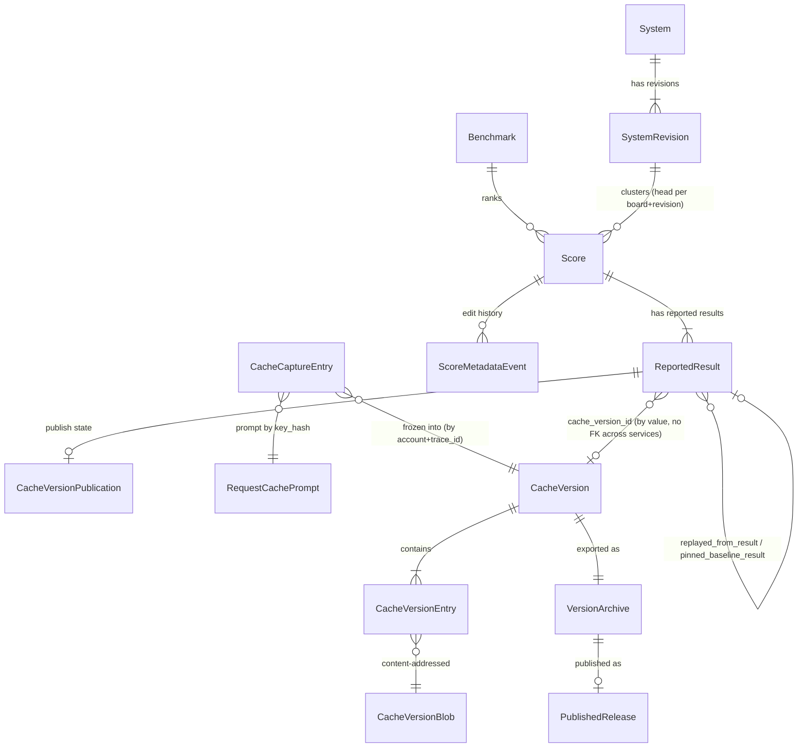

# ERD — E14 reproducible submission (OME-1307)

This document defines the data model for the E14 spec set. The PRDs refer to the entities here
by name. Source tags follow `00-overview.md`: `ans:Qn` points to the interview ledger, and
"ticket" means the OME-1307 body or Irina's comments on it (`[stated prompt]`).

Two services own data. **Each entity has exactly one owner service.** No service reads the
database of another service.

| Owner | Store | Entities |
|---|---|---|
| scoreboard | scoreboard Postgres (Tortoise) | `Score` (changed), `Benchmark` (changed), `ReportedResult`, `System`, `SystemRevision`, `ScoreMetadataEvent`, `CacheVersionPublication` |
| aigateway | aigateway Postgres (Tortoise) | `RequestCachePrompt`, `CacheCaptureEntry`, `CacheVersion`, `CacheVersionEntry`, `CacheVersionBlob` |
| aigateway (writer) / scoreboard (reader) | private object bucket (Garage/S3) | `VersionArchive` (object pair) |
| scoreboard publisher | GitHub public repo (releases) | `PublishedRelease` (external record) |

## 1. Diagram



The last relation crosses services. The scoreboard stores the `cache_version_id` and the
archive digest **by value**. It verifies them with the gateway's signed receipt (see
`contracts.md` C3). There is no foreign key across the two databases.

## 2. Scoreboard entities

### 2.1 `Score` — the cluster head (changed)

**Purpose.** Today one `Score` row is one submission `[existing apps/scoreboard/src/scoreboard/scores/models/score.py:159]`. After E14, a `Score` row is the **head of a cluster**: the first
claim of one system revision on one board and benchmark revision. The claim belongs to the
first submitter `[stated prompt]` (ticket, Irina answer 1). The ranked numbers are the numbers
of the original result `[stated ans:Q11]`.

**Kept columns** (no change): `id`, `benchmark_id`, `benchmark_revision`, `spec_id`,
`url4_expression`, `submitted_by`, `submitted_at`, `score`, `total_questions`,
`correct_questions`, the cost columns, `models`, `content_hash`, `authors`, `metadata`
`[existing apps/scoreboard/src/scoreboard/scores/models/score.py:15-151]`.

**New columns** `[proposed]`:

| Column | Type | Rule |
|---|---|---|
| `paper_url` | `VARCHAR(2048) NULL` | Editable by the head owner `[stated prompt]`. `https://` or `http://` only. |
| `system_revision_id` | `UUID NULL`, FK → `SystemRevision.id` | `NULL` only on legacy rows and private-board rows (§2.4). |
| `metadata_revision` | `INT NOT NULL DEFAULT 1` | Optimistic-concurrency token for metadata edits. Starts at 1. Goes up by 1 per edit. |
| `metadata_updated_at` | `TIMESTAMPTZ NULL` | Set on each metadata edit. |

**Invariants.**
- I-S1 `[proposed]`: For public boards, at most one head per
  `(benchmark_id, benchmark_revision, system_revision_id)` where `system_revision_id IS NOT NULL`.
  Enforce with a partial unique index.
- I-S2 `[stated ans:Q11]`: The ranked columns (`score`, `total_questions`,
  `correct_questions`, cost) of a head never change after insert. A later reported result
  never overwrites them.
- I-S3 `[existing apps/scoreboard/src/scoreboard/scores/models/score.py:104]`:
  `content_hash` excludes `authors`, so a metadata edit does not change `content_hash`.
- I-S4 `[stated prompt]`: Only `authors` and `paper_url` are editable `[stated ans:Q16]`.

**Ranking.** The leaderboard query reads heads only. This is the same table and the same
best-per-`(spec_id, benchmark_revision)` rule as today
`[existing apps/scoreboard/src/scoreboard/scores/store.py:592]`. For a head that has a system
name, `spec_id` holds the system name `[proposed]`.

### 2.2 `ReportedResult` — one submitted run (new)

**Purpose.** One row per submitted candidate run. The first run of a cluster is the
`is_original` row. Each later run of the same system revision on the same board is "another
reported result" under the head `[stated prompt]` (ticket, Irina answer 1). "One submission,
one recipe, one cache version" `[stated prompt]` maps to one `ReportedResult` and at most one
`cache_version_id`.

| Column | Type | Rule |
|---|---|---|
| `id` | `UUID PK` | |
| `head_id` | `UUID NOT NULL` FK → `Score.id`, `ON DELETE CASCADE` | The head. The FK attribute is `head`; the column has the Tortoise native name `head_id` (D8, `ans:Q25`). |
| `is_original` | `BOOL NOT NULL` | Exactly one `true` per `head_id` (partial unique index `uidx_reported_result_one_original` on `("head_id") WHERE "is_original"`). |
| `reporter` | `VARCHAR(255) NULL` | Verified submitter of this run. Same source as `Score.submitted_by` `[existing apps/scoreboard/src/scoreboard/routes/scores.py:87]`: in production, the `X-User-Email` identity of `cloudflare_headers` mode (`ans:Q22`). NULL only in the `disabled` dev and local fallback. |
| `run_id` | `VARCHAR(255) NULL UNIQUE` | From `Idempotency-Key` `[existing packages/screamingface/src/screamingface/_scoreboard/leaderboards.py:106]`. Unique, so a resend never makes a second row. As wide as `IdempotencyKey.key`, so a key that the legacy path accepts is accepted here too (FS-1). |
| `trace_id` | `CHAR(32) NULL` | From the report `[existing packages/screamingface/src/screamingface/report.py:189]`. |
| `score`, `total_questions`, `correct_questions` | as `Score` | This run's numbers. |
| `run_cost_usd`, `run_cost_status`, `cache_saved_cost_usd` | as `Score` | This run's cost. |
| `models`, `ran_with_providers`, `answer_seed`, `client_name`, `client_version`, `client_platform` | as `Score` / report | |
| `submitted_at` | `TIMESTAMPTZ NOT NULL` | Server time. Index `(head_id, submitted_at)` for the results list. |
| `cache_version_id` | `UUID NULL` | By value. Set only from a valid receipt (C3). |
| `cache_version_sha256` | `CHAR(64) NULL` | The archive digest from the receipt. |
| `cache_entry_count` | `INT NULL` | From the receipt. |
| `cache_call_count` | `INT NULL` | From the receipt: all gateway calls seen for the trace. |
| `cache_coverage_status` | `VARCHAR(16) NULL` | `complete` or `partial` (from the receipt). |
| `replayed_from_result_id` | `UUID NULL` FK → `ReportedResult.id`, `ON DELETE NO ACTION` | Set when the run was pinned to a version `[proposed]`. FK attribute `replayed_from_result` (D8). |
| `replay_hits`, `replay_misses` | `INT NULL` | Version hits and misses during the run `[stated ans:Q13]`. |
| `pinned_baseline_result_id` | `UUID NULL` FK → `ReportedResult.id`, `ON DELETE NO ACTION` | The result that a pin-by-date resolved to `[stated ans:Q7]`. FK attribute `pinned_baseline_result` (D8). |

**Invariants.**
- I-R1 `[implied]`: `cache_version_id`, `cache_version_sha256`, `cache_entry_count`,
  `cache_call_count` and `cache_coverage_status` are all set, or all `NULL`.
- I-R2 `[implied]`: `replay_hits`, `replay_misses` and `replayed_from_result_id` are all set,
  or all `NULL`.
- I-R3 `[proposed]`: A `ReportedResult` row is immutable after insert, except for the publish
  state, which lives in `CacheVersionPublication`.
- I-R4 `[implied]`: `cache_version_id` is unique across rows. One version binds to one result.
- I-R5 `[proposed]` (D8, `ans:Q25`): the two replay FKs use `ON DELETE NO ACTION`, not
  `RESTRICT`. The database checks NO ACTION at the end of the statement, on SQLite and on
  PostgreSQL. So when a head is deleted, the CASCADE can remove a replay and its original in the
  same cluster together. A replay in a **different** cluster still blocks the delete of its
  original, so the provenance stays and I-R2 stays true. (SQLite checks RESTRICT row by row,
  inside the CASCADE, so RESTRICT blocks the in-cluster delete.)
- Column names `[proposed]` (D8): every FK column has the Tortoise native name `<attr>_id`.
  No FK sets a custom `source_field`, and no migration renames a column.

**Size.** One row per submission. It grows at the submission rate (see §5).

### 2.3 `System` and `SystemRevision` — names (new)

**Purpose.** A system is "the url4 minus the benchmark" `[stated prompt]` (ticket, Irina
answer 3), with a global name that the first submitter owns `[stated ans:Q8]`. The owner can
declare a new url4 as the next revision of the name `[stated ans:Q14]`.

`System`:

| Column | Type | Rule |
|---|---|---|
| `id` | `UUID PK` | |
| `name` | `VARCHAR(64) NOT NULL UNIQUE` | Normalized (§2.3.1). Global `[stated ans:Q8]`. |
| `owner` | `VARCHAR(255) NOT NULL` | Verified identity of the first namer. |
| `created_at` | `TIMESTAMPTZ NOT NULL` | |

`SystemRevision`:

| Column | Type | Rule |
|---|---|---|
| `id` | `UUID PK` | |
| `system_id` | `UUID NOT NULL` FK → `System.id` | |
| `revision` | `INT NOT NULL` | 1, 2, 3, … Unique with `system_id`. |
| `fingerprint` | `CHAR(64) NOT NULL UNIQUE` | `sha256` of the canonical candidate url4, computed on the server (§2.3.2). |
| `candidate_url4` | `TEXT NOT NULL` | Canonical candidate url4, kept for display and audit. |
| `declared_by` | `VARCHAR(255) NOT NULL` | Always the system owner `[stated ans:Q14]`. |
| `created_at` | `TIMESTAMPTZ NOT NULL` | |

**Invariants.**
- I-N1 `[stated ans:Q8]`: A normalized name maps to exactly one `System`.
- I-N2 `[stated prompt]`: A fingerprint maps to exactly one `SystemRevision`, so one
  system revision has one name (Irina: "the system should be called the same").
- I-N3 `[stated ans:Q14]`: Only `System.owner` can add a revision.
- I-N4 `[proposed]`: Only a public-board submission claims a name or adds a revision. A
  private-board submission never writes to `System` or `SystemRevision`. This prevents a
  private name from leaking into the public registry.

#### 2.3.1 Name normalization `[proposed]`

Lowercase, then match `^[a-z0-9](?:[a-z0-9._-]{0,62}[a-z0-9])?$`. Reject all other input with
`422 invalid_system_name`. The route form `screamingface/<name>` (E8) needs a URL-safe name
with no slash.

#### 2.3.2 Fingerprint `[proposed]`, `[stated ans:Q20]`

`fingerprint = sha256(render(strip(build(candidate_url4_without_answer_seed), exclude_bindings)))`,
where the candidate is the zero-weight `candidate` binding inside the linked url4
`[existing packages/screamingface/src/screamingface/_evaluation/linking.py:34-40]`. A new
pure function in `packages/url4` computes it:

```python
def system_fingerprint(
    linked: str,
    binding: str = "candidate",
    *,
    exclude_bindings: frozenset[str] = frozenset(),
) -> str: ...
```

- **Caller.** The scoreboard calls
  `system_fingerprint(linked, binding="candidate", exclude_bindings=frozenset({"_sf_recipe"}))`
  `[stated ans:Q20]`. The SDK, when it computes a fingerprint, uses the same arguments.
- **`exclude_bindings`** `[existing packages/url4/src/url4/fingerprint.py:92-133]` (as built,
  D3 amendment, `ans:Q25`). The function removes a top-level source of the candidate
  expression whose binding name is in the set **only when the source is inert**, then renders.
  A source is inert when all three rules are true:
  1. its value is text (a `Text` node);
  2. its weight is the explicit scalar `0.0` (an absent weight is **not** inert);
  3. no `$name` reference to it stays in the rest of the system.
  When a named source is not inert, the function raises
  `url4.fingerprint.ExcludedBindingError` (a `url4.Url4Error`, code `malformed_source`). It
  never hides a working part of a system. WHY: the scoreboard takes client text, and a client
  can name a working member `_sf_recipe`; if the function hid it, a different system would get
  the fingerprint of an existing system. The scoreboard maps the error to `422 invalid_url4`
  (SR-D5). The `_sf_recipe` binding holds the recipe display name (`name`, `named`)
  `[existing packages/screamingface/src/screamingface/_evaluation/topology.py:14]`, so a rename
  does not make a new system. The `url4` package never names `_sf_recipe`: the caller passes
  it. The default (an empty set) removes nothing.
- **Seeds.** `answer_seed` is removed before hashing, because a seed is a sitting of the same
  system, not a different system `[proposed]`. A `seed` parameter that the Candidate itself
  declares is in the url4 text and **stays** in the hash (URL4 OD-2 default, `ans:Q20`).
- **No `candidate` binding.** The whole canonical url4 (`render(build(linked))`) is hashed
  (URL4 OD-5, `ans:Q20`).
- **Trust.** The scoreboard **always** recomputes the fingerprint from `url4_expression`. It
  never trusts a client value.

### 2.4 Clustering key `[proposed]`

| Board visibility | Cluster key |
|---|---|
| public | `(benchmark_id, benchmark_revision, system_revision_id)` |
| private | `(benchmark_id, benchmark_revision, submitted_by, candidate fingerprint)`. No `System` row (I-N4). The fingerprint goes into `Score.metadata.system_fingerprint`. |

The private rule keeps today's per-submitter scope on private boards
`[existing apps/scoreboard/src/scoreboard/scores/store.py:335]`.

### 2.5 `ScoreMetadataEvent` — edit history (new) `[proposed]`

One append-only row per successful metadata edit: `id`, `score_id`, `actor`, `at`,
`from_revision`, `to_revision`, `before` (JSON: `authors`, `paper_url`), `after` (JSON).
A citation can change after a paper ships, so the history shows who changed what. Rows are
never updated or deleted.

### 2.6 `CacheVersionPublication` — publish state (new)

One row per `ReportedResult` that has a cache version. The table is also the publish job
queue (no separate broker) `[proposed]`.

| Column | Type | Rule |
|---|---|---|
| `result_id` | `UUID PK` FK → `ReportedResult.id` | |
| `state` | `VARCHAR(16)` | See the state table below. |
| `requested_by`, `requested_at` | | Owner opt-in `[stated ans:Q9]`. |
| `attempts` | `INT DEFAULT 0` | |
| `next_attempt_at` | `TIMESTAMPTZ NULL` | Backoff schedule. |
| `lease_until` | `TIMESTAMPTZ NULL` | Worker lease (`SELECT … FOR UPDATE SKIP LOCKED`). |
| `last_error` | `VARCHAR(512) NULL` | Sanitized. |
| `release_tag` | `VARCHAR(64) NULL` | Deterministic: `cv-<cache_version_id>`. |
| `release_url` | `VARCHAR(512) NULL` | |
| `published_at` | `TIMESTAMPTZ NULL` | |
| `withdrawn_at`, `withdrawn_by`, `withdrawn_reason` | | Admin takedown only `[stated ans:Q10]`. |

**States** `[proposed]`. The state is `private` until the owner opts in `[stated ans:Q9]`.

| From \ Event | owner publishes | worker succeeds | worker fails (retryable) | attempts exhausted | admin takedown |
|---|---|---|---|---|---|
| `private` | → `requested` | reject | reject | reject | → `withdrawn` |
| `requested` | no-op (idempotent) | → `published` | → `requested` (backoff) | → `failed` | → `withdrawn` |
| `failed` | → `requested` (attempts reset) | reject | reject | reject | → `withdrawn` |
| `published` | no-op (idempotent) | reject | reject | reject | → `withdrawn` |
| `withdrawn` | reject `409 withdrawn` | reject | reject | reject | no-op |

`withdrawn` is terminal. A published version is immutable for its owner `[stated ans:Q10]`.

### 2.7 `Benchmark` (changed)

New column `redistributable BOOL NOT NULL DEFAULT false` `[proposed]`. The default is
fail-closed. A public board publishes to GitHub, and serves replay to non-owners, only when
`redistributable = true` `[stated ans:Q6]`. `visibility` stays as it is
`[existing apps/scoreboard/src/scoreboard/scores/models/benchmark.py:51]`.

**Writer** `[stated ans:Q23]`. Only a scoreboard admin sets `redistributable`, through an admin
route that the WIRING unit adds. It uses the same admin allowlist as the withdraw route
(`contracts.md` C10), and it writes an audit record. No other path writes the column.

## 3. Gateway entities

**What the live cache already keeps.** The live cache keeps each answer with no expiry
(`expires_at = NULL`)
`[existing apps/aigateway/src/aigateway/core/request_cache/models/request_cache_entry.py:25]`.
It does **not** keep three things that a version needs
`[existing apps/aigateway/src/aigateway/core/request_cache/models/request_cache_entry.py:13-34]`:

1. which calls belong to which run: the cache is global and a row has no trace or run id;
2. the prompt text: only `prompt_hash` is stored;
3. the answers that never go into the cache (`use-cache: false`, or a skipped write).

The two tables below add exactly those three things. Both are kept with no time limit, like
the cache, so a freeze can happen at any time after the run `[stated ans:Q18]`.

### 3.1 `RequestCachePrompt` — the prompt per cache key (new) `[proposed]`

A sibling of `request_cache_entries`. The `key_hash` already hashes the canonical request, so
one key has exactly one prompt. A prompt is stored **once per key**, not once per run, so the
reruns of a cluster add almost no storage.

| Column | Type | Rule |
|---|---|---|
| `key_hash` | `CHAR(64) PK` | The global cache key `[existing apps/aigateway/src/aigateway/core/request_cache/global_keys.py:257-292]`. |
| `request_json` | `JSONB NOT NULL` | The canonical request material that the key hashes. |
| `created_at` | `TIMESTAMPTZ NOT NULL` | |

**Write rule.** For each traced call, whatever its outcome, the gateway writes
`INSERT … ON CONFLICT (key_hash) DO NOTHING`. This also fills the prompt of a cache entry that
existed before this feature, on its next hit.

**Invariant I-P1** `[implied]`: for a given `key_hash`, `request_json` never changes. The key
is a hash of it, so a second insert with the same key has the same content.

**Retention.** None, like `request_cache_entries`. An operator prune of the cache
(`[existing apps/aigateway/DEPLOYMENT.md:313-339]`) must also prune the matching prompt rows
`[proposed]`.

### 3.2 `CacheCaptureEntry` — the thin run index (new) `[proposed]`

One small row per traced call. It records which keys a run used, in which order, and with
which outcome.

| Column | Type | Rule |
|---|---|---|
| `id` | `UUID PK` | |
| `account_id` | `VARCHAR(64) NOT NULL` | The caller account `[existing apps/aigateway/src/aigateway/routes/chat.py:244]`. |
| `trace_id` | `CHAR(32) NOT NULL` | From `traceparent`, which the engine forwards `[existing apps/screamingface-engine/src/screamingface_engine/world/connector.py:1061-1078]`. |
| `ordinal` | `BIGINT NOT NULL` | Arrival order per `(account_id, trace_id)`. |
| `key_hash` | `CHAR(64) NOT NULL` | Points to `RequestCachePrompt` and, when cached, to `request_cache_entries`. |
| `outcome` | `VARCHAR(16)` | `hit`, `stored`, `unstored`, `bypass`, `version_hit`, `error`. |
| `response_json` | `JSONB NULL` | Inline only when no live-cache row holds the answer (`unstored`, `bypass`). |
| `created_at` | `TIMESTAMPTZ NOT NULL` | |

Index: `(account_id, trace_id, ordinal)`.

**Retention.** None: the index is kept forever `[stated ans:Q18]`. There is no purge job.

**Size** [estimated]: ~150 bytes per row plus the index. At ~600,000 traced calls per day
(30 users × 20 runs × 1,000 calls), that is ~90 MB per day, or ~33 GB per year, plus the
inline bodies of uncached calls. See the tripwire in §5.

### 3.3 `CacheVersion` (new) `[proposed]`

| Column | Type | Rule |
|---|---|---|
| `id` | `UUID PK` | |
| `owner_account_id` | `VARCHAR(64) NOT NULL` | The account that froze it. |
| `trace_id` | `CHAR(32) NOT NULL` | Unique with `owner_account_id`, so a freeze is idempotent. |
| `status` | `VARCHAR(16)` | `frozen`, then `archived` (after the bucket export). |
| `entry_count` | `INT` | Distinct `(key_hash, blob_id)` pairs. |
| `call_count` | `INT` | Ledger rows seen for the trace. |
| `missing_count` | `INT` | Calls with no recoverable response (live row pruned, or `error`). |
| `coverage_status` | `VARCHAR(16)` | `complete` if `missing_count = 0`, else `partial`. |
| `archive_sha256` | `CHAR(64)` | sha256 of the `entries.jsonl.gz` bytes (the gzip output, not the plain JSONL). See §3.5. |
| `archive_key` | `VARCHAR(256)` | Bucket object key. |
| `created_at` | `TIMESTAMPTZ` | |

### 3.4 `CacheVersionEntry` and `CacheVersionBlob` (new) `[proposed]`

`CacheVersionBlob` is content-addressed and immutable: `sha256 PK` (over the canonical
request plus response), `request_json`, `response_json`, `metadata_json` (the
`aigw.cache-entry-metadata.v1` block
`[existing apps/aigateway/src/aigateway/core/request_cache/entry_metadata.py:29]`), `size_bytes`.

`CacheVersionEntry`: `(version_id, key_hash, blob_id, first_ordinal)`, primary key
`(version_id, key_hash, blob_id)`. `blob_id` holds `CacheVersionBlob.sha256`. The columns
`version_id` and `blob_id` have the Tortoise native FK names (D8, `ans:Q25`). As built, the key is
a UUID surrogate `id` plus a unique index on these three columns, because Tortoise 1.1.8 has no
composite primary key (GW-capture §5).

A rerun of the same recipe sends mostly the same calls, so blobs are shared across the
versions of one cluster. That keeps storage near the size of one run per cluster.

**Replay rule** `[proposed]`: for a `key_hash` with more than one blob in a version, replay
returns the blob with the lowest `first_ordinal`. This limitation is documented. See
`prd/replay-pinned-run.md` RP-D5.

### 3.5 `VersionArchive` — bucket object pair `[proposed]`

`cache-versions/<version_id>/entries.jsonl.gz` plus `cache-versions/<version_id>/manifest.json`.
The format extends the existing `screamingface.cache-snapshot.v1` idea
`[existing apps/aigateway/src/aigateway/core/request_cache/snapshot_export.py:49]` with a new
schema id, `screamingface.cache-version.v1`:

```json
{
  "schema": "screamingface.cache-version.v1",
  "version_id": "uuid",
  "trace_id": "32-hex",
  "created_at": "RFC3339",
  "entry_count": 412,
  "call_count": 420,
  "missing_count": 0,
  "coverage_status": "complete",
  "entries_sha256": "64-hex",
  "parameter_contract_revision": "aigw-parameter-contract-2026-08b",
  "key_revision": "<KEY_REVISION>"
}
```

Each line of `entries.jsonl.gz` is `{"key_hash", "first_ordinal", "request", "response",
"metadata"}`, sorted by `first_ordinal`. The bytes are canonical (sorted keys, UTF-8, no
insignificant whitespace, gzip `mtime=0`), so `archive_sha256` is reproducible.

**`archive_sha256` preimage** `[proposed]`, D7 (X-16). The digest is the sha256 of the
**compressed** bytes of `entries.jsonl.gz`:

1. Each line is the canonical JSON of one entry, then `"\n"`, encoded as UTF-8.
2. The lines go, in `first_ordinal` order, into one gzip stream with `filename=""`,
   `mtime=0` and `compresslevel=9`.
3. `archive_sha256 = sha256(<the gzip output bytes>)`. The manifest field `entries_sha256` has
   the same value. The manifest itself is not in the preimage.

The gateway (freeze, export), the receipt claim `sha` (`contracts.md` C3), and the scoreboard
(the digest check before a publish, PB-E5) all use this one rule.

**Source of truth.** The gateway Postgres rows (§3.3–3.4) are the source of truth for replay.
The bucket archive is a derived, immutable export. The gateway writes it after the freeze
commits (outbox: `status = frozen` means the export is due). A digest check detects a
mismatch.

### 3.6 Version retention `[proposed]`

The gateway keeps every `CacheVersion` with no time limit, because a citation must stay
resolvable (ticket goal) `[implied]`. The gateway does **not** know which versions the
scoreboard bound to a result: the design has no scoreboard → gateway call (see
`contracts.md`, decision record DR-2). A GC of "unbound" versions could therefore delete a
bound version. That is data loss, so v1 has no version GC. A freeze happens only at submit
time (`prd/submit-and-cluster.md`), so an unbound version exists only when a submit failed
after its freeze. The waste is small.

Tripwire: when unbound versions pass 10% of `CacheVersion` rows (measured by a scoreboard
export of bound ids, joined offline), add an explicit bind signal and a GC.

## 4. External record — `PublishedRelease` (GitHub)

Repo `ScreamingFace/screamingface-cache-versions` (public) `[stated ans:Q5]`, and the exact
name is `[proposed]`. One release per published version: tag `cv-<version_id>`, assets
`entries.jsonl.gz` and `manifest.json`, which are byte-identical to the bucket archive. The
release body links to the scoreboard page. The tag name is deterministic, so a retried publish
finds the existing release (see `prd/publish-and-takedown.md`).

## 5. Capacity envelope

| Quantity | Estimate | Therefore |
|---|---|---|
| Calls per run | 200 to 5,000 [estimated: 100–500 cases × 2–10 calls] | A version holds 200 to 5,000 entries. Cap at 20,000 entries [proposed]. |
| Bytes per entry | ~8 KB [estimated: ~4 KB request + ~4 KB response] | 1.6 to 40 MB per version before dedup. |
| Submissions | ~200 per week [assumed, 30 users] | ≤ 8 GB per week before dedup. With blob dedup across clusters, expect well below that. One Postgres node is enough. |
| Archive size | ≤ 40 MB gzip-compressed [estimated] | Far under the 2 GB GitHub asset cap. Cap the archive at 1.5 GB [proposed]. |
| Run index (`CacheCaptureEntry`) | ~90 MB per day, ~33 GB per year [estimated: 600,000 traced calls/day × ~150 B] | Kept forever `[stated ans:Q18]`. One Postgres node holds several years of it. |
| Prompts (`RequestCachePrompt`) | about the same size as `request_cache_entries` (one prompt per key) [estimated] | Grows at the rate of the cache, which already has no limit. |

Tripwires `[proposed]`:
- When `CacheVersionBlob` passes 200 GB, or its growth passes 20 GB per month, move the blob
  bodies to the bucket and keep only an index in Postgres.
- When `CacheCaptureEntry` passes 150 GB, or its query p99 for one trace passes 200 ms,
  partition the table by month on `created_at`. The data is kept forever, so partitioning is
  the lever, not a purge.

## 6. Migrations `[proposed]`

All changes are expand-only first, so the old code keeps working during a rollout.

**Scoreboard** (next migration after
`[existing apps/scoreboard/src/scoreboard/scores/migrations/0016_score_enriched_at.py]`):
1. `0017`: add the nullable `Score.paper_url`, `system_revision_id`, `metadata_updated_at`, and
   `metadata_revision DEFAULT 1`; add `Benchmark.redistributable DEFAULT false`.
2. `0018`: create `system`, `system_revision`, `reported_result`, `score_metadata_event` and
   `cache_version_publication`, with their unique and partial-unique indexes.
3. `0019` (data): backfill one `ReportedResult(is_original=true)` per existing `Score`, with
   `run_id` taken from `metadata.run_id` when present. The backfill is idempotent, because it
   skips a head that already has an original.
4. Out-of-band command `scoreboard backfill-systems --dry-run|--apply` `[proposed]`. For each
   public legacy head, compute the fingerprint. The earliest `submitted_at` claims the name
   `spec_id`. If a name clashes with a different fingerprint, the command reports it and does
   not apply it. **Legacy heads are never merged**, so the leaderboard does not change on
   deploy.

**Gateway** (next migration after the current chain):
1. Create `request_cache_prompt`, `cache_capture_entry`, `cache_version`,
   `cache_version_entry` and `cache_version_blob`.
2. No change to `request_cache_entries` itself. The no-variant key test stays green
   `[existing apps/aigateway/tests/unit/test_global_cache_key.py:260-273]`.
3. No prompt backfill for the cache entries that exist before this feature, because there is
   no source for their prompts. A backfill is not needed: every traced call writes its own
   prompt at call time (§3.1 write rule), including a hit on an old entry. So each call in a
   traced run always has its prompt.
