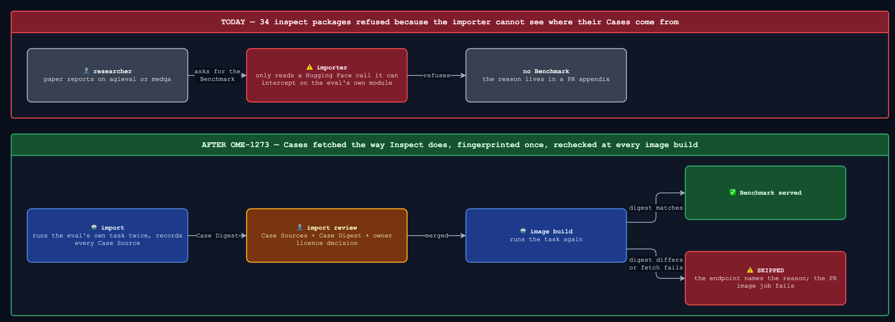
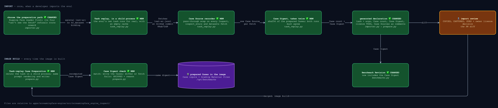

# Spec — import the Benchmarks whose Cases the importer can't see, by replaying the eval's own task

- Status: approved (owner, 2026-09-30). Design decisions: owner, 2026-09-30 (recorded on the ticket).
  Settled on this PR (owner, 2026-09-30): four refusals route to Task replay (R1), the strict
  image-job switch is approved (R11), the code ships as five PRs (Delivery), and the strict
  job's cost below is accepted.
- Amended 2026-10-02 (owner direction): a Task-replay Case is **captured** from the eval's own
  solvers, run up to their first `generate`, instead of rendered by our writer from template
  fields on the declaration. R2, R6, R9, the Runs / Taken / Never-runs table and two Known
  limitations changed; the declaration lost its three template fields. Plan:
  `docs/plan/2026-10-02-OME-1273-capture-rendering.md`.
- Amended 2026-10-05 (owner direction, on #1222): two refusals of plan step 7 become
  Benchmarks. R18 adds excluded Sample ids to a Task-replay declaration (sad_stages_full's
  three empty Samples), and R19 lets a Benchmark with no answer key and no Judge assemble
  when its own scorer grades from the reply alone (cyberseceval_4 mitre_frr). The "Named
  Deviations on Task-replay Benchmarks" line left Out of scope. Plan: the step-7 ledger,
  `docs/work/2026-10-02-ome-1273-task-replay-benchmarks-3.md`.
- Component: `apps/screamingface-engine` (`screamingface_engine_inspect`).
- Ticket: [OME-1273](https://linear.app/openmined/issue/OME-1273/import-the-single-turn-benchmarks-the-importer-still-refuses). Parent epic: OME-1299.
- Ledger: `docs/work/2026-09-30-ome-1273-task-replay-spec.md`.
- Pinned to: `inspect-evals` 0.20.0, `inspect-ai` 0.3.263, main `42baa988`.
- Architecture: `apps/screamingface-engine/docs/importing-an-inspect-eval.md` (OME-1459) is the
  current picture of what we take from a `Task` and which component runs each `eval()` step; it
  also records the decision taken after this spec, one fetch path (OME-1460). This spec stays as
  the record of the Task-replay design, capture rendering included, and its requirements.

## TLDR

[inspect_evals](https://github.com/UKGovernmentBEIS/inspect_evals/tree/v0.20.0) is a library
of ready-made evals. Our **importer** copies one into ScreamingFace as an **Imported
Benchmark**. **Case Preparation** then fetches its Cases once at image build and freezes them
into the Engine's image. Think of the importer as a clerk who copies an eval's Cases. Today the clerk only
knows one filing cabinet, the Hugging Face Hub, and only when the eval opens that cabinet in
plain sight.

The rule: **we only serve Cases that someone reviewed, and they must be the same at every image
build.** The importer refuses 34 packages because it can't see where their Cases come from:

- the Hugging Face fetch sits in a helper file or goes through a loader script (medqa, bbq, bbeh)
- the Cases come from GitHub or another URL (agieval, mgsm)
- the Cases ship as a file inside `inspect_evals` (persistbench)
- several fetches happen and none is clearly the Cases, or a converter is written inside the task (chembench, DROP, pre_flight)
- the importer's own stand-in Sample crashed the eval (bbh, personality, sciknoweval)

The change: we fetch the Cases the way Inspect does, by calling the eval's own task function.
Building its Task makes the eval load its dataset, which is the fetch we want. Each Case's text
is then captured from the eval's own solvers: they run on each Sample exactly as inspect runs
them, and the moment they would ask the model, a stand-in writes down the prompt instead.
**This never runs an evaluation:** no model, scorer or Judge runs, and nothing is paid for. We record every
place the task fetched from (a **Case Source**) and fingerprint what it produced (the **Case
Digest**). Every image build calls the task function again and serves nothing if the fingerprint
differs.
**It never serves Cases nobody reviewed.** No existing Imported Benchmark changes. Up to 14
packages become Benchmarks here. The Judge-graded rest become fetchable, ready for the Judge
tickets.

## Before / After

Today a researcher whose paper reports on agieval or medqa finds no Benchmark, and nothing
visible says why. After this work, each of the 34 packages is either a Benchmark whose Cases are
proven unchanged at every image build, or carries a named reason it isn't one yet.

### Don't regress

- Existing Imported Benchmarks keep their code path and their Benchmark Revisions byte for byte.
  `tests/unit/inspect/test_published_revisions.py` pins all 17 literal revisions.
- Import review keeps its three parts: COPIED (transcribed from the eval), CAPTURED (observed at
  import), OURS (our own seeds and preparer revision).
- Refuse first. A shape we can't reproduce exactly is refused by name, never approximated: the
  placeholder guard (OME-1272) and the question filter (OME-1269) keep working unchanged.

## Architecture / Design

Click the diagram for full size.

Files are relative to `apps/screamingface-engine/src/screamingface_engine_inspect/`.
`task_replay.py` is a proposed new module; the rest exist on main.

**What Task replay runs, and what it never runs.** Think of it as asking the eval to print its
question booklet, not to run the test.

| | What happens |
| -- | -- |
| **Runs** | The eval's `@task` function, called with its task args (`mgsm(languages=["en"])`). To build its `Task`, the function loads its dataset: mgsm downloads its TSV and checks upstream's sha256; agieval downloads a JSONL at a pinned GitHub commit. Then, per Sample, the Task's own `setup` and `solver` chain, up to its first `generate`: that call goes to a stand-in that records the messages and answers nothing (amended 2026-10-02). |
| **Taken** | `task.dataset`: the Samples after the eval's own filtering and conversion. Per Sample, the messages the solvers had built when they first asked the model (system text, then the one user prompt): that text is the Case. Our shared Case writer writes it and the Grading Material, as on the Hugging Face path. |
| **Never runs** | inspect's `eval()`. Any model: the stand-in `generate` never calls one, and the child's environment names no model (`INSPECT_EVAL_MODEL=none/none`), so a solver that builds its own with `get_model()` raises and the Sample is refused. The scorer, every Judge, a sandbox, a tool. A chain that asks twice, hands the model tools, or builds a multi-turn prompt is refused by name, never approximated. No API call is made and nothing is paid for. |

This is not new ground: the importer already calls task functions today, and so does the
question filter (OME-1269). Both swap `hf_dataset` for a stand-in; Task replay lets the real
fetch happen.

- **Choose the preparation path.** The Hugging Face reader runs first, because existing
  Benchmarks must keep their revisions. Only its four "can't see the fetch" refusals route
  onward (R1); every other refusal is a real mismatch, not blindness.
- **Task replay runs in a child process.** `inspect_evals` reads its cache directory once, when
  it is first imported (`INSPECT_EVALS_CACHE_PATH`). `inspect_ai.util.download` also skips a
  file whose cached copy matches. Only a fresh process with an empty cache fetches, and is
  recorded, every time.
- **The Case Source recorder wraps rather than stubs,** because the Case Digest needs the real
  Cases. It rebinds by identity (every module attribute that *is* the wrapped function), because
  evals import helpers by name: mgsm does `from inspect_ai.util import download`, so patching
  `inspect_ai.util` alone would miss it.
- **The Case Digest is taken twice at import.** An unseeded shuffle or generated Cases pass once
  and then fail at the next image build, so import catches it now.
- **The generated declaration splits review from enforcement.** Case Sources go in as comments
  (COPIED); the Case count and Case Digest go in as constants (CAPTURED). The reviewer judges
  *where* the Cases come from; the code enforces *what* they are.
- **Task-replay Case Preparation calls the eval's own loading code, not a copy of it,** because
  re-implementing each loader script by hand is exactly where silent mismatches come from.
- **The prompt is captured from the eval's own solvers, not imitated from declared template
  fields** (amended 2026-10-02), because an imitation only knows the solvers it was written
  for: sevenllm chains `prompt_template(TEMPLATE)` then `multiple_choice()`, and a writer that
  renders choices from a template field dropped the first solver entirely, with both replays
  agreeing because both ran the same writer. Capture runs the real chain, so a solver we never
  saw renders right. The Hugging Face path keeps its imitation writer until the fold
  (OME-1460); the two share the Case writer, so a Case is still written one way.
- **A mismatch writes SKIPPED, not a crash,** so one changed URL can't take every other
  Benchmark in a deployed image dark. The PR image job runs strict, so the PR that caused a
  mismatch (usually a dependency bump) can't merge.

## Known limitations of this design

- **Image builds run Inspect's fetch code with network access.** A dead or moved URL takes that
  Benchmark dark (SKIPPED) until someone re-imports it. Accepted: it fails loudly, never with
  different Cases.
- **An upstream change fails every Engine PR's image job until it is fixed.** The strict job
  checks all Task-replay Benchmarks, not just the ones a PR touched, and the job has no build
  cache, so every run fetches every Case Source again. Accepted: the fix is one re-import, and a
  silent pass would let the drift reach a deployed image. Real drift should be rare: most of the
  14 fetch from a dataset revision, a commit or an upstream sha256, which can vanish but can't
  change. piqa's unpinned URLs are the known exception; the import's recorder lists any other. The likelier failure is a host
  that's briefly down. The Hugging Face path already carries that risk on every PR today, and
  Inspect's download helpers retry. If flakes show up, the fix is retrying the fetch, not
  loosening the check.
- **Per-PR preview environments allow internet access; dev, staging and prod don't.** Engine
  run pods reach only DNS, the AI gateway and in-cluster services in dev, staging and prod,
  but previews allow outbound ports 80 and 443 (infrastructure repo,
  `kubernetes/apps/sf-preview/templates/networkpolicies.yaml`). A scorer that downloads
  something therefore passes in a preview and fails in dev. Accepted: R17's no-network grading
  test is the check that catches it, and it runs in CI before any environment.
- **Task replay has no gated-dataset path.** Hugging Face Benchmarks behind a gate
  (`needs_hf_token`) refuse a tokenless main build by name; a Task-replay Benchmark would go
  SKIPPED instead, and fail every secretless PR's strict image job. Accepted: none of the 14
  packages fetches a gated source; add the token path when one does.
- **A fetch we don't wrap can't be imported, and one made beside a wrapped fetch is invisible.**
  An eval that downloads only through plain `requests` or `urllib` produces Cases with no
  recorded Case Source, and is refused. An eval that makes one wrapped fetch and one unwrapped
  fetch imports cleanly with one Case Source listed; the reviewer reading the loader is the
  only check. Both stay so until upstream moves to an Inspect helper or we add the primitive.
- **A folded system message is not shown in the row.** Capture turns an eval's system message
  into the input's leading text (the named deviation); the generated declaration does not say
  which Benchmarks this touches (cybermetric's four, among the first 19). Accepted for now:
  the Case text carries it, and the catalogue prose can say so; a per-row note is a cheap
  follow-up if a reviewer asks.
- **The Case Digest says *that* the Cases changed, not *what* changed.** Accepted: the fix is
  always a re-import and a fresh review, and that diff shows the difference.
- **Case Sources are review comments, not checked at build.** A source that moves but serves
  identical content passes. Accepted: what we serve is the Cases, and the digest pins those.
- **Only Task-replay Benchmarks get a Case Digest.** Hugging Face-prepared Benchmarks keep the
  Case count as their only drift guard. Backfilling a digest changes their Benchmark Revisions,
  so it needs its own ticket (not filed).
- **Two preparation paths live side by side.** Folding the Hugging Face path into Task replay
  is a later decision, not this ticket's (OME-1460). Until then the Hugging Face path still
  imitates the eval's render from template fields; only the Task-replay path captures it.
- **A captured Case is system text then one user prompt.** An eval whose solvers build a
  few-shot conversation (assistant turns), several user turns, or image content is refused by
  name, not flattened. Accepted: none of the 14 packages needs it; the Case shape grows when
  one does.
- **A solver that names a model explicitly can still reach it.** The child's environment
  names no model, so a bare `get_model()` raises and capture refuses the Sample; a solver
  that writes `get_model("openai/gpt-4o")` or passes its own `default=` would still call
  out, with the builder's keys. Accepted: none of the 14 packages does this in a solver we
  import (cyberseceval_4's phishing solver uses the bare form and is refused); a reviewer
  reads each Task's solvers at import, and the no-network grading test never covers the
  import step.
- **A solver that reorders choices after the dataset is read is refused.** inspect's
  `multiple_choice(shuffle=…)` (deprecated upstream) shows the Candidate one order while the
  Grading Material holds the Sample's; the task arg that disables the shuffle is the fix.
- **Every count here is pinned to inspect_evals 0.20.0.** A version bump means re-running the
  sweep before trusting any number.

## Requirements

### Import side

- **R1. Routing.** The importer runs the Hugging Face reader first. Exactly these four refusals
  route to Task replay, as one distinct refusal kind; every other refusal stays a refusal:
  - the task module has no `hf_dataset` binding (`importer.py`:190 today);
  - the task never called `hf_dataset` (:508);
  - several `hf_dataset` calls, none of them the Task's dataset (:518);
  - `record_to_sample` is defined inside the task function (:491).

  Every existing import produces byte-identical generated code.
- **R2. Task replay.** It calls the eval's task function with the declared task args, then
  runs the Task's `setup` and `solver` chain on each Sample with a stand-in `generate` that
  records the messages and answers with an empty reply (amended 2026-10-02). It never calls
  inspect's `eval()`, so no model, scorer or Judge runs. The call happens in a child process
  whose `INSPECT_EVALS_CACHE_DIR` and Hugging Face cache point at a fresh, empty directory. The
  Samples are the Task's dataset after the task's own filtering, shuffling and conversion, as
  inspect would run them; the Case text is the system messages then the one user prompt the
  chain had built at its first `generate`. Refused by name, with the Case number: a Task that
  declares a sandbox; a chain that never calls `generate`, calls it twice, hands the model
  tools, builds a multi-turn or non-text prompt, reorders the choices, or raises.
- **R3. Case Source recorder.** A pass-through wrap on each fetch primitive below records one
  Case Source per call: its kind (Hugging Face, URL, file inside the package), its location, and
  its pin (dataset revision, a commit in the URL, or an upstream sha256), or "unpinned".

  | Primitive | Seen in |
  | -- | -- |
  | `datasets.load_dataset` | `hf_dataset`, inspect_evals' Hugging Face wrappers |
  | `huggingface_hub.snapshot_download`, `hf_hub_download` | loader-script datasets (medqa, bbq) |
  | `inspect_ai.util.download` (URL + sha256) | mgsm |
  | `inspect_evals.utils.load_dataset._download_remote` | `load_json_dataset`, `load_csv_dataset` (agieval) |
  | `inspect_ai._util.file.file` | `json_dataset`, `csv_dataset`, `file_dataset` reading a path (persistbench) |
  | `datasets.DownloadManager.download` | loader-script builders fetching extra URLs (piqa) |

  (Amended 2026-10-01: the recon found piqa's builder fetching two unpinned URLs through
  `DownloadManager`, which the five rows above never see.)

  The wrap rebinds every loaded module attribute that is the same function object.
- **R4. Import refusals, each by name.** The task raises; it yields no Samples; it yields
  Samples but no Case Source was recorded; two Samples share an id; the two runs' Case Digests
  differ. The existing scorer refusals (scorer count, a Judge where none is declared) still
  apply; the solver-template refusals of the Hugging Face reader do not, because capture
  renders those chains (R2, amended 2026-10-02). "No Case Source was recorded" fires only
  when the task recorded none at all: a fetch through a primitive the recorder does not wrap,
  made beside one it does, imports with the seen one listed (see Known limitations). A fetch
  a solver makes while capture renders a Sample is recorded too, tagged as made while
  rendering, so the reviewer can tell it from where the Cases come from.
- **R5. Case Digest.** The sha256 of the canonical JSON (sorted keys, no whitespace, UTF-8) of
  the ordered list of prepared Cases, each exactly as the writer writes it: id, rendered input,
  and Grading Material (target, choices, and metadata when kept). It is computed from the same
  code that writes the files, never from a second serialisation.
- **R6. Generated declaration.** A Task-replay Imported Benchmark gets its own declaration
  type, not new optional fields on `CasesSpec`, because none of `CasesSpec`'s dataset-pin fields
  apply. It carries the task reference and args, the Case count, the Case Digest, and a licence
  field (`license` in code); no prompt fields, because the eval's own solvers render the prompt
  (R2, amended 2026-10-02). The importer writes each Case Source above it as a comment, and the
  licence as `TODO` unless the one Hugging Face card names a cleared licence (amended
  2026-10-01: an uncleared card value such as medqa's `unknown` is written as `TODO` with the
  card's value in the review note, so R7 still fires). Where upstream supplied no hash, the comment
  says the Case Digest is the only pin.
- **R7. Licence gate.** A test refuses any Task-replay declaration whose licence is still `TODO`,
  next to the existing test that refuses unfinished catalogue prose
  (`test_inspect_imported_benchmarks.py`). The owner decides each licence; a Case Source with no
  Hugging Face dataset card has no licence the importer can read.
- **R8. Scorer lookup in helper files. Dropped (2026-10-01):** bbeh's scorer is in its task
  file, and livebench re-exports its scorer into its task file and leaves the 14 (see R13).
  The original text, kept for history: Scorer lookup searches the eval package's loaded
  modules, as template lookup already does (`_template_attribute`), and accepts a match only if
  it is the same object the Task holds. bbeh and livebench need this.

### Image side

- **R9. Task-replay Case Preparation.** It calls the task function again in a child process and
  captures each prompt from the Task's own solvers (R2), writes the Cases with the same writer
  as the Hugging Face path, and checks the Case count and the Case Digest before writing
  anything.
- **R10. Mismatch.** A different Case Digest, a different count, or a failed fetch writes the
  existing `SKIPPED` marker with a reason naming the Benchmark and the expected and actual
  values, writes no Cases, and moves on to the next Benchmark. At run time the Benchmark answers
  with the existing benchmark-unavailable error, carrying that reason.
- **R11. Strict image job.** With `SCREAMINGFACE_FAIL_BENCHMARK_BUILD_ON_UNCONFIRMED_CASES=1`, Case Preparation
  still writes every marker, then exits non-zero and lists every Benchmark it skipped for R10.
  Only the PR image job (`screamingface-engine-tests.yml`, job `image`) sets it (owner-approved,
  2026-09-30).
- **R12. Benchmark Revision.** The task reference, its args and the Case Digest join a
  Benchmark's revision pins only on a Task-replay Benchmark. All 17 published revisions stay
  byte-identical.

### Network

- **R16. Only Case Preparation has network access.** Case Preparation, at image build, is the
  only step that fetches anything. Grading must work with no egress: it downloads nothing (no
  model weights, tokenizers or data files), and any model call it makes (a Judge, in later
  tickets) goes through the AI gateway, never to the internet directly. Run pods read the
  prepared Cases from the image and never call the task function.
- **R17. Enforced per Benchmark.** In the import PRs (Delivery, steps 4 and 5), each new
  Benchmark's grading test runs with outbound network blocked inside that test (localhost
  still allowed), so a scorer that tries to download fails in CI instead of in prod. We can
  block all of it because **the 14 Benchmarks in this ticket are all graded without a Judge**:
  their scorers match strings, choices or rules, so a correct grading test makes no network
  call at all. A package whose scorer needs the network drops out of the 14 with that as its
  named reason, the same way sevenllm's QA tasks did. Judge-graded Benchmarks (later tickets)
  need their own version of this test, with the Judge stubbed or only the gateway allowed.

### Named Deviations and key-less grading (amended 2026-10-05)

- **R18. Excluded Sample ids.** A Task-replay declaration may name upstream Sample ids
  (`str(Sample.id)`) that Case Preparation leaves out, with the reason written beside them, as
  the Hugging Face path's `excluded_sample_ids` already does (onet_m6). They are dropped after
  the task builds its dataset and before capture, so the Cases are numbered 1..N over what is
  kept and `case_count` is that count. An id that is no longer in the dataset refuses, by name.
  The ids join the Benchmark Revision only when set, so no published revision moves. The
  importer takes them as a repeatable `--excluded-sample-id` and writes them into the row.
  sad_stages_full needs it: three of its 800 Samples have an empty question.
- **R19. No answer key, no Judge.** A Benchmark whose Samples carry no answer key may assemble
  without a Judge only when its row declares that its own scorer never reads the key
  (`scorer_reads_answer_key=False`) and that scorer is the eval's own, not one of inspect's
  built-ins, which all compare against the key. A test grades each such row's reply against an
  empty key and a non-empty one and requires the same grade. The importer takes
  `--no-answer-key` so the replay accepts the empty keys; the scorer claim stays a hand edit
  the reviewer reads. mitre_frr needs it: a regex over the reply decides "refused" or
  "accepted".

### Benchmarks and glossary

- **R13. The 14 Benchmarks.** Each is imported with its Case Digest agreeing across two Case
  Preparations and its owner licence decision in the diff. agieval, medqa and mgsm come first
  because papers cite them most.

  | Package | Case Source kind | Grading | Scope note |
  | -- | -- | -- | -- |
  | agieval | GitHub URL at a commit, no upstream hash | choice | not its math task (Judge-graded) |
  | medqa | Hugging Face + loader script | choice | — |
  | mgsm | URL + upstream sha256 | numeric match | — |
  | bbq | Hugging Face + loader script | choice | — |
  | piqa | Hugging Face; loader script fetches unpinned URLs | choice | the Case Digest is its only pin |
  | bbeh | Hugging Face, from a helper file | own scorer in its task file | — |
  | cybermetric | GitHub commit + sha256 | choice | 4 tasks |
  | worldsense | GitHub commit + sha256 | pattern match | `shuffle=False` task arg |
  | sad | GitHub commit + sha256 | lenient multiple choice; `seed` task arg pins its choice order | 5 tasks |
  | sevenllm | Hugging Face file URL at a commit | choice | multiple-choice tasks only |
  | cyberseceval_4 | GitHub commit, some with sha256 | per task | mitre_frr, malware_analysis, threat_intelligence only (the rest need a Judge or semgrep) |
  | pre_flight | Hugging Face; Case fields declared inline | choice | — |
  | chembench | Hugging Face, 9 fetches | own scorer | `shuffle=False` task arg |

  livebench: out (amended 2026-10-01); it needs its git dependency in the image and downloads
  nltk data inside its scorer (R17).

  The other 20 packages' destinations (Judge tickets, OME-1419, OME-1268, OME-1271, upstream
  issues) live in OME-1273's table. Here they only need to become fetchable, or to carry a named
  reason.
- **R14. Upstream notes** (amended 2026-10-01). The four "upstream bug" refusals were ours
  (three from the stand-in Sample) or a missing optional dependency (novelty_bench's torch).
  Two optional hygiene notes live in PR 5b's ledger; the owner decides whether to post them.
  bbh, personality_TRAIT and sciknoweval are re-checked under Task replay after PR 3, through
  the importer's `--task-replay` flag.
- **R15. Glossary.** `CONTEXT.md` gains **Case Source** and **Case Digest**, and Case
  Preparation now reads "from its pinned Case Sources" instead of "at a pinned dataset revision".

## Out of scope

- A Case Digest for Hugging Face-prepared Benchmarks: it changes their revisions (see Known
  limitations).
- Judge-graded packages: they become fetchable here and are imported by OME-1370, OME-1371 and
  OME-1400.
- DROP's worked examples (OME-1419), stereoset's two scorers (OME-1268), mind2web's images
  (OME-1271), bold's torch classifiers (no ticket).
- Checking Case Sources at build (see Known limitations).

## Delivery — stacked PRs, each under about 500 lines

1. This spec and the glossary entries. Docs only.
2. Image side: the declaration type, Task-replay Case Preparation, the Case Digest check, SKIPPED
   and the strict switch with its one CI line, the revision pins (R5, R9-R12). Tested with a hand-written declaration.
3. Import side: routing, the recorder, the double run, the generated declaration and the licence
   gate (R1-R7).
4. agieval, medqa, mgsm_en, each with its no-network grading test (R17).
5. a. The six plain packages; b. the five with extra wiring, plus the upstream notes (R14). Each
   Benchmark with its no-network grading test (R17).

(Amended 2026-10-01: R8 dropped, so the old step 4 is gone and the 11 split in two for size.)

A plan in `docs/plan/` follows this spec's approval and fixes each PR's file list and tests.

## Acceptance

1. All 34 packages end in exactly one destination from OME-1273's table. Every imported one has
   its Case Digest verified by two Case Preparations and its owner licence decision in the diff.
2. `test_published_benchmark_revision_is_byte_identical` passes unchanged: no existing Imported
   Benchmark's Benchmark Revision moves.
3. A test pins that a Case Digest mismatch writes SKIPPED with the reason and serves nothing, and
   another pins that the strict switch turns it into a non-zero exit.
4. A test pins that each of the four R1 refusals routes to Task replay and every other refusal
   does not.
5. The owner approves this spec before the first line of code (approved 2026-09-30).
6. Every imported Benchmark's grading test passes with outbound network blocked (R17).
