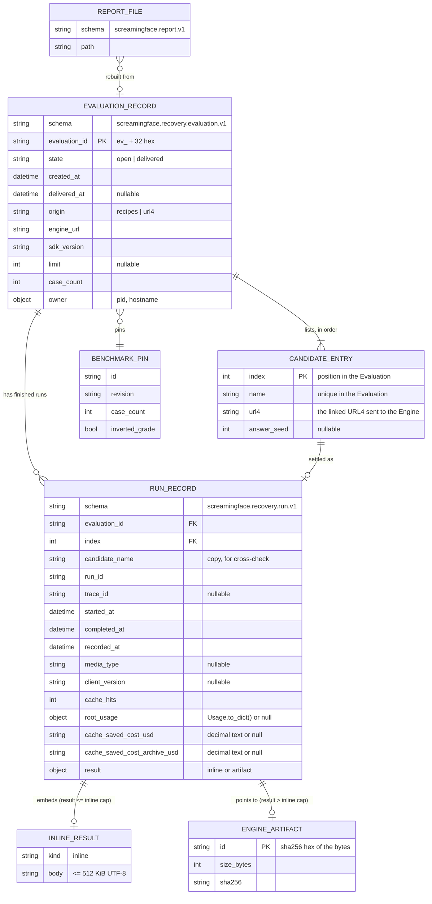

# ERD: recovery records, result artifacts, and the report file

**Ticket:** OME-1448 · **Epic:** OME-1294 (E5) · **Status:** spec, not approved

This document models the data that a finished evaluation leaves behind. It covers the new
recovery store on the researcher's disk, the existing Engine result artifact, and the existing
`report.json` file. The PRDs refer to the entities here by name.

All paths below use `<data_dir>`. `<data_dir>` is `SCREAMINGFACE_DATA_DIR`, or
`~/.screamingface` when that variable is not set
`[existing packages/screamingface/src/screamingface/_runtime/config.py:12]`.

## 1. Diagram



## 2. Store: the recovery store (new, planned)

### 2.1 Layout

```
<data_dir>/runs/                                   # mode 0700
  <evaluation_id>/                                 # mode 0700, one directory per Evaluation
    evaluation.json                                # EVALUATION_RECORD, mode 0600
    runs/<index>.json                              # RUN_RECORD, one per settled Candidate, mode 0600
    tmp/                                           # staging for recover-to-file, empty at rest
```

- The store is a directory of JSON files. It has no database. `[proposed]`
- One directory holds one Evaluation. When the SDK removes an Evaluation, it renames the
  directory to `.<evaluation_id>.trash-<uuid>` and then deletes it. A reader never sees half a
  removal. `[proposed — gap §per-connection/data]`
- Each RUN_RECORD is its own file. The thread that ran that Candidate is its only writer. Up to
  8 Candidates settle at the same time `[existing packages/screamingface/src/screamingface/_evaluation/runner.py:58]`,
  so one shared file would need a lock. Separate files need none. `[proposed — gap §per-element/store]`
- The runner thread is the only writer of `evaluation.json`. `[proposed]`
- Every write goes to a temporary file in the same directory, then `fsync`, then `os.replace`.
  This is the pattern that `FilesystemArtifactStore` uses
  `[existing apps/screamingface-engine/src/screamingface_engine/artifacts/filesystem.py:51]`.
  A crash leaves the old file or the new file, never a torn file. `[proposed]`
- Directories are `0700` and files are `0600`. A record holds the recipe URL4 and an artifact
  id. Any valid capability token can fetch any artifact id
  `[existing apps/screamingface-engine/src/screamingface_engine/rest/artifacts.py:97]`, so the id
  acts like a secret. This is the same rule as the runtime log
  `[existing packages/screamingface/src/screamingface/_runtime/runtime_logging.py:20]`. `[proposed — gap §cross-cutting/security]`

### 2.2 EVALUATION_RECORD (`evaluation.json`)

**Purpose.** It describes one call of `sf.evaluate` well enough to rebuild its `Report` without
the Recipes, without the Benchmark resource, and without the process that started it.
`[stated ans:Q3]`

**Key.** `evaluation_id`, which the SDK creates when the Evaluation opens. The format is `ev_`
plus 32 lowercase hex characters (uuid4). The pattern `^ev_[0-9a-f]{32}$` is also the
path-traversal guard. `[proposed]`

| Attribute | Type | Source | Notes |
|---|---|---|---|
| `schema` | text | `[proposed]` | `screamingface.recovery.evaluation.v1` |
| `evaluation_id` | text | `[proposed]` | key, see above |
| `state` | `open` \| `delivered` | `[stated ans:Q10]` | see §2.4 |
| `created_at` | UTC ISO-8601 | `[proposed]` | when the record opened |
| `delivered_at` | UTC ISO-8601 or null | `[stated ans:Q10]`, `[stated ans:Q13]` | starts the 7-day prune clock; set again by each successful recover |
| `origin` | `recipes` \| `url4` | `[implied]` | which `evaluate` path opened it |
| `engine_url` | text | `[implied]` | the origin the runs used; recovery uses this origin, never the current default |
| `sdk_version` | text | `[proposed]` | the SDK that wrote the record |
| `owner` | `{pid: int, hostname: text}` | `[proposed — gap §per-flow/concurrent]` | tells a live Evaluation from a crashed one |
| `benchmark` | BENCHMARK_PIN or null | `[implied]` | `BenchmarkInfo` fields `[existing packages/screamingface/src/screamingface/discovery.py:236]`; null when `origin` is `url4`, because a replay learns its Benchmark from the result body `[existing packages/screamingface/src/screamingface/_evaluation/results.py:91]` |
| `case_count` | int or null | `[implied]` | the selected Case count; null when `origin` is `url4` |
| `limit` | int or null | `[implied]` | the caller's `limit` |
| `candidates` | list of CANDIDATE_ENTRY | `[implied]` | in Evaluation order |

**Invariants.**
1. `candidates` is not empty. Each `name` is unique, and each `index` equals its list position. `[implied]`
   For `origin: url4`, `candidates` has exactly one entry, and `benchmark` and `case_count` are
   null. For `origin: recipes`, both are set. `[implied]`
2. The record never holds a credential, a capability token, or a result body. `[proposed]`
3. The file is at most 2 MiB. A reader refuses a larger file. `[proposed — gap §cross-cutting/security]`

### 2.3 CANDIDATE_ENTRY

**Purpose.** It holds what the Report needs about a Candidate that the result body does not
contain. The ticket's hand recovery shows that the artifact never names the Candidate and never
carries the recipe (OME-1448 "What the recovered report.json has and lacks"). `[stated prompt]`

| Attribute | Source | Notes |
|---|---|---|
| `index` | `[proposed]` | position in the Evaluation |
| `name` | `[implied]` | `Candidate.name` `[existing packages/screamingface/src/screamingface/_evaluation/model.py:41]` |
| `url4` | `[implied]` | `Candidate.url4`, the linked URL4 that the transport sends |
| `answer_seed` | `[implied]` | `Candidate.answer_seed` (OME-1193) |

**Why only four fields.** The Report reads `name`, `kind`, `models`, `url4`, `operations`,
`members` and `answer_seed` from a Candidate
`[existing packages/screamingface/src/screamingface/_evaluation/results.py:122]`.
`_candidate_from_url4` rebuilds `kind`, `models`, `operations` and `members` from the linked URL4
`[existing packages/screamingface/src/screamingface/_evaluation/url4.py:109]`. The Report does not
read `parameter_assignments`. Only preflight reads it
`[existing packages/screamingface/src/screamingface/_evaluation/model_parameters.py:124]`. So the
record stores `name` and `answer_seed`, and the SDK rebuilds the rest. Test RE-1 pins this
equality for every Candidate kind. If RE-1 fails for a kind, the record must store that
projection explicitly. `[proposed]`

### 2.4 State machine (EVALUATION_RECORD)

The two stored states are `open` and `delivered`. The SDK derives three views from an `open`
record:

- `in_progress`: the owner pid is alive on this host.
- `recoverable`: the owner is not alive, and at least one RUN_RECORD exists.
- `empty`: the owner is not alive, and no RUN_RECORD exists.

| State / view | Event | Next | Source |
|---|---|---|---|
| (none) | Evaluation opens (after preflight) | `open` | `[proposed]` |
| `open` | a Candidate settles with `succeeded` | `open` (+1 RUN_RECORD) | `[stated prompt]` option A |
| `open` | `sf.evaluate` returns a Report, or raises `candidates_failed` with a partial Report | `delivered` | `[stated ans:Q10]` |
| `open` | the owner aborts (Ctrl-C, stop sweep) | `open` (unchanged) | `[proposed]` |
| `open`/`in_progress` | `sf.recover` | no change; recovery reads the finished runs only | `[proposed — gap §per-flow/concurrent]` |
| `recoverable` | `sf.recover` succeeds (complete or partial Report handed over) | `delivered`, `delivered_at` = now | `[stated ans:Q13]` |
| `delivered` | `sf.recover` succeeds | `delivered`, `delivered_at` = now (the 7-day clock restarts) | `[stated ans:Q13]` |
| any | `sf.recover` gets 404 for every artifact-backed run | deleted, after the error names the age | `[stated ans:Q4]`, `[stated ans:Q8]` |
| any | `sf.recover` gets 404 for some artifact-backed runs | no change | `[proposed]` |
| `delivered` | scan finds `delivered_at` + 7 days < now | deleted | `[stated ans:Q10]` |
| `empty` | scan | deleted | `[proposed]` |
| `delivered` | a Candidate settles | rejected (cannot happen; it is logged and ignored) | `[implied]` |
| unknown `schema` | any scan or prune | no change; never deleted | `[proposed — gap §per-element/store]` |

### 2.5 RUN_RECORD (`runs/<index>.json`)

**Purpose.** It holds the root outcome of one finished run, without the result body when the
Engine spilled the result. It is the serialized `_RunOutcome`
`[existing packages/screamingface/src/screamingface/_core/ports.py:34]` with its `artifact`
ticket still unredeemed. `[implied]`

**Key.** `(evaluation_id, index)`. The file name is the index. `[proposed]`

| Attribute | Source | Notes |
|---|---|---|
| `run_id`, `started_at`, `completed_at`, `media_type` | `[existing packages/screamingface/src/screamingface/_core/ports.py:43]` | from the terminal frame |
| `trace_id` | `[existing packages/screamingface/src/screamingface/_core/ports.py:62]` | the client-minted id (OME-967) |
| `client_version`, `cache_hits` | `[existing packages/screamingface/src/screamingface/_core/ports.py:63]` | `cache_hits` came with OME-1441 |
| `root_usage` | `[existing packages/screamingface/src/screamingface/_core/ports.py:48]` | `Usage.to_dict()` shape, or null |
| `cache_saved_cost_usd`, `cache_saved_cost_archive_usd` | `[existing packages/screamingface/src/screamingface/_core/ports.py:56]` | decimal as text, to keep exact values; null is not zero |
| `result` | `[implied]` | `{"kind":"inline","body":…}` or `{"kind":"artifact","id":…,"size_bytes":…,"sha256":…}` |
| `recorded_at` | `[proposed]` | write time; used for "expired" age messages |

**Invariants.**
1. Exactly one of the inline body or the artifact ticket is present. This mirrors
   `_RunOutcome`. `[existing packages/screamingface/src/screamingface/_core/ports.py:37]`
2. The SDK writes the record **before** it redeems the artifact. The redemption is where the
   memory peak starts. `[stated prompt]`, `[implied]`
3. Only a `succeeded` terminal writes a record. A missing record means "not finished", and the
   recovered Report names that Candidate as failed. `[stated ans:Q7]`
4. An inline body is at most the Engine inline cap, 512 KiB by default
   `[existing apps/screamingface-engine/src/screamingface_engine/job_env.py:430]`. The reader caps
   the file at 2 MiB. `[proposed]`

### 2.6 Consistency with the Engine store

The Engine artifact store is the source of truth for result bytes. The recovery store holds only
pointers and metadata. `[stated ans:Q6]` The two stores have no shared transaction. They can
diverge in one way only: the Engine deletes the bytes and the pointer stays. The SDK detects this
with a 404 on redemption and reports `result_expired` with the age, measured from `completed_at`.
`[stated ans:Q8]`

## 3. Store: the Engine result artifact (existing, unchanged)

- Content-addressed. The id is the sha256 hex of the bytes
  `[existing packages/url4/src/url4/streaming/protocol/signals.py:174]`.
- A fetch never deletes it. Dedup re-stamps its mtime
  `[existing apps/screamingface-engine/src/screamingface_engine/artifacts/filesystem.py:64]`.
- Local retention: 48 h TTL, swept at App start and every hour
  `[existing apps/screamingface-engine/src/screamingface_engine/config.py:124]`.
- Hosted retention: a bucket lifecycle rule only. The S3 `sweep` does nothing on purpose
  `[existing apps/screamingface-engine/src/screamingface_engine/artifacts/s3.py:18]`. This work
  does not change hosted retention. `[stated ans:Q8]`
- **Delta (local only):** `screamingface up` moves the local store from
  `$TMPDIR/screamingface-engine/artifacts`
  `[existing apps/screamingface-engine/src/screamingface_engine/job_env.py:370]` to
  `<data_dir>/artifacts`, so a reboot does not delete it. The 48 h TTL does not change.
  `[stated ans:Q1]` See `prd/local-durable-artifacts.md`.

## 4. File: `report.json` (existing, bytes unchanged)

- The bytes are `json.dumps(report.to_dict(), ensure_ascii=False, separators=(",", ":"))`,
  encoded as UTF-8 `[existing packages/screamingface/src/screamingface/report.py:464]`.
- Top-level key order: `schema`, `started_at`, `completed_at`, `benchmark`, `candidates`,
  `usage` `[existing packages/screamingface/src/screamingface/report.py:454]`. `usage` comes after
  `candidates`, so a streaming writer can compute it while it writes the Candidates. `[implied]`
- **Delta:** export and recover-to-file write the same bytes through one streaming writer,
  atomically (temporary file + `os.replace`). See `prd/report-json-writer.md`. `[stated ans:Q1]`, `[stated ans:Q9]`

## 5. Migrations and versioning

1. Both record types carry `schema` with a `.v1` suffix. A reader accepts only the versions it
   knows. `[proposed]`
2. An unknown version is never deleted and never pruned, because a newer SDK may own it. `recover`
   refuses it with `recovery_record_unsupported` and names the version. `[proposed]`
3. A new optional field is a minor change: readers ignore unknown keys in `v1`. A changed meaning
   or a removed field needs `v2`, and the reader keeps a `v1` decoder for at least one minor SDK
   release. `[proposed]`
4. The first release creates `<data_dir>/runs/` on first use. Data from before this release does
   not exist, so no backfill is needed. `[implied]`
5. Moving the local artifact folder leaves old files in `$TMPDIR`. The OS cleans that folder. No
   migration is needed, because no record points at the old files. `[implied]`
