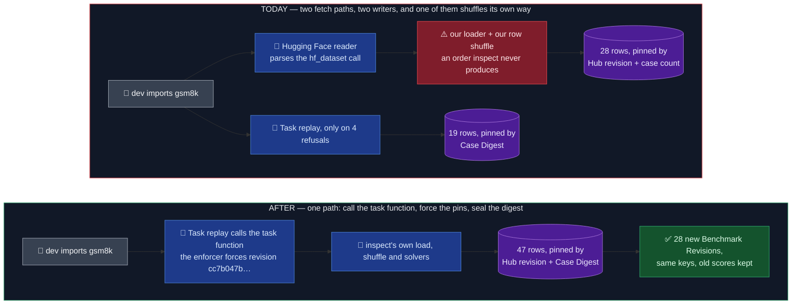
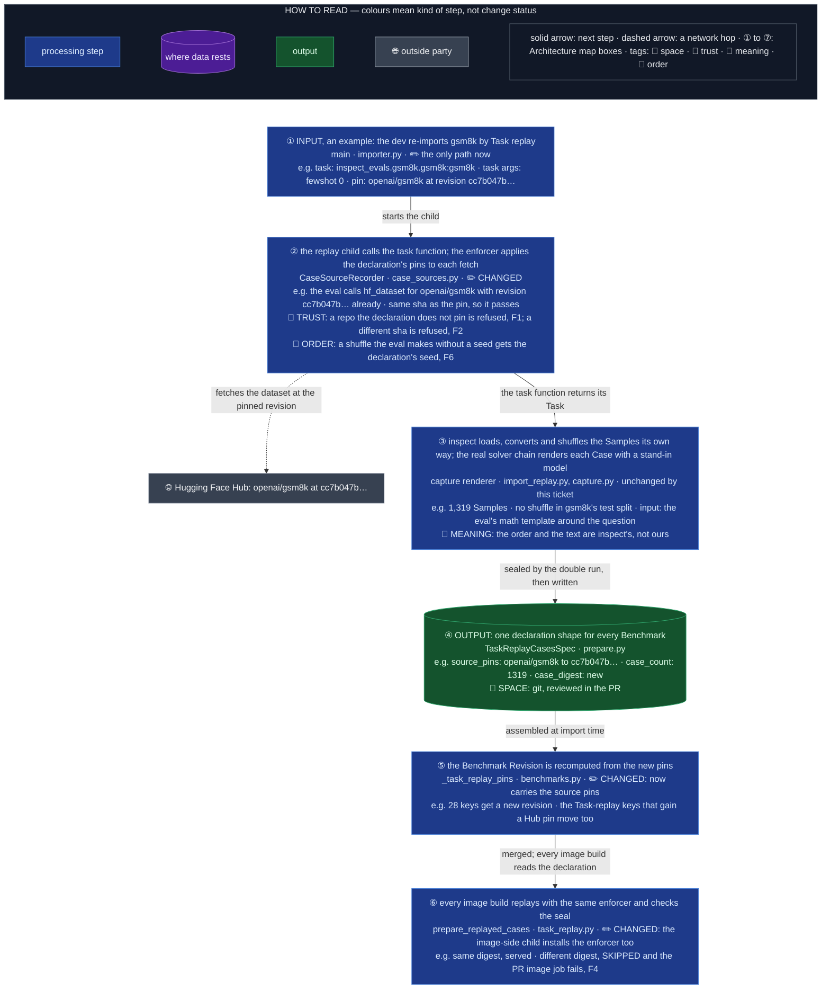
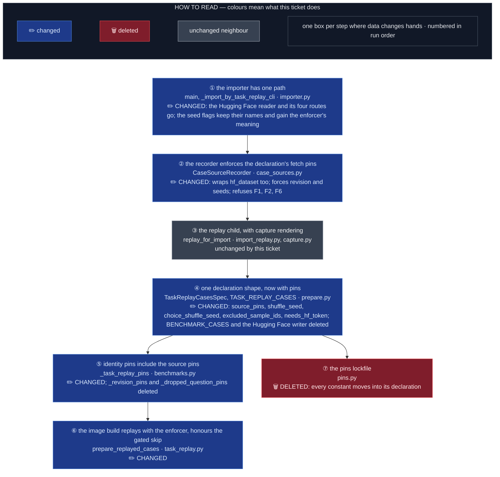

# Spec — prepare every Imported Benchmark's Cases by calling the eval's own task function

- Status: approved (merged as #1223, 2026-10-05). Amended 2026-10-06 by PR 2 from the Task 0
  sweep: the fold moves **30** rows, not 28 (coconot's two rows came with OME-1371 after this
  was written); R12's mmlu and hellaswag cells and R14's licences are corrected in place.
  Counts of 28 elsewhere in this document are as written on 2026-10-02.
- Component: `apps/screamingface-engine` (`screamingface_engine_inspect`).
- Ticket: [OME-1460](https://linear.app/openmined/issue/OME-1460/prepare-every-imported-benchmarks-cases-by-calling-the-evals-own-task),
  sub-issue of OME-1273 (Task replay). Parent epic: OME-1299.
- Ledger: `docs/work/2026-10-02-ome-1460-one-fetch-path-spec.md`. Plan:
  `docs/plan/2026-10-02-OME-1460-one-fetch-path.md`.
- Pinned to: `inspect-ai` 0.3.263, `inspect-evals` 0.20.0, `datasets` 5.0.0, main
  `ec11a0608` (2026-10-02: capture rendering #1219, the import side #1191 and the 19
  Task-replay Benchmarks #1220 and #1221 are merged).
- Parent spec: `docs/spec/2026-09-30-OME-1273-task-replay-import.md` (its R-numbers are
  cited as "parent R3"). Architecture page:
  `apps/screamingface-engine/docs/importing-an-inspect-eval.md`, whose §4 ("The fetch
  seam: one path") is the picture this spec realises.

## TLDR

An **Imported Benchmark** is an inspect eval copied into ScreamingFace. **Case Preparation**
is the image-build step that fetches its Cases and freezes them into the Engine's image.
Today there are two ways to fetch. The **Hugging Face path** reads the eval's `hf_dataset`
call off the task file and loads that dataset itself, at a Hub revision we pin, then
imitates the eval's prompt from template fields on the row. **Task replay** calls the eval's
own task function in a clean child, lets inspect load and shuffle the dataset, runs the
eval's own solvers up to their first model call and takes the prompt they built (capture),
and seals the result with a **Case Digest** that every image build re-checks. 28 rows of
`BENCHMARK_CASES` use the first path (the ticket says 27: it counts xstest's two rows as
one) and 19 use the second.

The rule that must hold: **a Benchmark's Cases are what inspect would send, fetched from a
pinned Case Source, and the same at every build.**

Where two paths hurt:

- every fix lands twice or drifts: the row shuffle, the choice shuffle, the system message
  and the question filter each exist once per path, and only the Hugging Face path has them;
- the Hugging Face path's row shuffle is our own (`random.Random`), not inspect's, so 18
  Benchmarks serve their Cases in an order inspect never produces;
- a new eval's shape is first judged by a reader that parses source text, and four of its
  refusals exist only to hand over to the other path.

What the reading of `main` adds to the ticket: every one of the 19 evals behind the 28 rows
already passes a 40-hex Hub revision to `hf_dataset`, equal to our pin, so the "forced
revision" mostly **verifies** (F2) and only bites a Task-replay row that fetches from the Hub
with no pin (F1); 14 of the 18 shuffled rows shuffle **unseeded** upstream, and lab_bench's
six task functions take no argument, so the double run would refuse them unless the
declaration's seed is forced through inspect's own shuffle (D1); two rows (musr, xstest)
send a system message today's rows deliberately do not bake, so capture changes their text
(D3); two rows (gsm8k, winogrande) build a few-shot system message unless their task arg
says 0 (D2); onet_m6's six excluded ids and xstest's gated fetch have no Task-replay home yet
(R6, R8, R9).

The change: every Imported Benchmark is prepared by Task replay with capture. The child
installs a **fetch-pin enforcer**: the recorder also wraps `hf_dataset`, forces the
declaration's Hub revision onto each fetch (refusing a repo the declaration does not pin, or
one the eval pins differently) and forces the declaration's seed onto a shuffle the eval
makes without one, so the order is one inspect produces and the same at every build. The
Hugging Face reader, its registry and its writer are deleted. **Every one of the 28 moved
rows gets a new Benchmark Revision under its existing key**, and so do the Task-replay rows
that gain a Hub pin (D4). The owner accepted the move (2026-10-02): no real users run these
Benchmarks yet. No Benchmark key changes.

## Before / After

For a researcher, the shuffled Benchmarks now ask their Cases in an order inspect's own
shuffle produces. For the next dev importing an eval, there is one command and one
declaration shape, and no reader to extend when the eval loads its data in a new way.
(47 rows: 28 moved plus 19 already on Task replay; step 7 of OME-1273 adds more
concurrently, see Delivery.)

### Don't regress

- The Case Digest is taken twice at import and checked at every image build, exactly as for
  the 19 Task-replay Benchmarks today (parent R5, R9, R10).
- `test_published_revisions.py` keeps its job: its 18 literals move in the fold PR on
  purpose, one diff line each, and freeze again. `test_inverted_grade.py` pins gsm8k's
  revision a second time and moves with it.
- Every grading test keeps running with outbound network blocked; the fold gives the 28
  moved Benchmarks the `no_network` grading test the 19 already have (R15).
- lab_bench's answer stays shuffled: its `record_to_sample` puts the ideal answer first, so
  an unshuffled sitting would grade "A" on every Case (R3, D1).

## Architecture / Design

**How to read this section.**

- **Numbers:** ① to ⑦ are the Architecture map's boxes; the Data Flow reuses them. F1 to
  F7 are the rows of the Failure-modes table.
- **Order:** Data Flow first, following gsm8k from the dev's command to a served Case
  (*how*). Then Failure modes (*what breaks*, and who notices). Then the Architecture map
  (*where*: which files, changed or deleted), kept open beside the plan's review focus.
- **Method:** read each diagram's HOW TO READ key, then follow the numbers top to bottom; a
  box's number says which Architecture box (and file) runs it.

### Data Flow

### Failure modes

| # | Fault | Where | Who notices | Outcome |
| -- | -- | -- | -- | -- |
| F1 | the eval fetches a Hub repo the declaration has no pin for | dev machine, at import; image build, for a row imported before this ticket | the dev; the PR image job | refused by name; the import prints the repo so the dev adds its pin. A pre-existing Task-replay row that fetches from the Hub unpinned (medqa, bbq, piqa) is re-imported with its pin in the fold (D4), so no build ever sees this |
| F2 | the eval already passes its own `revision`, a different 40-hex sha from the declaration's | dev machine, at import | the dev | refused: the eval's pin wins, and the declaration must match it. A branch or tag name the eval passes is replaced by the pin, because only a sha is Benchmark identity |
| F3 | upstream moves the dataset's default branch | nowhere | nobody | nothing changes: the forced revision fetches the same commit as before, at import and at every build |
| F4 | inspect or `datasets` changes how it converts or shuffles rows (a dependency bump) | the bump PR's image job | CI | the Case Digest differs, the Benchmark goes SKIPPED, the bump PR fails until the row is re-imported |
| F5 | a moved Benchmark's Cases differ from today's beyond the expected shuffle order | the fold PR | the reviewer | each of the 28 ships a one-line "what changed" note from the task 0 sweep; an unexplained text change blocks the PR |
| F6 | the eval shuffles rows or choices with no seed, and the declaration carries none | dev machine, at import | the dev | refused by name before the double run: the enforcer names the call and the missing seed, so a nondeterministic order never reaches the digest |
| F7 | a gated dataset (xstest) is built with no Hugging Face token | PR image job (no secret) | the build log | skipped with the existing gated-dataset reason, no `unconfirmed_cases` key, so the strict job stays green; a main or release build without the token still refuses by name |

### Architecture

- ② The pins are forced by the recorder, not written into the eval, because we never edit
  inspect_evals: the child replaces a missing or non-sha `revision` with the pin and refuses
  a different sha (F2); it replaces a missing `seed` on a `shuffle=True` call, and a bare
  `shuffle_choices=True`, with the declaration's seeds (F6).
- ② The pin is forced, not merely recorded, because a digest alone turns upstream drift into
  a dark Benchmark instead of preventing it (F3). On the 28 rows the force is a no-op today
  (every eval already passes the same sha); it is the guarantee that holds when a future
  inspect_evals bump drops or moves a pin.
- ② The seed is forced through inspect's own `hf_dataset` shuffle (HF `Dataset.shuffle`,
  `MemoryDataset.shuffle_choices`) and never through our `random.Random`, because an
  unseeded upstream shuffle has no canonical inspect order: any seeded sitting of inspect's
  own algorithm is one inspect produces, and ours was not.
- ② The enforcer wraps `hf_dataset` by identity (the real function and inspect_evals'
  pass-through shim), because `revision` and `seed` are `hf_dataset` arguments: a wrap at
  `datasets.load_dataset` sees the revision but never the shuffle.
- ④ The pins live on the declaration as data, not only as comments, because the child needs
  to read them, and the Case Digest then seals what they produced.
- ⑤ The source pins join the identity pins, because two declarations with the same task
  and digest but different Hub revisions are different Benchmarks (ticket). The seeds and
  the excluded ids need no pin of their own: the digest seals the order and the kept ids.
- ⑥ The image-side child installs the same enforcer, because F3 is a promise about every
  build, not only about import: a build that let the eval fetch unforced would re-fetch at
  whatever the eval names.
- ⑦ `pins.py` goes, because a lockfile that pins nothing the build reads is a second home for
  facts the declaration now carries; the Task-replay rows already carry theirs inline.

## Known limitations of this design

- **28 Benchmark Revisions move at once, plus every Task-replay row that gains a Hub pin
  (D4: medqa, bbq, piqa; task 0 lists them exactly).** Every existing score stays on its old
  revision; the leaderboard ranks per revision, so a key's new cohort starts empty. Accepted
  by the owner (2026-10-02): no real users run these yet, and the move happens once.
- **17 shuffled Benchmarks change Case order, and 14 of them keep a seed of ours.** Only
  mmlu takes inspect's own seed (`seed=42` upstream). 14 rows shuffle unseeded upstream, so
  the declaration's seed is forced through inspect's algorithm (D1): the order is one inspect
  can produce, not one it reproduces without our seed. Case ids renumber for all 17.
  Accepted: inspect itself gives these rows a different order every sitting.
- **Three rows lose their shuffle (aime24, aime25, hellaswag).** Their evals never shuffle;
  our seed was policy. Under Task replay they serve the Hub's order (hellaswag's split is
  domain-grouped, so a `limit=N` run sees one domain). Accepted: the enforcer seeds a
  shuffle the eval makes and never adds one; a sampled `limit` is a run-time concern, to
  revisit when a researcher runs a truncated hellaswag.
- **Two rows gain leading system text (musr, xstest).** Capture renders what the eval
  sends; today's rows left those generic messages out on purpose. xstest's Judge then sees
  the system text inside `{question}`. Accepted (D3): the real chain is the rule; the
  what-changed note names it.
- **A Hub dataset whose loader script fetches other URLs still has unpinned sources**
  (piqa). The Case Digest stays their only pin, as today.
- **Forcing covers `hf_dataset`, `datasets.load_dataset`, `snapshot_download` and
  `hf_hub_download`; a Hub file fetched through a raw URL is pinned by the commit in its URL
  or not at all**, as today (sevenllm).
- **The fold re-downloads 28 datasets on the importing machine, twice each.** Minutes, once.
  xstest's two rows need `HF_TOKEN` on that machine.
- **The licence gate now reaches the moved rows.** Six rows carry no cleared licence today
  (gsm8k and mmlu have none recorded; winogrande and hellaswag say UNKNOWN; paws and race_h
  say "other"), so their declarations are written `license="TODO"` and the owner decides
  each before the PR merges (parent R7, D13).
- **Every count here is pinned to inspect_evals 0.20.0.** A version bump means re-running
  task 0's sweep before trusting any number.

## Decisions this spec takes (the owner can flip any before coding starts)

| # | Decision | Why | Flip means |
| -- | -- | -- | -- |
| D1 | **An unseeded upstream shuffle is pinned by a seed on the declaration, forced through inspect's own shuffle by the enforcer** (`shuffle_seed` for rows, `choice_shuffle_seed` for choices; today's seed values are reused) | the parent plan's D6 ("a declared task arg, never a seed we add in code") cannot cover lab_bench: its six task functions take no argument, its `record_to_sample` puts the answer first, and `shuffle_choices=False` would grade "A" everywhere; one mechanism then covers all 14 rows, and the shuffle stays inspect's | `shuffle=False` task args where the task exposes one (13 rows serve the Hub's grouped order) and lab_bench stays refused until upstream adds task args |
| D2 | **gsm8k and winogrande are imported with `fewshot=0`** (a declared task arg, as today's rows were) | today's rows carry no few-shot system message; this ticket changes the fetch path, not the sitting; the ticket's table says their text is identical | the defaults (10 and 5 worked examples as a system message): a second text change on the same PR, and a different paper comparison |
| D3 | **Capture's rendering wins over today's omissions**: musr's and xstest's system messages become leading text | the rule is "what inspect sends"; capture runs the real chain and a per-row exemption is a second writer | keep the omission: a solver-level exemption on the declaration, which is the knob this ticket deletes |
| D4 | **Task-replay rows that fetch from the Hub with no pin are re-imported with one in the fold**, so F1 has no exemption | otherwise "one path" is false for them and their builds fetch HEAD; their revisions are not frozen and no user runs them | leave them unpinned and exempt them from F1 by name |
| D5 | **Two PRs, not three or four**: the enforcer alone, then the fold and the deletion together (owner's call, 2026-10-05) | the mechanism/data seam is where review attention differs; the fold is mechanical (28 declarations plus a red diff) and needs one owner press and one rebase on step 7, so the ~500-line cap is waived for it | four stacked PRs (28 rows split 14/14 by forced seed, the deletion on its own) |
| D6 | **`excluded_sample_ids` and `needs_hf_token` move to `TaskReplayCasesSpec` with their spelling and semantics unchanged** | onet_m6 and xstest need them on day one; the refusal rules exist and are tested | drop onet_m6's deviation (six ungradable Cases return and the import refuses by name) |
| D7 | **The seed flags keep their names** (`--shuffle-seed`, `--choice-shuffle-seed`) and mean "the seed the enforcer forces"; the Task-replay refusal of them goes | the dev's command stays the one the how-to shows | new flag names |
| D8 | **`pins.py` is deleted** with the Hugging Face path; the moved rows carry their facts inline like the 19 do | one home per fact; the Task-replay row shape already proved it | keep `pins.py` for the source pins only |

## Requirements

### The enforcer: the declaration's pins reach the eval's fetches

- **R1. Wrap `hf_dataset` too.** The recorder wraps `inspect_ai.dataset.hf_dataset` and
  `inspect_evals.utils.huggingface.hf_dataset` (the pass-through shim) by identity, as it
  wraps every primitive (parent R3), so a task module that bound either name at import
  still goes through the wrap. It records nothing new: the recorded Case Source stays the
  `datasets.load_dataset` call `hf_dataset` makes.
- **R2. Revision.** On every wrapped Hub fetch (`hf_dataset`, `datasets.load_dataset`,
  `huggingface_hub.snapshot_download`, `hf_hub_download`), the enforcer looks the repo id up
  in the declaration's `source_pins`: no pin → refused by name with the repo id (F1); the
  eval's `revision` absent or not a 40-hex sha → replaced by the pin; a different 40-hex sha
  → refused, naming both (F2). A branch or tag the eval passes is resolved to a sha at import
  by the existing Hub lookup and recorded as the pin; the enforcer never resolves at build.
- **R3. Seeds.** On a wrapped `hf_dataset` call with `shuffle=True` and no `seed`, the
  enforcer passes the declaration's `shuffle_seed`; with `shuffle_choices=True` (a bare
  bool), it passes the declaration's `choice_shuffle_seed` as the int seed `hf_dataset`
  accepts. A seeded call is left alone. A shuffle with no seed on the declaration is refused
  by name before the double run (F6). The enforcer never adds a shuffle the eval does not
  make (D1).
- **R4. Both children.** The import child and the image-side child install the enforcer
  before calling the task function; only the import child records. A build that could fetch
  unforced would break F3.
- **R5. The seal covers the enforced result.** The Case Digest is taken over the Cases the
  enforced run produced, twice at import and once at every build, exactly as today (parent
  R5, R9, R10). No new digest input.

### The declaration

- **R6. `TaskReplayCasesSpec` gains:** `source_pins: dict[str, str]` (Hub repo id → 40-hex
  sha, one entry per Hub Case Source, written by the importer from the recorded Case
  Sources); `shuffle_seed: int | None` and `choice_shuffle_seed: int | None` (R3);
  `excluded_sample_ids: tuple[str, ...] | None` (R9); `needs_hf_token: bool` (R8). The
  existing `task`, `task_args`, `case_count`, `case_digest`, `keep_sample_metadata`,
  `has_answer_key` and `license` stay as they are.
- **R7. Identity pins.** `_task_replay_pins` adds one `source_pins=` pin (sorted, JSON) when
  the mapping is non-empty. Seeds and excluded ids add no pin: the digest seals the order and
  the kept Cases (⑤). A row with no Hub source keeps today's three pins, so the 16
  Task-replay rows with no Hub fetch keep their revisions byte for byte.
- **R8. Gated datasets on Task replay.** `prepare_replayed_cases` checks `needs_hf_token`
  before replaying, with the same rule as the Hugging Face path today: no token and no
  `SCREAMINGFACE_SKIP_BENCHMARKS_NEEDING_HF_TOKEN=1` → refused by name; the skip flag → the
  SKIPPED marker with the gated reason and **no** `unconfirmed_cases` key, so the strict PR
  image job stays green (F7). The replay environment keeps `HF_HOME` untouched, as today, so
  a cached login reaches the child.
- **R9. Named exclusion on Task replay.** After the task function returns, both children
  drop the Samples whose `str(id)` is in `excluded_sample_ids` and refuse an id that is not
  present, through the existing `_without_excluded_samples` rule. `case_count` is the kept
  count. onet_m6 keeps its six ids and its reason.

### Import

- **R10. One path.** The importer's Hugging Face reader (`read_inspect_task` and its
  readers), `read_hub_dataset_facts`, `write_generated_rows`, the four `TaskReplayRoute`
  refusals and `--task-replay` go; `main` always imports by Task replay. `--shuffle-seed` and
  `--choice-shuffle-seed` are forwarded to the declaration (D7); passing one for a call the
  eval already seeds is refused by name, so the row never promises a seed nothing applies.
  The generated declaration writes `source_pins` from the recorded Hub Case Sources and
  `needs_hf_token` from the Hub's `gated` flag, read at import as today.
- **R11. Licence.** Unchanged from parent R6, R7, D13: the one Hub card's cleared licence,
  else `license="TODO"` with the card's value in the note, refused by the gate until the
  owner decides.

### The 30 moved rows

- **R12. Each row's fate is declared before it is re-imported**, from task 0's sweep, and
  the fold PR carries it as a one-line note on the row (F5). Expected from reading
  inspect_evals 0.20.0 (the sweep confirms or corrects every cell):

  | Row shape today | Keys | Upstream call at 0.20.0 | Under Task replay |
  | -- | -- | -- | -- |
  | plain, no shuffle | arc_easy, arc_challenge, wmdp_bio, wmdp_chem, wmdp_cyber, pubmedqa | `hf_dataset` with the same sha; pubmedqa filters by its bundled id list | text and order identical |
  | plain, few-shot task | gsm8k, winogrande | `fewshot=10` and `fewshot=5` defaults build a seeded few-shot system message | `fewshot=0` task arg (D2): text identical |
  | our row shuffle, upstream seeded | mmlu | `shuffle=True, seed=42`, then `filter_duplicate_ids` | inspect's seeded order replaces ours; text identical; **sweep: 105 duplicate questions dropped** (14,042 → 13,937), as inspect itself does |
  | our row shuffle, upstream unseeded | commonsense_qa, paws, boolq, mmlu_pro, race_h, frontierscience, onet_m6 | `shuffle=True`, no seed | our seed forced through inspect's shuffle (D1): order changes, text identical; onet_m6 keeps its system text, filter and six exclusions |
  | our row shuffle, upstream unseeded, system text unbaked | musr | `shuffle=True`, no seed; `system_message(SYSTEM_PROMPT)` | order changes and the text gains the leading system message (D3) |
  | our row and choice shuffle | lab_bench ×6 | `shuffle=True` and `shuffle_choices=True`, no seeds, no task args | both seeds forced (D1): row and choice order change; the answer stays shuffled |
  | our row shuffle, no upstream shuffle | aime24, aime25, hellaswag | no shuffle (hellaswag `shuffle=False`) | the Hub's order: ours was policy; aime text identical; **sweep: every hellaswag Case gains the leading newline its `SYSTEM_MESSAGE` starts with** (today's row strips it) |
  | plain, judged, no answer key (added by OME-1371) | coconot_original, coconot_contrast | `hf_dataset` with a pinned sha; the subset is a task arg | `task_args` carry the subset; text identical |
  | question filter, gated, judged | xstest_safe, xstest_unsafe | filter by `subset`; `system_message("You are a helpful assistant.")` | `task_args` carry the subset; `needs_hf_token` (R8); text gains the leading system message (D3) |

  Counts: 28 rows; 18 carry our row seed today (14 forced, 1 inspect's, 3 dropped); 6 carry
  our choice seed (all forced); 2 bake a system message today (hellaswag, onet_m6, both
  identical under capture); 4 run a question filter (onet_m6, pubmedqa, xstest ×2); 1 has a
  named exclusion (onet_m6); 2 are gated (xstest ×2); 1 keeps Sample metadata
  (frontierscience, which parent D11 keeps on because its scorer is its own). Add coconot ×2
  (no seed, no filter, judged, no answer key) for 30. The sweep (PR 1 of 2's ledger) confirms
  every other cell; its frontierscience "ids differ" is an artifact of the sweep itself (the
  eval numbers repeated ids with a process-wide counter and the sweep built today's Samples
  twice in one process), not a change.
- **R13. The question filter proves the same Case ids.** For the four filter rows, task 0
  diffs today's prepared `cases.json` against the replayed one by Sample id: the kept id
  set must be identical (the filter is the eval's own in both paths), and the digest then
  seals it. xstest_unsafe's 200 and xstest_safe's 250 are the acceptance numbers.
- **R14. Licences carry over.** The rows with a cleared licence note in `pins.py` get it as
  `license=`. The six without one were decided by the owner on 2026-10-06: gsm8k and mmlu
  `mit` (their Hub cards say so; the old notes simply had no licence line); hellaswag `mit`
  (per rowanz/hellaswag, owner decision 2026-09-22); winogrande `cc-by-4.0` (allenai's README
  says CC-BY, no version); paws Google's own licence ("may be freely used for any purpose"),
  crediting Google LLC as the data source; race_h CMU's terms (non-commercial research only),
  crediting and linking the source page. The credits are written into each Benchmark's
  description, where a visitor reads them.
- **R15. No-network grading for every Imported Benchmark.** One parametrised test over
  every key in `TASK_REPLAY_CASES` runs the grading path with the `no_network` fixture, so
  the 28 moved rows get the guard the 19 already have (parent R16, R17), as one lane rather
  than 28 files.

### Revisions and tests

- **R16. Literal moves.** The 18 literals in `test_published_revisions.py` and the one in
  `test_inverted_grade.py` move in the fold PR, one diff line each, and freeze again. Both
  are prior tests, so the fold PR carries the owner's `--skip-append-only`, asked for by
  name. Whether the 10 unfrozen rows (lab_bench ×6, frontierscience, onet_m6, pubmedqa,
  xstest_unsafe) and the 19 Task-replay rows get frozen is the ticket's open question.
- **R17. Deletion.** In the fold PR, after the 28 rows land: `BENCHMARK_CASES`, `CasesSpec`, `prepare_cases`,
  `emit_cases`, `case_records`, `_pinned_samples`, `task_kept_samples`, `count_kept_cases`,
  `_shuffle_choices`, `_resolved_system_text`, `_prompt`, `templated_prompt`, `mcq_prompt`,
  `_load_rows`, `_available_hf_token` (moved, not deleted, to the gated check of R8),
  `_revision_pins`, `_dropped_question_pins`, `pins.py`, and the importer's reader (R10);
  their tests (`test_inspect_cases.py`, the reader half of `test_inspect_importer.py`) go
  with them, and the gsm8k, mmlu and frontierscience benchmark tests are re-pointed at
  their Task-replay declarations. `prepared_case`, `_validated_answer_key`,
  `_without_excluded_samples`, `_write_cases`, `case_digest` and `require_commit_sha` stay.

### Docs and glossary

- **R18. `CONTEXT.md`.** The **Task replay** entry drops "The importer uses it when it
  cannot read the Case Sources off the task file, and" and reads "The importer uses it for
  every Imported Benchmark, and Case Preparation uses it again at every image build,
  checking the Case Digest." **Case Source** and **Case Preparation** keep their wording
  (both already say "pinned"). No new term: the enforcer is a mechanism inside the recorder,
  not a glossary concept.
- **R19. `apps/screamingface-engine/docs/importing-an-inspect-eval.md`** flips, in the
  fold PR: the status key (lines 14–19: the 🔧 stack is ✅ on main); §1a `dataset` and
  `solver` status cells (✅ Task replay, capture on main; the Hugging Face path gone); §1b
  `sandbox` (refusal by name ✅); §2 the "load the Samples" and "build the prompt" rows and
  "sandboxes, tools, agents" (🔧 → ✅); §2 "Two fetch paths (§4) and two renderings (§3) are
  one job done twice during a transition … until OME-1460 deletes it" (past tense, one
  path); §3 "gsm8k's few-shot system message follows when OME-1460 moves it" (corrected:
  gsm8k is imported with `fewshot=0`, D2); §4's table loses its Hugging Face column and its
  "One path ⏳" column becomes the only path; §4 "The Hugging Face path is retired when
  OME-1460 lands" and "`main`'s 28 Benchmarks have no such test yet" (R15); §5 Now/Later
  rows (one path moves to Now). The how-to `adding-an-imported-benchmark.md` loses the
  Hugging Face-path command and `CasesSpec` mentions.

### Network

- **R20. Only Case Preparation has network access; Grading has none.** Unchanged from
  parent R16. The enforcer adds no network call at build (R2: no resolution at build).

## What Task replay runs, and what it never runs

| | What happens |
| -- | -- |
| **Runs** | The eval's `@task` function with the declaration's task args (`gsm8k(fewshot=0)`, `xstest(subset="unsafe")`), in a child with empty caches and the enforcer installed; to build its `Task` the function loads its dataset through inspect's own `hf_dataset`, at the forced revision and seeds. Then, per Sample, the Task's own `setup` and `solver` chain up to its first `generate`, which a stand-in answers with nothing (capture, parent R2). |
| **Taken** | `task.dataset`: the Samples after the eval's own filtering, shuffling and conversion, minus the declaration's excluded ids. Per Sample, the messages the solvers had built at their first `generate`: the Case's input. The Sample's target, choices and kept metadata: its Grading Material. |
| **Never runs** | inspect's `eval()`. Any model: the stand-in never calls one and the child names none (`INSPECT_EVAL_MODEL=none/none`). The scorer, every Judge, a sandbox, a tool. No API call is made and nothing is paid for, at import or at build. |

## Out of scope

- A sampled or shuffled `limit` at run time (the concern the dropped policy shuffles leave
  behind, Known limitations). Revisit when a researcher runs a truncated hellaswag or aime.
- Freezing the revisions of the 10 unfrozen rows and the 19 Task-replay rows (open
  question; a one-line change per row once decided).
- Few-shot sittings of gsm8k and winogrande (D2's flip).
- Pinning a loader script's own URL fetches (piqa), as in the parent spec.
- The step-7 packages of OME-1273 (sad, bbeh, cyberseceval_4, pre_flight, chembench): they
  land by their own PRs and are not re-imported here; see Delivery for the ordering.

## Delivery — two PRs

Blocked by nothing on `main` (capture rendering, the import side and the 19 Benchmarks are
merged). **Sequenced after OME-1273's step 7:** that work is being imported concurrently
(worktree `task-replay-benchmarks-3`, at `main` with no commits yet on 2026-10-02) and adds
rows at the same `TASK_REPLAY_CASES` and `BENCHMARKS` anchors this fold writes to, and its
Benchmarks join the R15 lane and the revision count. PR A touches none of those anchors and
may merge before step 7; PR B rebases onto step 7's merged rows and merges after.

1. **PR A, the enforcer and the declaration** (R1–R9): the `hf_dataset` wrap, forced
   revision and seeds, both children, the five declaration fields, the identity pin, the
   gated skip and the named exclusion on Task replay. Tested with the stand-in eval in
   `tests/unit/inspect/test_task_replay.py`'s pattern; no real Benchmark moves.
2. **PR B, the fold and the deletion** (R10, R12–R19): all 28 rows re-imported as
   Task-replay declarations with their literals moved and a what-changed note each (the 14
   that need no forced seed first, then the 14 with forced seeds, so the diff reads in two
   halves), the three Task-replay rows that gain a Hub pin (D4), then the Hugging Face
   reader, registry, writer and lockfile with their tests, the R15 lane, `CONTEXT.md` and
   the architecture page. One `--skip-append-only` press covers the 19 literal moves and the
   deleted test files. Large by line count, mostly deletions; D5 says why that is accepted.

Each PR's file list and RED-first tests are in the plan.

## Acceptance

1. `BENCHMARK_CASES`, `CasesSpec`, `pins.py` and the Hugging Face reader are gone; every
   Imported Benchmark key resolves to a `TaskReplayCasesSpec` (30 moved + 19 + step 7's).
2. All 30 moved rows carry `source_pins` naming the sha their eval pins at 0.20.0; the fold
   PRs show, per row, that the Cases' text is identical to today's or name the difference
   from R12 (order only; the system text of musr and xstest). (R12, F5)
3. All 19 revision-literal sites move (18 in `test_published_revisions.py`, 1 in
   `test_inverted_grade.py`), each a one-line diff, and both tests pass; the 16 Task-replay
   rows with no Hub fetch keep their revisions byte for byte. (R7, R16)
4. A Hub fetch with no pin in the declaration is refused at import, a different sha is
   refused, a branch name is replaced by the pin, and a test pins each. (R2, F1, F2)
5. Every Imported Benchmark's grading test passes with outbound network blocked, through
   one parametrised lane. (R15)
6. A `shuffle=True` call with no seed gets the declaration's seed and the two replays
   agree; without a seed on the declaration the import is refused by name; a test pins each
   with the stand-in eval. lab_bench's six rows import with both seeds forced and no Case
   has its answer at a fixed letter across the row. (R3, F6, D1)
7. For onet_m6, pubmedqa, xstest_safe and xstest_unsafe the set of Sample ids kept under
   Task replay equals today's (R13); onet_m6 still drops its six ids (R9); xstest's PR
   build skips with the gated reason and the strict job stays green (R8, F7).
8. gsm8k's and winogrande's Case text is byte-identical to today's at `fewshot=0` (D2).
9. The owner approves this spec before the first line of code.

## Open questions

- **Leaderboard view of a key with two revisions**: only the latest cohort, or both
  (ticket). Decides whether the move is visible to visitors on day one.
- **Freeze the 10 unfrozen rows and the 19 Task-replay rows in
  `test_published_revisions.py`?** They are served on main but not frozen (ticket). The
  fold PR is the natural moment: one line per row.
- **D1 vs the parent plan's D6.** D6 said "a declared task arg, never a seed we add in
  code"; lab_bench makes that impossible. Confirm the forced seed through inspect's own
  shuffle, or the flip (13 rows at `shuffle=False`, lab_bench refused).
- **D2 (few-shot off)** and **D3 (system text in)** change what a paper comparison means for
  gsm8k, winogrande, musr and xstest; confirm before PR B.
- **Licences for the six rows without a cleared one** (gsm8k, mmlu, winogrande, hellaswag,
  paws, race_h): the owner's decision lands in PR B, all six.
