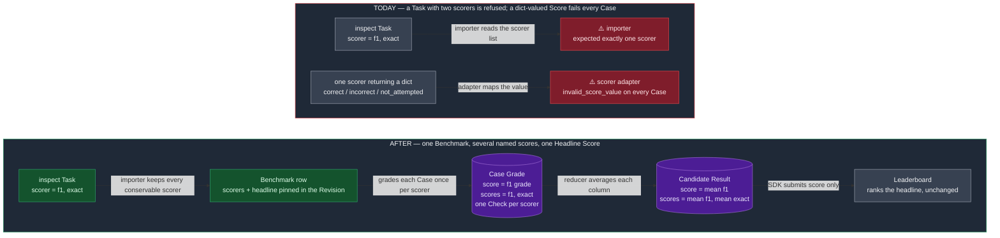
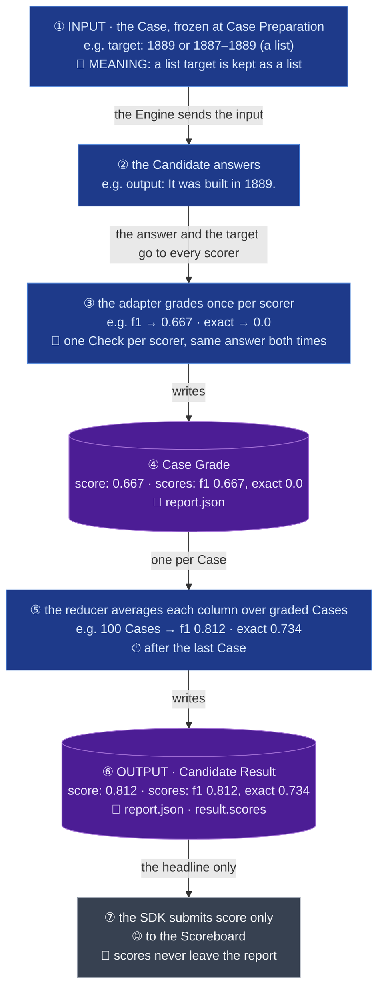

# Spec — one Benchmark, several named scores, one Headline Score (MATH and SQuAD first)

- Status: draft for owner approval (design decisions 1–8 settled on OME-1268, owner, 2026-10-05).
- Component: `apps/screamingface-engine` (`screamingface_engine_inspect` and the grading spine)
  and `packages/screamingface` (decoder and report card).
- Ticket: OME-1268. Parent epic: OME-1299. Unblocks OME-1418 (SimpleQA).
- Ledger: `docs/work/2026-10-02-multi-score-boards.md`.
- Delivery: five stacked PRs, this docs PR first, then four code PRs (§7): the SDK slice
  (`packages/screamingface`) releases before the three Engine slices deploy, the OME-1400 order.

## TLDR

An inspect Task may grade each answer with several **scorers**, each its own results column.
SQuAD declares two (`f1`, `exact`); MATH declares three. The importer today imports only Tasks with
exactly one scorer, and a Case Grade carries exactly one number, so both Benchmarks are refused,
and a scorer that returns a dict of named numbers (SimpleQA, cyberseceval_4) fails every Case as
`invalid_score_value`. **The change: a Task with several scorers lands as one Benchmark whose
Case Grades and Candidate Result carry every score by name in a new typed `scores` field, and one
declared Headline Score, copied into `score`, ranks the Leaderboard.** A scorer the Benchmark
cannot express is refused or dropped by name as a Named Deviation, never silently truncated to
the first. The field is absent on every single-scorer Benchmark, so no published Benchmark
Revision or report changes.

## 1. What inspect does with several scorers, and what the paper reports

inspect never combines a Task's scorers. `Task(scorer=[f1(), exact()])` marks each Case once per
scorer and reports each column separately, all from the **same** answers. Papers report SQuAD the
same way: an EM / F1 pair from one run. The owner rejected one Benchmark per scorer (2026-09-25):
it costs N runs and pairs EM and F1 computed from different answers.

Checked against the pinned `inspect_evals` 0.20.0 and `inspect_ai` source:

| Benchmark | Scorers (in declaration order) | Each scorer's declared metrics | Headline Score | Shown, not ranked | What else blocks it |
|---|---|---|---|---|---|
| SQuAD (`squad`) | `f1`, `exact` (inspect's own) | `mean`, `stderr` | `f1` | `exact` | the target is a list of accepted answers; Case Preparation requires one non-empty string |
| MATH (`math`) | `expression_equivalance`, `expression_exact_match`, `expression_exact_match_sympy` | `accuracy`, `stderr` each | `expression_exact_match` | `expression_exact_match_sympy` | `expression_equivalance` is dropped (§2.6); `GenerateConfig(temperature=0.5)` is not conserved |
| SimpleQA (OME-1418) | one scorer returning `{correct, incorrect, not_attempted}` | `simpleqa_metric`, a formula over the column means | `f_score` (formula) | `correct`, `incorrect`, `not_attempted` | the reducer for the formula is OME-1418's; the tripwire (§2.4) keeps it refused until then |
| cyberseceval_4 `cyse4_malware_analysis` | one scorer returning `{score, jaccard_similarity}` | `accuracy`, `stderr`, two grouped breakdowns | exact-match accuracy | `jaccard_similarity` | list-of-letters answer key, the same wall as SQuAD; follows this ticket |

inspect's own headline rule: the Task's `headline_metric` if declared, else the first scorer's
first metric. MATH and SQuAD declare none. We do not inherit that rule at run time; the Benchmark
row declares its Headline Score explicitly and the importer fills it from inspect's rule
(§2.2).

## 2. Design

The row declares the scorer list and the Headline Score; the adapter grades each Case once per
scorer; the reducer averages each column; the wire carries every column by name; the SDK shows
them beside the hero score. Nothing downstream learns a second ranking.

Red is where it fails today, green is the changed path, purple is a produced record.

### 2.1 The wire: a typed `scores` field, absent unless set

`CaseGrade` and `CandidateResult` each gain `scores: dict[str, float | None]`: one entry per
scorer, keyed by the inspect scorer name, the Headline Score included. `score` stays the headline
and keeps ranking. `metrics` stays what it is today, the audit grab bag (ContractEval's
`is_positive`, mean_scorer's `judged`, DRACO's spreads), so a shown score and a debug count never
share a namespace (ContractEval already has a `jaccard` audit metric; cyberseceval_4 adds a
`jaccard_similarity` score).

- **Validated in two places.** The wire model checks what it can see: every value finite or
  `None`, every key a non-empty string. The aggregation, which knows the row, checks the rest:
  the key set equals the row's declared `named_scores`, and `scores[headline] == score`. A
  wrong shape fails in the aggregate's own unit test with a named error, the `CandidateResult`
  way.
- **Absent unless set**, the `inverted_grade` precedent (`exclude_if` on an empty dict). Every
  single-scorer Benchmark's Case Grade and Candidate Result stay byte-identical, so no published
  Benchmark Revision moves and no golden changes. The SDK decoder refuses unknown keys, so the
  SDK learns the key before the Engine emits it (§7).
- **Named scores carry no direction.** Only the Headline Score is ranked, and it is always
  higher-is-better (the direction rule, OME-1400). The Inverted Grade flip and the OME-1371 word
  map apply to the scorer that produces the headline; every other scorer's value stays raw.

### 2.2 The row declares the scorers and the Headline Score

The row's existing `scorer` stays the scorer that produces the Headline Score. `BenchmarkSpec`
gains three declared properties, all empty by default so a single-scorer row renders exactly as
today: `extra_scorers` (the other scorers' references, in upstream order), `named_scores` (the
keys of `scores`, inspect registry names such as `f1` and `exact`, headline first; the importer
fills it for a multi-scorer row, a hand-written row fills it for a dict-valued scorer) and
`dropped_scorers` (any scorer left out by name, the Named Deviation).

- **All three pin into the Benchmark Revision.** Changing the headline, the scorer list or a
  drop on a published Benchmark can never keep its Revision, like `inverted_grade=1`. The pins
  are added only when a field is non-empty, so no published Revision moves.
- **The importer picks the headline with inspect's rule**: the first conservable scorer becomes
  `scorer`. It writes a `TODO(review)` comment when that differs from upstream's own first
  scorer, so a reviewer sees that MATH's headline is `expression_exact_match`, not the dropped
  `expression_equivalance`.
- **Assembly refuses a mismatch**: `named_scores` that do not cover `scorer` plus
  `extra_scorers`, or a dropped scorer that is also declared, fails at registration, before any
  Case is served. The headline cannot disagree with the scorer that produces it: it is
  `scorer` by construction.

### 2.3 The scorer adapter grades once per scorer and emits named scores

Today the adapter wraps one inspect scorer and turns its Score value into one float. After:

- **Several scorers.** The adapter calls each declared scorer on the same Case and answer, in
  declaration order, and writes `scores[name]` for each. `score` is `scores[headline]`. One
  Check per scorer (`id` = the scorer name), each carrying that scorer's raw value as Evidence,
  the same Check shape single-scorer Benchmarks write today.
- **A dict-valued Score** from one scorer becomes named per-Case scores the same way: each key
  of the dict is a named score, after the closed value → float map (C / I / P / N letters, the
  word map, plain numbers). SimpleQA's `{correct: "C", incorrect: "I", not_attempted: "I"}`
  becomes `{correct: 1.0, incorrect: 0.0, not_attempted: 0.0}`. A key the row did not declare,
  or a value the map cannot read, fails the Case as `invalid_score_value` naming the key.
- **One scorer failing fails the Case.** A Case's `scores` is complete or the Case is failed;
  a half-graded Case would make the column means disagree on their denominator.

### 2.4 The reducer averages each column, and a formula headline needs a declared reducer

The Benchmark reducer today is "mean of the one score". After: `score` is the mean of the
headline column over the Cases with a valid Case Grade (Coverage unchanged), and
`scores[name]` is the mean of each column over the same Cases.

- **A Headline Score that is a formula, not a mean, needs a declared reducer.** SimpleQA's
  `f_score` is `2 · correct · cga / (correct + cga)` with `cga = correct / (correct + incorrect)`,
  all over the column means. Worked example, 100 Cases, 60 correct / 20 incorrect / 20 not
  attempted: `cga` 0.75, `f_score` 0.667. The reducer is one declared formula per Benchmark over
  the column means, pinned by a conformance test that runs inspect's own metric on a fixture
  and asserts the same number. ContractEval's F1 from per-Case flags is the existing precedent.
  Writing SimpleQA's reducer is OME-1418's job; this spec fixes the shape.
- **The tripwire.** The importer reads each scorer's declared metrics. The scorer that produces
  the Headline Score must declare a plain mean over one column (`accuracy` or `mean`; `stderr`
  is ignored). Any other headline metric refuses the import naming it
  (`headline metric simpleqa_metric is not a plain mean; declare a reducer`), so SimpleQA cannot
  import today and silently publish `mean(correct)` as its headline. A non-mean metric on a
  non-headline scorer, or a grouped breakdown (cyberseceval_4's per-topic accuracy and Jaccard,
  which need Sample metadata), is a Named Deviation dropped by name, not a refusal: the overall
  column mean is still conserved.
- **Replay of inspect's metric function is rejected.** It would drag `SampleScore` objects into
  the Candidate Result stage, which must stay inspect-free, and a Fusion Candidate has no inspect
  Sample at all.

### 2.5 SQuAD's list of accepted answers

Case Preparation today refuses a Sample whose target is not one non-empty string. SQuAD's target
is a list of accepted answer strings (or `"unanswerable"`). After: a list-of-strings target is
accepted and frozen as the Case's Grading Material as a list; a Case's `target` on the wire stays
the exact value the scorer reads. inspect's `f1` and `exact` already take the best match over a
list target, so the grading code is untouched. An empty list, or a list with a non-string, is
still refused by name.

### 2.6 MATH ships two of three scorers, the third dropped by name

MATH declares `expression_equivalance(model=grader_model)` first, with `grader_model=None`.
inspect's `get_model(None)` resolves to the model being evaluated, so **the Candidate grades its
own answer.** That number measures the grader's leniency, not the answer: two Candidates with
identical answers get different grades, and a Fusion Candidate is re-invoked as its own examiner.
It is also not a paper number: Hendrycks' MATH graded by normalised exact match and Minerva
added sympy equivalence, which are exactly the two scorers kept. Keeping it would mean pinning
our house judge (the XSTest `JudgeSpec` pattern) and making MATH a judged Benchmark at roughly
5,000 judge calls per run against a grader nobody published with; a product choice for later,
not conservation.

The row writes the drop as a Named Deviation: `dropped_scorers=("expression_equivalance",)`
with the reason in the row's description. The Revision pins the kept list, so the drop can
never be silent. MATH's `GenerateConfig(temperature=0.5)` stays unconserved (the importer never
reads `task.config` today) and is written as a second Named Deviation; conserving it is its own
unit.

### 2.7 Where a researcher sees the scores

- **report.json** carries `scores` on each Case Grade and each Candidate Result, following the
  report's stable-key convention (`answer_seed`, `inverted_grade`): present as `{}` on a
  single-scorer Benchmark, so a reader sees an empty dict instead of guessing. So every
  report.json gains one key; the WIRE omits it (old SDKs refuse unknown keys), so every
  single-scorer run result is byte-identical. Report format stays `screamingface.report.v1`
  (additive).
- **`result.scores`** on the SDK's `CandidateResult`, a read-only mapping.
- **The report card** gains a `scores` block in the shape of DRACO's `by axis` block: a small
  `scores` label, one row per named score with the Benchmark-native number (the same 6-digit
  formatter as the hero score), and a `headline` tag on the ranked row only. The hero `score`
  cell stays the only accented figure. The block renders only when a Candidate carries more than
  one named score, so every existing report renders unchanged.
- **The Leaderboard** shows and ranks the Headline Score only. The SDK never submits `scores`.

## 3. Data Flow — one SQuAD Case, end to end

Values are illustrative; the Case is "When was the Eiffel Tower built?" with accepted answers
`["1889", "1887–1889"]`.

How to read: blue is a processing step, purple is a record that rests on disk; the tags inside
a box name the limit that shapes it (🧩 same bytes read differently, 🔀 ordering, 💾 where it
rests, ⏱ when it runs, 🌐 a network hop, 🔐 what never crosses).

## 4. Failure modes

| # | Fault | Who notices | Outcome |
|---|---|---|---|
| F1 | A Task declares a scorer the adapter cannot express (judge with no pinned model, code execution) | the importer | refused by name, as today |
| F2 | The Headline Score's metric is not a plain mean and the row names no reducer (SimpleQA) | the importer | refused naming the metric (§2.4) |
| F3 | A non-headline scorer declares a grouped or custom metric (cyberseceval_4) | the importer | imported; the breakdown is a Named Deviation dropped by name, the column mean kept |
| F4 | A row's `named_scores` do not cover its scorers, a dropped scorer is also declared, or a Case Grade's keys differ from `named_scores` | assembly, then the aggregation | registration fails before any Case is served; a mismatched Case Grade fails the aggregate's own test |
| F5 | One scorer fails on a Case (unreadable value, undeclared dict key) | the scorer adapter | the Case fails as `invalid_score_value` naming the key; no half-graded Case |
| F6 | A researcher's SDK installed before the SDK slice is released reads a multi-score report | the SDK decoder | "unsupported field" on `scores`, as with `inverted_grade` before OME-1400's PR 2; single-score reports unaffected |
| F7 | A published Benchmark's scorer list or headline is edited | the Revision pins | the Revision changes; the old one is never silently overwritten |

## 5. Known limitations of this design

- **MATH's third scorer is absent, and its sampling temperature is not conserved.** Both are
  Named Deviations on the row. MATH's number is the paper's exact-match number, not inspect's
  judge-equivalence number.
- **A formula headline other than a plain mean stays refused until someone declares its
  reducer.** SimpleQA waits for OME-1418. Replaying inspect's metric function is the fallback
  someone decides on then, not part of this design.
- **Grouped breakdowns are dropped.** cyberseceval_4's per-topic accuracy is not reproduced;
  the overall means are.
- **Named scores are shown only in the report and the report card.** The Leaderboard and the
  Scoreboard store and rank one float; a second column there is a later product decision.
- **A researcher's SDK installed before the SDK slice (§7, PR 2) is released cannot read a
  multi-score report** (F6): its decoder refuses any key it does not know, and we cannot patch
  a package already installed. Accepted: the SDK slice releases before any Engine emits the
  key, and single-scorer reports stay byte-identical, so an older SDK keeps working on every
  Benchmark that exists today.

## 6. Out of scope

- SimpleQA's reducer and import (OME-1418), cyberseceval_4's list-of-letters key and import.
- Conserving `GenerateConfig` (MATH's temperature): its own unit.
- A judge-backed `expression_equivalance` as a third shown score.
- Any Leaderboard or Scoreboard column for named scores.

## 7. Delivery — four stacked code PRs after this one

PR numbers below are the stack positions after this docs PR (which is PR 1 of 5).

| PR | Lands in | Carries | Why its own PR |
|---|---|---|---|
| 2 | `packages/screamingface` | decoder accepts the optional `scores` key on Case Grade and Candidate Result; `result.scores`; report.json `scores`; the report-card block | the decoder refuses unknown keys, so the SDK releases before any Engine emits the field |
| 3 | `apps/screamingface-engine` | wire-model `scores` field and validators; adapter grading once per scorer and reading dict Scores; per-column reducer; the headline-metric tripwire; Revision pins | the spine change, testable with fixtures alone |
| 4 | `apps/screamingface-engine` | importer: several scorers, declared headline with the review TODO, dropped scorers as Named Deviations, list-of-strings target at Case Preparation | the biggest diff, rides on PR 3 |
| 5 | `apps/screamingface-engine` | MATH and SQuAD rows, offline Case Preparation verified, licence lines | generated rows only; the reviewer checks conservation, not mechanism |

Deploy order: release PR 2's SDK before deploying PR 3's Engine. Each PR carries `Refs: OME-1268`
and a title ending in `(OME-1268, PR k of 5)`.

## 8. Acceptance

1. MATH (two scorers, one dropped by name) and SQuAD (two scorers) land as the standard generated
   rows with offline Case Preparation verified and licence lines in the diff.
2. Multi-scorer conservation is pinned: for each imported row, every declared scorer's per-Case
   value equals inspect's own scorer's value on the same answer (a fixture of 3 Cases each), and
   the dropped scorer is named in the row. Never silently truncated.
3. A dict-valued inspect Score becomes named per-Case scores instead of `invalid_score_value`,
   pinned by a test; a key the row did not declare still fails the Case by name.
4. The tripwire refuses `simpleqa` naming `simpleqa_metric`, pinned by a test that imports it.
5. Every published Benchmark Revision is unchanged (`test_published_revisions.py` passes
   untouched); every single-scorer run result is byte-identical to before, and every
   single-scorer report.json differs only by the stable `"scores": {}` key.
6. Prior importer, adapter, decoder and report-view tests untouched and green (append-only).
7. Any other OME-1253 sweep row whose sole refusal reason was scorer count is re-tested and
   reported in PR 4's body.

## 9. Glossary

`CONTEXT.md` gains two entries; both ship in this docs PR.

- **Headline Score**: the one score of a Benchmark that ranks the Leaderboard, always
  higher-is-better. For a single-scorer Benchmark it is the score; for a Benchmark with several
  Named Scores it is the one the Benchmark declares, copied into `score`. _Avoid_: main score,
  primary metric.
- **Named Score**: one of the several per-Case and per-Candidate numbers a Benchmark reports
  under its scorer's name, shown beside the Headline Score and never ranked. Carries no
  direction. _Avoid_: sub-score, secondary metric, extra metric.
