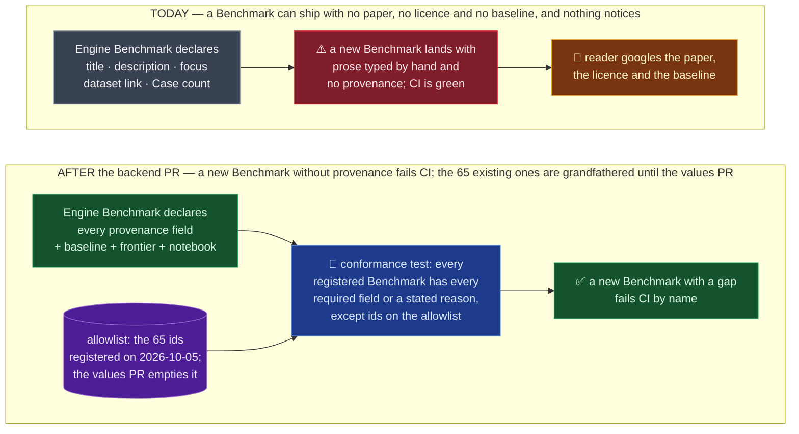

# Spec — every Benchmark declares its provenance, size, baseline and frontier score; the Engine derives a saturation verdict

- Status: draft for owner review (this PR). Design decisions on the ticket (owner, 2026-10-02 and
  2026-10-03); the four-PR carve and the grandfather allowlist below (owner direction,
  2026-10-05: backend first, pages after product signs off the mockup).
- Components: `apps/screamingface-engine` (source of truth), `apps/scoreboard` (copy + pages),
  `packages/screamingface` (SDK discovery + notebook views).
- Ticket: [OME-1455](https://linear.app/openmined/issue/OME-1455/show-where-each-benchmark-comes-from-and-how-much-room-frontier-models).
  Parent epic: OME-1299. Blocks OME-1471 (the fidelity agent needs the harness link).
- Ledger: `docs/work/2026-10-05-ome-1455-benchmark-provenance-spec.md`.
- Pinned to: main `0e28fe49c`, inspect-evals 0.20.0 (`apps/screamingface-engine/pyproject.toml`).
- Glossary: Benchmark Provenance, Frontier Score, Human Baseline, Benchmark Saturation
  (`CONTEXT.md`, this PR). The ticket carries the reader-facing Before/After, Data Flow,
  Failure modes and Architecture diagrams; this spec does not repeat them. It adds what the
  ticket cannot hold: the exact shapes, the rules a test can check, and the delivery order.

## TLDR

A Benchmark is one exam. Today the Engine declares five display facts about it (title,
description, focus, dataset link, Case count) and the pages show two. This change adds the
Benchmark Provenance (paper, authors, citation, website, harness, licence), a
content warning, the SDK notebook that runs it, a Human Baseline and a Frontier Score, each with
a source, and the Engine derives one Benchmark Saturation verdict from the frontier headroom.

Three rules hold:

1. **The Engine is the only place these facts are written.** The Scoreboard copies them at seed
   time; the SDK reads them from the catalogue; nobody re-types a link downstream.
2. **None of it touches the Benchmark Revision**, so no Leaderboard Score detaches. A link or a
   baseline says nothing about which Cases are asked or how they are graded.
3. **A silent gap is a failing test, from the first code PR.** A Benchmark that has no paper may
   say so with a reason; a Benchmark that says nothing fails CI. The 65 Benchmarks registered
   today are grandfathered by an explicit allowlist until the values PR empties it, so a
   Benchmark added in between must already carry the fields.

Delivery is four PRs: this one (spec, plan, glossary); the backend across Engine, Scoreboard
and SDK; the sourced values for all 65; the pages. The pages wait on product's sign-off of the
mockup on the ticket.

## 1. Delivery — four PRs, and why the test is strict before the values exist



| PR | Ticket boxes | Lands | Conformance test | Owner press |
|---|---|---|---|---|
| 1 (this) | — | spec, plan, four glossary entries, mirror | — | review |
| 2 backend | ① ③ ④ ⑤ ⑥ ⑨ + the data half of ⑧ | Engine fields + validation + served verdict; importer reads `eval.yaml` and arXiv; Scoreboard column, migration, schema; SDK discovery carries the block; SDK seed twin emits it | **strict, with the allowlist of the 65 ids registered today (8 built-in + 57 imported)** | `--skip-append-only` for the SDK public-surface snapshot |
| 3 values | ② | every row and declaration gets its sourced values; allowlist emptied | strict, allowlist empty | review of each source |
| 4 pages | ⑦ + the UI half of ⑧ | Leaderboard page strip, content warning, Cite, Run it; catalogue badge + cases; SDK list columns and card links | unchanged | product sign-off of the mockup first |

**Why strict from PR 2, not PR 3 (owner, 2026-10-05).** The point of going backend-first is that
a Benchmark onboarded between the two PRs (OME-1457's ten) already carries the fields. A test
that lists gaps without failing lets one through. A grandfather allowlist is a disabled rule
for a named set, not a disabled rule: a Benchmark whose id is not on the list must comply. The
list is a frozen set of ids in the test module, written once in PR 2 from the registry on that
day, and the only edit it ever takes is removal.

**Why PR 2 is over the size cap on purpose (owner, 2026-10-03).** One mechanism across three
apps, reviewed once, with no value-sourcing in it. Splitting it per app would ship an Engine that
serves keys the Scoreboard drops, which is exactly failure F4.

## 2. The declaration — shapes a test can check

All new fields live on the Engine `Benchmark` dataclass beside `focus` and `dataset_url`
(`apps/screamingface-engine/src/screamingface_engine/benchmarks/definition.py`), default
`None`, validated in the same `__post_init__` pass that checks `dataset_url` today. They are
**not** on `BenchmarkDeclaration`: that block holds the three axes that change how a Benchmark
is scored or grouped (`failure_policy`, `interaction`, `difficulty`); provenance changes
neither. They never enter any revision hash because every revision is computed by its own
definition module from an explicit tuple of parts, and no module adds them (the OME-904 rule).

### 2.1 Field table

| Field | Type on `Benchmark` | Rule the validator or the conformance test enforces | May be `NotPublished` |
|---|---|---|---|
| `paper_url` | `str \| NotPublished \| None` | http(s), the existing `_WEB_URL` check | yes (a Benchmark with no paper: a blog post goes here instead) |
| `authors` | `str \| None` | non-blank, ≤ 255; the short author line, e.g. `Hendrycks et al., 2020` | no |
| `citation` | `str \| NotPublished \| None` | non-blank; BibTeX | yes |
| `inspect_contributors` | `tuple[str, ...] \| None` | each a valid GitHub username (`[A-Za-z0-9]` then up to 38 of `[A-Za-z0-9-]`, no double or trailing hyphen), at least one; **must be `None` on a Benchmark whose origin is not `inspect_evals`** | no (Imported only) |
| `homepage_url` | `str \| None` | http(s) | optional field |
| `harness_url` | `str \| None` | http(s) **and** pinned: the path contains a 7–40 hex sha or a `v`-prefixed tag segment; refused when it contains `/tree/main`, `/tree/master`, `/blob/main`, ends at a repo root, or contains `github.com/ScreamingFace/` | no |
| `license` | `str \| NotPublished \| None` | non-blank, ≤ 64; an SPDX id where one exists (`MIT`, `CC-BY-4.0`); `NotPublished` for the two whose owner licence decision on OME-1273 is "unknown" | yes |
| `license_note` | `str \| None` | ≤ 255 | optional field |
| `content_warning` | `str \| None` | ≤ 255 | optional field |
| `human_baseline` | `HumanBaseline \| NotPublished \| None` | `score` in [0, 1], `source_url` http(s) | yes (121 of the 129 inspect evals ship none) |
| `frontier_score` | `FrontierScore \| NotPublished \| None` | `score` in [0, 1], `model` non-blank, `source_url` http(s), `as_of` an ISO month `YYYY-MM` | yes (a Benchmark too new to have one) |
| `notebook` | `str \| None` | the stem of a file in `packages/screamingface/examples/`, e.g. `12_inspect_evals_benchmarks` | no |
| `dataset_url`, `case_count` | exist today | unchanged | — |

`NotPublished` is a frozen dataclass with one field, `reason: str`, non-blank. It is the
"declared none-published with a one-line reason" of the ticket, written where the value would
go, so a reviewer sees the reason beside the field:

```python
human_baseline=NotPublished(reason="the paper reports no human study"),
```

**Required** means: the conformance test fails when the field is `None` on a registered
Benchmark whose id is not on the allowlist. `NotPublished` passes. Optional fields
(`homepage_url`, `license_note`, `content_warning`) are never checked for presence.

`HumanBaseline` and `FrontierScore` are frozen dataclasses:

```python
@dataclass(frozen=True, slots=True)
class HumanBaseline:
    score: float          # on the Benchmark's own headline metric, 0..1
    source_url: str

@dataclass(frozen=True, slots=True)
class FrontierScore:
    score: float          # 0..1; for an Inverted Grade Benchmark, already 1 − the published rate
    model: str            # as the source names it, e.g. "GPT-5"
    source_url: str
    as_of: str            # "2026-09"
```

An Inverted Grade Benchmark enters the inverted value and names the conversion in `model` or
in a trailing note on the source, so the one saturation rule holds unchanged.

### 2.2 The saturation verdict — derived, never stored

```python
SATURATION_HEADROOM: float = 0.10   # the one named constant; a judgment call, see §5

def saturation_verdict(frontier: FrontierScore | NotPublished | None) -> Saturation:
    """saturated when 1.0 − frontier.score ≤ SATURATION_HEADROOM; open otherwise; unknown with no score."""
```

`Saturation = Literal["saturated", "open", "unknown"]`, closed like `DifficultyTier`, with an
SDK twin in `_catalogue_vocabulary.py` pinned by the existing vocabulary conformance tests.
Worked examples, the three fixtures of the ticket's acceptance:

| frontier score | headroom | verdict |
|---|---|---|
| 0.92 | 0.08 | saturated |
| 0.60 | 0.40 | open |
| none / `NotPublished` | — | unknown |

The Human Baseline is never an input. A Benchmark whose frontier score equals its human
baseline is still open if headroom is above the floor.

### 2.3 What the catalogue serves

`_metadata()` keeps its present-only convention: a key is emitted when the field has a value
and omitted otherwise, never `null`. A `NotPublished` field is **omitted** on the wire; its
reason is for the declaration's reviewer, not for readers. The pages therefore render a
not-published and a grandfathered-missing field the same way: nothing, no dash.

New served keys, flat beside `focus` and `dataset_url`: `paper_url`, `authors`, `citation`,
`contributors` (list), `inspect_contributors` (list, Imported only), `homepage_url`,
`harness_url`, `license`, `license_note`, `content_warning`, `human_baseline` (object with
`score`, `source_url`), `frontier_score` (object with `score`, `model`, `source_url`, `as_of`),
`notebook`, and `saturation`, which is **always** emitted (`unknown` when there is no frontier
score). The new string limits join `_DISPLAY_LIMITS` so the Engine refuses what the Scoreboard
column could not hold.

## 3. The importer — what it fills, from where

The importer (`screamingface_engine_inspect/importer.py`) reads nothing about provenance
today: the Hub licence goes into a comment, and `BenchmarkSpec` has no licence field. PR 2 adds:

- **`eval.yaml` of the eval's package**, read through `importlib.resources` from the installed
  `inspect_evals` at the pinned version, never from GitHub. Of its keys the importer takes
  exactly four: `arxiv` → `paper_url`; `contributors` → `inspect_contributors`; the task entry
  whose `name` matches the imported task → `dataset_samples` (the size cross-check, §3.1) and
  `human_baseline.score` + `human_baseline.source` → `human_baseline`; `group` → when it is
  `Safeguards`, the generated row carries `content_warning="TODO"` under a `# TODO(review):`
  line so assembly refuses until a human writes or removes it. Every other key is ignored
  (`title`, `description`, `version`, `tags`, `external_assets`, `metadata`): prose stays the
  importing agent's job, and the pins already come from the task.
- **The paper's arXiv entry**, one HTTP call at import time, never at page load: the author
  list from the arXiv API (`export.arxiv.org/api/query`) shortened to `<first surname> et al.,
  <year>` (or the full list when there are at most three authors), and the BibTeX from
  `arxiv.org/bibtex/<id>`. Tests read a recorded fixture; no test touches the network. An
  unreachable arXiv, or a paper not on arXiv, leaves `authors="TODO"` and `citation="TODO"`
  with a `# TODO(review):` line (failure F8).
- **The Hub licence** moves from the comment into `license=` on the row, normalised to its
  SPDX spelling where the Hub's string is one; the `CLEARED_DATASET_LICENSES` warning stays
  as it is.
- **`harness_url`** is generated as the inspect_evals task directory on GitHub at the installed
  version's tag: `https://github.com/UKGovernmentBEIS/inspect_evals/tree/v<version>/src/inspect_evals/<package>`.
  When OME-1421's single-source pin bumps, the link follows (§5).
- **`notebook`** defaults to `12_inspect_evals_benchmarks` for every generated row.
- **`frontier_score`** is generated as `NotPublished(reason="TODO")` under `# TODO(review):`;
  the agent either sources one or writes the real reason. Assembly refuses a literal `TODO`
  reason, the same rule as every other generated TODO.

`BenchmarkSpec` gains one field per table row above plus `upstream_case_count: int | None`
(§3.1); `single_shot_benchmark` passes them through to `Benchmark(...)` unchanged.

### 3.1 The size cross-check lives in the conformance test, not at boot

The ticket's Data Flow puts the `dataset_samples` versus `case_count` comparison at
registration. This spec moves it into conformance test ⑨, and records the deviation: **a
metadata mismatch must never take the Engine down at boot.** The importer writes the declared
size onto the row as `upstream_case_count`; the test asserts it equals the assembled
`case_count` unless the row carries a Named Deviation that changes the count (a question filter
or dropped Cases). CI, not a pod restart, is where "the exam is a different size than inspect
says" gets loud, and it fires before any paid run, which is what F2 asks for.

## 4. The copies — Scoreboard and SDK

### 4.1 Scoreboard: one JSON column plus one verdict column

`difficulty` and `origin` never reached the Scoreboard, so OME-1257 is a precedent for the
Engine and SDK halves only. The Scoreboard half copies OME-904 (`focus`, `dataset_url`): a
`_CatalogEntry` field, a `SeedBenchmark` field, a model column, a migration, a
`BenchmarkSchema` field, one mapper.

**Decision (this spec, for owner review): the provenance block is one nullable `provenance`
JSON column, and `saturation` is one flat `CharField(16)` column.** Alternatives weighed:

- *One column per key* (the ticket's Data Flow wording, "one column per new field"): about
  twenty nullable columns, two migrations' worth of `AddField`, and every later field needs a
  Scoreboard migration. The Scoreboard is a copy, not an authority, and nothing queries a
  paper link.
- *One JSON column for everything, verdict included*: loses the one value the catalogue page
  will filter and sort on when OME-1383 scales the list past a flat table.

The block is typed on both sides. The Scoreboard reads it through ONE class,
`ProvenanceSchema` (`extra="ignore"` so an older Scoreboard still boots against a newer Engine,
the Don't-regress rule), key by key: the seed cuts the block off a catalogue entry and the API
rebuilds it from the stored copy through the same `from_stored`, so a key this build cannot
read costs that key, never the row (PR 2, second review round: a seed-side duplicate class
and a whole-block read were a 500 on the whole listing). Failure F4, "the seed silently drops
a key", is pinned by an Engine-side test that parses the Scoreboard's `ProvenanceSchema` with
`ast`, the way
`test_catalogue_vocabulary_conformance.py` already parses the SDK, and asserts every served
provenance key is a declared field there. Migration `0018_benchmark_provenance.py`, nullable,
no backfill, safe for a rolling rollout like `0011_benchmark_case_count.py`; Tortoise
mechanics per the `tortoise-dev` companion skill in PR 2.

### 4.2 SDK: three projection sites, not two

- `discovery.Benchmark` gains a `provenance: BenchmarkProvenance | None` sub-model and
  `saturation: str`, decoded in `_engine/catalog_contract.py` with the same tolerance as
  `_optional_axis` (absent key → `None`; present → shape-checked). `focus` and `dataset_url`
  are **not** added to `discovery.Benchmark` in this ticket: they were never carried and no
  surface of this ticket needs `focus`; `dataset_url` moves into the provenance block's view.
- `_runtime/bootstrap.py::scoreboard_seed_json`, the local twin of the Engine-to-Scoreboard
  seed, emits the block and the verdict. Without it a local Scoreboard seeded from the SDK
  would differ from a deployed one.
- The public-surface snapshot changes (a defaulted field on a public model), so PR 2 ships
  with the owner's `--skip-append-only` press.

The hardcoded per-origin links in `_ui/cards.py::_ORIGIN_SOURCES` are replaced by the
per-Benchmark links in **PR 4**, with the rest of the rendering; PR 2 leaves the cards as
they are.

## 5. Known limitations of this design

Those the ticket already lists (stale frontier scores, the half-definition of saturation, the
0.10 floor, the 1.0 ceiling, hand-sourced baselines, licence as display only, the harness
link following the pin bump, no link to our own translation, inverted frontier values,
non-arXiv papers, content warning as human judgement, notebook following main, the
cross-app notebook check, inspect porters checked for format only) stand. This spec adds:

- **No `contributors` field for who typed the row here** (owner decision, 2026-10-06, during
  PR 2 review). In a team-only registry it was one handle on 57 of 65 rows, so it carried
  nothing a reader could use, and git holds the same fact with better precision. The field a
  syft-space private-data Benchmark will need is a different one (the data owner: an org and a
  contact, not a GitHub handle tuple) and gets designed when that work is real. The porters
  upstream (`inspect_contributors`) stay: credit owed outside.

- **Between PR 2 and PR 3 the pages show nothing new for the 65 grandfathered Benchmarks**, and
  nothing at all until PR 4. Accepted: that is the point of backend-first; the strip is a
  rendering of fields that already exist.
- **The allowlist is a list of ids in a test, so a renamed Benchmark falls off it and fails.**
  Accepted: ids do not change (the Benchmark key rule), and a failure here is a one-line fix
  that a reviewer should see anyway.
- **The size cross-check runs in CI, not at boot (§3.1).** A mismatch in a deployed image that
  skipped CI would not be caught by the Engine. Accepted: every image is built from a merged
  PR, and the ticket's own "who notices" column for F2 is CI.
- **A JSON column cannot be filtered per provenance key in SQL.** Accepted until a page needs
  it; the one value a page will sort on (`saturation`) has its own column.
- **`NotPublished` is invisible on the wire.** A reader cannot tell "no paper exists" from "not
  entered yet" on a page; the declaration and the test can. Accepted: the strip omits missing
  fields by design, and a reason for readers is a product question for PR 4.
- **The arXiv author line is a heuristic** (`<surname> et al., <year>`); a paper with a
  consortium author or a non-Latin name order may need the agent's hand. Accepted: the line is
  reviewed in the import PR like every other generated value.

## 6. Out of scope

- Category tabs, search and sorting on the catalogue page (OME-1383).
- Automatic refresh of frontier scores; a usage counter; a changelog of provenance edits.
- Vision Benchmarks; any change to Cases, Grading or Benchmark Revision.
- A licence gate (OME-1273 holds the licence decisions).
- The fidelity audit that compares our translation against `harness_url` (OME-1471, blocked on
  this ticket).

## 7. Acceptance (restated from the ticket, with the carve)

- After PR 2: conformance test ⑨ passes with the allowlist holding exactly the ids registered
  on main that day, counted from the registry, and fails by name for a fixture Benchmark
  missing any required field. The importer, run on MMLU's recorded `eval.yaml` and arXiv
  fixture, yields a row with `paper_url`, `inspect_contributors`, `human_baseline`,
  `upstream_case_count`, `authors` and `citation` filled and no TODO for them. The three
  verdict fixtures pass. Every revision golden is byte-identical. The Scoreboard migration
  applies on an empty and on a seeded database; `GET /v1/benchmarks` serves the block.
- After PR 3: the allowlist is empty and the test passes; every `harness_url` is pinned and
  upstream; every `notebook` names a real file; every `inspect_contributors` entry is a valid handle.
- After PR 4: the ticket's page-level acceptance, verified against the mockup product signed.
