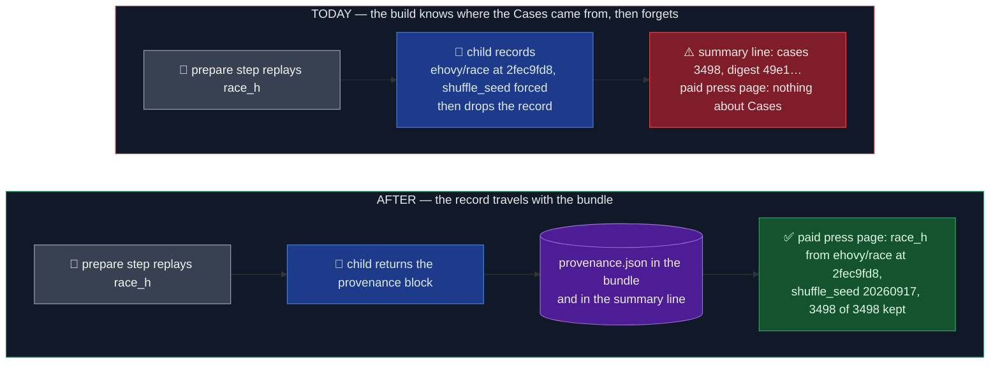

# Every prepared bundle says where its Cases came from

Status: approved 2026-10-06 · OME-1492 PR 1 of 3 · ledger
`docs/work/2026-10-06-bundle-provenance.md`

## TLDR

**Case Preparation** is the step that fills a Benchmark's **bundle** (its folder of Cases in the
Engine image) before anything runs. For an Imported Benchmark it calls the inspect eval's own task
function in a **child process**, forcing every Hugging Face fetch to a pinned commit and every
shuffle to a pinned seed. Then it checks the result against the **Case Digest**: one sha256 over
every Case, sealed at import. The **summary line** is the one JSON line per bundle that the prepare
step prints in CI, and the **paid smoke overview** is the table each paid press writes on its run page.

The rule that must hold: a red build or a red press says where its Cases came from, from the log
alone, without anyone re-running the import on a laptop.

Where it falls short today:

- the child already records every Hub commit it read and every seed it forced, then throws the
  record away;
- the child knows how many Samples the task yielded and how many the declaration excluded, and
  returns neither;
- the summary line says only `cases` and `case_digest`; the paid smoke overview says nothing about
  Cases at all, and on a cache hit no summary line is printed in the first place.

The change: the child returns a **provenance block** (sources read, seeds forced with their values,
Samples yielded / excluded / kept, inspect package versions, seconds). Case Preparation writes it
as `provenance.json` in the bundle, before `cases.json`, and adds it to the summary line, on a
mismatch skip as well as on success. The paid smoke overview gains a "Where the Cases came from"
section read from those files, so it shows on every press. The block holds only commits, seed
values, counts and versions, never a Case's text. No seal changes (that's PR 2), and no Benchmark
Revision moves.

## Before / After



### Don't regress

- `cases.json` stays the last file a preparer writes: the workflow, the just recipe and the paid
  conftest treat a parseable `cases.json` as "bundle finished".
- A digest or count mismatch still goes SKIPPED with `unconfirmed_cases`, so the strict image job
  still fails.
- `replayed_cases` keeps its contract (a list of Cases): the import path (`import_replay.py`) and its
  tests read it.

## Design

The block, with real values for race_h:

```json
{
  "sources": [{"kind": "hugging-face", "location": "ehovy/race/high", "pin": "revision 2fec9fd8…", "phase": "load"}],
  "seeds_applied": {"shuffle_seed": 20260917},
  "samples": {"yielded": 3498, "excluded": 0, "kept": 3498},
  "pins": {"inspect-ai": "0.3.263", "inspect-evals": "0.20.0"},
  "seconds": 15.0
}
```

| Decision | Choice | Why |
| -- | -- | -- |
| Who builds the block | the child, from the recorder it already installs | only the child saw the fetches; the recorder lives in its process |
| `sources` | the recorder's Case Sources (kind, location, pin, phase) | a location is a repo, file name or URL, never Case text; it already carries the forced revision |
| `seeds_applied` | the seeds the enforcer forced, **with their values** from the declaration | a name alone can't tell two seeds apart; the value is public, it's in `prepare.py` |
| `samples` | `yielded` = the task's dataset length, `kept` = Cases written, `excluded` = the difference | sad_stages_full (800 → 797) and onet_m6 (397 → 391) exclude Samples; a drift in either count shows here |
| `pins` | `inspect-ai` / `inspect-evals` from the installed metadata | the same versions that already feed each Revision |
| `seconds` | wall time of the replay, measured in the parent | the child can't time its own process start |
| Result file | the child's `result.json` becomes `{"prepared": [...], "provenance": {...}}` | the import child already writes this shape; a cut-off file still fails as today |
| Public API | new `replay_with_provenance(spec) -> TaskReplay(cases, provenance)`; `replayed_cases(spec)` returns its `.cases` | the import path and its tests keep their list |
| File order | `provenance.json` first, then `cases.json` | an interrupted bundle never looks finished without its provenance |
| On a mismatch skip | the summary and `provenance.json` still carry the block | that's exactly when on-call needs to know which commit and seed were used |
| Smoke overview | new section "Where the Cases came from", one line per Benchmark, read from `<assets>/<Benchmark id>/provenance.json` | the file sits in the cached bundle, so the section appears on every press, not only on a cache miss |

## Known limitations of this design

- **The 8 hand-built Benchmarks get no block in this PR** (draco, ifeval, healthbench, gdpval,
  medxpert, contracteval). They don't use Task replay and their six preparers are separate code;
  OME-1492 PR 3 gives each preparer its own block (owner call, 2026-10-06). Until then their rows
  in the overview read "not recorded", like any bundle without the file.
- **A bundle prepared before this change has no `provenance.json`** until its cache is rebuilt.
  The paid smoke's cache key covers the inspect plugin, so its next press rebuilds them. The e2e
  replay lane's key doesn't cover it, so its cached bundles stay without the file. The overview
  shows "not recorded" for such a row.
- **A child that crashes before writing its result reports no block**, only today's error
  sentence. Accepted: there's nothing trustworthy to report then.
- **The block is as true as the enforcer.** It names the commit the child was forced to read. A
  fetch that bypasses the recorder (a raw URL with no commit) shows as `unpinned`, same as today.

## Scope

- **Now (PR 1):** the block, `provenance.json`, the summary line, the overview section.
- **Later (PR 2):** the per-Case hash list sealed at import and the mismatch explainer ("order
  only", "N missing", "text changed").
- **Later (PR 3):** a block from each of the six hand-built preparers, and the Benchmark-to-bundle
  mapping the overview needs for the shared bundles (draco-3pass reads `draco`, both HealthBench
  Benchmarks read `healthbench`, gdpval-text reads `gdpval`).

## Acceptance

1. Every Imported bundle prepared after this change holds `provenance.json` with `sources`,
   `seeds_applied`, `samples`, `pins` and `seconds`, and its summary line carries the same block
   (success and mismatch skip).
2. A test greps `provenance.json` and the summary line for the stand-in eval's Case inputs and
   targets and finds none.
3. The stand-in Hub eval's block names the pinned commit and the forced seed with its value.
4. The paid smoke overview shows one provenance line per Imported Benchmark and "not recorded"
   when a bundle has no file (the hand-built ones until PR 3); a block without seeds or Hub
   fetches still renders.
5. The published Revisions are unchanged (`test_published_revisions.py` passes untouched), and
   `run_gates.py` is green for both stacks.
