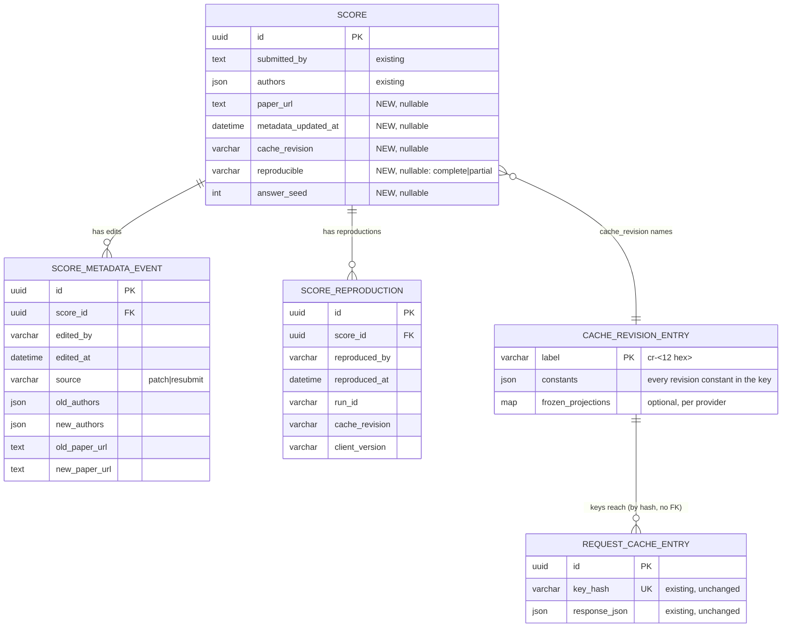

# ERD — E14 reproducible submission

Source tags follow `00-overview.md` §3. Anchors are on `origin/main` at `4d81004e1`.

E14 adds no new store. It adds columns and two tables to the scoreboard, and one committed registry
(code, not a database table) to the AI Gateway. The gateway cache table does not change.

## 1. Scoreboard: `Score` (existing table, new columns)

Purpose: one persisted leaderboard result `[existing apps/scoreboard/src/scoreboard/scores/models/score.py:18]`.

| Column | Type | Rule | Source |
|---|---|---|---|
| `paper_url` | `TEXT NULL` | `http` or `https` URL, at most 2048 characters. NULL means "no paper". | `[stated prompt]` ("a link to a paper") |
| `metadata_updated_at` | `TIMESTAMPTZ NULL` | Set when `authors` or `paper_url` change after creation. NULL means "never edited". | `[proposed]` |
| `cache_revision` | `VARCHAR(32) NULL` | The gateway cache revision label of the run (`cr-<12 hex>`). NULL for an older row, or a run with no cached call. | `[stated ans:Q1]` `[stated ans:Q3]` |
| `reproducible` | `VARCHAR(16) NULL` | `complete` or `partial`. NULL for an older row (it is treated as unknown). | `[stated ans:Q3]` |
| `answer_seed` | `INT NULL` | The run's answer seed. A replay must send the same seed, or its requests differ. | `[implied]` — gap §determinism |

Invariants:

- **I1.** `cache_revision` is set only when `reproducible` is set. `[proposed]`
- **I2.** `cache_revision`, `reproducible` and `answer_seed` are **fill-only**. A same-owner resubmit
  can fill a NULL value. It cannot change a set value. `[proposed]` This is the same rule that
  `models` and the cost fields have today
  `[existing apps/scoreboard/src/scoreboard/scores/store.py:235]`.
- **I3.** None of the new columns enter `content_hash`. Dedup does not change
  `[existing apps/scoreboard/src/scoreboard/scores/store.py:378]`.
- **I4.** `authors` and `paper_url` are display-only. A change to them does not set `enriched_at`
  `[existing apps/scoreboard/src/scoreboard/scores/store.py:232]`.

## 2. Scoreboard: `score_metadata_events` (new table)

Purpose: the edit log of `authors` and `paper_url` `[stated ans:Q7]`. Only the owner (through the
API) and operators (through the database) can read it `[stated ans:Q10]`.

- Key: `id UUID` `[proposed]`. Index on `(score_id, edited_at DESC)` `[proposed]`.
- `score_id`: FK to `Score`, `ON DELETE CASCADE`. Use the native Tortoise `score_id` column
  (see the repo's FK `source_field` pitfall). `[proposed]`
- `edited_by`: the verified identity that made the change (it is always the submitter, per
  `[stated ans:Q5]`).
- `source`: `patch` (the new edit endpoint) or `resubmit` (the existing same-owner correction path,
  `[existing apps/scoreboard/src/scoreboard/scores/store.py:235]`).
- `old_*` / `new_*`: the values before and after. A field that did not change has equal old and new
  values. `[proposed]`

Invariants:

- **I5.** One event row for each request that changes at least one value. A request that changes
  nothing writes no row. `[proposed]`
- **I6.** The event and the `Score` update are written in one transaction, against a locked row.
  `[proposed]`
- Retention: forever. Size: one small row per edit. `[proposed]`

Cardinality: one score has 0..N events `[implied]`.

## 3. Scoreboard: `score_reproductions` (new table)

Purpose: each exact replay that a verified identity records `[stated ans:Q6]` `[stated ans:Q8]`.
There is no cap. The same identity can record many times `[stated ans:Q9]`.

- Key: `id UUID`. Unique `(score_id, run_id)`, so a retry of the same replay does not count twice.
  `[proposed]`
- `score_id`: FK to `Score`, `ON DELETE CASCADE`, native `score_id` column. `[proposed]`
- `reproduced_by`: the verified identity.
- `run_id`: the replay run's id from the client.
- `cache_revision`: the revision the replay used (equal to the score's, by the check in
  `prd/reproduce.md`).
- `client_version`: the SDK version that ran the replay.

The `Score` read DTO derives `reproduction_count` (rows) and `last_reproduced_at` (max time). They
are not stored on `Score`. `[proposed]`

Cardinality: one score has 0..N reproductions `[implied]`.

## 4. AI Gateway: cache revision registry (committed code, new)

Purpose: name each set of cache-key revision constants, and keep old sets computable so that a
replay can name an old revision `[stated ans:Q1]`. Specified in `prd/cache-revision-registry.md`.

- Label: `cr-` plus the first 12 hex characters of the sha256 of the canonical JSON of the
  constants map. The label is **computed**, so nobody has to remember to bump it. `[proposed]`
- `constants`: `key_revision` (`KEY_REVISION`,
  `[existing apps/aigateway/src/aigateway/core/request_cache/global_keys.py:104]`),
  `parameter_contract` (`:117`), `tavily_retrieval`
  (`[existing apps/aigateway/src/aigateway/core/request_cache/tavily_retrieval.py:64]`), and one
  entry for each provider adapter revision.
- `frozen_projections`: optional. When a revision bump changes projection **code** (not only a
  constant), the old projection is kept here under the old label. `[stated ans:Q1]`
- Storage: a Python module plus one golden-vector JSON file for each entry under
  `apps/aigateway/tests/fixtures/cache_revisions/`. `[proposed]`

Invariants:

- **I7.** The label of the running constants is always in the registry. A CI test fails if it is
  not. `[proposed]`
- **I8.** No entry is ever deleted or changed. Each entry's golden vectors still produce their
  recorded keys. `[stated ans:Q1]`

## 5. AI Gateway: `request_cache_entries` (existing, unchanged)

The rows are write-once (`set_if_absent`,
`[existing apps/aigateway/src/aigateway/core/request_cache/store.py:220]`) and have no expiry. One
key returns one row forever. So the cache version of a submission is identified by
**url4 + benchmark revision + answer seed + cache revision** `[stated ans:Q3]`. E14 stores no key
list and no digest `[stated ans:Q3]`.

## 6. Migrations

All scoreboard changes are additive and nullable. Old rows stay valid with NULLs. There is no
backfill. `[proposed]`

| Migration | Change | PR |
|---|---|---|
| `0019_score_metadata` | `paper_url`, `metadata_updated_at`, and the `score_metadata_events` table | A1 |
| `0020_score_cache_version` | `cache_revision`, `reproducible`, `answer_seed`, and the `score_reproductions` table | B4 |

The example to copy is `0017_score_cache_saved_cost_archive.py` (a nullable column, no backfill)
`[existing apps/scoreboard/src/scoreboard/scores/migrations/0017_score_cache_saved_cost_archive.py]`.
The numbers are fixed by stack order (`00-overview.md` §6). A rebase onto a newer `main` renumbers
them.
