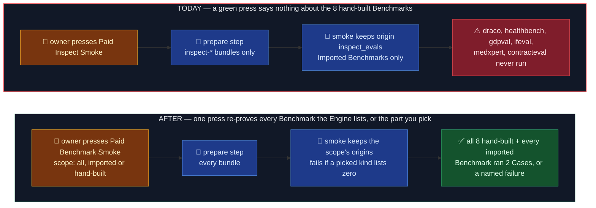

# The paid smoke re-proves every Benchmark, not only the imported ones

Status: approved 2026-10-06 · OME-1500 · ledger `docs/work/2026-10-06-paid-benchmark-smoke.md`

## TLDR

The **paid smoke** is a button the owner presses in GitHub Actions after a gateway, route or
import change. It boots the real stack (Postgres, AI Gateway, Engine), connects a real
OpenRouter key, and runs a cheap Fusion over 2 Cases of each Benchmark. It fails only when
**our pipe** breaks (a dead route, a grading error), never on a bad score. An **Imported
Benchmark** is an inspect eval copied into ScreamingFace (`origin: inspect_evals`). A
**hand-built Benchmark** is one we wrote ourselves in the Engine (`origin: screamingface`).

The rule that must hold: a green press means every Benchmark the Engine serves ran end to end.

Where it falls short today:

- the test keeps only `origin == "inspect_evals"`, so the 8 hand-built Benchmarks never run;
- the prepare step skips every bundle not named `inspect-*`, so their Cases would not even
  exist on the runner;
- the lane is named "inspect" everywhere, which stops being true.

The change: the smoke runs every Benchmark the live Engine lists, and the button gains a
`scope` choice (`all`, the default · `imported` · `hand-built`) so a press after an inspect
import can skip the expensive AI Judges. The job timeout goes from 120 to 180 minutes. The lane is
renamed to "Paid Benchmark Smoke". It never runs a wrong shelf silently: a scope typo, or a
selected kind with zero Benchmarks listed, fails before any spend. No Benchmark, Revision or
merge gate changes; the lane stays `workflow_dispatch` only.

## Before / After

For the owner: after a gateway refactor, one press now covers the Benchmarks we ship on the
leaderboard, not only the imported shelf.

### Don't regress

- The lane never runs on push or pull_request, and `tests/paid` is never collected without
  `SCREAMINGFACE_TEST_PAID=1` (`test_paid_lane_isolation.py`).
- A press where nothing could run still fails, never skips green (`SCREAMINGFACE_PAID_REQUIRED`).
- The asset cache is still saved right after prepare, so a failed press never pays the
  downloads twice.

## Design

| Decision | Choice | Why |
| -- | -- | -- |
| Which Benchmarks | every one the live Engine lists, filtered by origin per `scope` | the Engine is the source of truth; a new hand-built Benchmark (MuSiQue, OME-1475) joins with zero edits here |
| Duplicate pairs (draco / draco-3pass, the two HealthBench) | run all 8 | owner call 2026-10-06: "every Benchmark runs" stays literally true |
| Scope values | `all` (default) · `imported` (origin `inspect_evals`) · `hand-built` (origin `screamingface`) | the words a person uses; origin values stay internal |
| Unknown scope | fail before boot, naming the allowed values | a typo would otherwise pick zero Benchmarks |
| Empty kind | a picked origin with zero listed Benchmarks is a failure | an Engine booted without the inspect extra must not pass on the hand-built ones alone (today's guard, kept per kind) |
| What gets prepared | every bundle, whatever the scope | one cache entry, one assets check; a cache hit makes the extra bundles free |
| Cache key | hash of the inspect plugin **and** the Engine's `benchmarks/` package | today a change to `draco/prepare.py` would reuse stale assets |
| Timeout | 120 → 180 minutes | recent presses took 15–38 min for the imported shelf; the rubric Benchmarks call a Judge once per criterion (DRACO 5 passes), so headroom is cheap insurance |
| Gated datasets | nothing to add | all six hand-built datasets on Hugging Face are public and ungated (checked 2026-10-06); the existing `HF_TOKEN_BENCHMARKS` still covers xstest |
| Judges | already gateway seeds | `gemini-3.1-pro-preview` (DRACO, GDPval) and `gpt-5.4` (HealthBench) are in the OpenRouter seed list, so no 404 at run time |

Names after the rename:

| Today | After |
| -- | -- |
| `screamingface-paid-inspect-smoke.yml` · "ScreamingFace Paid Inspect Smoke" | `screamingface-paid-benchmark-smoke.yml` · "ScreamingFace Paid Benchmark Smoke" |
| `just screamingface test-paid-inspect` | `just screamingface test-paid-benchmarks [scope]` |
| `test_imported_board_smoke.py::test_every_imported_board_runs_end_to_end` | `test_imported_board_smoke.py::test_every_benchmark_runs_end_to_end` (file name kept, see Known limitations) |

## Known limitations of this design

- **The cost of a full press is unmeasured.** Three hand-built families grade with a pro-tier
  Judge per rubric criterion, so `all` may cost several times today's press; the first
  `scope=all` press's overview prints the real total, and `imported` exists for cheap presses.
- **Any edit under the Engine's `benchmarks/` package now cold-starts the asset cache**,
  re-downloading every dataset once (minutes, no money). Accepted: a precise key per preparer
  is more moving parts than one slow press after an Engine change.
- **The test module keeps its old file name** (`test_imported_board_smoke.py`). The append-only
  gate approves edits to an existing test file by pinning its before and after contents, but
  never a rename, so renaming it would need the gate skipped.
- **Internal helper names still say "board"** (`_board_summary.py`, `BoardSummary`). Renaming
  them is churn with no reader-visible effect, so this change leaves them.
- **The old recipe name is gone, not aliased.** A muscle-memory `test-paid-inspect` fails with
  just's "unknown recipe"; it's one owner, so an alias isn't worth keeping.

## Scope

- **Now:** the widened shelf, the `scope` choice, timeout, rename, the free tests of the picker.
- **Later (OME-1492 PR 1):** the overview shows, per Benchmark, where its Cases came from.
- **Out:** changing the panel, Case count or concurrency (the rubric Benchmarks run with the same
  4-at-a-time and 2 Cases); a per-Benchmark cost cap (no evidence yet it is needed).

## Acceptance

1. A `scope=all` press lists 8 hand-built + every imported Benchmark in its progress lines.
2. `scope=imported` runs only `inspect-*` ids; `scope=hand-built` runs exactly the 8.
3. `scope=typo` fails before the stack boots, naming `all, imported, hand-built`.
4. Free tests (`tests/paid` gate tests + `test_paid_lane_isolation.py`) pass with
   `SCREAMINGFACE_TEST_PAID=1` and no key; `run_gates.py screamingface` is green.
