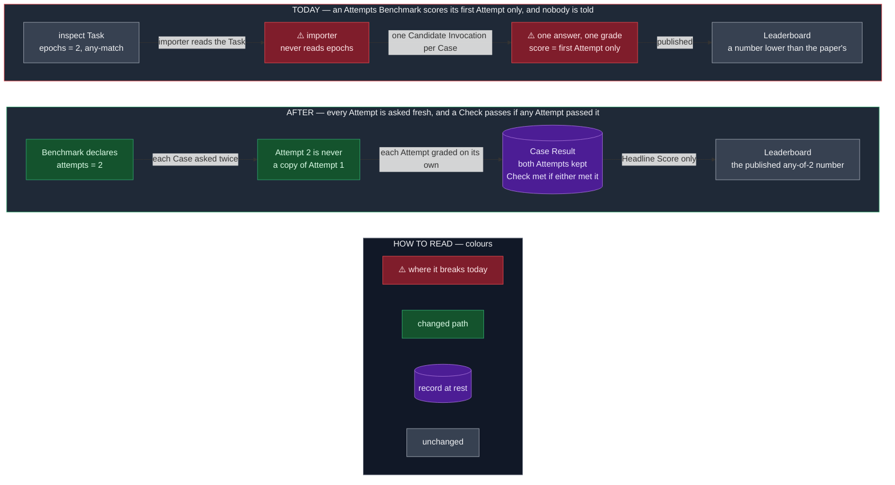
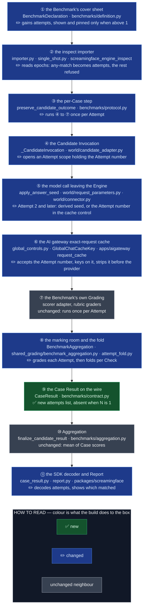

# Spec — a Benchmark may give each Case several Attempts, and a Check passes if any Attempt passes it

- Status: implemented by the seven-PR stack on OME-1458 (2026-10-08). Decisions D1–D14 approved by the owner on OME-1458,
  2026-10-07 (§1); D5 and D7 were revised after reading the code and re-approved the same day;
  D5 was extended on 2026-10-08 so an unseeded rerun replays every Attempt (PR 4), and D14
  was changed the same day: the build rides OME-1458 as one stack. The plan
  (`docs/plan/2026-10-08-OME-1458-attempts-per-case.md`, 2026-10-08) moved the fold into the
  shared marking room, put the failure code on both lists in the SDK PR, split the Engine build
  in two (seven PRs), and gave each Attempt its own cost records; this spec says so where it
  applies.
- Component: `apps/screamingface-engine` (the grading spine and `screamingface_engine_inspect`)
  and `packages/screamingface` (decoder and Report).
- Ticket: OME-1458. Parent epic: OME-1299. Unblocks OME-1476 (ARC-AGI-2).
- Ledger: `docs/work/2026-10-07-attempts-per-case-spec.md`.
- Delivery: one stack of seven PRs on OME-1458: this spec, the importer refusal, then the build in
  the SDK, the AI gateway and the Engine (§7). The last PR closes the ticket.

## TLDR

Some Benchmarks let the model hand in more than one answer per question and mark the question
right if **any** answer is right. ARC-AGI-2 gives two Attempts per test grid; ZeroBench and MBPP
publish the same rule as pass@k. Think of it as an exam that accepts two answer sheets.

The rules that must hold:

1. **Our score for such a Benchmark is the number its authors publish**, so the Attempts are
   reproduced, never approximated, or the Benchmark is refused by name.
2. **Attempt 2..N never get the cached answer from Attempt 1.** Each Attempt is a real, separate
   answer from the model (§2.3).
3. **Rerunning a Benchmark with N Attempts a second / third time gets all cached results for all
   Attempts from the 1st run**, so the rerun is free and returns the same answers, like any other
   Benchmark (§2.3).

Today it breaks in two places:

- **The spine has room for one sheet.** Each Case calls the Candidate once and grades one answer,
  so a hand-built ARC-AGI-2 could only publish its first-Attempt score, which is lower than the
  published one.
- **The inspect importer ignores `epochs`.** A Task that declares several epochs is imported and
  run with one, silently. No published Benchmark is affected today (every imported Task declares
  one epoch), but the next import of MBPP or ZeroBench would be.

**The change: a Benchmark declares `attempts=N`; the Engine asks each Case N times, grades each
Attempt on its own, and marks a Check met if any Attempt met it.** The Report shows every
Attempt; the Leaderboard ranks the one Headline Score, as today. It never scores a declared
Attempts rule at one Attempt without saying so. Blast radius: nothing changes for a Benchmark
that declares no Attempts; its Case Results, Report and Benchmark Revision stay byte-identical.

## 1. The decisions, and the five questions the ticket asked

| # | Decision | Ticket question |
|---|---|---|
| D1 | **k independent Attempts per Case, any-match** (option b). Options a (k answers in one reply) and c (refuse forever) are rejected. | — |
| D2 | **Any-match is the only rule.** pass@1 estimated from N samples, all-must-match (ZeroBench's pass^k) and mean-over-Attempts wait until a Benchmark needs them. | Q3 |
| D3 | A new required-when-set field `attempts` on `BenchmarkDeclaration`, shown in the catalogue and pinned into the Benchmark Revision only when N > 1. | Q1 |
| D4 | The catalogue says **"any of N Attempts"**, never a bare "pass@N": inspect's `pass_at` means the unbiased estimator, a different number (§2.1). | Q1 |
| D5 | **Revised.** Attempt 1 is sent exactly as today. Attempt i ≥ 2 differs only in what keeps it from being a copy of Attempt 1: a seed derived from the run's answer seed when the run declared one, and the Attempt number in the gateway's cache control when it did not (§2.3), so a rerun replays every Attempt. The owner first approved "one seed per Attempt"; that would refuse every Anthropic model (§2.3). | Q2 |
| D6 | One Attempt of a Fusion is one full fusion, members and synthesizer, as a solo Model gets one full call. | Q2 |
| D7 | **Revised.** The fold is per **Check**: a Check is met if any Attempt met it, and the Case score is the share of met Checks. For a Benchmark with one Check per Case this is "the best Attempt wins". The owner first approved "best Attempt per Case"; that undercounts ARC-AGI-2 (§2.4). | Q3, Q4 |
| D8 | Partial credit is per output: an ARC-AGI-2 task with two test grids, one matched, scores 0.5. That is what the ARC Prize's own scorer computes. | Q4 |
| D9 | The Report shows each Attempt's answer and grade, and how many Attempts failed, only when N > 1. It gives no per-Attempt verdict: credit is per Check, so a Case can pass while no single Attempt has full marks. | Q3 |
| D10 | Question 5 (multiply the pre-run Cost Estimate by k) has nothing to multiply: no Cost Estimate exists in code (ADR 0003). The catalogue says "N Candidate Invocations per Case" instead, and the Report shows the cost actually spent. | Q5 |
| D11 | The importer maps inspect's any-match reducers to `attempts=N` and refuses every other reducer by name. | — |
| D12 | Until the build lands, the importer refuses every `epochs` > 1 by name (OME-1458, PR 2). | — |
| D13 | The build is proven by a test-only Benchmark declaring two Attempts; ARC-AGI-2 proves it for real in OME-1476. | — |
| D14 | **Revised.** The decision and the build ride one ticket, OME-1458, as one stack of seven PRs across the SDK, the AI gateway and the Engine (owner, 2026-10-08, the OME-1268 precedent). | — |

## 2. Design

**The cost lands on the researcher who can't trust the number.** An ARC-AGI-2 score computed
from one Attempt sits below every published score and looks like a weak model, not a different
rule. After: the number matches the ARC Prize's own scorer, and the Report shows which Attempt
earned each point.

### 2.1 What the published rules say, and what inspect does

| Source | Rule | Evidence |
|---|---|---|
| ARC Prize harness | **Two Candidate Invocations per test grid**, same prompt each time; a grid passes if either reply matches exactly; a task scores matched grids ÷ grids | `arcprize/arc-agi-benchmarking@9e2828fb`, `main.py:261-291` (`--num_attempts` default 2), `scoring/scoring.py:122-127` |
| ARC-AGI-2 evaluation set | 120 tasks: 75 with one test grid, 43 with two, 2 with three (167 grids) | `arcprize/ARC-AGI-2@f3283f72`, `data/evaluation/*.json` |
| ZeroBench | pass@5: five samples at temperature 0.7, correct if any is correct | arXiv 2502.09696 |
| inspect `Epochs(N, reducer)` | each epoch is a full, separate run of the Sample; the same seed is sent on every epoch; the cache keys on the epoch | `inspect_ai` 0.3.263, `_eval/task/run.py:1752-1756`, `model/_cache.py:91-98` |
| inspect `pass_at(k)` | the unbiased estimator 1 − C(n−c, k) / C(n, k) over all n epochs. It equals any-match only when k = n | `scorer/_reducer/reducer.py:163-205` |
| inspect `max`, `at_least(1)` | any epoch correct → correct | same file, :129-160, :247-301 |

So inspect's `pass_at_5` with 5 epochs is our any-of-5; MBPP's `pass_at_1` with 5 epochs is an
average, a different number, and stays refused (D2).

### 2.2 The declaration: `attempts`, absent unless set

`BenchmarkDeclaration` gains `attempts: int`, the number of Attempts per Case. It is the
record's own named extension point for declared axes, and grading is untouched by declaring it.

- **One means "no Attempts rule".** At 1 the field is left out of `as_block()`, the catalogue
  and the Benchmark Revision, the `inverted_grade` precedent, so no published Revision, catalogue
  entry or rendered expression moves.
- **Above one, it is pinned.** Changing N changes what the score means, so it changes the
  Benchmark Revision; the catalogue shows "any of N Attempts · N Candidate Invocations per Case".
- **Hand-built Benchmarks** set it in their declaration. **Imported Benchmarks** get it from the
  importer (§2.6).

### 2.3 Running the Attempts: Attempt 2 must not be a copy of Attempt 1

The per-Case step runs the Candidate Invocation and its Grading once per Attempt, numbered 1 to
N, inside the one Case (the Attempts may run side by side; the Case Result keeps them in order).
One Attempt is one complete answer: for a Fusion that is every member
and the synthesizer (D6), for a Corrective Loop every round.

**The trap is the AI gateway's cache, not the seed.** A model with no seed already answers
differently each time it is asked; the problem is that Attempt 2 is never asked. The gateway
keys a stored reply on the exact request, by design with no sampling member
(`GlobalChatCacheKey`, OME-305):

- Attempt 1 sends `gpt-x` "What is 6 times 7?"; the gateway calls the provider, gets `41`, and
  stores it under that exact request.
- Attempt 2 sends the identical request; the gateway finds the stored `41` and returns it
  without calling the provider.

Both Attempts say `41`, and the score is silently first-Attempt again. inspect avoids this by
putting the epoch number in its cache key; our cache is shared across every hosted user and
stays exact. So Attempt i ≥ 2 changes its request, and only in a way the Candidate does not see:

| The run declared | Attempt 1 | Attempt i ≥ 2 | Why |
|---|---|---|---|
| no seed (the normal case, and every Anthropic model) | today's request, unchanged | no seed; the cache control carries the Attempt number, `cache: {"attempt": i}` (PR 4) | the gateway keys the stored reply on the request plus the Attempt number and strips it before the provider, so Attempt i is asked afresh once and replayed on every rerun; a seed is not needed, and would refuse every Anthropic model (its Messages API has no `seed`) |
| an answer seed `s`, chosen by the researcher | today's request, seed `s` | seed derived from `(s, i)`, cached as normal | the run stamps `s` on every answer, and a provider that honours seeds returns the same answer for the same seed, so Attempt 2 needs its own; every Candidate Model already supports `seed` (the SDK refuses a seeded run otherwise), and a distinct seed is a distinct cache entry, so a rerun replays every Attempt |

**Rerun = replay holds for every Benchmark.** In both rows each Attempt has its own stored reply,
the same one on every run, so a second run of an Attempts Benchmark costs nothing and returns the
same answers, like any other rerun.

**A gateway without PR 4 is still correct.** Its cache control accepts only `use-cache`
and bypasses the cache on any other field, so an unseeded Attempt i ≥ 2 is asked afresh, just not
stored: the free rerun waits for the gateway, the score never does.

Attempt 1 is byte-identical to today's request, so a Benchmark without Attempts never changes
its egress. The Benchmark's own Judges are untouched: a Judge grading the same answer twice may
be served the same stored verdict, which is right.

### 2.4 Grading and the fold: per Check, not per Case

Each Attempt is graded by the Benchmark's own Grading, unchanged, into its own Case Grade. The
shared marking room (`BenchmarkAggregation`), where every Benchmark's Case Grades are built,
then folds the N grades into
the Case's one Case Grade:

- **A Check is met if it is met in any Attempt.** The folded Check records which Attempts met
  it.
- **The Case score is the share of Checks met.** For every Imported Benchmark, which grades one
  Check per Case, this is the best Attempt's score.
- **The Case Result's shown answer** is the first Attempt with the highest Case score, so the
  answer a reader sees is one that earned the points.

Why per Check, not "pick the best answer sheet": one ARC-AGI-2 task can ask for two output
grids, A and B, one Check each (45 of the 120 evaluation tasks ask for two or three).

| | Grid A | Grid B |
|---|---|---|
| Attempt 1 | ✅ right | ❌ wrong |
| Attempt 2 | ❌ wrong | ✅ right |

- **ARC's own scorer** checks each grid on its own: A passed (Attempt 1), B passed (Attempt 2),
  so the task scores **1.0**.
- **Best Attempt per Case** treats each Attempt as one whole sheet: Attempt 1 scores 0.5,
  Attempt 2 scores 0.5, the best is **0.5**, lower than ARC's number for the same answers.
- **Per Check** takes, for each grid, whichever Attempt got it right: **1.0**, ARC's number.

On a Benchmark with one Check per Case, which is every Imported Benchmark, the two rules give
the same score.

**Any-match needs pass/fail Checks.** A Check graded 0.6 (an F1, a partial rubric) is neither
met nor missed in the published sense, and inspect's `max` would take the larger partial score,
which no ARC or ZeroBench paper reports. So an Attempt whose Case Grade has a Check score other
than 0 or 1 fails the Case with the named failure `attempt_grade_not_pass_fail`, never a guess.

### 2.5 What the Report and the Leaderboard see

The Case Result gains `attempts`: one entry per Attempt, carrying its answer, finish reason,
failures, Case Grade and its own cost records. It is absent when N = 1, so every existing report.json is unchanged.
The Case Result's own `output` and `grade` stay what a reader and the Aggregation already read:
the shown answer and the folded Case Grade.

The Aggregation is unchanged: the Headline Score is the mean of Case scores. The SDK Report adds
a badge per Case, "any of 2 Attempts", lists each Attempt's answer and score under it, and
counts every Attempt once in the run's cost:
each Attempt carries its own cost records, so the Case-level ones are left out. The
Leaderboard ranks the Headline Score; since N is part of the Benchmark Revision, every entry on
one Leaderboard used the same N.

### 2.6 The importer: any-match epochs become Attempts, everything else is refused

| inspect Task declares | Example | Imported as |
|---|---|---|
| no epochs, or `epochs=1` with any reducer | every published Imported Benchmark; lab_bench's `Epochs(1, "mode")` | as today, no `attempts` |
| `epochs=N`, every reducer `max`, `at_least(1)` or `pass_at(N)` | an ARC-style any-of-N Task | `attempts=N` |
| `pass_at(k)` with k < N, `mean`, `median`, `mode` | MBPP (5 epochs, `pass_at_1`/`_2`/`_5`), b3, tac | refused, naming the reducer |
| `pass_k`, `at_least(k > 1)`, a custom reducer | ZeroBench's `5_of_5_reliability` | refused, naming the reducer |
| an any-match reducer with a tuned threshold | `at_least(1, value=0.5)` | refused, naming the parameter |
| any-match epochs beside several scores | `Epochs(2, "max")` with two scorers | refused (F10) |

Until the build lands, the importer refuses every `epochs` > 1 (D12), because there is nowhere
yet to send a second Attempt.

## 3. Architecture / Design

How to read this section: the circled numbers ① to ⑪ are the boxes of the Architecture map in
§3.3, one numbering for the whole spec, so ⑤ is the same code in the Data Flow, the Failure-modes
table and the delivery plan. Read the Data Flow first (one Case, two Attempts, end to end: *how*
it works), then the Failure modes (rows F1 to F9: *what breaks* and who notices), then the
Architecture map (*where*: which files, new or changed). Read each diagram's key before its
boxes.

### 3.1 Data Flow — one Case, two Attempts, an unseeded run

The example is illustrative: the Case "What is 6 times 7?", answer key `42`, on a Benchmark that
declares `attempts=2`.

```mermaid
%%{init: {"flowchart": {"wrappingWidth": 460}}}%%
flowchart TB
  s0["INPUT · the Case, frozen at Case Preparation (an example)<br/>e.g. input: What is 6 times 7? · answer key: 42 · attempts: 2"]
  s3["③ the per-Case step starts Attempt 1 of 2<br/>symbol · preserve_candidate_outcome · protocol.py<br/>🔀 WHEN & WHO: Attempts run inside one Case, maybe side by side"]
  s4a["④ ⑤ Attempt 1: the Candidate Invocation, request unchanged<br/>e.g. seed: none · cache: participates<br/>⏱ TIME: one full Candidate answer"]
  c1[("⑥ AI gateway exact-request cache<br/>💾 SPACE: shared by every hosted user<br/>e.g. no stored reply for this request")]
  p1["model provider<br/>e.g. reply: 41"]
  s7a["⑦ Grading, Attempt 1<br/>e.g. Check 1: UNMET · score: 0.0"]
  s4b["④ ⑤ Attempt 2: same prompt, the Attempt number in the cache control<br/>e.g. seed: none · cache: attempt 2<br/>🧩 MEANING: the Candidate sees the same input"]
  c2[("⑥ AI gateway cache, Attempt 2's own entry<br/>💾 SPACE: keyed on the request plus attempt 2<br/>e.g. first run: no stored reply · rerun: 42")]
  p2["model provider<br/>e.g. reply: 42"]
  s7b["⑦ Grading, Attempt 2<br/>e.g. Check 1: MET · score: 1.0"]
  s8["⑧ the fold: a Check is met if any Attempt met it<br/>e.g. Check 1: MET by Attempt 2 · Case score: 1.0 · shown: Attempt 2"]
  r9[("⑨ Case Result in report.json<br/>e.g. output: 42 · score: 1.0<br/>attempts: 1 → 41, 0.0 · 2 → 42, 1.0<br/>💾 SPACE: the run's report")]
  s10["⑩ Aggregation, unchanged<br/>e.g. mean over 120 Cases → Headline Score 0.31"]
  s11["⑪ OUTPUT · the SDK Report<br/>e.g. Case 1: any of 2 Attempts · Attempt 1 score 0 · Attempt 2 score 1"]
  s0 -->|the Engine loads the Case| s3
  s3 -->|asks the Candidate| s4a
  s4a -.->|🌐 gateway looks up the exact request| c1
  c1 -.->|🌐 miss: the gateway calls the provider| p1
  p1 -->|the reply comes back| s7a
  s7a -->|Attempt 2 starts| s4b
  s4b -.->|🌐 gateway looks up the request plus attempt 2| c2
  c2 -.->|🌐 miss: the gateway strips the number and calls the provider| p2
  p2 -->|the reply comes back| s7b
  s7b -->|both Case Grades| s8
  s8 -->|writes| r9
  r9 -->|one per Case| s10
  s10 -->|the SDK reads the report back| s11
  subgraph KEY["HOW TO READ — dashed arrows are network hops; circled numbers are §3.3's boxes"]
    direction LR
    k1["processing step"]
    k2[("record or store at rest")]
    k3["outside party"]
  end
  s11 ~~~ KEY
  classDef stage fill:#1e3a8a,stroke:#4a7fd4,color:#dbeafe
  classDef data  fill:#4c1d95,stroke:#a06ed4,color:#ede9fe
  classDef plain fill:#374151,stroke:#9ca3af,color:#f3f4f6
  class s0,s3,s4a,s4b,s7a,s7b,s8,s10,s11,k1 stage
  class c1,c2,r9,k2 data
  class p1,p2,k3 plain
  style KEY fill:#111827,stroke:#6b7280,color:#f3f4f6
```

Tags inside a box name the limit that shapes it: ⏱ when it runs, 💾 where it rests, 🌐 a
network hop, 🔀 ordering, 🧩 the same bytes read differently. On a rerun both lookups hit and no
provider is called. In a seeded run, Attempt 2 instead carries a seed derived from the run's seed,
which gives it its own entry the same way (§2.3).

### 3.2 Failure modes

| # | Fault | Box | Who notices | Outcome |
|---|---|---|---|---|
| F1 | An inspect Task declares `epochs` > 1, before the build lands | ② | the importer | refused by name (D12) |
| F2 | An inspect Task declares epochs with a reducer we don't run (`mean`, `pass_at(k < N)`, a custom one), or an any-match reducer with a tuned threshold (`at_least(1, value=0.5)`, logged as `at_least_1`) | ② | the importer | refused naming the reducer and, for a tuned one, its parameters |
| F3 | Attempt 2 would be served Attempt 1's stored reply | ⑤ ⑥ | nobody, which is why §2.3 exists | prevented: Attempt 2's request always keys differently (a derived seed, or the Attempt number in the cache control) |
| F4 | One Attempt's Grading fails, another is graded | ③ ⑧ | the Report | the Case is graded from the graded Attempts; the failed one keeps its failure in `attempts`; the Report says "1 of 2 Attempts failed". A failed **Candidate Invocation** in any Attempt fails the whole Case instead, as it does for a one-Attempt Case today (§4) |
| F5 | Every Attempt of a Case fails | ⑧ | the Aggregation | the Case has no Case Grade; the Benchmark's Failure Policy applies, as today |
| F6 | An Attempt's Check is graded neither 0 nor 1 | ⑧ | the marking room | the Case fails as `attempt_grade_not_pass_fail`; no guessed fold |
| F7 | A seeded run names a Model whose provider has no `seed` | ⑤ | the SDK's parameter check, before any paid call | refused, as today for every seeded run |
| F8 | A researcher's SDK released before the build reads a report with `attempts` | ⑪ | the SDK decoder | "unsupported field"; reports without Attempts unaffected; the SDK slice releases first (§7) |
| F9 | The Engine sends the Attempt number to a gateway without PR 4 | ⑥ | nobody | that gateway bypasses the cache on the unknown field: Attempts are fresh and graded correctly, only the free rerun is lost until it deploys |
| F10 | An inspect Task declares any-match epochs and several scores (Named Scores) | ② | the importer | refused by name: the fold credits Checks, and a Named Score has none. The marking room refuses the pair too, as a contract error that aborts the run, but only after every Case was asked N times |
| F11 | A Benchmark's Attempts are graded on different Checks | ⑧ | the marking room | a contract error that aborts the run: the fold matches Checks by id, and no Benchmark grades Attempts differently |
| F12 | The Benchmark's missing-case hook files nothing for one Attempt | ⑧ | the marking room | that Attempt gets the finalizer's `case_result_missing` failure; the Case is graded from the rest (F4) |
| F13 | A Candidate pins its own `seed` | ⑤ | nobody | the seed is kept, and Attempt 2 carries the Attempt number in the cache control instead: a fresh call, but a provider that honours the seed may return Attempt 1's answer again (§4) |
| F14 | Attempt 2's rewrite reaches no Candidate Invocation (one nested in an `iterate` or a struct) | ③ | the Engine, when the Benchmark is built | refused before any paid call: an unmarked Attempt 2 would be sent identical to Attempt 1 |
| F15 | A Benchmark we build ourselves declares N Attempts but its expression asks fewer | ① ③ | CI: a test over every registered Benchmark | the test fails: the two numbers are written in two places, and a forgotten second one would publish a first-Attempt score under an any-of-N label |

### 3.3 Architecture

The arrows are the order a Case passes through the code, not imports. The stages that carry a
"because":

- ③ runs Attempts inside one Case, because Cases already run one at a time and the Case scope
  is what attributes each call's cost to its Case; the Attempts themselves are independent, so
  they may run side by side.
- ⑤ changes only Attempts 2 and later, because Attempt 1 byte-identical to today is what keeps
  every existing Benchmark's egress, replay fixtures and goldens unchanged.
- ⑥ keys on the Attempt number only when it is present, because every request without one must
  hash exactly as today, or every stored reply would be abandoned.
- ⑧ folds per Check, because ARC-AGI-2 credits each test grid separately (§2.4).
- ⑨'s field is absent at N = 1, because the SDK decoder refuses unknown keys and every
  existing report must stay readable.

## 4. Known limitations of this design

- **N Attempts cost N times as much.** ARC-AGI-2 at two Attempts per grid is 334 Candidate
  Invocations for 120 tasks. Accepted: it is the published rule, and the catalogue states it.
- **The shared cache gains a sampling dimension it was built without** (OME-305 chose an exact
  cache with no sampling lane). Accepted: the Attempt number is caller-declared and absent from
  every existing request, so the cache stays exact for everything else.
- **A rerun is free only when nothing about the request changed.** Rule 3 holds while the gateway
  change (PR 4) is deployed, the cache is on, the run does not opt out of caching, the stored
  replies have not expired, and the Candidate (models, Fusion members, parameters) and the seed
  are the same. A different seed is meant to give new answers, so it is not served the old ones.
  Before PR 4 deploys, a rerun replays Attempt 1 but pays for Attempts 2..N again (F9).
- **The cache is shared by every hosted user.** If another researcher already ran the same
  Attempt 2 request, your first run is served their stored Attempt 2 answer. That is how the
  cache treats every request today.
- **Attempts at temperature 0 come out nearly identical**, and the score is close to the
  first-Attempt score. Accepted: the Candidate owns its sampling settings, and the ARC harness
  behaves the same way; the Report shows the identical answers.
- **Only any-match is supported.** MBPP (pass@1 estimated from 5 samples) and ZeroBench's
  all-must-match reliability stay refused by name until a Benchmark needs them.
- **`max` over a partial-credit scorer imports, then fails per Case.** `Epochs(2, "max")` with an
  F1 scorer reads as any-match, but its Checks are graded between 0 and 1, so each Case fails as
  `attempt_grade_not_pass_fail` (F6) after its Attempts were paid for. The importer cannot tell a
  partial-credit scorer from its name. Accepted: no inspect_evals Task declares it today.
- **A Candidate that pins its own `seed` may get the same answer on every Attempt** (F13).
  Overriding the seed would change the Candidate under test, so it is kept. Accepted, like
  temperature 0: the Report shows the identical answers.
- **A failed Attempt can lose its siblings' spend from the record.** The Attempts of one Case
  run side by side; when one fails, the run cancels the others in flight, and a provider call
  already billed for them is not recorded. The Case fails either way (the next bullet).
- **The fold scores met Checks ÷ Checks, not the Benchmark's own formula.** A weighted rubric
  Benchmark that declared Attempts would switch to an unweighted share. Accepted: no weighted
  Benchmark declares Attempts; revisit before one does.
- **A `--task-arg` that sets the epoch count imports at that count.** `epochs=1` on a Task whose
  eval publishes any-of-5 gives a one-Attempt Benchmark. The pinned task args move the revision,
  so it shows; the import doc says so.
- **A Case with a failed Attempt has fewer chances to pass** (F4). Accepted: the ARC harness
  counts a missing Attempt the same way; the Report says how many Attempts failed.
- **A failed Candidate Invocation in any Attempt fails the whole Case**, losing the Attempts
  that did answer: a provider that keeps erroring on Attempt 2 after the gateway's retries fails
  that Case, as it would at one Attempt. URL4 collects an error only inside `iterate`, which
  rebinds `$item` and `$index` that every Benchmark's own nodes read. Accepted for now; revisit
  when a real Attempts Benchmark (OME-1476) shows such failures in its Report.
- **How ARC-AGI-2 prompts each test grid is OME-1476's design.** The harness sends one prompt per
  grid; that Benchmark will need one Candidate Invocation per grid per Attempt, which the
  glossary already allows ("a Case may require multiple ordered Candidate Invocations"). If those
  invocations sit inside an `iterate`, the Attempts rewrite does not reach them today and the
  build refuses the Benchmark (F14); OME-1476 extends the rewrite or builds them differently.

## 5. Out of scope

- pass@1-from-N, all-must-match and mean-over-Attempts folds (D2).
- A Cost Estimate (ADR 0003); question 5's ×N waits for it.
- ARC-AGI-2 itself (OME-1476) and ZeroBench (needs image input).
- Any Leaderboard or Scoreboard column for per-Attempt detail.

## 6. Acceptance

1. A Benchmark without Attempts is byte-identical: every published Benchmark Revision unchanged
   (`test_published_revisions.py` untouched), every e2e golden green including its
   `expression_sha` rung, and Attempt 1's egress identical to today's.
2. A test-only Benchmark declaring `attempts=2` runs end to end locally against stubbed replies
   `41` then `42`: its Case Result carries both Attempts, the Case scores 1.0, and the Report
   prints "any of 2 Attempts" and both Attempts' scores.
3. A two-Check fixture where Attempt 1 meets only Check A and Attempt 2 only Check B scores 1.0
   (the ARC rule), pinned by a test that says why.
4. **Attempt 2..N never get the cached answer from Attempt 1.** Test: in one run, Attempt 1 is
   answered `41` and stored; Attempt 2 of the same Case is not served `41` from the cache, it goes
   to the model. Holds in an unseeded run (the Attempt number in the cache control) and in a
   seeded run (a different seed), pinned by tests on the request the Engine sends.
5. **Rerunning a Benchmark with N Attempts a second / third time gets all cached results for all
   Attempts from the 1st run.** Test: run an `attempts=2` Benchmark twice with the same Candidate
   and no seed; the second run makes zero model calls and every Attempt's answer equals the first
   run's. Same with the same seed in a seeded run. Pinned by a gateway test (PR 4).
6. The importer maps `max`, `at_least(1)` and `pass_at(N)` to `attempts=N` and refuses every
   other reducer by name; before the build, it refuses every `epochs` > 1 (OME-1458, PR 2).
7. A non-0/1 Check under Attempts fails the Case as `attempt_grade_not_pass_fail`, pinned on both
   the Engine and SDK failure-code lists.

## 7. Delivery

| PR | Ticket | Lands in | Carries |
|---|---|---|---|
| 1 (this one) | OME-1458, PR 1 of 7 | `docs/` | this spec, the plan, the `Attempt` glossary entry, ledger and mirror |
| 2 | OME-1458, PR 2 of 7 | `apps/screamingface-engine` | ② refuses every `epochs` > 1 by name (F1) |
| 3 | OME-1458, PR 3 of 7 | `packages/screamingface` | ⑪ decoder accepts `attempts`, per-Attempt cost, the Report line, the catalogue line; the new failure code on both the SDK and Engine lists (they are pinned equal); released first (F8) |
| 4 | OME-1458, PR 4 of 7 | `apps/aigateway` | ⑥ the cache control accepts the Attempt number, keys on it, strips it |
| 5 | OME-1458, PR 5 of 7 | `apps/screamingface-engine` | ④ ⑤: Attempt 2's request (the Attempt scope, the derived seed or the cache control) |
| 6 | OME-1458, PR 6 of 7 | `apps/screamingface-engine` | ① ③ ⑧ ⑨: the declaration, the Attempt loop, the fold, the wire field, the test-only Benchmark |
| 7 | OME-1458, PR 7 of 7 | `apps/screamingface-engine` | ② maps any-match epochs to `attempts=N` and narrows F1 to F2; closes OME-1458 and its docs |

Deploy order: the SDK from PR 3 releases and the gateway from PR 4 deploys before the Engine
from PRs 5 and 6, the order OME-1268 used. Only the SDK order is required for correctness (F8);
the gateway order only decides when reruns become free (F9). The Engine build is split at ⑤
(Attempt 2's request) versus ③ ⑧ ⑨ (the loop, the fold and the wire) to stay near the
~500-line review cap.

## 8. Glossary

`CONTEXT.md` gains one entry in this PR:

- **Attempt**: one complete, independent answer by the Candidate to a Case, graded on its own.
  A Benchmark that declares N Attempts asks each Case N times; a Check is met if any Attempt met
  it. _Avoid_: epoch (inspect's word), sample, try, retry (a retry re-sends one failed request),
  pass@k (inspect's `pass_at` is an estimator, a different number).
