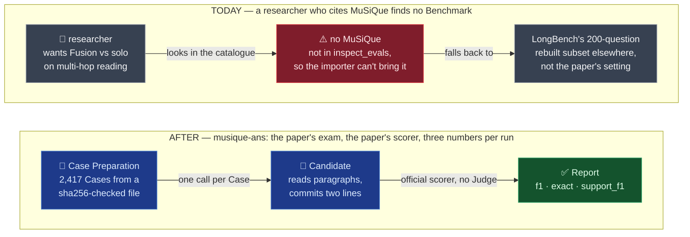
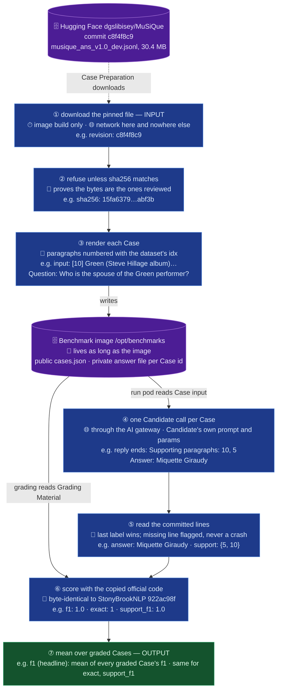

# OME-1475 — MuSiQue-Ans as a judge-free multi-hop reading Benchmark

**Ticket:** [OME-1475](https://linear.app/openmined/issue/OME-1475/build-and-score-the-musique-benchmark)
· **Plan:** `docs/plan/2026-10-07-OME-1475-musique-ans.md`
· **Ledger:** `docs/work/2026-10-06-ome-1475-musique-spec.md`
· **Stack:** screamingface-engine, screamingface · **Date:** 2026-10-07

## TLDR

**MuSiQue** is a reading test built like a detective puzzle: each question needs 2 to 4 facts
chained together, each fact sits in a different paragraph, and the model gets 17 to 20 paragraphs
of which only 2 to 4 matter, the rest decoys chosen to look relevant. **MuSiQue-Ans** is the
setting where every question has an answer: 2,417 dev questions (test answers are withheld).
It is not in inspect_evals, so it lands as a **hand-built Benchmark**, the way ContractEval
did: we prepare the Cases, grade one answer, and combine the grades ourselves.

The rule that must hold: **our number means what the paper's number means.** The paper scores the
answer with SQuAD-style token F1 against the gold answer and its aliases, and scores which
paragraphs the model used with support F1. Both must come from the paper's own scoring code.

Where it would break without care:

* The authors publish no Hugging Face copy, only a Google Drive zip, and image builds that
  download from Google Drive fail on rate limits.
* The paper used fine-tuned models, so there is no official prompt; a model that answers in a
  full sentence loses F1 for wording, not knowledge.
* The paper's two headline numbers (answer F1, support F1) need two scores per Case; until
  OME-1268 a Benchmark could report only one.

The change: a new Benchmark `musique-ans` pins its Cases to a byte-verified community mirror,
asks each question in one Candidate call, reads the model's committed `Answer:` and
`Supporting paragraphs:` lines, and grades them with the paper's scorer copied verbatim.
It reports answer F1 as the headline and exact match plus support F1 beside it. **No Judge, no
grading tokens, and a Case is never served from bytes nobody checked.** No existing Benchmark
changes.

## Before / After



The win is a number a researcher can put next to the paper's (human answer F1 78.0, best 2022
model 49.8) and a per-hop view of where a Fusion beats a solo model.

## Architecture / Design

**How to read this section.** Read the Data Flow first: it follows one real Case,
`2hop__460946_294723`, end to end, with its step numbers ① to ⑦. Then the Failure modes table
(rows F1 to F7) says what breaks and who notices. The code map (which files, new or changed) is
in the plan, and its boxes use the same ① to ⑦.

### Data Flow



HOW TO READ: cylinders are stores, dashed arrows are network hops, blue boxes are steps, the
green box is the output. Tags inside a box: ⏱ when it runs · 🌐 network · 🔐 trust · 🧩 meaning
· 💾 storage. Every value is the real Case.

* ② refuses rather than warns, because a re-pushed mirror would otherwise serve different
  Cases under the same Benchmark Revision.
* ③ numbers paragraphs with the dataset's own `idx` (0-based, equal to position in every row),
  because support F1 compares the model's cited numbers with the gold `is_supporting` set.
* ⑤ takes the **last** label, because a model reasoning aloud may write "the answer: maybe X"
  before committing.
* ⑥ calls the copied functions and nothing else (the only edit to the copied files is their one import line, made relative), because every line between the reply and the
  number moves our score away from the paper's.

### Failure modes

| # | Fault | Step | Who notices | Outcome |
| -- | -- | -- | -- | -- |
| F1 | Mirror re-pushed or file changed | ② | image build | build fails, names expected and actual sha256; nothing served |
| F2 | Hugging Face unreachable at build | ① | image build | build fails loudly; the previous image keeps serving |
| F3 | Row shape changed (missing field, idx not positional, count ≠ 2,417) | ③ | image build | `PrepareError` naming the row; nothing served |
| F4 | Reply has no `Answer:` line | ⑤ | the Report | whole reply scored; Case flagged "missing Answer line"; graded, not failed |
| F5 | Reply has no `Supporting paragraphs:` line, or no integers on it | ⑤ | the Report | support set empty, so support F1 0 (the official behaviour); Case flagged |
| F6 | Candidate call fails (provider error, timeout) | ④ | the Report | Case not graded; Coverage drops; existing failure policy, nothing new |
| F7 | Grading Material missing for a Case | ⑥ | the Report | `missing_answer_asset`, as ContractEval and MedXpert |

A grading crash (a bug in our wrapper) surfaces as `musique_grading_failed`, the per-Benchmark
code every hand-built Benchmark declares.

## Known limitations of this design

* **MuSiQue-Full is not here.** Its unanswerable twins are scored per pair, so the grade spans
  two Cases, and the paper reports no human score for it. Next unit, reusing the source pin,
  the copied scorer and most of the prompt.
* **The dev set has been public since 2022** and may sit in models' training data. Accepted:
  the same is true of every public benchmark we carry; stated on the Benchmark.
* **The paper's baselines are fine-tuned 2022 models**, not prompted LLMs, so our numbers sit
  beside theirs, not on the same leaderboard. Stated on the Benchmark.
* **A Candidate whose own prompt or token cap drops the two committed lines scores low.**
  Accepted: the prompt is part of the Candidate, the flag makes it visible, and the SDK's default
  synthesis prompt carries format constraints through a Fusion.
* **Per-hop F1 lives in the notebook, not the Report.** Named Scores average over every graded
  Case; a 2/3/4-hop split is a subgroup view, which the Report has no shape for yet.

## Established facts

Read from the official data, code and paper, not inferred. Local copies were checked on
2026-10-06.

| Fact | Value | Source |
| -- | -- | -- |
| Official data | Google Drive zip `musique_data_v1.0.zip`, sha256 `98f839bf…ee0cd` | repo `download_data.sh` |
| Mirror | `dgslibisey/MuSiQue` @ `c8f4f8c9465fb69d31a8eae894c3fd509c4ca321` | Hugging Face |
| Dev file | `musique_ans_v1.0_dev.jsonl`, sha256 `15fa63794d18a94ce12411aca6e2327e65b6e83b0b1490efab3f1962e48abf3b`, **byte-identical** in the zip and the mirror | both, compared with `cmp` |
| Cases | 2,417, all `answerable: true`; ids unique | dev file |
| Hops | 2-hop 1,252 · 3-hop 760 · 4-hop 405; id prefixes `2hop`, `3hop1`, `3hop2`, `4hop1`, `4hop2`, `4hop3` | dev file; paper Table 2 |
| Paragraphs | 17 to 20 per Case; `idx` equals position in every row; 2 to 4 supporting, equal to the hop count | dev file |
| Row fields | `id, paragraphs[idx, title, paragraph_text, is_supporting], question, question_decomposition, answer, answer_aliases, answerable` | dev file |
| Aliases | 680 Cases carry `answer_aliases`; answers are 2 words at the median, 14 at most | dev file |
| Size | median ~10.2k characters of paragraphs per Case, max ~20.9k; ~25.2M in total | dev file |
| Answer scorer | normalise (lowercase, strip punctuation, drop `a/an/the`, collapse spaces); token F1 and exact match; **max over `[answer] + answer_aliases`**; mean over Cases | `metrics/answer.py` @ `922ac98f` |
| Support scorer | set precision/recall/F1 of predicted vs gold `idx`; both empty counts 1.0; mean over Cases | `metrics/support.py` @ `922ac98f` |
| Licence | CC BY 4.0, covering data and code | repo `LICENSE` |
| Human | answer F1 **78.0**, support F1 93.9 (125 sampled questions) | TACL 2022, Table 3 |
| Best model in the paper | EX(SA): answer F1 **49.8**, support F1 79.2 (dev) | TACL 2022, Table 4 |
| Best published | Beam Retrieval: answer F1 **69.2**, support F1 91.4 (test) | NAACL 2024, Table 4 |

## Decisions

| # | Decision | Why |
| -- | -- | -- |
| D1 | Benchmark id `musique-ans` (code package and asset bundle `musique`, since a hyphen is not a module name), difficulty `hard` | MuSiQue-Full is a different dataset (its answerable half re-picks every decoy), so it needs its own id later; 27-point human-model gap |
| D2 | Case Source: the mirror at its commit, plus the dev file's sha256, checked before parsing | the official zip is Google Drive only; the mirror is byte-identical |
| D3 | Prompt in the Case input (user message); no Benchmark system message | the system message belongs to the Candidate's Recipe |
| D4 | Paragraphs rendered `[idx] Title`, then the text, blank-line separated, dataset order | support F1 needs citable numbers; dataset order keeps the Revision stable |
| D5 | Reply ends with `Supporting paragraphs: …` then `Answer: …` | lets any model reason first and still commit a clean span |
| D6 | Parse: text after the last `Answer:` to the end of that line; integers after the last `Supporting paragraphs:`; case-insensitive; an empty label line takes the next non-empty line | last label wins over mid-reasoning mentions |
| D7 | Missing `Answer:` → score the whole reply; missing support line → empty set; either → per-Case flag | never a crash, never silent |
| D8 | Copy `metrics/answer.py` and `metrics/support.py` verbatim under `musique/vendor/`, with the licence and the pinned commit; a thin typed wrapper calls them | the code that scores is the paper's code |
| D9 | Named Scores `f1` (headline), `exact`, `support_f1` | the paper's An and Sp, plus EM; `f1`/`exact` match SQuAD's names |
| D10 | No token cap or temperature from the Benchmark; the notebook's example Candidates set `max_tokens` | a Candidate's params are the researcher's (platform rule) |
| D11 | New failure code `musique_grading_failed`, Engine and SDK lists together | every hand-built Benchmark declares its own |
| D12 | Hop type and the dataset's own id kept in the private answer record and surfaced on each Case result's metadata (MedXpert's pattern); notebook `15_musique` shows per-hop F1 | the Candidate receives only the Case input, and `cases.json` extra keys do not reach the Report on today's Engine |
| D13 | Provenance: TACL paper, the four authors, the TACL citation, harness `StonyBrookNLP/musique` @ `922ac98f`, CC BY 4.0, Human Baseline 0.78 (Table 3), Frontier Score 0.692 (see Frontier Score below), notebook `15_musique` | required by OME-1455's conformance rule |
| D14 | No Draft Feedback | not needed for launch |

### The prompt (byte-frozen; part of the Benchmark Revision)

```text
Answer the question using the numbered paragraphs below.

[0] Grant's First Stand
<paragraph_text>

[1] List of show business families
<paragraph_text>

… every paragraph, in the dataset's order …

Question: Who is the spouse of the Green performer?

Think it through if that helps, then end your reply with these two lines, in this order:
Supporting paragraphs: <the numbers of the paragraphs you used, comma-separated>
Answer: <the answer, in as few words as possible>
```

### How a reply becomes three numbers

Gold for `2hop__460946_294723`: answer `Miquette Giraudy`, no aliases, supporting {5, 10}.

| Reply ends with | answer read | support read | f1 | exact | support_f1 | flag |
| -- | -- | -- | -- | -- | -- | -- |
| `Supporting paragraphs: 10, 5` / `Answer: Miquette Giraudy` | `Miquette Giraudy` | {5, 10} | 1.0 | 1 | 1.0 | — |
| `Supporting paragraphs: 10` / `**Answer:** Giraudy` | `** Giraudy` | {10} | 0.67 | 0 | 0.67 | — |
| `Answer:` / `Miquette Giraudy` | `Miquette Giraudy` (next line) | ∅ | 1.0 | 1 | 0.0 | missing support line |
| `The performer is Steve Hillage, whose partner is Miquette Giraudy.` | the whole reply | ∅ | 0.36 | 0 | 0.0 | missing both lines |

0.67 for `Giraudy`: precision 1/1, recall 1/2, F1 = 2·1·0.5 / 1.5. 0.36 for the sentence: 2 of
its 9 normalised tokens match (`the` is dropped; precision 2/9, recall 1.0, F1 = 4/11).

### Frontier Score

**0.692 answer F1, Beam Retrieval (beam size 2), as of 2024-06.** Zhang et al., "End-to-End Beam
Retrieval for Multi-Hop Question Answering", NAACL 2024
(https://aclanthology.org/2024.naacl-long.96/), Table 4 of arXiv 2308.08973v2, read in the PDF.
It is the highest answer F1 we found in the official setting (only the given paragraphs, no
outside corpus); the paper calls it the new state of the art.

Two things the Benchmark's description says next to it:

* **It is a test-split number** (the leaderboard's split); our runs use dev, because test
  answers are withheld. The 2022 paper's 49.8 is dev.
* **It is a fine-tuned pipeline**, not a prompted LLM. No paper we found prompts a frontier
  model on the full dev set with every paragraph; the closest prompted results are 48–57 answer
  F1 on 500–1,000-question samples, so ScreamingFace's runs may be the first.

Not checked: the official leaderboard (`leaderboard.allenai.org` does not resolve), which could
hold a higher entry with no paper. Benchmark Saturation is not near: headroom is 0.308.

## Test plan

Every test names the invariant it defends.

* **Vendored code is the paper's code:** each copied file (`answer.py`, `support.py`, and their base `metric.py`), with its one import line restored, hashes to the upstream bytes at `922ac98f`.
* **Scorer parity:** the worked examples above, plus a handful of real dev Cases with aliases,
  give the hand-checked numbers through the wrapper.
* **Parser:** every row of the reply table, plus mid-reasoning mentions, markdown, mixed case,
  integers out of range or repeated.
* **Case Preparation:** a two-row fixture file renders byte-identical Case inputs; a wrong sha256,
  a non-positional `idx`, or a wrong count raises `PrepareError`; Grading Material holds the
  answer, aliases and supporting `idx`, and the public Case never does.
* **Named Scores:** a graded Case carries exactly `f1`, `exact`, `support_f1`, headline equal to
  `score`; the aggregate is the mean of each column.
* **Registration:** the enumerating tests (declaration table, early-grade compatibility, stage
  parity, timing, CLI, failure-code conformance, provenance conformance) include `musique-ans`.
* **End to end:** `musique-ans` joins the e2e board list and skips loudly until its golden
  recording exists (recorded by the owner; it calls real models).

## Out of scope

* **Later:** MuSiQue-Full (`musique-full`), a Report-level breakdown by Case metadata.
* **Out:** the test split (answers withheld); the open-domain setting (no paragraphs given),
  which needs retrieval tools (OME-1241).
