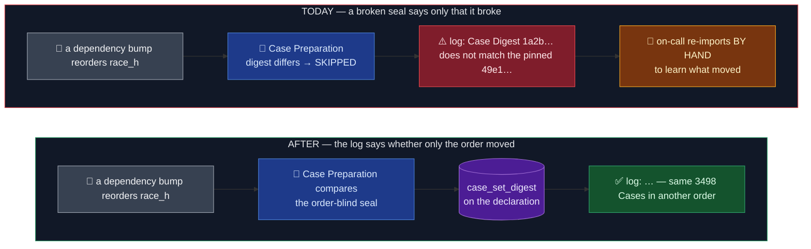

# A broken seal says whether only the order moved

Status: approved 2026-10-07 · OME-1492 PR 2 of 3 · stacked on PR 1 (#1268) · ledger
`docs/work/2026-10-07-case-hash-seal.md`

## TLDR

Every Imported Benchmark is **sealed** at import by its **Case Digest**: one sha256 over all of its
Cases, in order. **Case Preparation** (the image-build step that re-creates the Cases) refuses to
serve Cases whose digest differs and marks the Benchmark SKIPPED with a one-line reason.

The rule that must hold: when a seal breaks, the build log says what kind of change it was,
without anyone re-running the import on a laptop, and without printing any Case's text.

Where the log fell short: the reason said only "Case Digest X does not match the pinned Y". A
dependency bump that merely reshuffles rows reads exactly like a template that rewrote every
prompt.

The change: each declaration gains a second, **order-blind** seal, the `case_set_digest`: a hash of
the Cases' content sorted, so order doesn't affect it. On a Case Digest mismatch (same count), Case
Preparation compares it and appends "same 3498 Cases in another order" or "same count, different
Cases: text changed". A count change was already named by the existing sentence. The importer seals
it for every new import, and all 57 Benchmarks on `main` got theirs from a one-time backfill that
kept a value only where the replayed Cases still matched the sealed Case Digest (57 of 57 did). The
new field is not part of any Revision, so no Benchmark Revision moves.

## Before / After

### Don't regress

- The Case Digest is computed exactly as before, and `case_set_digest` joins no Revision pin, so
  the published Revisions are unchanged (`test_published_revisions.py` passes untouched).
- A mismatch still goes SKIPPED with `unconfirmed_cases`, so the strict image job still fails.
- Only counts reach the log, never a Case's input or target.

## Design

| Decision | Choice | Why |
| -- | -- | -- |
| What the second seal hashes | each Case's content (input and grading material; not `id`/`case_id`), hashed with the existing `case_digest`, sorted, then hashed together | one home for "what a Case is"; `id`/`case_id` are only the serving position, so keeping them would make a pure reorder look like rewritten text (caught by the stand-in reorder test) |
| Where it lives | a `case_set_digest` field on the declaration, beside `case_digest` | 57 lines, no new files; owner call 2026-10-07 over a per-Case fingerprint list (3.3 MB, two files over the 500 KB hook) |
| Identity | not a Revision pin | it is diagnosis, not identity: the Case Digest already pins what the Cases are |
| When it explains | only when the count matched and the Case Digest did not | a count change is already named ("the task yielded N Cases, pinned case count is M") |
| At import | sealed from run 1 with the Case Digest; run 2 proves both | the existing invariant holds: run 2 replays exactly the declaration the importer writes |
| Backfill | a one-off replay of all 57 declarations, keeping a value only where the Case Digest still matched | 57 of 57 matched on 2026-10-07; no backfill command is committed, since new imports seal it themselves |

## Known limitations of this design

- **"Text changed" doesn't say which Case or how many.** It distinguishes the three shapes
  (reorder, count change, rewrite) but not the position. Per-Case detail was costed at 3.3 MB of
  fingerprint lists and deferred until someone needs it.
- **A hand-edited seal goes stale.** Re-sealing a Benchmark by editing `case_digest` without
  re-running the import leaves the old `case_set_digest`; the importer always writes both together.
- **A reshuffle of a Case's answer options reads as "text changed".** The six lab_bench
  declarations force a `choice_shuffle_seed`, which orders the options inside each Case's prompt.
  If that order moves, every Case's own text moves with it, so the order-blind seal breaks too.
  Accepted: the options a Candidate sees did change, and the seed is printed in the bundle's
  provenance block to check first.

## Acceptance

1. A reordered stand-in replay goes SKIPPED with a reason ending "same 4 Cases in another order".
2. A rewritten one ends "same count, different Cases: text changed", with no Case text in it.
3. A row without `case_set_digest` keeps today's sentence.
4. A new import writes `case_set_digest` on its row.
5. All 57 declarations carry a backfilled value equal to their replay's; the published Revisions
   are unchanged.
