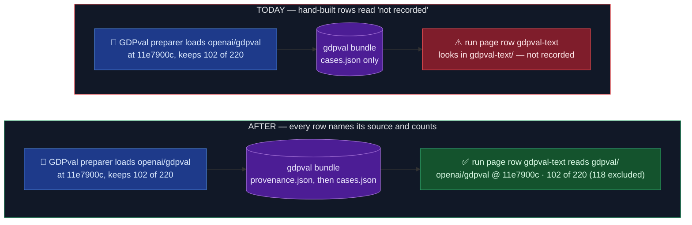

# Every hand-built bundle says where its Cases came from

Status: implemented 2026-10-07 · OME-1492 PR 3 of 3 · ledger
`docs/work/2026-10-07-hand-built-provenance.md` · builds on
`docs/spec/2026-10-06-OME-1492-bundle-provenance.md` (PR 1)

## TLDR

**Case Preparation** is the image-build step that fills each Benchmark's **bundle** (its folder
of Cases in the Engine image). PR 1 made it leave a small label in every Imported bundle,
`provenance.json`: which dataset commit it read, any seed it forced, how many rows it loaded and
kept, and how long it took. The same block rides the bundle's summary line in the build log, and
the paid smoke's run page shows it per Benchmark under "Where the Cases came from".

The rule that must hold: every bundle on the run page says where its Cases came from, without
anyone re-running the build.

Where it fell short after PR 1:

- the six **hand-built preparers** (draco, ifeval, healthbench, gdpval, medxpert, contracteval:
  the Benchmarks we wrote by hand, not imported from inspect) wrote no label;
- four Benchmarks read another Benchmark's bundle (draco-3pass, both HealthBench Benchmarks,
  gdpval-text), so the run page looked in a folder that doesn't exist.

The change: each hand-built preparer writes the same block, before `cases.json`, and adds it to
its summary. The file name, the summary key and the writer move into the Engine core, so both
kinds of preparer share them without core importing the inspect plugin. The run page maps the
four Benchmarks to their shared bundle and shows "—" for an inspect version a hand-built bundle
doesn't have. No Case text is ever written, and no Benchmark Revision moves.

## Before / After

## What each preparer records

`seeds_applied` and `pins` are `{}` for all six: none forces a seed, none runs inspect.
`excluded` is always `yielded − kept`, as in PR 1, so the run page's "kept of yielded
(excluded)" accounts for every row.

| Bundle | Sources | yielded | kept | excluded on purpose |
| -- | -- | -- | -- | -- |
| draco | `perplexity-ai/draco` @ revision `ce076749…` | rows loaded (100) | Cases written (100) | none |
| ifeval | `google/IFEval` @ revision `966cd895…`; the vendored official file `josejg/instruction_following_eval/data/input_data.jsonl` @ commit `0c495b2f…` | rows loaded (541) | Cases written (541) | none |
| healthbench | `openai/healthbench-professional` @ revision `349962fd…` | rows loaded (525) | Cases written (525) | none: worst-30% is a selection at serve time |
| gdpval | `openai/gdpval` @ revision `11e7900c…` | rows loaded (220) | Cases written (102) | 118: every task outside the frozen text subset, the 7 unreadable ones included |
| medxpert | `TsinghuaC3I/MedXpertQA/Text` @ revision `7e7c465a…` | rows loaded (2450) | Cases written (2450) | none |
| contracteval | `theatticusproject/cuad-qa` @ revision `d9c4ee02…` | rows loaded (4182) | Cases written (4182) | none |

Why the ifeval official file counts as a source: the preparer checks every Hub row against it and
its text wins on key 2785, so that Case's prompt comes from the file.

`seconds` runs from the start of the preparer's `prepare`, download included, to the moment it
writes the block.

## Known limitations of this design

- **Two fetched inputs are left out.** gdpval's ~85 reference files come from URLs the pinned rows
  name, with no hash, so listing them would add 85 unpinned lines for one bundle; ifeval's nltk
  tokenizer data is downloaded unpinned but feeds the verifier, never a Case. Both stay out until
  someone needs them on the run page.
- **The shared-bundle map is a copy.** The run page's four-entry map repeats the Engine's
  `builtins.py` pairs, because the SDK test venv can't import the Engine. A new Benchmark on a
  shared bundle reads "not recorded" until the map gains its line.
- **gdpval's `excluded` (118) is not the summary's `excluded_tasks` (7).** The summary keeps its
  own count of unreadable tasks; the block counts every row the frozen selection drops.
- **A bundle prepared before this change has no file** until its cache is rebuilt; its row reads
  "not recorded", as in PR 1.

## Acceptance

1. Each of the six hand-built bundles holds `provenance.json` written before `cases.json`, with
   the declared revision as its pin and `samples.kept` equal to the Cases written; the summary
   carries the same block (one test per family).
2. No fixture Case text appears in the file (same tests).
3. The run page shows the shared bundle's block for draco-3pass, both HealthBench Benchmarks and
   gdpval-text, and a block with empty `pins` renders.
4. `check_layering.py` and both stacks' `run_gates.py` green; no Benchmark Revision changes.
