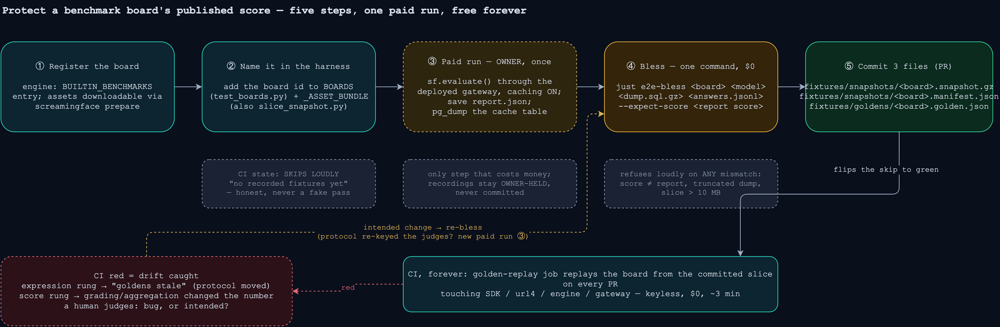
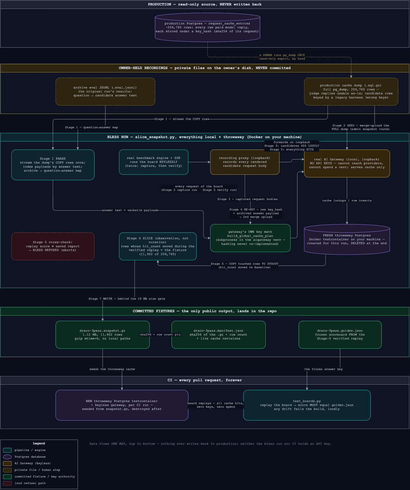
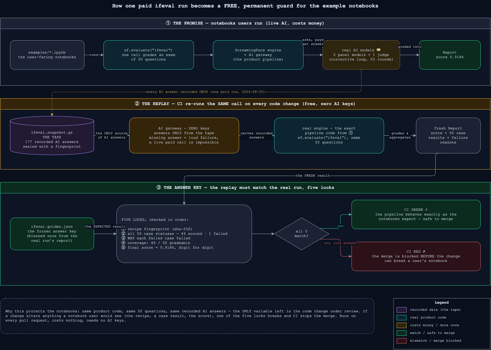

# E2E replay lane — protect a benchmark board's published score

One paid run becomes a permanent free regression test: CI replays the whole benchmark
from committed fixtures and goes red when the published number drifts.



## The five steps

| # | Who | Do | Done when |
|---|-----|----|-----------|
| ① | dev | Board registered in the engine (`BUILTIN_BENCHMARKS`) with preparable assets | `uv run screamingface prepare <board>` works |
| ② | dev | Add the board id to `BOARDS` (`test_boards.py`) and `_ASSET_BUNDLE` (there **and** in `fixtures/slice_snapshot.py`) | e2e lane SKIPS loudly: "no recorded fixtures yet" |
| ③ | **owner** 💵 | Run the board once for real: `sf.evaluate()` through a gateway with the request cache ON (a local `screamingface up` stack needs `AIGATEWAY_DATABASE_URL` pointed at Postgres, `AIGW_REQUEST_CACHE_ENABLED=true` and a long TTL). Keep `report.export()` output (+ a `pg_dump` of `request_cache_entries` for the dump-based paths; all recordings stay private, never committed) | recordings on the owner's disk |
| ④ | dev | Single-model: `just e2e-bless <board> <model> <dump.sql.gz> <answers.jsonl> --expect-score <report score>`. **Fusion (OME-978)**: `just e2e-bless-report <board> <report.json>` — the report alone is the recording; the capture→splice loop synthesizes the tape and the replay must reproduce the report's score/coverage/statuses. **Corrective loop / fresh recording (OME-1098)**: `just e2e-bless-fresh <board> <dump.sql.gz> <report.json> <candidate.json> [--limit N]` — a dump recorded through the current gateway needs no re-key, so any candidate shape replays; the candidate spec must rebuild the recorded run verbatim (prompts + params) and the replay must reproduce the report's outcome AND rendered expression. All need docker + prepared assets; all refuse on any mismatch | 3 fixture files written |
| ⑤ | dev | Commit `fixtures/snapshots/<board>.snapshot.gz` + `.manifest.json` + `fixtures/goldens/<board>.golden.json` in a PR | `test_boards[<board>]` green; CI guards the score forever |

Running the lane locally:

```sh
SCREAMINGFACE_TEST_E2E=1 uv run pytest tests/e2e -rs        # opt-in, needs docker
```

## How the bless run moves the data



Everything below the recordings runs in throwaway Docker containers with **no API
keys** — a cache miss is a loud failure, never a live call. Full mechanics: the
docstring of [`fixtures/slice_snapshot.py`](fixtures/slice_snapshot.py).

## Why this guards the example notebooks

The full story for one board (ifeval), non-engineer readable: one paid run is recorded
onto a tape (`ifeval.snapshot.gz`), CI replays the exact notebook call against it with
zero AI keys, and the fresh result must match the frozen answer key
(`ifeval.golden.json`) on five locks — recipe fingerprint, case statuses, failure
reasons, coverage, and the score digit-for-digit. Any mismatch blocks the merge before
it can break a notebook in `examples/`. (Scope note: this guards the pipeline the
notebooks call — `sf.evaluate()` — not the `.ipynb` files themselves.)



## When CI goes red

| Failure rung | Message | Meaning | Fix |
|---|---|---|---|
| expression | "goldens stale" | the rendered protocol moved | intended? → re-bless (step ④) |
| case statuses / coverage | "case statuses drifted" | some cases now fail/score differently | investigate, then re-bless if intended |
| failure codes | "failure codes drifted" | the same cases fail, but for a different REASON (`incomplete_verdicts` → `case_error`) — a reclassification | investigate, then re-bless if intended |
| score | "final score drifted" | grading/aggregation changed the number | investigate, then re-bless if intended |

Re-blessing needs the owner-held recordings again — EXCEPT when only the golden's
per-case failure codes must be (re)written: `just e2e-refresh-golden <board>` replays
the committed snapshot and refuses to write if anything but the failure map moved. If the change re-keyed the
**judge** requests (judge params/prompts are hashed into every judge cache key), the
old dump can no longer serve them — either a new paid run (③), or the disclosed
interim path: `--dump-judge-bodies` on the old checkout, then `--judge-bodies` +
`--judge-param <the delta>` on the new one (pipeline pin, not a score pin — see the
tool's docstring).

## Fixture inventory

| File | Committed? | What |
|---|---|---|
| `fixtures/snapshots/<board>.snapshot.gz` | ✅ | minimal cache slice: exactly the rows one replay touches |
| `fixtures/snapshots/<board>.manifest.json` | ✅ | sha256 + row count + cache revisions (refuse-early guard) |
| `fixtures/goldens/<board>.golden.json` | ✅ | frozen answer key: expression sha, case statuses, per-case failure codes, score |
| `fixtures/snapshots/synthetic.*` | manifest ❌ (generated) | plumbing-only fixture; regenerate via `generate_synthetic.py` in the aigateway venv |
| dump / report / answers | ❌ never | owner-held recordings, referenced only by content sha |
