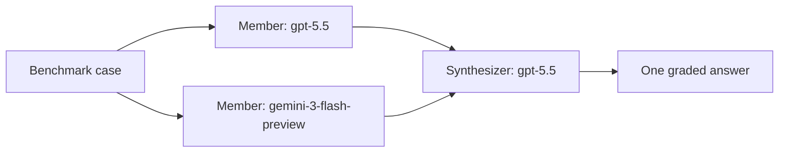
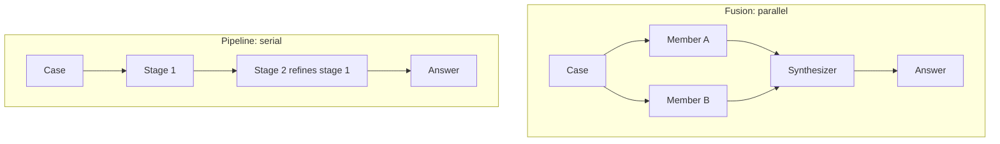
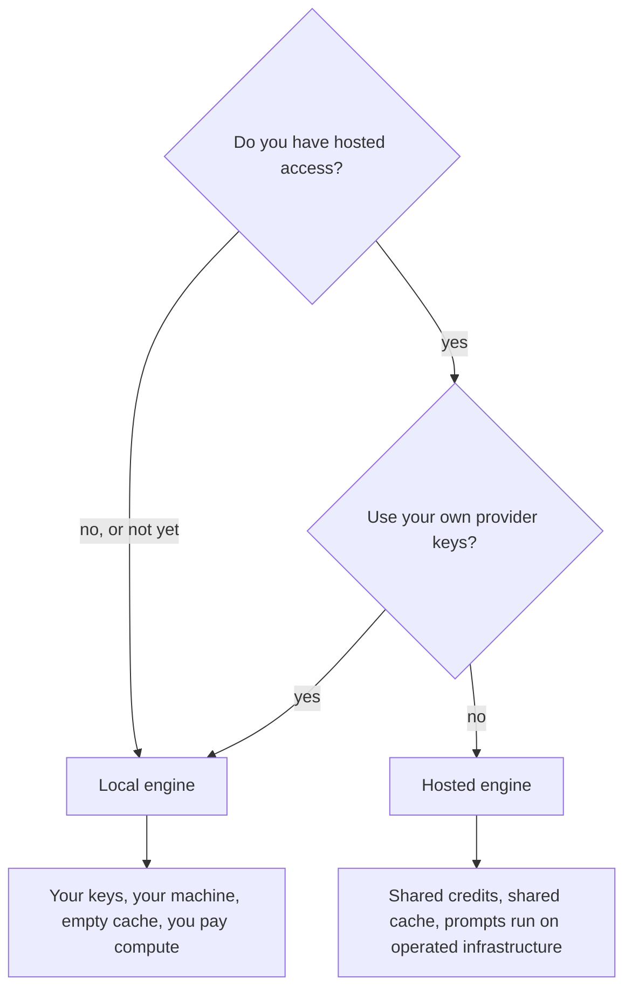

# Dogfood run: the Client documentation site

Target: the `public-docs` site, reader path from the landing page through Overview,
Installation, and Your first fusion, plus the navigation tree and router.

Run on 2026-09-02 against commit `90a104e3` as named in the sidebar footer.

## Context slots: what was and was not available

No context skill was loaded for this run. It exercises the degradation path the spec
requires: with nothing loaded, the skill produces structure and prose guidance and does not
invent product claims.

| Slot | Available | Source |
|---|---|---|
| the reader | yes | supplied in the commissioning prompt: a senior researcher composing multiple models, evaluating adoption |
| the time budget | yes | 30 minutes, from the same prompt |
| operational metrics | yes | cost, accuracy, speed, from the same prompt |
| product facts | **no** | taken from the docs themselves and not independently verified |
| terminology casing | **no** | drift is reported where the docs disagree with themselves, not against an external list |
| positioning language | **no** | not checked |
| house voice, target voice | **no** | one house rule was supplied separately by the owner: no em-dashes |
| house writing skill | **no** | its AI-tell pass did not run |

Everything below that describes the product is a claim the docs make, not a fact this review
confirmed.

## Verdict

This reader would adopt. The Overview does the hardest job well: it says what the thing is,
names the effect it is built around, and supports the headline claim with a citation and a
second piece of literature rather than an adjective. Cost is treated as a first-class
quantity throughout, which is exactly what this reader came to check.

Understanding breaks in the first ten minutes, and all three breaks are avoidable. The
fastest path is gated by an invitation the reader only learns about halfway down a tab body.
The tutorial never shows what success looks like, so a reader cannot tell whether their run
worked. And the page the whole site calls "Quickstart" is titled something else and appears
under that other name in the sidebar, so the most-linked page in the docs cannot be found by
the name it is linked by.

Structurally the site is in better shape than most: it declares the four page types in its
own navigation and mostly honours them. The exception is Installation, which is filed as a
tutorial and is about forty percent reference material.

## Friction log

Chronological, following the reader path.

| # | Location | What happened |
|---|---|---|
| 1 | `Index.vue:84` | "**Your own providers.** You connect the API keys you already have" reads as unconditional. Two pages later the hosted path says the opposite. Noted as a promise; it applies only to the local path |
| 2 | `Index.vue:30` | `benchmark="draco-3pass"` appears with no explanation of what `draco-3pass` is or how it relates to `draco`. Guessed it was a benchmark id |
| 3 | `Index.vue:142` | "Two ways to run" is a decision with two topologies, in prose. Had to hold both in mind to compare them |
| 4 | `InstallationPage.vue:20` | The install check is `len(sf.__all__) # 56`. A count of 57 gives no way to tell whether that is a problem. It verifies a count, not that anything works |
| 5 | `InstallationPage.vue:107` | "The fastest start" |
| 6 | `InstallationPage.vue:109` | "Hosted access is currently by invitation. If you haven't been approved yet, use the local engine tab below while you wait." The single most important fact for a new reader, arriving after the path was called the fastest start. It changes the reader's 30 minutes |
| 7 | `InstallationPage.vue:107` | "no provider key of your own: the hosted engine does not take one". Direct contradiction of friction 1. Requires scrolling back to the Overview bullet |
| 8 | `InstallationPage.vue:127` | "The **Quickstart** takes it from here", linking to `/sf-client/first-fusion`. There is no Quickstart in the sidebar |
| 9 | `InstallationPage.vue:146` | `prepare draco` takes a family, but the Overview example used `draco-3pass`. No way to tell whether preparing `draco` covers `draco-3pass` |
| 10 | `InstallationPage.vue:176` | An FAQ with seven collapsibles opens inside what the nav calls a tutorial. Ports, TLS certificates, provider enablement, web-search keys. None of it is the task the reader came to do |
| 11 | `FirstFusionPage.vue:39` | Prerequisites say the Client must be installed. They do not say the engine must be pointed at, which Installation established as mandatory. Requires guessing that `sf.connect()` implies a configured engine |
| 12 | `FirstFusionPage.vue:63` | `sf.connect()`, with no preceding `sf.configure()`. Third distinct entry point after `sf.configure()` and `client.login()`. Unclear which to use |
| 13 | `FirstFusionPage.vue:88` | The tutorial runs `ifeval`; the Overview example ran `draco-3pass`. Neither page says why they differ |
| 14 | `FirstFusionPage.vue:95` to `:107` | Five cells, no expected output on any of them. No way to tell whether the run succeeded. The Overview, which is not the tutorial, is the only page that shows a result |
| 15 | `FirstFusionPage.vue:118` | Fan-out, synthesizer, pipeline, and nesting are introduced as prose in one section. Four structural ideas, no picture |
| 16 | `router/index.ts:27` | The Reproduce DRACO route renders `QuickstartPage.vue`. A file named for one page serving another |

## Flow map

**Ordering defects**

- `sf.configure()` is established as mandatory in Installation, then omitted from the
  tutorial's prerequisites and never called in its cells. The tutorial depends on a step it
  does not state.
- `url4` is linked from the Overview before it is defined, then defined one paragraph later.
  Harmless, but the link invites a detour before the definition arrives.
- `synthesizer` is used as a `Fusion` argument in the Overview example and only explained in
  the tutorial's step 3.

**Terminology drift**

| Concept | Names in use |
|---|---|
| the tutorial page | "Quickstart" in four link texts, "Your first fusion" as the page title and sidebar entry |
| the deep-research benchmark | `draco`, `draco-3pass` |
| the medical benchmark | `healthbench`, `healthbench-worst30` |
| connecting | `sf.configure()`, `client.login()`, `sf.connect()` |

The first row is the expensive one. "Quickstart" is the label on the primary call to action
on the landing page, and the word appears nowhere a reader can land.

**Arc**

The Overview follows the intended arc closely: what it is, why it exists, what it provides,
how it works, the choice, then the smallest example. The break is that its smallest example
uses a different benchmark from the tutorial that follows it, so the two do not compose into
one path.

**Page types**

| Page | Declared | Actually |
|---|---|---|
| Overview | overview | explanation, plus a runnable example at the end |
| Installation | tutorial | tutorial for the first half, reference and troubleshooting for the second |
| Your first fusion | tutorial | tutorial, correctly, apart from the missing outputs |

## Scorecard

| # | Item | Score | Evidence |
|---|---|---|---|
| 1 | first contact | 4 | "open, Python-first infrastructure for composing model ensembles", with 68.6 against 60.2 and a citation |
| 2 | time to first success | 2 | five tutorial cells, zero expected outputs, and the fast path gated by invitation |
| 3 | concept ordering | 3 | the tutorial never states the engine step that Installation made mandatory |
| 4 | learning-curve shape | 4 | steps are small and the tutorial is genuinely short |
| 5 | example quality | 3 | runnable and realistic, but two benchmarks across two pages and `len(sf.__all__) # 56` as a check |
| 6 | reference navigability | 4 | reference is its own navbar tab, and every public symbol has one home |
| 7 | terminology discipline | 2 | "Quickstart" in four places for a page called "Your first fusion" |
| 8 | honest operations | 4 | cost next to accuracy, cited numbers, and stated limits such as "the cache starts empty and you pay for the compute". No stability statement, changelog, or migration notes |
| 9 | visual clarity | 3 | one accurate diagram with real alt text and a caption, against three prose-only structural concepts |

## Trust check

**Holding up.** The headline claim carries a link to published results and a second citation
from the literature. Limits are stated plainly where the choice is made, for instance that a
local engine starts with an empty cache and bills you for compute, and that the hosted
engine runs your prompts on infrastructure the project operates. Cost appears next to
accuracy rather than in an appendix. No marketing superlatives appear in the pages read.

**Not holding up.** There is no stability or versioning statement. The sidebar reads "Based
on state at commit 90a104e3", which is accurate about what the docs were checked against but
tells a reader nothing about whether the API will move under them. No changelog, no
migration notes, and no contribution path is reachable from the pages on the reader path.
For a project asking a researcher to build on it, those are the signals of being safe to
depend on, and their absence is the one thing that would make this reader hesitate.

One sentence to rewrite, at `InstallationPage.vue:107`:

> "The fastest start."

It is not the fastest start if it is gated. Something like: "The shortest path once you have
access. Hosted access is currently by invitation; the local engine has no waiting."

## Diagram plan

Three gaps, in priority order.

**1. Fusion topology.** `FirstFusionPage.vue:118`, the "How far this goes" section. Answers:
how does a fusion actually route a question? Four structural ideas currently arrive as
prose.

**2. Fusion against pipeline.** Same section. Answers: what is the difference between the
two ways recipes compose? Keep it to the contrast and nothing else.

**3. Which engine to run.** `Index.vue:142`, "Two ways to run". Answers: which engine should
the reader point at? This replaces a two-bullet comparison held only in prose, and it is
where the invitation gate belongs.

Every label above uses the site's own terms. If any of them is wrong, the prose should
change with the diagram rather than the diagram alone.

## Top fixes

Ordered by effect on time to understanding.

**1. Show the expected output on every tutorial cell.** `FirstFusionPage.vue`, cells 1 to 5.
Blocks flow because a reader following a tutorial has no way to tell success from failure,
which is the whole point of a tutorial. The Overview already does this well, so the pattern
exists and only needs applying. At minimum, cell 5 should show a score.

**2. Rename "Quickstart" or rename the page.** Four link texts say Quickstart and point at a
page titled "Your first fusion". Pick one name and use it in the sidebar, the page title,
the landing-page button, and all four links. Cheapest fix here with the largest effect on
finding anything.

**3. Move the invitation gate to where the choice is made.** `Index.vue:142` and
`InstallationPage.vue:107`. Before, at 107: "The fastest start." After: "The shortest path
once you have access. Hosted access is currently by invitation; the local engine has no
waiting." State it in the Overview's two-ways section too, not only inside a tab.

**4. Fix the provider-keys contradiction.** `Index.vue:84`. Before: "**Your own providers.**
You connect the API keys you already have, and calls are billed to your own accounts rather
than resold to you." After: "**Your own providers, on a local engine.** Connect the API keys
you already have and calls are billed to your own accounts rather than resold to you. The
hosted engine supplies shared credits instead and takes no key of yours."

**5. Split Installation.** Keep install and point-at-an-engine as the tutorial. Move the
seven-item FAQ, which is ports, TLS, provider enablement, and web-search keys, into a how-to
called something like "Troubleshoot a local runtime". The material is good and it is in the
wrong page type. This is the split remedy, not a trim.

**6. Add the three diagrams above.**

**7. Use one benchmark on the reader path.** The Overview example and the tutorial should run
the same one, or the Overview should say in one clause why it differs. Also say once whether
`prepare draco` covers `draco-3pass`.

**8. Replace the install check.** Before: `len(sf.__all__) # 56`. After: something that
fails loudly and does not drift, for example printing the version, or a call that proves the
Client can reach its engine.

**9. State stability and versioning.** One short section, or a line in the sidebar footer
beyond the commit: what may change, what will not, and where the changelog lives.

**10. Remove em-dashes.** 43 of them across 18 of 37 pages. This is the owner's house rule
and it is currently unenforced in the docs. Mechanical, but do it with judgement: each one
becomes a comma, a colon, parentheses, or a full stop depending on what the sentence is
doing.

## What already works, so nobody improves it away

- **The Overview's opening two paragraphs.** They state what the thing is, then support the
  central claim with a number, a citation, and a second piece of literature, and then say
  plainly that the effect is not new and name what the project actually adds. That last move
  is rare, and it is why this reader kept reading.
- **The local-flow diagram** at `Index.vue:130`. Accurate, one idea, real alt text, and a
  caption that repeats the claim in words. It is the model the three proposed diagrams should
  follow.
- **Cost as a first-class subject.** Named in the Overview's feature list, explained in the
  caching bullet with the reason it matters when comparing candidates, and reported per model
  and per fusion.
- **The navigation.** It declares the four page types and separates reference into its own
  tab. Most sites do not get this far, and it is why the page-type findings above are three
  fixes rather than a restructure.
- **The FAQ content itself.** The provider-key answer explains that the error names the
  credential rather than the configuration, which is precisely the sentence that saves
  someone an hour. Move it, do not cut it.

## What this run says about the skill

Two findings depend on the skill's own method rather than on general attentiveness: the
page-type mismatch on Installation, which follows from the nav declaring a type and the page
not honouring it, and the three diagram gaps, which follow from the concept-to-diagram table
rather than from noticing an absence. The trust-check gap on versioning is easy to overlook
because nothing on the page is wrong; the trust check names it as a category to check
regardless.

One gap in the skill: `review-angles.md` said only to run the code and report real output,
with no guidance for a review environment that cannot execute anything. This run could not
run any Python. The rule now covers that case: mark examples unverified and check them for
internal consistency instead. Recorded in `PROVENANCE.md`.

## Second run: with the context skill loaded

The same reader path, re-read with the project's canonical terminology loaded. Every finding
below needs an external authority on what is true and what may be claimed, which is why the
first run, with that slot unavailable, could not produce any of them.

Caveat on both directions: canon is stamped as current to 2026-08-29 and the docs are
checked against commit `90a104e3`. Either can be the stale one, so each item below is a
reconciliation, not a verdict that the docs are wrong.

**1. `draco-3pass` is correct and not yet in policy.** Canon and the formal benchmark policy
(`OME-836`) name three identities: `draco`, `ifeval`, `healthbench-worst30`. The Overview's
smallest example runs `benchmark="draco-3pass"`, absent from both. Traced through Linear: the
docs previously used `draco-lite`, which the released Client now rejects with
`PlanningError`; `draco-3pass` is the validated, working replacement (`OME-1057`), and is a
real, tested engine board. The docs are right. The gap is that the policy and canon have not
been updated to add it as a fourth sanctioned identity.

**2. Ambiguity over which DRACO the claims rules govern.** Canon requires a result on a
benchmark the organisation authored or hosts to name that fact in the same sentence, and
bars a state-of-the-art claim on such a benchmark. Canon's own DRACO entry, though,
describes DRACO as a third-party benchmark the organisation did not create, while a separate
canon entry lists "DRACO (grounded)" among boards the organisation would build and own. The
two entries do not obviously name the same board.

The Overview's headline result, 68.6% against 60.2%, reproduces the DRACO the docs link to.
Whether the claims rules above apply depends on which of canon's two DRACO entries that is.
This needs an answer from whoever owns the claims policy; the finding is the ambiguity
between canon's two entries, not a proven breach.

**3. "Reproducible" against "auditable".** Canon says results on held-out benchmarks are to
be described as auditable rather than reproducible. Two adjacent Overview bullets say
"**Held-out grading**" and "**A reproducible artifact for every run** ... Anyone holding it
can run the same evaluation". Read together they claim the word canon reserves. The
distinction canon draws still holds: the url4 expression is reproducible, the score on
held-out data is auditable.

**4. Product-name casing.** Canon treats Client, Studio, Engine, Leaderboard, and Toolkit as
product names. The docs write "engine" and "leaderboard" in lower case through most of the
prose while also using "ScreamingFace Leaderboard" in one FAQ answer. Minor, and the docs
are internally almost consistent, so the fix is to pick canon's casing or to record a
deliberate exception.

**5. Canon's own confidence.** The top term carries status "Needs Review", with a note that
provisional wording should not ship in external copy unchecked. The Overview's opening is
external copy, so this qualifies every item above.

**What went right.** The docs do not mention the parent organisation anywhere on the reader
path, which matches canon's rule against leading with that connection. Nothing on the path
contradicted it.

## What the two runs together say

The no-context run found structure, ordering, terminology drift inside the docs, missing
outputs, and missing diagrams. The context-loaded run found a benchmark id canon's list was
missing rather than the docs advertising something unsupported, an ambiguity in the claims
policy, and a word the project has explicitly reserved.

Neither run found the other's findings. That is the argument for the context contract being
part of the skill rather than an optional extra, and against running a docs review with
nothing loaded and calling it done.
