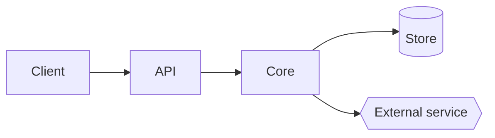
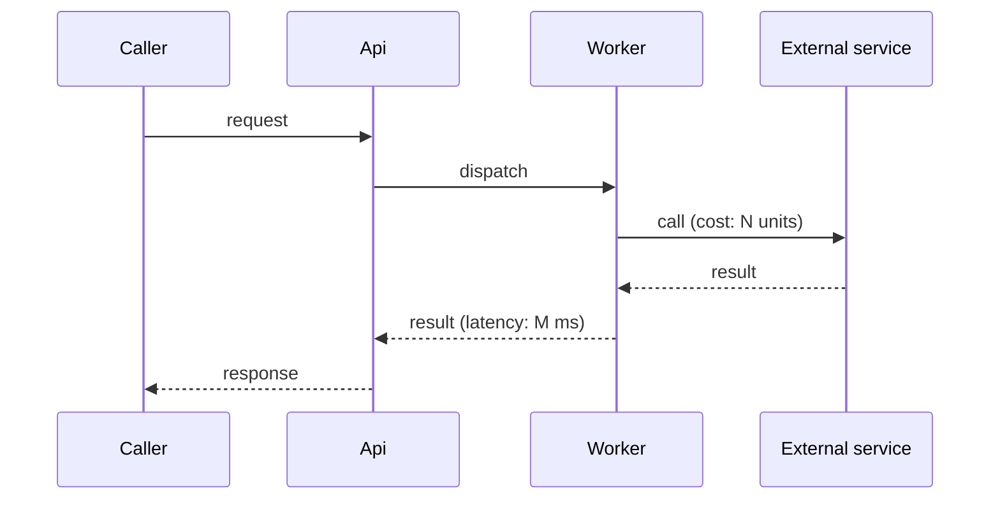
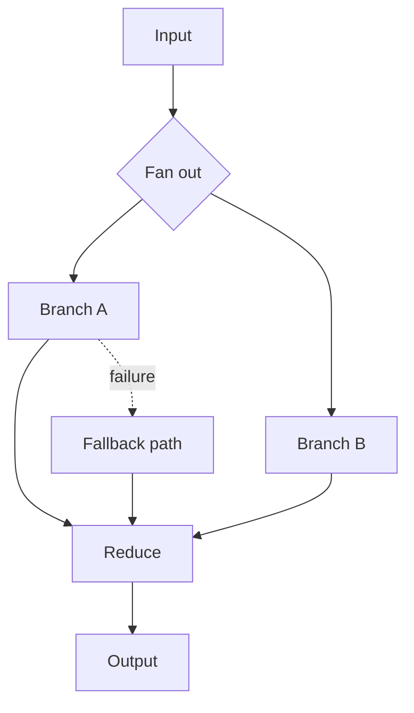
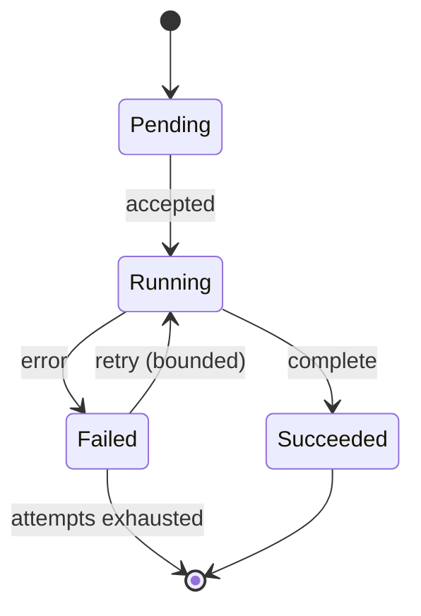
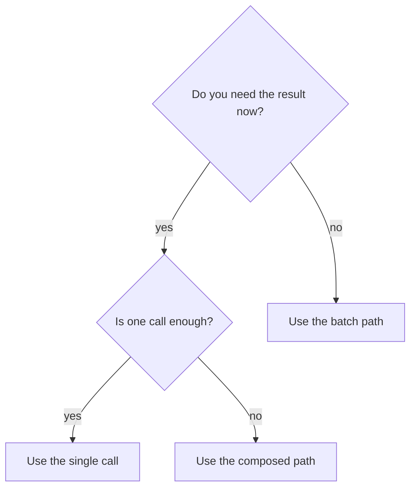

# Diagrams

## The test

At every concept, ask: *am I asking the reader to assemble a picture in their head that this
page should have drawn?*

A wall of prose describing a pipeline is a puzzle the reader has to solve. The same pipeline
drawn once is handed over already assembled. Structure, flow, sequence, state, and decisions
are all cheaper to see than to read.

## Which concepts need one

| Concept in the prose | Diagram | The one question it answers |
|---|---|---|
| components and their boundaries | component | what are the pieces, and what talks to what? |
| the journey of one call or one record | flow or sequence | what happens on a single request, and where does cost or latency accumulate? |
| how parts chain, fan out, cascade, or vote | topology | how is work composed, and where do errors travel? |
| anything with states and transitions: sessions, jobs, retries, circuit breakers | state | what states exist, and what moves between them? |
| "use X when…, use Y when…" | decision tree or comparison matrix | which one do I pick? |
| a tradeoff space across configurations | annotated chart or table | where does each option land relative to the others? |

If a concept in that left column appears as prose only, that is a finding, not a preference.

Three cases do not need a diagram: a linear list of two or three steps, a single component
with no collaborators, and anything the reader can hold in one sentence.

## Four hard rules

**One idea per diagram.** A figure that needs a paragraph of explanation has failed. Three
ideas in one figure means three figures. Split overloaded diagrams; delete decorative ones.

**Diagrams as code.** Author them in a text format that lives beside the prose and is
reviewed in the same change. A picture that cannot be diffed will drift.

**Text and picture agree.** Every label uses the exact name the prose and the API use, with
the exact casing. If drawing the diagram reveals a better name, rename the prose too rather
than letting the two diverge.

**A stale diagram is worse than none.** An absent diagram leaves the reader working. A wrong
one teaches a wrong model, confidently, and they will trust it over the text.

## Specifying a missing diagram

Never write "add a diagram here". A finding is actionable only if it names four things:

1. **the boxes**, using the exact terms from the prose
2. **the arrows**, and what flows along each one
3. **the labels** on both, including units where a number crosses an arrow
4. **the one question** the reader has when they arrive at that point in the page

Then supply the source, ready to paste.

## Paste-ready starting points

Component boundaries:

One request, with cost accumulating per hop:

Composition topology, including where an error can propagate:

Lifecycle:

Decision guidance, replacing "use X when" prose:

For a tradeoff space, a table beats three paragraphs, and a plot beats the table once there
are more than about six options. Either way, label the axes with the metric and its unit,
and mark the baseline the reader is comparing against.

## Reviewing a diagram that already exists

Mark each one:

| Verdict | Test |
|---|---|
| works | matches the prose, one idea, same names, current with the API |
| decorative | removing it loses the reader nothing |
| overloaded | more than one idea, or needs a paragraph to read |
| stale | contradicts the current API, the current names, or the current flow |
| drifting labels | the picture and the text call the same thing different names |

Decorative and stale both get deleted. Overloaded gets split. Drifting labels get one name
chosen and applied in both places.
